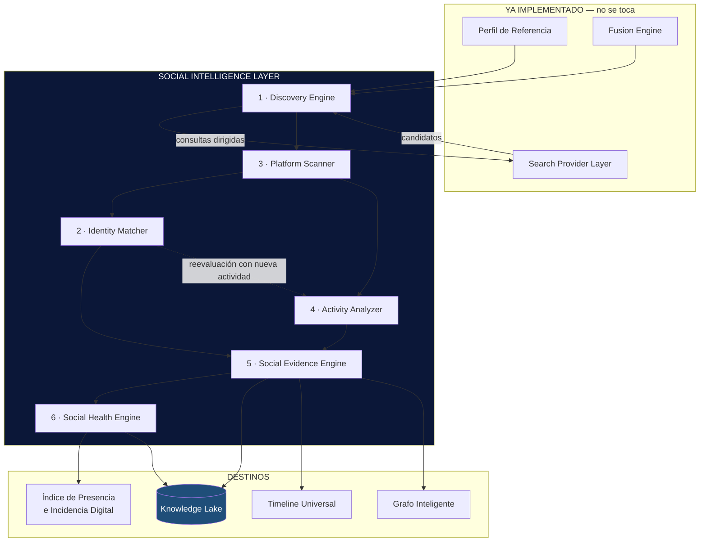

```
════════════════════════════════════════════════════════
  SENTINEL INTELLIGENCE PLATFORM — AI Intelligence Platform
  ARQUITECTURA — Social Intelligence Layer (SIL)
────────────────────────────────────────────────────────
  Documento     : ARQ-SIL-001
  Versión       : v1.0
  Fecha         : 2026-08-19
  Estado        : Draft — diseño, sin implementación
  Sprint        : 3 (arquitectura) · 3.1 (primera implementación)
  Autor         : Comité Fundador de Sentinel Intelligence
  Founder       : Patricio David Fierro (Product Owner principal)
  Confidencial. : CONFIDENCIAL — Uso interno fundacional
════════════════════════════════════════════════════════
```

# Social Intelligence Layer — Arquitectura

## 0. Premisa

**Las redes sociales no son buscadores.** Un buscador devuelve documentos; una red social expone **entidades con estado y actividad en el tiempo**. Tratarlas con el mismo contrato produce dos errores que ya cometimos en versiones anteriores del módulo:

| Si se tratan como buscador | Consecuencia observada |
|---|---|
| Cada resultado es un documento suelto | Un mismo perfil aparecía como N hallazgos distintos |
| No hay noción de cuenta | Imposible responder "¿esta cuenta es del objetivo?" |
| No hay dimensión temporal | La actividad —lo más informativo de una red— se pierde |
| El acceso se asume homogéneo | Se diseñó para un acceso que legalmente no existe |

Por eso el **Social Intelligence Layer (SIL)** es una capa **hermana**, no subordinada, del Search Provider Layer.

---

## 1. Estado real del entorno (verificado, 2026-08-19)

Antes de diseñar, lo que existe de verdad:

| Componente | Estado real | Implicación para el SIL |
|---|---|---|
| **Fusion Engine** | ✅ Implementado y probado | El SIL **consume** su Perfil de Referencia; no lo modifica |
| **Search Provider Layer** | ✅ Implementado (Brave pendiente de clave) | El SIL lo **usa** para descubrir candidatos, no para leer perfiles |
| **Perfil de Referencia** | ✅ Implementado | Es la **entrada obligatoria** del SIL |
| **Sentinel Core** | ⚠️ Esqueleto (`packages/sentinel-core`: Observe→Understand→Explain, ~50 líneas, con una ejecución de prueba al importar). **No está conectado al backend OSINT** | El SIL se diseña para encajar en ese contrato cuando el Core se materialice |
| **Knowledge Lake** | ❌ **No existe** | Destino futuro. El SIL define el **contrato de emisión** desde hoy |
| **Timeline Universal** | ⚠️ Hoy es un `timeline[]` de etapas de la investigación, no una línea temporal de hechos | El SIL emite eventos fechados que lo harán posible |
| **Grafo Inteligente** | ⚠️ Hoy `KnowledgeGraph.jsx` + `entidades[]` por dominio | El SIL aporta nodos de tipo *cuenta* y aristas de correspondencia |

> **Compromiso de compatibilidad:** el SIL **no modifica** ninguno de los anteriores. Se integra de forma aditiva, igual que el Perfil de Referencia y el Fusion Engine: si falla, devuelve `null` y la investigación continúa.

---

## 2. Arquitectura general



### Diagrama interno (ASCII)

```
                        PERFIL DE REFERENCIA
                    nombre · variantes · handles
                 términos discriminantes · contexto
                                │
   ┌────────────────────────────▼─────────────────────────────┐
   │  1 · DISCOVERY ENGINE                                     │
   │     ¿qué cuentas PODRÍAN ser del objetivo?                │
   │     · handles observados      · resolución directa de URL │
   │     · variantes de handle     · consultas dirigidas (SPL) │
   │     salida: CandidatoCuenta[]  ← NO afirma identidad      │
   └────────────────────────────┬─────────────────────────────┘
                                │
   ┌────────────────────────────▼─────────────────────────────┐
   │  3 · PLATFORM SCANNER        (registro de adaptadores)    │
   │     Facebook · Instagram · TikTok · X · YouTube · LinkedIn│
   │     cada uno declara: modo de acceso, salud, presupuesto  │
   │     salida: PerfilSocial normalizado (solo datos PÚBLICOS)│
   └───────────┬──────────────────────────────┬───────────────┘
               │                              │
   ┌───────────▼──────────────┐   ┌───────────▼───────────────┐
   │ 2 · IDENTITY MATCHER      │   │ 4 · ACTIVITY ANALYZER     │
   │  ¿ES del objetivo?        │   │  ¿cómo se comporta?       │
   │  7 señales ponderadas     │   │  frecuencia · temas       │
   │  → Correspondencia 0–100  │   │  picos · consistencia     │
   │  → SIEMPRE explicada      │   │  → eventos fechados       │
   │  → nunca autoconfirma     │   └───────────┬───────────────┘
   └───────────┬──────────────┘               │
               │        ┌──────────────────────┘
   ┌───────────▼────────▼─────────────────────────────────────┐
   │  5 · SOCIAL EVIDENCE ENGINE                               │
   │     esquema único · dedup por URL · calidad · LINAJE      │
   │     salida: SocialEvidence[]  ← unidad atómica del SIL    │
   └───────────┬───────────────────────────────────────────────┘
               │
   ┌───────────▼───────────────────────────────────────────────┐
   │  6 · SOCIAL HEALTH ENGINE                                  │
   │     ficha VIVA del actor: presencia · cobertura ·          │
   │     consistencia · actividad · riesgos                     │
   │     → Índice de Presencia e Incidencia Digital (IPID)      │
   └───────────┬───────────────────────────────────────────────┘
               │
          KNOWLEDGE LAKE · TIMELINE UNIVERSAL · GRAFO INTELIGENTE
```

---

## 3. Los seis submotores

### 3.1 Discovery Engine

| | |
|---|---|
| **Responsabilidad** | Producir una lista de **cuentas candidatas** por plataforma. Descubre; **no decide** si pertenecen al objetivo. |
| **Entradas** | `PerfilReferencia` (nombre principal, `variantes.handle`, `handlesObservados`, `terminosDiscriminantes`, `contexto`), plataformas habilitadas, presupuesto. |
| **Salidas** | `CandidatoCuenta[]` — `{plataforma, handle, url, urlNormalizada, origenDescubrimiento, señalesPreliminares[], descubiertoEn}` |
| **Evidencias generadas** | `evidencia_descubrimiento` — cómo apareció el candidato (handle ya observado, variante probada, consulta dirigida). Es la primera pieza del linaje. |
| **Knowledge Lake** | Zona **raw**: todo candidato, incluidos los después descartados. Descartar sin registrar impide auditar por qué se descartó. |

**Tres vías de descubrimiento, en orden de fiabilidad:**

1. **Handles ya observados** en el Perfil de Referencia — la vía más fiable: la URL ya apareció en evidencias reales.
2. **Resolución directa de URL** — comprobar si `plataforma.com/{variante}` existe públicamente. Barato y determinista. **Existir no implica pertenecer**: solo genera candidato.
3. **Consulta dirigida** vía Search Provider Layer (`site:instagram.com "Nombre" término_discriminante`). Reutiliza infraestructura probada; no se duplica.

> El Discovery Engine **nunca** consulta la red social buscando por nombre dentro de la plataforma: eso es trabajo del Platform Scanner y depende del modo de acceso disponible.

---

### 3.2 Identity Matcher

| | |
|---|---|
| **Responsabilidad** | Estimar la **correspondencia** entre una cuenta candidata y el objetivo. Produce un grado, nunca una afirmación. |
| **Entradas** | `PerfilReferencia` + `PerfilSocial` (del Scanner) + `SocialEvidence[]` acumuladas + señales de actividad. |
| **Salidas** | `Correspondencia` — `{puntuacion 0–100, nivel, señales[], contraseñales[], estado, requiereRevisionHumana}` |
| **Evidencias generadas** | `evidencia_correspondencia` — cada señal con su valor, su peso y la evidencia concreta que la sustenta. |
| **Knowledge Lake** | Zona **curated**: la correspondencia es un juicio derivado, versionado. Al llegar evidencia nueva se emite una **versión nueva**, nunca se sobrescribe la anterior. |

**Las siete señales oficiales:**

| # | Señal | Qué comprueba | Fuerza | Puede ser CONTRASEÑAL |
|---|---|---|---|---|
| S1 | **Nombre** | Nombre visible frente a `variantes.nombre` | Media | Sí — nombre claramente distinto |
| S2 | **Usuario (handle)** | Handle frente a `variantes.handle` | Media | No |
| S3 | **Biografía** | Términos discriminantes del perfil en la bio | **Alta** | Sí — bio de otra persona/rubro |
| S4 | **Cargo** | Rol declarado frente a `contexto.rol` | **Alta** | Sí — cargo incompatible |
| S5 | **País** | Ubicación/idioma frente a `contexto.pais` | Media | Sí — país incompatible |
| S6 | **Enlaces oficiales** | La cuenta enlaza a un dominio ya asociado al objetivo, **o** un dominio oficial enlaza a la cuenta | **Muy alta** | No |
| S7 | **Presencia cruzada** | Otras cuentas ya correspondidas enlazan a esta | **Muy alta** | No |

**Principios innegociables:**

1. **Ninguna señal aislada confirma identidad.** Ni siquiera S6 o S7: se exige **concurrencia de señales independientes**.
2. **Las contraseñales restan.** Un modelo que solo suma evidencia favorable confirma cualquier homónimo.
3. **Estados con intervención humana** (IA2 — human-in-the-loop):

```
   descubierto → candidato → probable → [ANALISTA] → confirmado
                                     ↘ [ANALISTA] → descartado
```

   **El estado `confirmado` solo lo alcanza una persona.** El sistema llega como máximo a `probable`, por alta que sea la puntuación.
4. **Toda puntuación se muestra desglosada.** `94/100 — Alta correspondencia` va siempre acompañado de qué señales lo produjeron y cuáles faltaron.
5. **La ausencia de señal no es contraseñal.** Una bio vacía baja la puntuación por falta de sustento, no por sospecha.

---

### 3.3 Platform Scanner

| | |
|---|---|
| **Responsabilidad** | Obtener, de cada plataforma, el **perfil público** de una cuenta bajo un contrato uniforme. Aísla al resto del SIL de las diferencias entre redes. |
| **Entradas** | `CandidatoCuenta` (plataforma + handle/URL), credenciales si las hay, presupuesto. |
| **Salidas** | `PerfilSocial` — `{plataforma, handle, urlCanonica, nombreVisible, biografia, verificado, seguidores, siguiendo, publicaciones, enlacesExternos[], avatarUrl, creadoEn, ultimaActividad, accesoUsado, obtenidoEn}` |
| **Evidencias generadas** | `evidencia_perfil` — instantánea fechada del estado público de la cuenta. |
| **Knowledge Lake** | Zona **raw** (respuesta cruda del adaptador) + **curated** (`PerfilSocial` normalizado). Los avatares y capturas van a **MinIO**, no al registro. |

**Patrón:** idéntico al Search Provider Layer, que ya está probado — registro + salud + presupuesto + failover. **No se inventa un patrón nuevo.**

#### Matriz de acceso real — la restricción que condiciona todo

Esta tabla es el equivalente social del descubrimiento sobre DuckDuckGo del Sprint 2: **conviene conocerla antes de implementar, no después.**

| Plataforma | Vía legítima | Realidad de acceso | Estado inicial previsto |
|---|---|---|---|
| **YouTube** | YouTube Data API v3 | Clave de API sencilla; datos de canal y vídeos públicos | ✅ **Viable — candidato a primer adaptador** |
| **X** | API v2 | De pago en todos los niveles útiles | ⚠️ Requiere decisión de coste |
| **Facebook** | Graph API | Exige app, revisión y permisos; datos de personas prácticamente cerrados | ❌ Solo páginas públicas, con revisión |
| **Instagram** | Instagram Graph API | Solo cuentas *business/creator* vinculadas y con autorización del titular | ❌ No aplicable a terceros |
| **TikTok** | Research API / Display API | Research API sujeta a solicitud y perfil académico | ⚠️ Requiere solicitud |
| **LinkedIn** | API de partners | Raspado **prohibido** por sus condiciones | ❌ Sin vía para terceros |

**Consecuencia de diseño:** cada adaptador declara su `modoAcceso` y su `estado`, exactamente como los proveedores de búsqueda:

- `api_oficial` — datos completos
- `publico_limitado` — metadatos públicos vía página abierta u oEmbed, sin sesión
- `sin_configurar` — falta credencial
- `no_disponible` — sin vía legítima

Cuando un adaptador está en `no_disponible`, el SIL **no inventa datos ni raspa tras un login**: registra el hueco y lo declara como **cobertura parcial**. La presencia en esa red se sigue infiriendo desde el Fusion Engine (la URL del perfil aparece en resultados web), pero se marca como `presencia_inferida`, no `perfil_leido`.

> **Restricción ética vinculante:** el SIL solo trata **datos públicos**. No accede a contenido protegido, no elude muros de sesión y no perfila a personas privadas. Deriva de los criterios de exclusión EX1–EX7 (Cap. 14) y de IA2/IA4.

---

### 3.4 Activity Analyzer

| | |
|---|---|
| **Responsabilidad** | Describir el **comportamiento público** de una cuenta a lo largo del tiempo. |
| **Entradas** | `PerfilSocial` + publicaciones públicas accesibles + ventana temporal. |
| **Salidas** | `PerfilActividad` — `{ventana, volumen, frecuenciaMedia, franjasHorarias, diasActivos, temas[], picos[], ultimaPublicacion, latenciaRespuesta, consistencia}` |
| **Evidencias generadas** | `evidencia_actividad` (agregada) y `evidencia_publicacion` (cada pieza pública, fechada). |
| **Knowledge Lake** | **Fuente principal del Timeline Universal.** Cada publicación es un hecho fechado; cada agregado, una serie temporal. |

**Aporta a dos consumidores distintos:**

- **Al Identity Matcher:** la actividad es señal de correspondencia. Una cuenta que publica sobre los términos discriminantes del objetivo, en su país y en su franja horaria, refuerza S3/S5. Una cuenta inactiva desde hace años debilita el conjunto.
- **Al Social Health Engine:** es la materia prima de la incidencia digital.

**Detecta y marca** (sin juzgar): inactividad prolongada, ráfagas anómalas, cambios bruscos de temática, discontinuidades. Se declaran como **observaciones**, no como acusaciones.

---

### 3.5 Social Evidence Engine

| | |
|---|---|
| **Responsabilidad** | Convertir toda salida del SIL en **evidencia normalizada, deduplicada, con calidad y linaje**. Es el único punto de salida hacia el resto de la plataforma. |
| **Entradas** | Salidas de Discovery, Scanner, Matcher y Activity. |
| **Salidas** | `SocialEvidence[]` |
| **Evidencias generadas** | Es el productor: **nada sale del SIL sin pasar por aquí.** |
| **Knowledge Lake** | **Es el puente.** Emite registros inmutables, *append-only*, con `tenant_id` y linaje completo. |

#### Esquema de `SocialEvidence`

```jsonc
{
  // --- IDENTIDAD DE LA EVIDENCIA ---
  "id": "se-<uuid>",
  "version": "1.0",

  // --- CAMPOS EXIGIDOS ---
  "platform": "instagram",              // enum de plataformas soportadas
  "handle": "danielnoboaok",            // null si la evidencia no es de cuenta
  "url": "https://www.instagram.com/danielnoboaok/",
  "tipo": "perfil",                     // ver tabla de tipos
  "confianza": {                        // correspondencia con el OBJETIVO
    "puntuacion": 94,
    "nivel": "alta",
    "estado": "probable",               // nunca "confirmado" sin analista
    "señales": [ { "id": "S3", "nombre": "Biografía",
                   "valor": true, "peso": "alta",
                   "detalle": "La bio contiene 'presidente' y 'Ecuador'",
                   "evidencias": ["se-014"] } ],
    "contraseñales": [],
    "requiereRevisionHumana": true
  },
  "quality": {                          // calidad del DATO, no de la identidad
    "nivel": "completa",                // completa | parcial | mínima
    "criteriosCumplidos": ["tieneTitulo", "tieneSnippetReal", "fuenteClasificada"],
    "criteriosFaltantes": ["tieneFecha"],
    "motivo": "Perfil leído por API oficial con biografía y enlaces."
  },

  // --- CONTENIDO NORMALIZADO ---
  "urlNormalizada": "instagram.com/danielnoboaok",
  "titulo": "Daniel Noboa (@danielnoboaok)",
  "descripcion": "Presidente de la República del Ecuador",
  "fecha": "2026-08-19T14:02:00Z",
  "datos": { /* PerfilSocial | PerfilActividad | publicación */ },

  // --- PROCEDENCIA Y LINAJE (DT3) ---
  "origen": {
    "submotor": "platform_scanner",
    "adaptador": "youtube_api",
    "modoAcceso": "api_oficial",
    "consulta": null,
    "derivadaDe": ["se-002"]
  },
  "corroboracion": {
    "fuentes": ["youtube_api", "brave_web"],
    "totalFuentes": 2,
    "multiFuente": true
  },

  // --- GOBIERNO ---
  "tenantId": "<tenant>",
  "objetivoId": "<objetivo>",
  "capturadoEn": "2026-08-19T14:02:00Z",
  "expiraEn": null,
  "publica": true
}
```

**Distinción central del esquema** — dos ejes independientes que nunca deben confundirse:

| Eje | Pregunta que responde | Campo |
|---|---|---|
| **Confianza** | ¿Esto corresponde al objetivo? | `confianza` |
| **Calidad** | ¿Cuánta información aprovechable trae? | `quality` |

Un perfil leído por API oficial puede tener **calidad completa** y **confianza baja** (es un homónimo bien documentado). Y al revés. Ya está implementado así en el Fusion Engine y se mantiene.

**Tipos de evidencia:**

| `tipo` | Qué representa | Submotor |
|---|---|---|
| `descubrimiento` | Aparición de una cuenta candidata | Discovery |
| `perfil` | Instantánea del perfil público | Scanner |
| `correspondencia` | Juicio de identidad con su desglose | Matcher |
| `actividad` | Agregado temporal de comportamiento | Activity |
| `publicacion` | Pieza pública individual y fechada | Activity |
| `enlace_cruzado` | Una cuenta o dominio enlaza a otra | Matcher |
| `ausencia` | **Se buscó y no hay presencia** | Discovery/Scanner |

> `ausencia` es una evidencia de pleno derecho. "No tiene LinkedIn" y "no lo comprobamos" son cosas distintas, y el analista debe poder distinguirlas.

**Reglas del motor:** dedup por `urlNormalizada` reutilizando `textUtils`; calidad reutilizando `evaluarCalidad` del Fusion Engine; una URL hallada por N fuentes es **una evidencia con N fuentes** (misma regla que ya rige el Fusion Engine); **inmutabilidad** — corregir es emitir versión nueva.

---

### 3.6 Social Health Engine

| | |
|---|---|
| **Responsabilidad** | Mantener la **ficha viva** de presencia digital del actor y alimentar el IPID. |
| **Entradas** | `SocialEvidence[]` del actor, histórico previo. |
| **Salidas** | `FichaSocial` (estado actual) + `EventoFicha[]` (cambios respecto a la lectura anterior). |
| **Evidencias generadas** | `evidencia_ficha` — instantánea versionada; y eventos de cambio (cuenta nueva, cuenta inactiva, pico de actividad). |
| **Knowledge Lake** | **PostgreSQL** para el estado vigente de la ficha; **Knowledge Lake** para el histórico versionado que permite la serie temporal del índice. |

#### Estructura de la ficha viva

```
   FICHA SOCIAL — <objetivo>                    actualizada: <fecha>
   ═══════════════════════════════════════════════════════════════

   PRESENCIA POR PLATAFORMA
   ┌────────────┬───────────────┬─────────────┬────────────────┐
   │ Plataforma │ Estado        │ Corresp.    │ Acceso         │
   ├────────────┼───────────────┼─────────────┼────────────────┤
   │ X          │ perfil_leido  │ 94 probable │ api_oficial    │
   │ Instagram  │ inferida      │ 78 probable │ no_disponible  │
   │ YouTube    │ perfil_leido  │ 91 probable │ api_oficial    │
   │ Facebook   │ inferida      │ 65 candidato│ no_disponible  │
   │ TikTok     │ no_comprobada │ —           │ sin_configurar │
   │ LinkedIn   │ ausencia      │ —           │ no_disponible  │
   └────────────┴───────────────┴─────────────┴────────────────┘

   DIMENSIONES DE LA FICHA
   · Cobertura      plataformas con presencia / plataformas comprobadas
   · Consistencia   coherencia de nombre, bio y enlaces entre cuentas
   · Actividad      volumen y regularidad en la ventana observada
   · Alcance        magnitudes públicas declaradas (seguidores, vistas)
   · Verificación   distintivos oficiales y enlaces recíprocos
   · Solidez        cuánta de la ficha se apoya en perfiles LEÍDOS
                    frente a presencia solo INFERIDA

   RIESGOS OBSERVADOS (descriptivos, no acusatorios)
   · cuentas homónimas no resueltas
   · suplantación potencial (perfil similar, correspondencia baja)
   · inactividad prolongada
   · cobertura parcial por acceso no disponible
```

**Relación con el IPID (Índice de Presencia e Incidencia Digital):**

La ficha aporta las **dimensiones**; el índice aporta los **pesos**. Este documento define las seis dimensiones y deja los pesos **deliberadamente sin fijar**: ponderar sin datos reales produce un número arbitrario. Los pesos se calibrarán con las primeras fichas reales, igual que las cuotas del Cap. 13.

**Regla de honestidad del índice:** el IPID debe exponer siempre su **Solidez**. Un índice alto construido sobre presencia inferida y no sobre perfiles leídos es un índice frágil, y quien lo lea tiene que saberlo.

---

## 4. Estructura de archivos propuesta

```
apps/backend/services/
│
├── social/                              ← NUEVO — Social Intelligence Layer
│   │
│   ├── socialIntelligenceLayer.js       orquestador y punto de entrada único
│   ├── socialContracts.js               esquemas, enums y validadores
│   │
│   ├── discovery/
│   │   ├── discoveryEngine.js
│   │   ├── handleResolver.js            resolución directa de URL de perfil
│   │   └── directedQueryBuilder.js      consultas dirigidas (usa el SPL)
│   │
│   ├── identity/
│   │   ├── identityMatcher.js
│   │   ├── signals/
│   │   │   ├── nameSignal.js            S1
│   │   │   ├── handleSignal.js          S2
│   │   │   ├── bioSignal.js             S3
│   │   │   ├── roleSignal.js            S4
│   │   │   ├── countrySignal.js         S5
│   │   │   ├── officialLinkSignal.js    S6
│   │   │   └── crossPresenceSignal.js   S7
│   │   └── matchExplainer.js            desglose legible del 0–100
│   │
│   ├── platforms/                       mismo patrón que providers/
│   │   ├── platformRegistry.js          nombre · prioridad · acceso · estado
│   │   ├── platformHealth.js            OK · Bloqueado · Sin configurar · Error
│   │   ├── youtubePlatform.js           API oficial      — viable
│   │   ├── xPlatform.js                 API v2           — requiere plan
│   │   ├── facebookPlatform.js          Graph API        — solo páginas
│   │   ├── instagramPlatform.js         Graph API        — limitado
│   │   ├── tiktokPlatform.js            Research API     — por solicitar
│   │   └── linkedinPlatform.js          sin vía          — declarado
│   │
│   ├── activity/
│   │   ├── activityAnalyzer.js
│   │   ├── temporalMetrics.js
│   │   └── topicExtractor.js
│   │
│   ├── evidence/
│   │   ├── socialEvidenceEngine.js
│   │   ├── evidenceSchema.js
│   │   └── evidenceDeduper.js           reutiliza textUtils
│   │
│   └── health/
│       ├── socialHealthEngine.js
│       ├── fichaSocial.js
│       └── ipidDimensions.js            dimensiones, SIN pesos todavía
│
└── knowledgeLake/                       ← NUEVO — contrato, sin backend aún
    ├── lakeContract.js                  forma del registro emitido
    ├── lakeEmitter.js                   emisor con destino conmutable
    └── adapters/
        ├── memoryAdapter.js             desarrollo (Sprint 3.1)
        ├── fileAdapter.js               JSONL local (Sprint 3.2)
        └── minioAdapter.js              producción (futuro)
```

**Dos decisiones de estructura:**

1. **Una señal, un archivo.** Cada señal del Identity Matcher es auditable y testeable por separado. Un solo archivo de 700 líneas volvería la puntuación inexplicable, que es justo lo contrario de lo que se busca.
2. **El Knowledge Lake nace con adaptador conmutable.** Se desarrolla contra memoria, se prueba contra fichero y se despliega contra MinIO **sin tocar el SIL**. Es el mismo patrón del Search Provider Layer, que ya demostró funcionar.

---

## 5. Flujo de datos

```
 ┌─ ENTRADA ────────────────────────────────────────────────────┐
 │  investigarObjetivo(objetivo)                                 │
 │    → Descubrimiento general    (ya existe)                    │
 │    → Perfil de Referencia      (ya existe)                    │
 │    → Fusion Engine             (ya existe)                    │
 └───────────────────────────┬──────────────────────────────────┘
                             │  perfilReferencia + fusion.evidencias
                             ▼
 ┌─ SOCIAL INTELLIGENCE LAYER ──────────────────────────────────┐
 │                                                               │
 │  [1] DISCOVERY                                                │
 │      handles observados ──┐                                   │
 │      variantes de handle ─┼─► CandidatoCuenta[]               │
 │      consultas dirigidas ─┘   (+ evidencia_descubrimiento)    │
 │                             │                                 │
 │  [2] SCANNER  ──────────────▼                                 │
 │      por cada candidato, según modo de acceso:                │
 │        api_oficial      → PerfilSocial completo               │
 │        publico_limitado → PerfilSocial parcial                │
 │        no_disponible    → presencia_inferida + evidencia      │
 │                             │      de cobertura parcial       │
 │                             ▼                                 │
 │  [3] MATCHER ◄──────── PerfilSocial                           │
 │      S1..S7 → puntuación + señales + contraseñales            │
 │      estado ≤ probable        (confirmar exige ANALISTA)      │
 │                             │                                 │
 │  [4] ACTIVITY ◄─────────────┤  (solo cuentas ≥ probable:      │
 │      métricas temporales    │   no se analiza a un homónimo)  │
 │      eventos fechados       │                                 │
 │                             ▼                                 │
 │  [5] EVIDENCE ENGINE                                          │
 │      normaliza · deduplica · califica · sella linaje          │
 │                             │                                 │
 │                             ├──────────────► SocialEvidence[] │
 │                             ▼                                 │
 │  [6] HEALTH ENGINE                                            │
 │      ficha viva + eventos de cambio → IPID                    │
 └───────────────────────────┬──────────────────────────────────┘
                             │
        ┌────────────────────┼────────────────────┐
        ▼                    ▼                    ▼
  KNOWLEDGE LAKE      TIMELINE UNIVERSAL    GRAFO INTELIGENTE
  histórico +         hechos fechados       nodos: objetivo,
  linaje append-only  (publicaciones,       cuenta, dominio
                      cambios de ficha)     aristas: corresponde,
                                            enlaza, menciona
```

**Realimentación:** el Matcher se reevalúa cuando llega actividad o presencia cruzada nueva. Por eso las correspondencias se **versionan** en lugar de sobrescribirse: se puede reconstruir qué se sabía en cada momento y por qué.

---

## 6. Conexión con el Knowledge Lake

El Knowledge Lake **no existe todavía**. Lo que se define ahora es su **contrato de entrada**, para que el SIL nazca emitiendo el formato definitivo y no haya que migrar después.

### Registro emitido

```jsonc
{
  "esquema": "sentinel.social.evidence.v1",
  "tenantId": "<tenant>",              // DT1 — multitenancy
  "objetivoId": "<objetivo>",
  "particion": "2026/08/19",           // partición temporal
  "zona": "raw",                       // raw | curated
  "residencia": "ec",                  // DT4 — soberanía del dato
  "payload": { /* SocialEvidence */ },
  "linaje": {                          // DT3 — trazabilidad origen→decisión
    "submotor": "identity_matcher",
    "derivadaDe": ["se-002", "se-014"],
    "adaptador": "youtube_api",
    "modoAcceso": "api_oficial",
    "version": "1.0"
  },
  "emitidoEn": "2026-08-19T14:02:00Z",
  "hash": "<sha256 del payload>"       // inmutabilidad verificable
}
```

### Reparto por almacén — coherente con el stack ya aprobado

| Dato | Almacén | Por qué |
|---|---|---|
| Evidencia social histórica | **Knowledge Lake** (sobre MinIO) | Volumen, inmutable, analítico |
| Ficha social vigente | **PostgreSQL** | Estado consultable y transaccional |
| Búsqueda de evidencias | **OpenSearch** | Texto y filtros |
| Avatares, capturas | **MinIO** | Objetos binarios |
| Presupuesto y salud de plataformas | **Redis** | Efímero, alta frecuencia |

*Corresponde al stack de datos oficial DT1–DT4 (Cap. 10 de la Constitución, ya aprobado). Este documento **no lo modifica**: lo aplica.*

### Tres reglas

1. **Append-only.** Nada se actualiza en el Lake; se emite una versión nueva. La ficha "viva" vive en PostgreSQL; su historia, en el Lake.
2. **Linaje obligatorio.** Ninguna evidencia entra sin declarar de dónde salió y de qué otras evidencias deriva (ADR-010-02).
3. **Emisor desacoplado.** El SIL llama a `lakeEmitter.emitir(registro)`. Que detrás haya memoria, un fichero JSONL o MinIO es indiferente para el SIL.

---

## 7. Alcance del Sprint 3.1

**Criterio de selección:** entregar la porción vertical de mayor valor que **no dependa de ninguna credencial nueva**, para no repetir el bloqueo que sufrimos con DuckDuckGo.

### Sí — Sprint 3.1

| # | Entregable | Por qué primero | Depende de |
|---|---|---|---|
| 1 | `socialContracts.js` — esquemas, enums, validadores | Todo lo demás se apoya aquí | Nada |
| 2 | `platformRegistry.js` + `platformHealth.js` | Patrón ya probado en `providers/`; declara honestamente qué red es accesible | Nada |
| 3 | `discoveryEngine.js` sobre **handles ya observados** | El Perfil de Referencia **ya los produce**: valor inmediato, cero acceso nuevo | Perfil de Referencia ✅ |
| 4 | `identityMatcher.js` con **S1, S2, S6, S7** | Son las cuatro señales calculables **sin leer la red**: nombre, handle, enlaces y presencia cruzada salen de datos que ya tenemos | Fusion Engine ✅ |
| 5 | `socialEvidenceEngine.js` + esquema | Cierra la cadena; reutiliza dedup y calidad existentes | textUtils ✅ |
| 6 | `lakeContract.js` + `memoryAdapter.js` | Nace emitiendo el formato definitivo | Nada |
| 7 | Panel `SocialCorrespondencePanel.jsx` | Sin verlo no se puede validar; muestra el `94/100` **con su desglose** | — |

**Resultado esperado del 3.1:** para "Daniel Noboa", una lista de cuentas candidatas con **correspondencia puntuada y explicada**, construida enteramente sobre datos que la plataforma ya obtiene. Es la petición original del Sprint 1 —`94/100 — Alta correspondencia` y por qué— por fin cerrada.

### No — queda para 3.2 y posteriores

| Diferido a | Qué | Motivo |
|---|---|---|
| **3.2** | `youtubePlatform.js` (API oficial) | Primer adaptador real; requiere clave de YouTube Data API |
| **3.2** | Señales S3, S4, S5 (bio, cargo, país) | Necesitan leer el perfil: dependen del Scanner |
| **3.3** | `activityAnalyzer.js` | Necesita publicaciones, que dependen del Scanner |
| **3.3** | `socialHealthEngine.js` + ficha viva | Necesita varias plataformas leídas para ser significativa |
| **3.4** | `fileAdapter` / `minioAdapter` del Lake | Cuando haya volumen que persistir |
| **Sin fecha** | X, Facebook, Instagram, TikTok, LinkedIn | Dependen de decisiones de coste y de acceso legal (§3.3) |
| **Excluido** | Threads, Telegram, Reddit, Bluesky | Fuera de alcance por indicación expresa |
| **Excluido** | Captura masiva de redes | Fuera de alcance por indicación expresa |

---

## 8. Riesgos del diseño

| ID | Riesgo | Prob. | Impacto | Mitigación |
|---|---|---|---|---|
| RS-1 | Las plataformas cierran el acceso a datos de terceros | **Alta** | **Alto** | Matriz de acceso explícita · `presencia_inferida` como salida válida · cobertura parcial declarada |
| RS-2 | El Matcher confirma un homónimo | Media | **Alto** | Concurrencia de señales · contraseñales · tope en `probable` · HITL obligatorio |
| RS-3 | Coste de las APIs sociales | Media | Medio | Adaptadores con presupuesto, como los proveedores de búsqueda |
| RS-4 | Uso indebido: vigilancia de personas privadas | Media | **Muy alto** | Solo datos públicos · EX1–EX7 verificados antes de investigar · linaje auditable |
| RS-5 | El IPID se lee como verdad objetiva | **Alta** | Medio | Dimensión **Solidez** siempre visible · pesos calibrados, no inventados |
| RS-6 | El SIL se acopla al Fusion Engine y se vuelve inmodificable | Media | Medio | Contratos explícitos · el SIL consume, nunca modifica |
| RS-7 | Bloqueo por raspar sin API, como ocurrió con DuckDuckGo | **Alta** | Alto | Prohibido raspar tras muro de sesión · adaptadores declaran su modo de acceso |

---

## 9. Decisiones que requieren aprobación del Founder

1. **Ratificar** el SIL como capa hermana del Search Provider Layer, no subordinada.
2. **Ratificar** que el estado `confirmado` de una identidad **solo lo otorga una persona** (IA2), por alta que sea la puntuación.
3. **Ratificar** `presencia_inferida` y `ausencia` como resultados legítimos y declarables.
4. **Decidir** el orden de las plataformas atendiendo a la matriz de acceso, no al interés comercial: **YouTube es la única con vía limpia e inmediata**.
5. **Decidir** si se asume el coste de la API de X, que es la red de mayor valor político y la segunda con vía viable.
6. **Aprobar** el alcance del Sprint 3.1 propuesto en §7.

---

## 10. Referencias

- `docs/constitution/` — Cap. 9 (IA1 explicabilidad, IA2 human-in-the-loop, IA4 trazabilidad), Cap. 10 (DT1–DT4, stack de datos), Cap. 14 §5.5 (criterios de exclusión EX1–EX7). **Este documento aplica esa doctrina; no la modifica.**
- `apps/backend/services/searchProviderLayer.js` — patrón de registro, salud, presupuesto y failover que el Platform Scanner replica.
- `apps/backend/services/fusionSearchEngine.js` — dedup por URL normalizada, corroboración multi-origen y `evaluarCalidad`, reutilizados por el Social Evidence Engine.
- `apps/backend/services/referenceProfileService.js` — entrada obligatoria del SIL.

---

*Fin del documento ARQ-SIL-001 — Social Intelligence Layer, arquitectura v1.0. Estado: Draft, pendiente de aprobación.*
