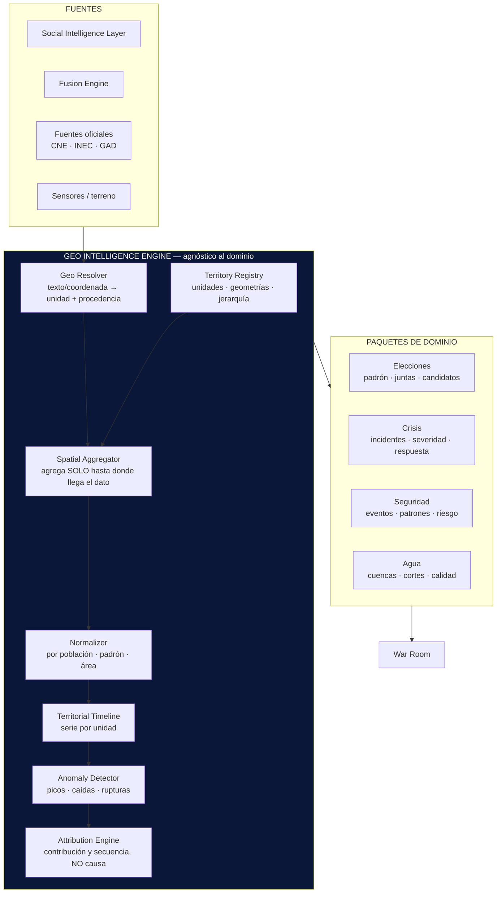

```
════════════════════════════════════════════════════════
  SENTINEL INTELLIGENCE PLATFORM — AI Intelligence Platform
  DISEÑO UX — War Room Operacional
────────────────────────────────────────────────────────
  Documento     : UX-WR-001
  Versión       : v1.0
  Fecha         : 2026-08-19
  Estado        : Draft — diseño, sin implementación
  Sprint        : UX-1 (diseño) · UX-2 (primera implementación)
  Autor         : Comité Fundador de Sentinel Intelligence
  Founder       : Patricio David Fierro (Product Owner principal)
  Confidencial. : CONFIDENCIAL — Uso interno fundacional
════════════════════════════════════════════════════════
```

# War Room Operacional — Diseño

## 0. La restricción que gobierna todo el diseño

Antes de dibujar un solo pin: **el War Room de Cuenca tiene dos resoluciones geográficas incompatibles y debe mostrarlo, no disimularlo.**

| Tipo de dato | Resolución real disponible | Precisión |
|---|---|---|
| Resultados electorales (CNE) | **Junta receptora del voto** | Muy fina, oficial |
| Padrón y demografía (INEC) | **Parroquia / zona censal** | Fina, oficial |
| Eventos (agenda, territorio, incidentes) | **Dirección o coordenada** | Fina, si se captura bien |
| Medios locales | Cobertura **cantonal**; a veces parroquia si la nota la nombra | Media |
| **Conversación digital** | **Ciudad, en el mejor caso** | **Gruesa** |
| **Pauta digital (Meta Ads)** | **Provincia** — no cantón | **Muy gruesa** |

### El precedente que no vamos a repetir

En el informe de Meta Ads de la Prefectura del Azuay (periodo 27-may a 27-jun 2026) se intentó estimar penetración **por cantón** repartiendo el alcance provincial según peso poblacional del INEC. El resultado fue **134 % en Cantones Principales y 238 % en Cantones Rurales**: penetraciones imposibles, porque el radio de segmentación captaba población de Cuenca y periferia contada como "Azuay Province". La solución adoptada fue **reportar en la unidad que el dato realmente soporta** (agrupación de cantones), no en la que se deseaba.

**El War Room hereda esa regla como ley de diseño:**

> **REGLA GEO-1 — Nunca se pinta más fino que la resolución del dato.**
> Una capa cuyo dato llega a nivel ciudad **no se desagrega a parroquia**, por mucho que el mapa tenga parroquias dibujadas. Se pinta en su unidad real y se declara.

Un heatmap por parroquia construido con datos de ciudad no es un mapa: es una invención con forma de mapa. Y a diferencia de una cifra mal calculada, **un mapa se cree**.

---

## 1. Procedencia geográfica del dato

Todo dato que entra al War Room declara **cómo obtuvo su ubicación**. Es el equivalente geográfico del linaje (DT3) y de `presencia_inferida` del Social Intelligence Layer.

| Procedencia | Significado | Resolución máxima que habilita |
|---|---|---|
| `declarada` | El dato trae coordenada o unidad administrativa explícita | Punto / parroquia |
| `derivada` | Se resolvió desde un topónimo en el texto, con confianza | Parroquia, con margen |
| `agregada` | Solo existe en unidad superior (ciudad, cantón, provincia) | **Esa unidad, y ninguna más fina** |
| `desconocida` | Sin señal de ubicación | No se pinta — se cuenta aparte |

**Lo que no se puede ubicar no desaparece.** Cada capa muestra su contador de `sin ubicar`. Un mapa con 40 pines y 300 registros sin ubicar da una impresión falsa si no lo dice.

---

## 2. El mapa: Cuenca real, no un mapa genérico

### 2.1 Geografía administrativa

El mapa se construye sobre las **unidades administrativas reales del cantón Cuenca**, provincia del Azuay:

- **15 parroquias urbanas** *(v)*: Bellavista · Cañaribamba · El Batán · El Sagrario · El Vecino · Gil Ramírez Dávalos · Hermano Miguel · Huayna Cápac · Machángara · Monay · San Blas · San Sebastián · Sucre · Totoracocha · Yanuncay
- **21 parroquias rurales** *(v)*: Baños · Chaucha · Checa · Chiquintad · Cumbe · El Valle · Llacao · Molleturo · Nulti · Octavio Cordero Palacios · Paccha · Quingeo · Ricaurte · San Joaquín · Santa Ana · Sayausí · Sidcay · Sinincay · Tarqui · Turi · Victoria del Portete

*(v) = a verificar contra la fuente oficial (GAD Municipal de Cuenca / geoportal INEC) antes de implementar. Misma convención que el Cap. 14 de la Constitución: las cifras se marcan hasta confirmarse.*

**Jerarquía de zoom y unidad de análisis:**

```
   z10  Provincia del Azuay ──── contexto, no análisis
   z11  Cantón Cuenca ────────── unidad de comparación con otros cantones
   z12  Parroquia ───────────── ★ UNIDAD PRINCIPAL DE ANÁLISIS
   z14  Zona censal ─────────── solo con dato INEC
   z16  Recinto / junta ─────── solo con dato CNE
   z17+ Punto ───────────────── solo procedencia `declarada`
```

Al hacer zoom más allá de lo que la capa activa soporta, **la capa no se subdivide**: se atenúa y aparece el aviso *«Esta capa no tiene resolución por parroquia. Datos disponibles a nivel ciudad.»*

### 2.2 Base cartográfica

| Decisión | Elección | Por qué |
|---|---|---|
| Motor de mapa | **MapLibre GL JS** | Libre, sin clave, teselas vectoriales, sin dependencia de proveedor (coherente con la agnosticidad del proyecto) |
| Base | Teselas vectoriales OSM, **estilo oscuro propio** | El War Room es oscuro; un basemap claro compite con los datos |
| Límites administrativos | **GeoJSON oficial** (GAD Cuenca / INEC), servido por el backend | Un mapa genérico no tiene parroquias de Cuenca. Sin este archivo no hay War Room |
| Proyección | Web Mercator (EPSG:3857) para render; **EPSG:32717 (UTM 17S)** para cálculos de área | Mercator distorsiona el área; los cálculos por km² no se hacen en pantalla |
| Etiquetas | Topónimos locales en español | El analista es local |

**El basemap es contexto, no protagonista:** calles y relieve al 25 % de opacidad, sin POIs comerciales. La tinta fuerte se reserva a los datos.

> **Lo que NO es:** un mapa de mundo con un marcador en Cuenca. El territorio *es* la unidad de análisis; sin límites parroquiales reales, el heatmap y el ranking territorial no existen.

---

## 3. Capas

Cuatro capas, activables de forma independiente, cada una con su resolución declarada:

| Capa | Contenido | Resolución típica | Procedencia dominante |
|---|---|---|---|
| **Medios** | Notas y coberturas de medios locales/nacionales | Cantón; parroquia si la nota la nombra | `derivada` |
| **Conversación** | Volumen y temas de conversación pública digital | **Ciudad** | `agregada` |
| **Eventos** | Actos, recorridos, incidentes, hitos de agenda | **Punto** | `declarada` |
| **Candidatos** | Actividad territorial de actores en seguimiento | Punto o parroquia | `declarada` / `derivada` |

**Reglas de composición:**

1. **Una sola capa de magnitud a la vez.** Dos heatmaps superpuestos son ilegibles. Al activar el heatmap de una capa, el de la otra se desactiva.
2. **Las capas de puntos sí se combinan** (Eventos + Candidatos), porque la forma del pin las distingue.
3. **Máximo 3 candidatos con color simultáneo.** Verificado con el validador de paletas: en contextos de todos-los-pares (mapa, choropleth) solo los tres primeros colores mantienen separación segura para daltonismo. El cuarto y siguientes van a «Otros» o a comparación en pequeños múltiplos.
4. **Cada capa muestra su contador de `sin ubicar`.**

---

## 4. Sistema de pines

### 4.1 Principio: **la forma dice qué es, el color dice cuánto o en qué estado**

El tipo de pin se codifica por **forma e icono**, no por color. Tres razones:

1. Cuatro tipos por color en un mapa no superan el umbral de separación para daltonismo en el modo de todos-los-pares (medido, no supuesto).
2. En un mapa los pines aparecen en cualquier vecindad, sin orden previsible.
3. Deja el color libre para lo que de verdad varía: **magnitud y severidad**.

```
   TIPO                FORMA              COLOR CODIFICA
   ─────────────────────────────────────────────────────────────
   Medios              ◆ rombo            volumen de cobertura
                                          (rampa azul secuencial)

   Conversación        ● círculo hueco    volumen de menciones
                       (borde grueso)     (rampa azul secuencial)
                       ⚠ nunca en punto exacto: se ancla al
                         centroide de su unidad real

   Evento              ▲ triángulo        naturaleza del evento
                                          (neutro; severidad si aplica)

   Actividad de        ⬢ hexágono         color del candidato
   candidato                              (slots 1–3, máx. 3)

   Alerta              ✱ estrella +       ESTADO fijo:
                       anillo pulsante    good · warning · serious ·
                                          critical
                                          + icono + etiqueta SIEMPRE
```

### 4.2 Anatomía del pin

```
        ┌── halo de selección (2px, solo si está seleccionado)
        │
        │   ┌── anillo de superficie 2px (separa pines solapados)
        │   │
        ▼   ▼
      ╭───────────╮
      │   ◆  12   │   ← contador si es un clúster
      ╰───────────╯
            │
            ╰── ancla: punta al punto exacto (procedencia `declarada`)
                       base plana al centroide (procedencia `agregada`)

   La FORMA DEL ANCLA comunica la precisión:
     punta afilada  → sabemos dónde
     base plana     → es el centroide de una zona, no un lugar
```

Este detalle es el que evita el engaño más común de los mapas de inteligencia: un pin afilado sobre una esquina cuando el dato solo decía «Cuenca».

### 4.3 Estados y agrupamiento

| Estado | Tratamiento |
|---|---|
| Normal | Opacidad 100 %, anillo de superficie |
| Atenuado | 30 % — no coincide con el filtro activo, pero se mantiene visible para no perder contexto |
| Seleccionado | Halo + ficha lateral abierta |
| Clúster | Forma del tipo dominante + contador; al hacer clic, expande |
| Sin corroborar | Contorno discontinuo — una sola fuente lo respalda |

**Agrupamiento:** por proximidad **dentro de la misma parroquia**, nunca entre parroquias. Agrupar cruzando un límite administrativo destruye la unidad de análisis.

---

## 5. Heatmap territorial

### 5.1 Coropletas por parroquia, no manchas de calor

**Se descarta el heatmap de densidad de puntos** (la mancha difusa). Motivos:

| Problema del *blur* de densidad | Consecuencia |
|---|---|
| Inventa precisión entre puntos | Sugiere intensidad donde no hay dato |
| El radio del kernel es arbitrario | El mismo dato «prueba» cosas distintas según el radio |
| Ignora límites administrativos | Y la decisión política se toma por parroquia |
| No es comparable | No se puede rankear ni medir evolución |

**Se adopta la coropleta por parroquia**, que es discreta, auditable, comparable y coincide con la unidad de decisión.

### 5.2 Especificación de color

**Magnitud — rampa secuencial de un solo tono** (azul, claro→oscuro). Nunca arcoíris.

```
   NIVEL DE ACTIVIDAD (menciones normalizadas por 1.000 habitantes)

   ░░ #cde2fb  100 · muy bajo
   ▒▒ #9ec5f4  200 · bajo
   ▓▓ #5598e7  350 · medio
   ██ #2a78d6  450 · alto
   ██ #184f95  600 · muy alto
   ▨▨ hachurado 45°  ·  SIN DATO SUFICIENTE
```

**Cambio — rampa divergente** azul ↔ rojo con **gris neutro** en el centro (el punto medio debe leerse como «nada», no como un color más):

```
   VARIACIÓN vs. periodo anterior
   #184f95 ◄── #2a78d6 ── #383835 ── #d03b3b ──► rojo intenso
    sube fuerte     sube     sin cambio    baja      baja fuerte
```

### 5.3 Tres reglas de honestidad

1. **Normalización obligatoria y visible.** El valor absoluto pinta de oscuro a la parroquia más poblada, siempre. Se normaliza por población o por padrón y **el selector de normalización está a la vista**, no escondido en ajustes.
2. **`Sin dato` tiene su propio tratamiento.** Hachurado a 45°, nunca el tono más claro de la rampa: «casi cero» y «no sabemos» no pueden parecerse.
3. **Umbral mínimo de muestra.** Bajo N configurable, la parroquia se marca `muestra insuficiente` en lugar de pintarse. Con 3 menciones no se colorea un territorio.

---

## 6. Panel «¿Qué provocó este cambio?»

### 6.1 Una precisión necesaria sobre el nombre

El panel no puede afirmar **causa**. Con datos observacionales —sin experimento ni contrafactual real— lo que se puede establecer es **contribución y coincidencia temporal**, no causalidad. Un panel que diga «esto lo provocó» estaría afirmando más de lo que el dato sostiene, y contradiría la explicabilidad obligatoria (IA1).

**Diseño adoptado:** el panel conserva la pregunta del usuario como **título**, porque es la pregunta correcta, y responde con lenguaje calibrado:

- «**Coincide con**» para correlación temporal
- «**Contribuye en ~X %**» para aporte medido al agregado
- «**Precede en N h**» para secuencia observada
- «**Atribución no determinable**» cuando no hay suficiente para ordenar los factores

> Es la misma disciplina que ya rige el resto de la plataforma: la puntuación de identidad se detiene en «Muy alta correspondencia» y la confirmación queda para el analista. Aquí, la atribución se detiene en «contribución observada» y la causa queda para el analista.

### 6.2 Estructura

```
 ╭──────────────────────────────────────────────────────────────╮
 │  ¿QUÉ PROVOCÓ ESTE CAMBIO?                            ✕      │
 ├──────────────────────────────────────────────────────────────┤
 │  Candidato A · Yanuncay · 12–19 ago                          │
 │                                                              │
 │      ▲ +34 %   menciones                                     │
 │      de 1.240 a 1.662        ventana: 7 d                    │
 │                                                              │
 │  ── FACTORES ORDENADOS POR APORTE ──────────────────────     │
 │                                                              │
 │  1. ▓▓▓▓▓▓▓▓▓▓░░░░  ~52 %   Cobertura mediana                │
 │     3 medios locales, 14–15 ago · «coincide con»             │
 │     ▸ 6 evidencias                        [ver]              │
 │                                                              │
 │  2. ▓▓▓▓▓▓░░░░░░░░  ~28 %   Evento territorial               │
 │     Recorrido en Yanuncay, 14 ago 10:00                      │
 │     «precede en 6 h al primer pico»       [ver]              │
 │                                                              │
 │  3. ▓▓▓░░░░░░░░░░░  ~13 %   Publicación propia               │
 │     Vídeo, 15 ago · alcance 47.000        [ver]              │
 │                                                              │
 │  4. ▓░░░░░░░░░░░░░   ~7 %   Sin atribuir                     │
 │     Actividad de fondo no asociada a un factor               │
 │                                                              │
 │  ── LO QUE NO SABEMOS ──────────────────────────────────     │
 │  · 118 menciones sin ubicación (7 % del total)               │
 │  · Conversación disponible solo a nivel ciudad:              │
 │    el desglose por parroquia es del componente               │
 │    de medios y eventos, no del digital                       │
 │  · Sin datos de pauta de terceros en la ventana              │
 │                                                              │
 │  [ Exportar con evidencias ]   [ Marcar como revisado ]      │
 ╰──────────────────────────────────────────────────────────────╯
```

### 6.3 El bloque «Lo que no sabemos» es obligatorio

No es un descargo legal: es la parte del panel que impide una mala decisión. Un panel que solo enumera lo que encontró produce exceso de confianza. La sección declara siempre: registros sin ubicar, capas de resolución más gruesa que la vista, ventanas sin cobertura y porcentaje no atribuido.

### 6.4 Cómo se calcula el aporte

| Paso | Método |
|---|---|
| 1. Detección | El cambio supera el umbral configurado en su ventana |
| 2. Recolección | Todas las evidencias de la ventana + margen previo |
| 3. Agrupación | Por factor: medios, eventos, publicación propia, pauta, terceros |
| 4. Aporte | Proporción del delta explicada por cada grupo, con residuo explícito |
| 5. Secuencia | Orden temporal factor → pico, con la latencia observada |
| 6. Calibración | Etiqueta según fuerza de la señal: coincide / precede / contribuye |
| 7. Residuo | **El «sin atribuir» siempre se muestra.** Si supera el 40 %, el panel encabeza con «Atribución no determinable» |

Cada factor enlaza a sus **evidencias** con su linaje: sin poder abrir la evidencia, el porcentaje es un acto de fe.

---

## 7. Distribución en cuatro cuadrantes

### 7.1 Wireframe

```
 ┌──────────────────────────────────────────────────────────────────────────┐
 │  SENTINEL WAR ROOM · Cuenca      [◀ 12–19 ago ▶]  [Capas ▾]  [Norm. ▾]  │
 ├───────────────────────────────────────────┬──────────────────────────────┤
 │                                           │  ② ALERTAS            (12)   │
 │  ① MAPA — Cuenca                          │  ┌────────────────────────┐  │
 │                                           │  │ ⛔ CRÍTICA             │  │
 │      ╭─────────────────────────╮          │  │ Narrativa negativa     │  │
 │      │   ▨▨  ░░░  ██  ▓▓       │          │  │ El Vecino · hace 40m   │  │
 │      │  ░░  ██ ◆ ▲  ░░  ▒▒     │          │  │ ▸ 4 medios · 1 evento  │  │
 │      │   ▓▓ ⬢  ✱  ▒▒  ░░       │          │  ├────────────────────────┤  │
 │      │  ██  ▒▒  ◆ ░░  ▓▓       │          │  │ ⚠ SERIA                │  │
 │      │   ░░  ▓▓ ⬢  ██  ░░      │          │  │ Pico en Yanuncay       │  │
 │      ╰─────────────────────────╯          │  │ +34 % · hace 2 h       │  │
 │                                           │  ├────────────────────────┤  │
 │   ░░▒▒▓▓██ bajo→alto  ▨ sin dato          │  │ ▲ ATENCIÓN             │  │
 │   ◆ medios ● conversación ▲ evento        │  │ Cobertura cae en Monay │  │
 │   ⬢ candidato ✱ alerta                    │  └────────────────────────┘  │
 │                                           │  Sin ubicar: 118 (7 %)       │
 ├───────────────────────────────────────────┼──────────────────────────────┤
 │  ③ EVOLUCIÓN                              │  ④ RANKING                   │
 │                                           │                              │
 │   menciones                               │  CANDIDATOS                  │
 │   1.8k ┤        ╱‾‾╲    ← A               │  1 ● A   1.662  ▲ +34 %      │
 │        │   ╱‾‾╲╱    ╲                     │  2 ● B   1.104  ▼ −8 %       │
 │   1.2k ┤ ╱‾    ─── ── ← B                 │  3 ● C     870  ─  +1 %      │
 │        │╱   ·············· ← C            │    ⋯ otros 4                 │
 │   0.6k ┤                                  │                              │
 │        └┬────┬────┬────┬────┬──           │  PARROQUIAS                  │
 │        12   14   16   18  ago             │  1 Yanuncay    892  ▲ +41 %  │
 │         ▲ evento    ▲ nota                │  2 El Vecino   744  ▲ +12 %  │
 │                                           │  3 Totoracocha 610  ▼ −5 %   │
 │   [ ¿Qué provocó este cambio? ]           │  4 Monay       588  ▼ −19 %  │
 └───────────────────────────────────────────┴──────────────────────────────┘
```

### 7.2 Por qué esta disposición

| Cuadrante | Posición | Función | Razón de la ubicación |
|---|---|---|---|
| **① Mapa** | Superior izquierda, el mayor | *Dónde* | Se lee primero (recorrido visual occidental) y es el centro declarado del War Room |
| **② Alertas** | Superior derecha | *Qué exige atención ya* | Lo urgente no puede requerir desplazamiento |
| **③ Evolución** | Inferior izquierda | *Desde cuándo* | Bajo el mapa: el eje temporal comparte el ancho |
| **④ Ranking** | Inferior derecha | *Quién y dónde destaca* | Junto a alertas: ambos son listas ordenadas |

**Diagonal de lectura:** Mapa → Alertas → Evolución → Ranking responde *dónde → qué → desde cuándo → quién*. Es el orden en que un analista pregunta.

### 7.3 Filtrado cruzado

Los cuatro cuadrantes son **una sola consulta con cuatro vistas**. Toda selección se propaga:

| Acción | Efecto en los demás |
|---|---|
| Clic en parroquia (①) | ③ filtra a esa parroquia · ④ resalta su fila · ② filtra sus alertas |
| Clic en alerta (②) | ① centra y resalta su ubicación · ③ marca su ventana · abre el panel de cambio |
| Selección de rango (③) | ① recalcula el heatmap · ④ recalcula el ranking · ② filtra por fecha |
| Clic en candidato (④) | ① muestra solo su actividad · ③ resalta su serie |

**Regla de color innegociable:** el color sigue a la **entidad**, nunca a su posición en el ranking. Si un filtro reduce de 5 candidatos a 2, los supervivientes **conservan su color**. Repintar por rango hace que la vista mienta entre dos estados.

**Regla de un solo eje:** el cuadrante Evolución nunca tiene doble eje vertical. Dos magnitudes de escala distinta → dos gráficos o indexado a base común. Un doble eje permite «demostrar» cualquier correlación eligiendo las escalas.

---

## 8. Flujo de interacción

```
  INICIO
    │
    ├─► Vista por defecto: cantón Cuenca · últimos 7 días · todas las capas
    │
    ▼
  ¿Hay alerta crítica?
    │
    ├── SÍ ──► ② destaca · ① la señala sin mover el encuadre
    │            │
    │            └─► clic ──► panel «¿Qué provocó este cambio?»
    │                          │
    │                          ├─► ver evidencias ──► lista con linaje
    │                          ├─► exportar informe
    │                          └─► marcar como revisado
    │
    └── NO ──► exploración libre
                 │
                 ├─► ① clic en parroquia ──► los 4 cuadrantes se filtran
                 │      │
                 │      └─► ficha de parroquia: actividad, medios,
                 │           eventos, candidatos, evolución, sin ubicar
                 │
                 ├─► ③ arrastrar rango ──► recálculo global
                 │
                 └─► ④ clic en candidato ──► seguimiento individual
                        │
                        └─► actividad territorial + correspondencia
                             (procedente del Social Intelligence Layer)
```

**Cuatro reglas de interacción:**

1. **Nunca se pierde el contexto.** Filtrar atenúa; no elimina. Se ve lo excluido.
2. **Todo número es interrogable.** Clic → sus evidencias. Sin esa ruta, es decoración.
3. **La resolución se anuncia antes de engañar.** Zoom más allá de la capa → aviso, no subdivisión inventada.
4. **Vista de tabla siempre disponible.** Requisito de accesibilidad y de auditoría: quien no distinga los colores debe poder leer los mismos datos.

---

## 9. Geo Intelligence Engine

### 9.1 Principio

El War Room de elecciones es **el primer módulo** de un motor geoespacial reutilizable, igual que Sentinel Politics es el primer módulo sobre Sentinel Core. **El motor no sabe de elecciones.** Sabe de territorio, series temporales, magnitudes normalizadas, anomalías y atribución.



### 9.2 Los siete componentes del motor

| Componente | Responsabilidad | Reutilización entre dominios |
|---|---|---|
| **Territory Registry** | Unidades, geometrías, jerarquía, población. Cualquier división administrativa | Total — cambia el conjunto de unidades, no el código |
| **Geo Resolver** | Ubica un dato y **declara su procedencia** | Total |
| **Spatial Aggregator** | Agrega respetando GEO-1: **nunca desagrega** | Total — es donde vive la regla |
| **Normalizer** | Por población, padrón, área, hogares | Total — cambia el denominador |
| **Anomaly Detector** | Picos, caídas, rupturas de tendencia por unidad | Total — cambian los umbrales |
| **Attribution Engine** | Ordena factores por aporte con residuo explícito | Total — cambia el catálogo de factores |
| **Territorial Timeline** | Serie temporal por unidad, alimenta el Timeline Universal | Total |

### 9.3 Qué aporta cada paquete de dominio

Un paquete de dominio es **configuración y vocabulario**, no un motor nuevo:

| Paquete | Unidades | Denominador | Factores de atribución | Alerta típica |
|---|---|---|---|---|
| **Elecciones** | Parroquia, recinto, junta | Padrón electoral | Medios, eventos, pauta, terceros | Narrativa negativa en zona clave |
| **Crisis** | Parroquia, barrio, punto | Población, hogares | Incidente, comunicación oficial, rumor | Escalada sin respuesta oficial |
| **Seguridad** | Parroquia, cuadrante | Población, km² | Patrón, evento, operativo | Concentración anómala de incidentes |
| **Agua** | Cuenca hidrográfica, junta, red | Usuarios, caudal | Corte, lluvia, obra, calidad | Afectación de servicio con reclamos |

> **Prueba de que el motor es genérico:** *Agua* usa **cuencas hidrográficas**, que no coinciden con los límites administrativos. Si el Territory Registry solo admitiera parroquias, el motor no sería reutilizable. Por eso el registro es de **conjuntos de unidades arbitrarios con jerarquías propias**, y una unidad puede pertenecer a más de una jerarquía.

---

## 10. Estructura de componentes propuesta

```
apps/web/src/warroom/                       ← NUEVO (frontend)
│
├── WarRoom.jsx                             contenedor de 4 cuadrantes
├── WarRoomContext.jsx                      estado compartido: la ÚNICA
│                                           fuente de verdad del filtro
├── quadrants/
│   ├── MapQuadrant.jsx                     ①
│   ├── AlertsQuadrant.jsx                  ②
│   ├── EvolutionQuadrant.jsx               ③
│   └── RankingQuadrant.jsx                 ④
│
├── map/
│   ├── CuencaMap.jsx                       MapLibre GL
│   ├── layers/
│   │   ├── ChoroplethLayer.jsx             heatmap por parroquia
│   │   ├── MediaPinLayer.jsx               ◆
│   │   ├── ConversationPinLayer.jsx        ●
│   │   ├── EventPinLayer.jsx               ▲
│   │   ├── CandidatePinLayer.jsx           ⬢
│   │   └── AlertPinLayer.jsx               ✱
│   ├── Pin.jsx                             forma + ancla + estados
│   ├── ClusterPin.jsx                      agrupa dentro de parroquia
│   ├── ResolutionNotice.jsx                aviso de resolución
│   └── MapLegend.jsx                        rampa + formas + sin dato
│
├── panels/
│   ├── ChangeAttributionPanel.jsx           «¿Qué provocó este cambio?»
│   ├── FactorBar.jsx                        barra de aporte
│   ├── UnknownsBlock.jsx                    «Lo que no sabemos»
│   ├── ParishCard.jsx                       ficha de parroquia
│   └── EvidenceList.jsx                     evidencias con linaje
│
├── controls/
│   ├── TimeRangeControl.jsx
│   ├── LayerToggle.jsx
│   ├── NormalizationSelect.jsx              visible, no oculto
│   └── TableViewToggle.jsx                  accesibilidad + auditoría
│
└── viz/
    ├── palette.js                           paleta VALIDADA (§11)
    ├── EvolutionChart.jsx                   un solo eje
    ├── RankingList.jsx                      color por entidad, no por rango
    └── DeltaBadge.jsx                       ▲▼ con icono + signo, no solo color
```

```
apps/backend/services/geo/                  ← NUEVO (backend)
│
├── geoIntelligenceEngine.js                orquestador
├── territoryRegistry.js                    unidades y jerarquías
├── geoResolver.js                           ubica + declara procedencia
├── spatialAggregator.js                     hace cumplir GEO-1
├── normalizer.js
├── anomalyDetector.js
├── attributionEngine.js                     contribución, NO causa
├── territorialTimeline.js
│
├── territories/
│   ├── ec-azuay-cuenca.json                 GeoJSON oficial (v)
│   └── territoryLoader.js
│
└── domains/
    ├── eleccionesPack.js
    ├── crisisPack.js
    ├── seguridadPack.js
    └── aguaPack.js
```

---

## 11. Paleta — validada, no elegida a ojo

Ejecutado `scripts/validate_palette.js` del sistema de visualización. **El War Room es oscuro**, así que la validación que manda es la de superficie oscura:

| Uso | Colores | Resultado |
|---|---|---|
| Entidades en mapa/coropleta (todos los pares) | `#3987e5` `#d95926` `#199e70` | **PASS** — 5/5 comprobaciones. Peor par CVD ΔE 9.4 · visión normal 20.9 · contraste ≥3:1 |
| Series en Evolución (pares adyacentes, 8 series) | los 8 pasos oscuros | **PASS** — 5/5. Peor adyacente CVD ΔE 8.4 · visión normal 19.3 |
| Magnitud (coropleta) | rampa azul `#cde2fb`→`#184f95` | Secuencial de un tono |
| Cambio | divergente azul↔rojo, medio gris `#383835` | El medio lee «nada» |
| Alertas | `#0ca30c` `#fab219` `#ec835a` `#d03b3b` | Estado reservado; **siempre** con icono y etiqueta |

**Consecuencias de diseño derivadas de la medición:**

1. **Máximo 3 entidades con color simultáneo en el mapa.** No es una preferencia: pasado el tercer color, ningún orden de la paleta supera el umbral de todos-los-pares. La cuarta entidad va a «Otros» o a pequeños múltiplos.
2. **Los pines llevan forma además de color** — codificación secundaria obligatoria en el mapa, donde cualquier par puede quedar contiguo.
3. **Las alertas nunca son solo color.** Icono + etiqueta siempre; en superficie clara, `warning` y `serious` no alcanzan 3:1 y el color por sí solo no comunicaría.
4. **El color de estado no se reutiliza para series.** Un candidato nunca se pinta con el rojo de «crítica».
5. **Modo claro previsto.** No es una inversión automática: son pasos propios de las mismas rampas, validados contra la superficie clara. En claro, tres colores quedan bajo 3:1 y exigen etiqueta directa o vista de tabla.

---

## 12. Riesgos

| ID | Riesgo | Prob. | Impacto | Mitigación |
|---|---|---|---|---|
| WR-1 | Heatmap por parroquia con datos de ciudad | **Alta** | **Muy alto** | GEO-1 en el agregador · procedencia visible · aviso de resolución. Es el error de Azuay, un nivel más abajo |
| WR-2 | El panel de atribución se lee como causa probada | **Alta** | Alto | Lenguaje calibrado · residuo «sin atribuir» siempre visible · bloqueo si supera el 40 % |
| WR-3 | Sin GeoJSON oficial de parroquias, no hay War Room | Media | **Muy alto** | Obtener y versionar el archivo **antes** de UX-2 |
| WR-4 | Sobrecarga cognitiva: cuatro cuadrantes a la vez | Media | Medio | Jerarquía visual clara · una capa de magnitud a la vez · atenuar en lugar de ocultar |
| WR-5 | Datos «sin ubicar» ignorados por el analista | **Alta** | Alto | Contador permanente por capa · en «Lo que no sabemos» |
| WR-6 | Uso del mapa para perfilar a personas por zona | Baja | **Muy alto** | Unidad mínima = parroquia para datos de personas · EX1–EX7 (Cap. 14) |
| WR-7 | El motor geo nace atado a elecciones | Media | Alto | Registro de territorios con jerarquías arbitrarias · validación con el paquete Agua (cuencas ≠ parroquias) |
| WR-8 | Rendimiento con miles de pines | Media | Medio | Agrupamiento por parroquia · teselas vectoriales · virtualización de listas |

---

## 13. Alcance del Sprint UX-2

**Criterio:** igual que en el Sprint 3.1, la porción vertical que **no depende de un dato que aún no tenemos**.

### Sí — UX-2

| # | Entregable | Depende de |
|---|---|---|
| 1 | **Obtener y versionar el GeoJSON oficial** de las 36 parroquias | GAD Cuenca / INEC — **bloqueante** |
| 2 | `territoryRegistry.js` + `ec-azuay-cuenca.json` | (1) |
| 3 | `geoResolver.js` con las cuatro procedencias | (2) |
| 4 | `spatialAggregator.js` que hace cumplir GEO-1 | (2) |
| 5 | `CuencaMap.jsx` + `ChoroplethLayer` + leyenda + aviso de resolución | (1) (2) |
| 6 | `palette.js` con la paleta ya validada | Nada |
| 7 | Estructura de los cuatro cuadrantes con datos del Fusion Engine | Fusion Engine ✅ |

**Resultado esperado:** el mapa real de Cuenca con las 36 parroquias, pintando lo que el dato del Fusion Engine soporta de verdad —probablemente a nivel cantón— y **declarándolo**. Un mapa honesto y pobre es mejor punto de partida que un mapa rico e inventado.

### No — diferido

| A | Qué | Por qué |
|---|---|---|
| UX-3 | Panel de atribución completo | Necesita series históricas que aún no existen |
| UX-3 | `anomalyDetector` + `attributionEngine` | Requieren histórico para calibrar umbrales |
| UX-4 | Capas Medios y Conversación con datos reales | Dependen del Social Intelligence Layer (Sprint 3.1+) |
| UX-4 | Sistema de alertas en vivo | Requiere ingesta continua, hoy inexistente |
| UX-5 | Paquetes Crisis, Seguridad y Agua | Tras validar el motor con Elecciones |
| — | Captura masiva de redes | Excluido por indicación expresa |

---

## 14. Decisiones que requieren aprobación

1. **Ratificar GEO-1** — nunca pintar más fino que la resolución del dato, aunque el mapa tenga la geometría para hacerlo.
2. **Aceptar el lenguaje calibrado** del panel de atribución: «contribuye», «coincide», «precede»; nunca «provocó» como afirmación del sistema.
3. **Confirmar la coropleta por parroquia** en lugar del heatmap de densidad difusa.
4. **Autorizar la obtención del GeoJSON oficial** de Cuenca — es bloqueante para UX-2.
5. **Confirmar el máximo de 3 entidades con color** simultáneas en el mapa, con «Otros» para el resto.
6. **Aprobar el alcance de UX-2** (§13).

---

## 15. Referencias

- `docs/architecture/Social-Intelligence-Layer.md` — proveedor de las capas Conversación y Candidatos.
- `docs/constitution/` — Cap. 9 (IA1 explicabilidad, IA2 human-in-the-loop, IA4 trazabilidad), Cap. 10 (DT3 linaje, DT4 residencia), Cap. 14 §5.5 (EX1–EX7). **Se aplica; no se modifica.**
- Informe Meta Ads Prefectura del Azuay, 27-may a 27-jun 2026 — origen empírico de GEO-1.
- Fuentes oficiales a incorporar: CNE (juntas y resultados), INEC (población y zonas censales), GAD Municipal de Cuenca (límites parroquiales).

---

*Fin del documento UX-WR-001 — War Room Operacional, diseño v1.0. Estado: Draft, pendiente de aprobación.*
