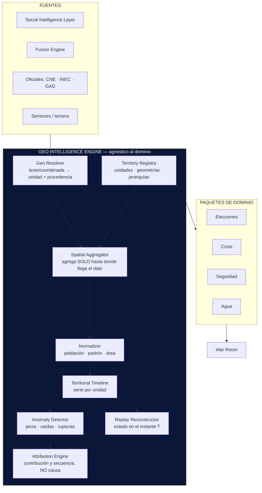

```
════════════════════════════════════════════════════════
  SENTINEL INTELLIGENCE PLATFORM — AI Intelligence Platform
  DISEÑO UX — War Room Operacional
────────────────────────────────────────────────────────
  Documento     : UX-WR-001
  Versión       : v2.0 — CONGELADA
  Fecha         : 2026-08-20
  Estado        : Frozen — especificación definitiva del
                  Centro de Operaciones de Sentinel
  Sprint        : UX-1 (cerrado) · UX-2 (implementación)
  Autor         : Comité Fundador de Sentinel Intelligence
  Founder       : Patricio David Fierro (Product Owner principal)
  Confidencial. : CONFIDENCIAL — Uso interno fundacional
════════════════════════════════════════════════════════
```

# War Room Operacional — Especificación congelada

> **Estado congelado.** Este documento cierra el Sprint UX-1. Toda modificación posterior de lo aquí especificado requiere un ADR que lo supersede, conforme a las reglas de gobierno documental del proyecto.

## Índice

| § | Contenido |
|---|---|
| 0 | La restricción que gobierna el diseño |
| 1 | Procedencia geográfica del dato |
| 2 | Mapa Inteligente de Cuenca |
| 3 | Las cinco capas |
| 4 | Sistema de pines |
| 5 | Panel lateral de incidente |
| 6 | Heatmap territorial |
| 7 | Los cuatro cuadrantes (congelados) |
| 8 | Módulo «¿Qué provocó este cambio?» |
| 9 | Replay Intelligence |
| 10 | Componentes React |
| 11 | Flujo de interacción |
| 12 | Geo Intelligence Engine |
| 13 | Paleta validada |
| 14 | Riesgos |
| 15 | Alcance del Sprint UX-2 |
| 16 | Registro de decisiones congeladas |

---

## 0. La restricción que gobierna todo el diseño

Antes de un solo pin: **el War Room de Cuenca tiene dos resoluciones geográficas incompatibles y debe mostrarlo, no disimularlo.**

| Tipo de dato | Resolución real disponible | Precisión |
|---|---|---|
| Resultados electorales (CNE) | **Junta receptora del voto** | Muy fina, oficial |
| Padrón y demografía (INEC) | **Parroquia / zona censal** | Fina, oficial |
| Eventos (agenda, territorio, incidentes) | **Dirección o coordenada** | Fina, si se captura bien |
| Medios locales | Cobertura **cantonal**; parroquia si la nota la nombra | Media |
| **Conversación ciudadana** | **Ciudad, en el mejor caso** | **Gruesa** |
| **Pauta digital (Meta Ads)** | **Provincia** — no cantón | **Muy gruesa** |

### El precedente que no vamos a repetir

En el informe de Meta Ads de la Prefectura del Azuay (27-may a 27-jun 2026) se estimó penetración **por cantón** repartiendo el alcance provincial según peso poblacional del INEC. Resultado: **134 % en Cantones Principales y 238 % en Cantones Rurales** — penetraciones imposibles, porque el radio de segmentación captaba población de Cuenca y periferia contada como «Azuay Province». La solución adoptada fue reportar **en la unidad que el dato realmente soporta**.

> ### REGLA GEO-1 · CONGELADA
> **Nunca se pinta más fino que la resolución del dato.**
> Una capa cuyo dato llega a nivel ciudad **no se desagrega a parroquia**, por mucho que el mapa tenga las parroquias dibujadas. Se pinta en su unidad real y se declara.

Un heatmap por parroquia construido con datos de ciudad no es un mapa: es una invención con forma de mapa. Y a diferencia de una cifra mal calculada, **un mapa se cree**.

---

## 1. Procedencia geográfica del dato

Todo dato declara **cómo obtuvo su ubicación**. Es el equivalente geográfico del linaje (DT3) y de `presencia_inferida` del Social Intelligence Layer.

| Procedencia | Significado | Resolución máxima habilitada | Marca visual |
|---|---|---|---|
| `declarada` | Trae coordenada o unidad administrativa explícita | Punto / parroquia | Ancla en punta |
| `derivada` | Resuelta desde un topónimo en el texto, con confianza | Parroquia, con margen | Ancla en punta atenuada |
| `agregada` | Solo existe en unidad superior | **Esa unidad y ninguna más fina** | **Ancla de base plana** |
| `desconocida` | Sin señal de ubicación | No se pinta — se cuenta aparte | Contador «sin ubicar» |

**Lo que no se puede ubicar no desaparece.** Cada capa muestra su contador de `sin ubicar`. Un mapa con 40 pines y 300 registros sin ubicar da una impresión falsa si no lo dice.

---

## 2. Mapa Inteligente de Cuenca

**El mapa es el corazón del War Room.** No es un widget de contexto: es la superficie sobre la que se toma la decisión, y los otros tres cuadrantes son sus derivadas.

### 2.1 Geografía administrativa real

Cantón **Cuenca**, provincia del **Azuay**, Ecuador.

- **15 parroquias urbanas** *(v)*: Bellavista · Cañaribamba · El Batán · El Sagrario · El Vecino · Gil Ramírez Dávalos · Hermano Miguel · Huayna Cápac · Machángara · Monay · San Blas · San Sebastián · Sucre · Totoracocha · Yanuncay
- **21 parroquias rurales** *(v)*: Baños · Chaucha · Checa · Chiquintad · Cumbe · El Valle · Llacao · Molleturo · Nulti · Octavio Cordero Palacios · Paccha · Quingeo · Ricaurte · San Joaquín · Santa Ana · Sayausí · Sidcay · Sinincay · Tarqui · Turi · Victoria del Portete

*(v) = a verificar contra fuente oficial (GAD Municipal de Cuenca / geoportal INEC) antes de implementar. Misma convención que el Cap. 14 de la Constitución.*

### 2.2 Jerarquía de zoom y unidad de análisis

```
   z10  Provincia del Azuay ──── contexto, no análisis
   z11  Cantón Cuenca ────────── comparación con otros cantones
   z12  Parroquia ───────────── ★ UNIDAD PRINCIPAL DE ANÁLISIS
   z13  Sector especial ─────── Centro Histórico y polígonos propios
   z14  Zona censal ─────────── solo con dato INEC
   z16  Recinto / junta ─────── solo con dato CNE
   z17+ Punto ───────────────── solo procedencia `declarada`
```

Al hacer zoom más allá de lo que la capa activa soporta, **la capa no se subdivide**: se atenúa y `ResolutionNotice` avisa — *«Esta capa no tiene resolución por parroquia. Datos disponibles a nivel ciudad.»*

### 2.3 Base cartográfica — por qué no es un mapa genérico

| Decisión | Elección | Por qué |
|---|---|---|
| Motor | **MapLibre GL JS** | Libre, sin clave, teselas vectoriales, sin dependencia de proveedor |
| Base | Teselas vectoriales OSM, **estilo oscuro propio** | El War Room es oscuro; un basemap claro compite con los datos |
| Límites | **GeoJSON oficial** (GAD Cuenca / INEC), servido por el backend | Un mapa genérico no tiene las parroquias de Cuenca. **Sin este archivo no hay War Room** |
| Proyección | Web Mercator (EPSG:3857) para render; **EPSG:32717 (UTM 17S)** para área | Mercator distorsiona el área; los km² no se calculan en pantalla |
| Etiquetas | Topónimos locales en español | El analista es local |
| Opacidad de la base | 25 %, sin POIs comerciales | La tinta fuerte se reserva a los datos |

> **Lo que NO es:** un mapa mundial con un marcador sobre Cuenca. El territorio *es* la unidad de análisis; sin límites parroquiales reales no existen el heatmap ni el ranking territorial.

---

## 3. Las cinco capas

| # | Capa | Contenido | Resolución típica | Procedencia dominante | Componente |
|---|---|---|---|---|---|
| 1 | **Medios de comunicación** | Notas y coberturas de medios locales y nacionales | Cantón; parroquia si la nota la nombra | `derivada` | `MediaPinLayer` |
| 2 | **Conversación ciudadana** | Volumen y temas de conversación pública digital | **Ciudad** | `agregada` | `ConversationPinLayer` |
| 3 | **Eventos** | Actos, recorridos, incidentes, hitos de agenda | **Punto** | `declarada` | `EventPinLayer` |
| 4 | **Actividad de candidatos** | Presencia territorial de actores en seguimiento | Punto o parroquia | `declarada` / `derivada` | `CandidatePinLayer` |
| 5 | **Heatmap territorial** | Magnitud agregada por unidad | Parroquia o sector | según capa fuente | `NarrativeHeatmap` |

**Reglas de composición — congeladas:**

1. **Una sola capa de magnitud a la vez.** Dos heatmaps superpuestos son ilegibles. Activar uno desactiva el otro.
2. **Las capas de puntos sí se combinan.** La forma y el color del pin las distinguen.
3. **Máximo 3 candidatos con color simultáneo.** Medido, no supuesto (§13). El cuarto y siguientes van a «Otros» o a pequeños múltiplos.
4. **Cada capa muestra su contador de `sin ubicar`.**
5. **El heatmap se alimenta de una capa declarada**, nunca de la suma de capas con resoluciones distintas.

---

## 4. Sistema de pines

### 4.1 Los cinco pines — especificación congelada

| Pin | Color | Hex (oscuro) | Hex (claro) | Forma | Capa |
|---|---|---|---|---|---|
| **Medio de comunicación** | **Azul** | `#3987e5` | `#2a78d6` | ◆ rombo | Medios |
| **Conversación ciudadana** | **Morado** | `#d55181` | `#e87ba4` | ● círculo con borde grueso | Conversación |
| **Evento relevante** | **Amarillo** | `#c98500` | `#eda100` | ▲ triángulo | Eventos |
| **Actividad de candidato** | **Verde** | `#008300` | `#008300` | ⬢ hexágono | Candidatos |
| **Alerta crítica** | **Rojo** | `#d03b3b` | `#d03b3b` | ✱ estrella + anillo pulsante | *estado, no capa* |

### 4.2 Dos ajustes derivados de la medición

Los cinco colores y sus significados son los especificados. Dos precisiones, ambas medidas con el validador de paletas y no elegidas por gusto:

**a) El morado se sitúa en el paso magenta-rosado `#d55181`.** El violeta-azulado inicial (`#9085e9`) es indistinguible del azul: **ΔE 1.9 en protanopia y 9.8 incluso con visión normal**, muy por debajo del piso de 15. Y no es un problema de elegir mejor el paso: se probaron seis violetas y ninguno que siga leyéndose como «violeta» supera 5.3 en protanopia — la confusión azul/violeta es intrínseca. Como Medios y Conversación son las dos capas más densas del mapa, era la peor colisión posible. El paso adoptado mide **ΔE 15.9 (protanopia) y 26.5 (visión normal)** frente al azul, y sigue leyéndose como morado.

**b) El rojo es un ESTADO, no la quinta capa.** Con los cuatro colores de capa (azul, morado, amarillo, verde) el conjunto **pasa las cinco comprobaciones en ambos modos**. Al añadir el rojo como quinto color categórico, falla contra verde (ΔE 5.9 en deuteranopia) y contra morado (9.0 en visión normal). La solución no es cambiar el rojo: es reconocer que **una alerta nunca es «otro pin más»** — es una interrupción. Por eso pertenece a la paleta de estado, que está exenta del umbral categórico **precisamente porque siempre viaja con icono y etiqueta**, nunca con el color solo.

### 4.3 La forma es codificación redundante obligatoria

El color es el lenguaje primario, tal como se especificó. La **forma** va siempre además:

```
   ◆  Medio          rombo
   ●  Conversación   círculo de borde grueso
   ▲  Evento         triángulo
   ⬢  Candidato      hexágono
   ✱  Alerta         estrella + anillo pulsante + icono + etiqueta
```

Razón: en un mapa los pines aparecen en cualquier vecindad, sin orden previsible, y sobre un basemap que introduce su propio color. La forma garantiza que el mapa se lea con daltonismo, impreso en gris y en modo de contraste forzado.

### 4.4 Anatomía del pin

```
        ┌── halo de selección (2px, solo si está seleccionado)
        │
        │   ┌── anillo de superficie 2px (separa pines solapados)
        │   │
        ▼   ▼
      ╭───────────╮
      │   ◆  12   │   ← contador si es un clúster
      ╰───────────╯
            │
            ╰── ANCLA:
                punta afilada  → procedencia `declarada` · sabemos dónde
                punta atenuada → procedencia `derivada`  · resuelto del texto
                base plana     → procedencia `agregada`  · centroide de zona
```

Este detalle evita el engaño más común de los mapas de inteligencia: **un pin afilado sobre una esquina cuando el dato solo decía «Cuenca».**

### 4.5 Estados y agrupamiento

| Estado | Tratamiento |
|---|---|
| Normal | Opacidad 100 %, anillo de superficie |
| Atenuado | 30 % — no coincide con el filtro, pero se mantiene visible para no perder contexto |
| Seleccionado | Halo + `IncidentPanel` abierto |
| Clúster | Forma del tipo dominante + contador; clic expande |
| Sin corroborar | Contorno discontinuo — una sola fuente lo respalda |
| Fuera de ventana (Replay) | 10 %, sin interacción |

**Agrupamiento:** por proximidad **dentro de la misma parroquia**, nunca cruzando límites. Agrupar entre parroquias destruye la unidad de análisis.

---

## 5. Panel lateral de incidente — `IncidentPanel`

Al seleccionar cualquier pin se abre el panel lateral derecho con los **siete campos especificados**:

```
 ╭──────────────────────────────────────────────────────────╮
 │  ◆  MEDIO DE COMUNICACIÓN                          ✕     │
 ├──────────────────────────────────────────────────────────┤
 │                                                          │
 │  ORIGEN                                                  │
 │  Diario El Mercurio · sección Política                   │
 │  ◆ medio local · Cuenca                                  │
 │                                                          │
 │  NARRATIVA                                               │
 │  «Cuestionamiento a la gestión de obras viales»          │
 │  Encuadre: crítico · Tema: infraestructura               │
 │                                                          │
 │  ALCANCE                                                 │
 │  Estimado 47.000  ·  ⚠ métrica declarada por la fuente,  │
 │  no verificada de forma independiente                    │
 │                                                          │
 │  HORA                                                    │
 │  15 ago 2026 · 09:10 (ECT, UTC−5)                        │
 │  Detectado por Sentinel: 09:34 (+24 min)                 │
 │                                                          │
 │  UBICACIÓN                                               │
 │  El Batán  ·  procedencia: derivada                      │
 │  «resuelto desde el topónimo citado en la nota»          │
 │                                                          │
 │  CONFIANZA                                               │
 │  ████████████░░░  82/100 — Alta                          │
 │  ▸ Fuente identificada y recurrente          +30         │
 │  ▸ Corroborado por 2 fuentes independientes  +25         │
 │  ▸ Fecha y autoría explícitas                +15         │
 │  ▸ Ubicación derivada, no declarada          −8          │
 │  ▸ Alcance no verificable                    −5          │
 │                                                          │
 │  EVIDENCIA                                               │
 │  ▸ ev-0142  nota original          [abrir]               │
 │  ▸ ev-0148  réplica en radio       [abrir]               │
 │  ▸ ev-0151  mención en X           [abrir]               │
 │  Linaje: fusion_engine → brave_web → ev-0142             │
 │                                                          │
 │  ENLACE DE ORIGEN                                        │
 │  🔗 elmercurio.com.ec/2026/08/15/...       [abrir ↗]     │
 │                                                          │
 ├──────────────────────────────────────────────────────────┤
 │  [ ¿Qué provocó este cambio? ]  [ Ver en Replay ]        │
 │  [ Añadir al informe ]          [ Marcar revisado ]      │
 ╰──────────────────────────────────────────────────────────╯
```

### Cinco reglas del panel — congeladas

1. **Los siete campos siempre están presentes.** Si un dato falta, se muestra el campo con «no disponible» explícito. Ocultar el campo haría creer que no aplica.
2. **La confianza se desglosa siempre.** Un número sin sus componentes es una opinión con formato de dato. Coherente con IA1.
3. **El alcance se marca como declarado por la fuente.** Sentinel no puede verificar el alcance de un tercero; presentarlo sin la advertencia sería atribuirse una medición ajena.
4. **La hora es doble:** hora del hecho y hora de detección. La diferencia es información operativa — cuánto tardó Sentinel en verlo.
5. **La evidencia es navegable con su linaje.** Sin poder abrir la evidencia, el panel es decoración.

---

## 6. Heatmap territorial

### 6.1 Coropletas, no manchas de calor

**Se descarta el heatmap de densidad difusa.** Motivos:

| Problema del *blur* de densidad | Consecuencia |
|---|---|
| Inventa precisión entre puntos | Sugiere intensidad donde no hay dato |
| El radio del kernel es arbitrario | El mismo dato «prueba» cosas distintas según el radio |
| Ignora límites administrativos | Y la decisión se toma por parroquia |
| No es comparable | No permite rankear ni medir evolución |

**Se adopta la coropleta por unidad territorial:** discreta, auditable, comparable y coincidente con la unidad de decisión.

### 6.2 Los sectores solicitados — y una advertencia cartográfica

Los ocho sectores indicados **no son homogéneos**, y eso cambia cómo el motor los trata:

| Sector | Naturaleza | Tipo | Implicación |
|---|---|---|---|
| **Centro Histórico** | **NO es parroquia** — es un polígono patrimonial que abarca El Sagrario, San Blas, Gil Ramírez Dávalos y bordes de Huayna Cápac y Sucre | Sector especial | Requiere **polígono propio** en el Territory Registry |
| **El Batán** | Parroquia urbana | Urbana | Directo |
| **Totoracocha** | Parroquia urbana | Urbana | Directo |
| **Machángara** | Parroquia urbana | Urbana | Directo |
| **Yanuncay** | Parroquia urbana | Urbana | Directo |
| **Ricaurte** | Parroquia **rural** | Rural | Área mucho mayor, densidad menor |
| **El Valle** | Parroquia **rural** | Rural | Área mucho mayor, densidad menor |
| **Baños** | Parroquia **rural** | Rural | Área mucho mayor, densidad menor |

**Dos consecuencias de diseño:**

**a) El Centro Histórico necesita su propia geometría.** No se puede pintar sumando parroquias enteras: El Sagrario no es solo Centro Histórico. El Territory Registry ya está diseñado para admitir **jerarquías arbitrarias y unidades pertenecientes a más de una jerarquía** — este es el caso que lo justifica, junto al de las cuencas hidrográficas del paquete Agua.

**b) Mezclar urbanas y rurales sin normalizar es el hermano de GEO-1.** Ricaurte, El Valle y Baños tienen superficies muy superiores a El Batán o Totoracocha. Un mapa de valores absolutos pintaría de oscuro lo grande o lo poblado, siempre, y respondería a la pregunta equivocada.

### 6.3 Normalización — obligatoria y visible

```
   ┌─ NORMALIZAR POR ─────────────────────────┐
   │  ● Población (INEC)      recomendado     │
   │  ○ Padrón electoral      Elecciones      │
   │  ○ Superficie (km²)      cobertura terr. │
   │  ○ Valor absoluto        ⚠ solo conteo   │
   └──────────────────────────────────────────┘
```

El selector `NormalizationSelect` está **a la vista en la barra superior**, no oculto en ajustes: cambiar el denominador cambia el mapa, y quien lo lee debe saber cuál está mirando. Al elegir «valor absoluto» aparece el aviso *«mapa de conteo: refleja tamaño y población, no intensidad relativa»*.

### 6.4 Escala de color

**Magnitud — rampa secuencial de un solo tono** (azul, claro→oscuro). Nunca arcoíris.

```
   INTENSIDAD (normalizada)

   ░░ #cde2fb  100 · muy baja
   ▒▒ #9ec5f4  200 · baja
   ▓▓ #5598e7  350 · media
   ██ #2a78d6  450 · alta
   ██ #184f95  600 · muy alta
   ▨▨ hachurado 45°  ·  SIN DATO SUFICIENTE
```

**Cambio — rampa divergente** azul ↔ rojo con **gris neutro** al centro (el punto medio debe leerse como «nada», no como un color más):

```
   VARIACIÓN vs. periodo anterior
   #184f95 ◄── #2a78d6 ── #383835 ── #d03b3b ──► rojo intenso
    sube fuerte     sube     sin cambio    baja     baja fuerte
```

### 6.5 Cómo funciona el motor — sin inventar datos

```
   1. RECOLECCIÓN     evidencias de la ventana temporal activa
                      (Fusion Engine + Social Intelligence Layer)
                              │
   2. RESOLUCIÓN      GeoResolver → unidad + procedencia por evidencia
                              │
   3. FILTRO GEO-1    ¿la procedencia soporta la unidad pedida?
                      NO → se agrega en su unidad real y se declara
                              │
   4. AGREGACIÓN      conteo por unidad territorial
                              │
   5. UMBRAL          N < mínimo configurable → «muestra insuficiente»
                      NO se pinta. Con 3 menciones no se colorea un territorio
                              │
   6. NORMALIZACIÓN   ÷ denominador seleccionado
                              │
   7. ESCALADO        cuantiles sobre las unidades CON dato
                      (nunca sobre el total, que incluiría los ceros falsos)
                              │
   8. RENDER          coropleta + leyenda + «sin dato» + resolución efectiva
```

### 6.6 Tres reglas de honestidad — congeladas

1. **Normalización obligatoria y visible** (§6.3).
2. **`Sin dato` tiene tratamiento propio:** hachurado a 45°, nunca el tono más claro de la rampa. «Casi cero» y «no sabemos» no pueden parecerse.
3. **Umbral mínimo de muestra.** Bajo N, la unidad se marca `muestra insuficiente` en lugar de pintarse.

---

## 7. Los cuatro cuadrantes — congelados

### 7.1 Wireframe definitivo

```
 ┌───────────────────────────────────────────────────────────────────────────┐
 │ SENTINEL WAR ROOM · Cuenca   [◀ 12–19 ago ▶] [Capas▾] [Normalizar▾] [⏱] │
 ├──────────────────────────────────────────────┬────────────────────────────┤
 │ ① MAPA INTELIGENTE                           │ ② ALERTAS         (12)     │
 │   WarRoomMap · GeoLayerManager                │   AlertCenter              │
 │   NarrativeHeatmap · GeoLegend                │  ┌──────────────────────┐  │
 │   MapPopup · TerritorialFilter                │  │ ⛔ CRÍTICA           │  │
 │                                              │  │ Narrativa negativa   │  │
 │     ╭──────────────────────────────╮         │  │ El Vecino · 40m      │  │
 │     │  ▨▨  ░░░  ██  ▓▓   ░░        │         │  │ ▸ 4 medios · 1 event │  │
 │     │ ░░  ██ ◆ ▲  ░░  ▒▒  ██       │         │  ├──────────────────────┤  │
 │     │  ▓▓ ⬢  ✱  ▒▒  ░░  ◆  ▓▓      │         │  │ ⚠ SERIA              │  │
 │     │ ██  ▒▒  ● ░░  ▓▓  ⬢  ░░      │         │  │ Pico en Yanuncay     │  │
 │     │  ░░  ▓▓ ▲  ██  ░░  ▒▒        │         │  │ +34 % · 2 h          │  │
 │     ╰──────────────────────────────╯         │  ├──────────────────────┤  │
 │                                              │  │ ▲ ATENCIÓN           │  │
 │  GeoLegend                                   │  │ Cobertura ↓ en Monay │  │
 │  ░░▒▒▓▓██ baja→alta   ▨ sin dato             │  └──────────────────────┘  │
 │  ◆ medio ● conversación ▲ evento             │  Sin ubicar: 118 (7 %)     │
 │  ⬢ candidato ✱ alerta                        │  Resolución: cantón        │
 ├──────────────────────────────────────────────┼────────────────────────────┤
 │ ③ EVOLUCIÓN                                  │ ④ RANKINGS                 │
 │   EvolutionChart · TimelineReplay             │   CandidateRadar           │
 │                                              │   RankingList              │
 │   menciones                                  │                            │
 │   1.8k ┤        ╱‾‾╲    ← A                  │  CANDIDATOS                │
 │        │   ╱‾‾╲╱    ╲                        │  1 ⬢ A  1.662  ▲ +34 %     │
 │   1.2k ┤ ╱‾    ─── ── ← B                    │  2 ⬢ B  1.104  ▼ −8 %      │
 │        │╱   ·············· ← C               │  3 ⬢ C    870  ─  +1 %     │
 │   0.6k ┤                                     │    ⋯ otros 4               │
 │        └┬────┬────┬────┬────┬──              │                            │
 │        12   14   16   18  ago                │  SECTORES                  │
 │         ▲evento  ▲nota  ✱alerta              │  1 Yanuncay      ▲ +41 %   │
 │                                              │  2 Centro Hist.  ▲ +18 %   │
 │  ⏱ REPLAY  ◀◀ ▶ ▶▶   ●━━━━━━━━━━━ 15:40      │  3 El Batán      ▲ +12 %   │
 │  cobertura de ingesta ▓▓▓▓░▓▓▓▓▓▓            │  4 Totoracocha   ▼ −5 %    │
 │                                              │  5 Machángara    ▼ −19 %   │
 │  [ ¿Qué provocó este cambio? ]                │  norm.: población          │
 └──────────────────────────────────────────────┴────────────────────────────┘
```

### 7.2 Qué componente vive en cada cuadrante — congelado

| Cuadrante | Componentes | Función | Razón de la ubicación |
|---|---|---|---|
| **① Mapa Inteligente** | `WarRoomMap` · `GeoLayerManager` · `NarrativeHeatmap` · `MapPopup` · `GeoLegend` · `TerritorialFilter` | *Dónde* | Se lee primero y es el corazón declarado del War Room. El mayor de los cuatro |
| **② Alertas** | `AlertCenter` | *Qué exige atención ya* | Lo urgente no puede requerir desplazamiento ni clic |
| **③ Evolución** | `EvolutionChart` · `TimelineReplay` | *Desde cuándo* | Bajo el mapa: comparten el eje horizontal del tiempo y el ancho |
| **④ Rankings** | `CandidateRadar` · `RankingList` | *Quién y dónde destaca* | Junto a Alertas: ambos son listas ordenadas y verticales |

`IncidentPanel` no pertenece a un cuadrante: es un **panel lateral superpuesto** invocado desde cualquiera de los cuatro.

**Diagonal de lectura:** Mapa → Alertas → Evolución → Rankings responde *dónde → qué → desde cuándo → quién*. Es el orden en que un analista pregunta.

### 7.3 Filtrado cruzado

Los cuatro cuadrantes son **una consulta con cuatro vistas**. Toda selección se propaga:

| Acción | Efecto en los demás |
|---|---|
| Clic en sector (①) | ③ filtra al sector · ④ resalta su fila · ② filtra sus alertas |
| Clic en alerta (②) | ① centra y resalta · ③ marca su ventana · abre el panel de cambio |
| Rango temporal (③) | ① recalcula heatmap · ④ recalcula ranking · ② filtra por fecha |
| Clic en candidato (④) | ① muestra solo su actividad · ③ resalta su serie |
| Replay activo (③) | **los cuatro** se reconstruyen al instante T |

**Dos reglas innegociables:**

- **El color sigue a la entidad, nunca a su rango.** Si un filtro reduce de 5 candidatos a 2, los supervivientes **conservan su color**. Repintar por posición hace que la vista mienta entre dos estados.
- **Un solo eje vertical en Evolución.** Dos magnitudes de escala distinta → dos gráficos o indexado a base común. Un doble eje permite «demostrar» cualquier correlación eligiendo las escalas.

---

## 8. Módulo «¿Qué provocó este cambio?»

### 8.1 Una precisión necesaria y congelada

El módulo **no puede afirmar causa**. Con datos observacionales —sin experimento ni contrafactual real— lo establecible es **contribución y secuencia temporal**. Un panel que dijera «esto lo provocó» afirmaría más de lo que el dato sostiene y contradiría la explicabilidad obligatoria (IA1).

**Diseño adoptado:** el módulo conserva la pregunta como **título**, porque es la pregunta correcta, y responde con lenguaje calibrado:

| Etiqueta | Cuándo se usa |
|---|---|
| **«Precede en N h»** | Secuencia temporal observada |
| **«Coincide con»** | Correlación temporal sin orden claro |
| **«Contribuye ~X %»** | Aporte medido al agregado |
| **«Atribución no determinable»** | El residuo sin atribuir supera el 40 % |

> Misma disciplina que rige el resto de la plataforma: la identidad se detiene en «Muy alta correspondencia» y confirma el analista. Aquí la atribución se detiene en «contribución observada» y la causa la establece el analista.

### 8.2 La cadena: Timeline + evidencias + conversación

```
                    CAMBIO DETECTADO
              Candidato A · Yanuncay · +34 %
                          │
        ┌─────────────────┼─────────────────┐
        ▼                 ▼                 ▼
   TIMELINE          EVIDENCIAS        CONVERSACIÓN
   ¿qué pasó         ¿qué lo           ¿cómo reaccionó
    antes?            respalda?         la gente?
        │                 │                 │
        │  hechos         │  linaje         │  volumen
        │  fechados       │  corroborado    │  y encuadre
        └────────┬────────┴────────┬────────┘
                 ▼                 ▼
            ORDENACIÓN        CUANTIFICACIÓN
            temporal          del aporte
                 └────────┬────────┘
                          ▼
                  CADENA RECONSTRUIDA
              con residuo explícito y
              bloque «lo que no sabemos»
```

### 8.3 Estructura del panel

```
 ╭───────────────────────────────────────────────────────────────╮
 │  ¿QUÉ PROVOCÓ ESTE CAMBIO?                              ✕     │
 ├───────────────────────────────────────────────────────────────┤
 │  Candidato A · Yanuncay · 12–19 ago                           │
 │                                                               │
 │      ▲ +34 %   menciones                                      │
 │      de 1.240 a 1.662        ventana: 7 d                     │
 │                                                               │
 │  ── CADENA RECONSTRUIDA ─────────────────────────────────      │
 │                                                               │
 │  09:10 ◆ El Mercurio publica nota crítica                     │
 │          │  precede en 70 min                                 │
 │  10:20 ● Menciones ×2,4 (de 180 a 432/h)                      │
 │          │  precede en 45 min                                 │
 │  11:05 ⬢ Candidato A responde en X                            │
 │          │  precede en 115 min                                │
 │  13:00 ● Segundo pico: 610 menciones/h                        │
 │                                                               │
 │  ── FACTORES ORDENADOS POR APORTE ───────────────────────      │
 │                                                               │
 │  1. ▓▓▓▓▓▓▓▓▓▓░░░░  ~52 %  Cobertura mediana                  │
 │     3 medios, 14–15 ago · «precede en 70 min»                 │
 │     ▸ 6 evidencias                            [ver]           │
 │                                                               │
 │  2. ▓▓▓▓▓▓░░░░░░░░  ~28 %  Evento territorial                 │
 │     Recorrido en Yanuncay, 14 ago 10:00                       │
 │     «precede en 6 h al primer pico»           [ver]           │
 │                                                               │
 │  3. ▓▓▓░░░░░░░░░░░  ~13 %  Respuesta propia                   │
 │     Publicación 15 ago · alcance declarado 47.000  [ver]      │
 │                                                               │
 │  4. ▓░░░░░░░░░░░░░   ~7 %  Sin atribuir                       │
 │     Actividad de fondo no asociada a un factor                │
 │                                                               │
 │  ── LO QUE NO SABEMOS ───────────────────────────────────      │
 │  · 118 menciones sin ubicación (7 % del total)                │
 │  · La conversación solo está disponible a nivel ciudad:       │
 │    el desglose por sector proviene de medios y eventos,       │
 │    no del componente digital                                  │
 │  · Sin datos de pauta de terceros en la ventana               │
 │  · Hueco de ingesta 16 ago 02:00–06:00 (4 h)                  │
 │                                                               │
 │  [ Abrir en Replay ]  [ Exportar con evidencias ]             │
 ╰───────────────────────────────────────────────────────────────╯
```

### 8.4 Cómo se calcula

| Paso | Método |
|---|---|
| 1. Detección | El cambio supera el umbral configurado en su ventana |
| 2. Recolección | Evidencias de la ventana + margen previo, de Timeline y Fusion |
| 3. Agrupación | Por factor: medios, eventos, respuesta propia, pauta, terceros |
| 4. Secuencia | Orden temporal factor → pico, con latencia observada |
| 5. Aporte | Proporción del delta explicada por cada grupo |
| 6. Calibración | Etiqueta según fuerza de la señal (§8.1) |
| 7. Residuo | **El «sin atribuir» siempre se muestra.** Sobre 40 % → «Atribución no determinable» |
| 8. Huecos | Se declaran los intervalos sin ingesta que afectan la ventana |

### 8.5 El bloque «Lo que no sabemos» es obligatorio

No es un descargo legal: es la parte que impide una mala decisión. Un panel que solo enumera lo que encontró produce exceso de confianza. Declara siempre: registros sin ubicar, capas de resolución más gruesa que la vista, huecos de ingesta y porcentaje no atribuido.

---

## 9. Replay Intelligence

### 9.1 Qué es

El modo de **reconstrucción temporal** del War Room: los cuatro cuadrantes vuelven al estado que tenían en un instante T y avanzan como una película, mostrando cómo se formó una situación.

```
   ⏱ REPLAY · 15 ago 2026

   ◀◀   ▶   ▶▶      ●━━━━━━━━━━━━━━━━━━━━━━━━  15:40
                     08:00                    18:00
   velocidad: ○1x ●4x ○15x ○60x        [salir del replay]

   cobertura de ingesta
   ▓▓▓▓▓▓▓▓░░░░▓▓▓▓▓▓▓▓▓▓▓▓▓▓▓▓▓▓▓▓
           ▲ hueco 11:20–12:00 (40 min)

   ── HITOS EN LA VENTANA ────────────────────────────────
   09:10 ◆ El Mercurio publica
   10:20 ● Menciones ×2,4
   11:05 ⬢ Candidato A responde
   13:00 ● Segundo pico
   14:30 ✱ Alerta: narrativa negativa en El Vecino
```

### 9.2 Comportamiento

| Elemento | Especificación |
|---|---|
| **Barra temporal** | Rango completo de la ventana; el cursor marca el instante T |
| **Velocidades** | 1× (tiempo real), 4×, 15×, 60× |
| **Reconstrucción** | Los cuatro cuadrantes muestran **solo** evidencias con `hora ≤ T` |
| **Mapa** | Los pines **aparecen** al alcanzar su hora; los previos se atenúan progresivamente con la edad |
| **Heatmap** | Recalculado en T: se ve el calor formándose |
| **Evolución** | La serie se dibuja hasta T; el resto en gris tenue |
| **Alertas** | Aparecen en el momento en que se habrían disparado |
| **Rankings** | Reordenados según el estado en T — el color no cambia (§7.3) |
| **Hitos** | Marcas en la barra; clic salta a ese instante |
| **Salida** | Vuelve al estado presente sin perder los filtros |

### 9.3 La barra de cobertura de ingesta — obligatoria

**Un replay implica completitud, y esa es su trampa.** Si la ingesta tuvo un hueco, el replay mostrará calma donde solo hubo ceguera.

Por eso la barra de cobertura va **siempre bajo la línea temporal**: tramos con ingesta en tono lleno, huecos en hachurado. Al reproducir un tramo sin cobertura, el panel muestra *«sin ingesta en este intervalo: la ausencia de actividad no es evidencia de calma»*.

Es el mismo principio que separó `bloqueado` de `0 resultados` en el Search Provider Layer, y `ausencia` de `no comprobado` en el Social Intelligence Layer. **La misma doctrina, aplicada al tiempo.**

### 9.4 Requisito arquitectónico

El Replay exige que **toda evidencia tenga hora de hecho y hora de detección**, y que el estado sea **reconstruible por filtrado temporal**, no por sobrescritura. Es decir: el almacén debe ser **append-only** —exactamente lo que ya se especificó para el Knowledge Lake— y las correspondencias y fichas deben estar **versionadas**, no actualizadas en sitio.

> **Si el Knowledge Lake no es append-only, Replay Intelligence es imposible.** Esta es la dependencia dura entre ambos diseños.

### 9.5 Usos

| Uso | Valor |
|---|---|
| **Post-mortem de crisis** | Reconstruir qué se supo y cuándo se supo |
| **Auditoría de decisión** | Demostrar sobre qué información se decidió |
| **Entrenamiento** | Formar analistas con episodios reales |
| **Presentación ejecutiva** | Narrar una situación con evidencia, no con relato |
| **Calibración** | Comprobar si una alerta se habría disparado a tiempo |

---

## 10. Componentes React — responsabilidades

| Componente | Responsabilidad única | Recibe | Emite | No hace |
|---|---|---|---|---|
| **`WarRoomMap`** | Poseer la instancia de MapLibre, el encuadre, el zoom y el basemap oscuro. Coordinar las capas | `vista`, `capasActivas`, `instanteReplay` | `onSectorClick`, `onPinClick`, `onViewportChange` | No decide qué pintar cada capa; no consulta datos |
| **`GeoLayerManager`** | Registrar, ordenar y activar/desactivar las cinco capas. Hacer cumplir «una sola capa de magnitud» y el aviso de resolución | catálogo de capas, filtro activo | `onLayerToggle`, `onResolutionConflict` | No dibuja marcas; no accede a la red |
| **`IncidentPanel`** | Mostrar los siete campos del incidente con confianza desglosada y evidencias navegables | `incidenteId` | `onOpenEvidence`, `onOpenAttribution`, `onOpenReplay` | No calcula la confianza; solo la presenta |
| **`AlertCenter`** | Listar alertas ordenadas por severidad y antigüedad. Icono + etiqueta siempre. Mostrar «sin ubicar» y resolución vigente | `alertas`, `filtro` | `onAlertSelect`, `onAlertAck` | No genera alertas; eso es del backend |
| **`CandidateRadar`** | Comparar actores en seguimiento: posición, variación y actividad territorial. Aplicar el tope de 3 colores y agrupar el resto en «Otros» | `candidatos`, `ventana` | `onCandidateSelect` | No asigna colores por rango — el color sigue a la entidad |
| **`NarrativeHeatmap`** | Renderizar la coropleta: escalado por cuantiles sobre unidades con dato, «sin dato» hachurado, umbral de muestra y normalización aplicada | `unidades`, `metrica`, `normalizacion`, `resolucion` | `onUnitClick`, `onScaleReady` | **No desagrega nunca** por debajo de la resolución declarada |
| **`TimelineReplay`** | Controlar el instante T y la velocidad. Publicar T al contexto para que los cuatro cuadrantes se reconstruyan. Renderizar la barra de cobertura de ingesta y los hitos | `ventana`, `hitos`, `coberturaIngesta` | `onInstantChange`, `onPlayStateChange` | No transforma datos; solo mueve el reloj |
| **`MapPopup`** | Resumen mínimo al pasar o tocar un pin: tipo, titular, hora, confianza. Puerta de entrada al `IncidentPanel` | `pin` | `onExpand` | No duplica el panel completo |
| **`TerritorialFilter`** | Seleccionar unidades territoriales (parroquias y sectores especiales) y propagar la selección a los cuatro cuadrantes | jerarquía de territorios | `onTerritorySelect` | No oculta lo no seleccionado — lo atenúa |
| **`GeoLegend`** | Explicar simultáneamente **tres codificaciones**: la rampa de magnitud, las formas y colores de los cinco pines, y el significado del ancla | `escalaActiva`, `capasActivas` | — | No es decorativa: sin ella el mapa es ilegible |

### 10.1 Estado compartido

```
   WarRoomContext  ← ÚNICA fuente de verdad
   ├── ventana temporal      { desde, hasta }
   ├── instanteReplay        T | null   ← null = presente
   ├── capasActivas          Set
   ├── normalizacion         'poblacion' | 'padron' | 'area' | 'absoluto'
   ├── seleccion             { tipo, id }   territorio | candidato | alerta | pin
   ├── resolucionEfectiva    'canton' | 'parroquia' | 'sector' | 'punto'
   └── metricasCobertura     { sinUbicar, huecosIngesta[] }
```

Los cuatro cuadrantes **leen** del contexto y **emiten** intenciones; ninguno guarda estado propio de filtro. Es lo que garantiza que las cuatro vistas nunca se contradigan.

### 10.2 Estructura de archivos

```
apps/web/src/warroom/                       ← NUEVO (frontend)
│
├── WarRoom.jsx                             contenedor de 4 cuadrantes
├── WarRoomContext.jsx                      estado compartido (§10.1)
│
├── quadrants/
│   ├── MapQuadrant.jsx                     ①
│   ├── AlertsQuadrant.jsx                  ②
│   ├── EvolutionQuadrant.jsx               ③
│   └── RankingsQuadrant.jsx                ④
│
├── map/
│   ├── WarRoomMap.jsx
│   ├── GeoLayerManager.jsx
│   ├── NarrativeHeatmap.jsx
│   ├── MapPopup.jsx
│   ├── GeoLegend.jsx
│   ├── ResolutionNotice.jsx
│   ├── Pin.jsx                             forma + ancla + estados
│   ├── ClusterPin.jsx
│   └── layers/
│       ├── MediaPinLayer.jsx               ◆ azul
│       ├── ConversationPinLayer.jsx        ● morado
│       ├── EventPinLayer.jsx               ▲ amarillo
│       ├── CandidatePinLayer.jsx           ⬢ verde
│       └── AlertPinLayer.jsx               ✱ rojo (estado)
│
├── panels/
│   ├── IncidentPanel.jsx                   los 7 campos
│   ├── ChangeAttributionPanel.jsx           «¿Qué provocó este cambio?»
│   ├── CausalChain.jsx                      cadena reconstruida
│   ├── FactorBar.jsx                        barra de aporte
│   ├── UnknownsBlock.jsx                    «Lo que no sabemos»
│   ├── ConfidenceBreakdown.jsx              desglose de confianza
│   └── EvidenceList.jsx                     evidencias con linaje
│
├── alerts/
│   └── AlertCenter.jsx
│
├── rankings/
│   ├── CandidateRadar.jsx
│   └── RankingList.jsx
│
├── replay/
│   ├── TimelineReplay.jsx
│   ├── IngestionCoverageBar.jsx             obligatoria (§9.3)
│   └── MilestoneTrack.jsx
│
├── controls/
│   ├── TimeRangeControl.jsx
│   ├── LayerToggle.jsx
│   ├── NormalizationSelect.jsx              visible, no oculto
│   ├── TerritorialFilter.jsx
│   └── TableViewToggle.jsx                  accesibilidad + auditoría
│
└── viz/
    ├── palette.js                           paleta VALIDADA (§13)
    ├── EvolutionChart.jsx                   un solo eje
    └── DeltaBadge.jsx                       ▲▼ con icono y signo, no solo color
```

```
apps/backend/services/geo/                  ← NUEVO (backend)
│
├── geoIntelligenceEngine.js                orquestador
├── territoryRegistry.js                    unidades y jerarquías arbitrarias
├── geoResolver.js                           ubica + declara procedencia
├── spatialAggregator.js                     hace cumplir GEO-1
├── normalizer.js
├── anomalyDetector.js
├── attributionEngine.js                     contribución, NO causa
├── territorialTimeline.js
├── replayReconstructor.js                   estado en el instante T
│
├── territories/
│   ├── ec-azuay-cuenca.json                 GeoJSON oficial (v)
│   ├── ec-azuay-cuenca-sectores.json         Centro Histórico y otros
│   └── territoryLoader.js
│
└── domains/
    ├── eleccionesPack.js
    ├── crisisPack.js
    ├── seguridadPack.js
    └── aguaPack.js
```

---

## 11. Flujo de interacción

```
  INICIO
    │
    ├─► Vista por defecto: cantón Cuenca · últimos 7 días · todas las capas
    │
    ▼
  ¿Hay alerta crítica?
    │
    ├── SÍ ──► ② destaca · ① la señala sin mover el encuadre
    │            │
    │            └─► clic ──► IncidentPanel
    │                          │
    │                          ├─► ¿Qué provocó este cambio? ──► cadena
    │                          ├─► Ver en Replay ──► T = hora del hecho
    │                          ├─► evidencias con linaje
    │                          └─► exportar / marcar revisado
    │
    └── NO ──► exploración libre
                 │
                 ├─► ① clic en sector ──► los 4 cuadrantes se filtran
                 │      └─► ficha del sector: actividad, medios,
                 │           eventos, candidatos, evolución, sin ubicar
                 │
                 ├─► ① clic en pin ──► MapPopup ──► IncidentPanel
                 │
                 ├─► ③ arrastrar rango ──► recálculo global
                 │
                 ├─► ③ activar Replay ──► reconstrucción en T
                 │      └─► los 4 cuadrantes retroceden juntos
                 │           + barra de cobertura de ingesta
                 │
                 └─► ④ clic en candidato ──► seguimiento individual
                        └─► actividad territorial + correspondencia
                             (del Social Intelligence Layer)
```

**Cinco reglas de interacción — congeladas:**

1. **Nunca se pierde el contexto.** Filtrar atenúa; no elimina.
2. **Todo número es interrogable.** Clic → sus evidencias. Sin esa ruta, es decoración.
3. **La resolución se anuncia antes de engañar.** Zoom más allá de la capa → aviso, no subdivisión inventada.
4. **Vista de tabla siempre disponible.** Accesibilidad y auditoría: quien no distinga los colores debe poder leer los mismos datos.
5. **El Replay declara siempre su cobertura.** Ausencia de datos ≠ ausencia de hechos.

---

## 12. Geo Intelligence Engine

### 12.1 Principio

El War Room electoral es **el primer módulo** de un motor geoespacial reutilizable, igual que Sentinel Politics es el primer módulo sobre Sentinel Core. **El motor no sabe de elecciones.** Sabe de territorio, series temporales, magnitudes normalizadas, anomalías y atribución.



### 12.2 Los ocho componentes

| Componente | Responsabilidad | Reutilización |
|---|---|---|
| **Territory Registry** | Unidades, geometrías, **jerarquías arbitrarias**, población | Total — cambia el conjunto de unidades |
| **Geo Resolver** | Ubica un dato y **declara su procedencia** | Total |
| **Spatial Aggregator** | Agrega respetando GEO-1: **nunca desagrega** | Total — aquí vive la regla |
| **Normalizer** | Por población, padrón, área, hogares | Total — cambia el denominador |
| **Anomaly Detector** | Picos, caídas, rupturas por unidad | Total — cambian los umbrales |
| **Attribution Engine** | Ordena factores por aporte, con residuo explícito | Total — cambia el catálogo de factores |
| **Territorial Timeline** | Serie por unidad; alimenta el Timeline Universal | Total |
| **Replay Reconstructor** | Estado completo en el instante T | Total |

### 12.3 Paquetes de dominio

Un paquete es **configuración y vocabulario**, no un motor nuevo:

| Paquete | Unidades | Denominador | Factores | Alerta típica |
|---|---|---|---|---|
| **Elecciones** | Parroquia, sector, recinto, junta | Padrón | Medios, eventos, pauta, terceros | Narrativa negativa en zona clave |
| **Crisis** | Parroquia, barrio, punto | Población, hogares | Incidente, comunicación oficial, rumor | Escalada sin respuesta oficial |
| **Seguridad** | Parroquia, cuadrante | Población, km² | Patrón, evento, operativo | Concentración anómala |
| **Agua** | **Cuenca hidrográfica**, junta, red | Usuarios, caudal | Corte, lluvia, obra, calidad | Afectación con reclamos |

> **Prueba de que el motor es genérico:** *Agua* usa **cuencas hidrográficas** y el War Room electoral necesita el **Centro Histórico** — ninguno de los dos coincide con los límites parroquiales. Si el Territory Registry solo admitiera parroquias, el motor no sería reutilizable. Por eso el registro admite **conjuntos de unidades arbitrarios con jerarquías propias**, y una unidad puede pertenecer a más de una jerarquía.

---

## 13. Paleta validada

Ejecutado `scripts/validate_palette.js`. **El War Room es oscuro**, así que la validación que manda es la de superficie oscura.

| Uso | Colores | Resultado medido |
|---|---|---|
| **4 capas de pines** (todos los pares) | `#3987e5` `#d55181` `#c98500` `#008300` | **PASS 5/5** — peor par visión normal ΔE 19.3 |
| 4 capas en modo claro | `#2a78d6` `#e87ba4` `#eda100` `#008300` | **PASS 5/5** — CVD ΔE 13.0 · normal 19.6 |
| Series en Evolución (8, adyacentes) | los 8 pasos oscuros | **PASS 5/5** — CVD ΔE 8.4 · normal 19.3 |
| Entidades en mapa (todos los pares) | primeros 3 slots | **PASS 5/5** — CVD ΔE 9.4 · normal 20.9 |
| Magnitud (coropleta) | rampa azul `#cde2fb`→`#184f95` | Secuencial de un tono |
| Cambio | divergente azul↔rojo, medio gris `#383835` | El medio lee «nada» |
| Alertas (estado) | `#0ca30c` `#fab219` `#ec835a` `#d03b3b` | Reservado; **siempre** icono + etiqueta |

**Cinco reglas derivadas de la medición — congeladas:**

1. **Máximo 3 entidades con color simultáneo en el mapa.** Pasado el tercero, ningún orden supera el umbral de todos-los-pares. La cuarta va a «Otros» o a pequeños múltiplos.
2. **Los pines llevan forma además de color.** Codificación secundaria obligatoria.
3. **Las alertas nunca son solo color.** Icono + etiqueta siempre.
4. **El color de estado no se reutiliza para series.** Un candidato nunca se pinta con el rojo de «crítica».
5. **Modo claro previsto, no invertido.** Pasos propios de las mismas rampas, validados contra la superficie clara. En claro, morado y amarillo quedan bajo 3:1 y exigen etiqueta directa o vista de tabla.

---

## 14. Riesgos

| ID | Riesgo | Prob. | Impacto | Mitigación |
|---|---|---|---|---|
| WR-1 | Heatmap por parroquia con datos de ciudad | **Alta** | **Muy alto** | GEO-1 en el agregador · procedencia visible · aviso de resolución |
| WR-2 | El panel de atribución se lee como causa probada | **Alta** | Alto | Lenguaje calibrado · residuo siempre visible · bloqueo sobre 40 % |
| WR-3 | Sin GeoJSON oficial no hay War Room | Media | **Muy alto** | Obtener y versionar **antes** de UX-2 |
| WR-4 | Centro Histórico pintado sumando parroquias enteras | **Alta** | Alto | Polígono propio en `ec-azuay-cuenca-sectores.json` |
| WR-5 | Comparar parroquias rurales y urbanas sin normalizar | **Alta** | Alto | Normalización obligatoria y visible · aviso en «valor absoluto» |
| WR-6 | Datos «sin ubicar» ignorados por el analista | **Alta** | Alto | Contador permanente por capa · en «Lo que no sabemos» |
| WR-7 | **Replay leído como historia completa** | **Alta** | **Muy alto** | Barra de cobertura de ingesta obligatoria · aviso en tramos sin datos |
| WR-8 | Knowledge Lake no append-only → Replay imposible | Media | **Muy alto** | Dependencia declarada (§9.4) antes de implementar el Lake |
| WR-9 | Uso del mapa para perfilar personas por zona | Baja | **Muy alto** | Unidad mínima = parroquia para datos de personas · EX1–EX7 (Cap. 14) |
| WR-10 | El motor geo nace atado a elecciones | Media | Alto | Jerarquías arbitrarias · validación con Agua (cuencas) y Centro Histórico |
| WR-11 | Rendimiento con miles de pines y replay a 60× | Media | Medio | Agrupamiento por parroquia · teselas vectoriales · virtualización · precálculo de instantes |
| WR-12 | Sobrecarga cognitiva de cuatro cuadrantes | Media | Medio | Jerarquía visual · una capa de magnitud a la vez · atenuar en lugar de ocultar |

---

## 15. Alcance del Sprint UX-2

**Criterio:** la porción vertical que **no depende de un dato que aún no tenemos**.

### Sí — UX-2

| # | Entregable | Depende de |
|---|---|---|
| 1 | **Obtener y versionar el GeoJSON oficial** de las 36 parroquias | GAD Cuenca / INEC — **bloqueante** |
| 2 | Polígono del **Centro Histórico** y sectores especiales | (1) |
| 3 | `territoryRegistry.js` + `ec-azuay-cuenca.json` | (1) (2) |
| 4 | `geoResolver.js` con las cuatro procedencias | (3) |
| 5 | `spatialAggregator.js` que hace cumplir GEO-1 | (3) |
| 6 | `WarRoomMap` + `GeoLayerManager` + `NarrativeHeatmap` + `GeoLegend` + `ResolutionNotice` | (1) (3) |
| 7 | `palette.js` con la paleta ya validada | Nada |
| 8 | `WarRoomContext` + los cuatro cuadrantes con datos del Fusion Engine | Fusion Engine ✅ |
| 9 | `IncidentPanel` con los siete campos | Fusion Engine ✅ |

**Resultado esperado:** el mapa real de Cuenca con sus 36 parroquias y el Centro Histórico, pintando lo que el dato del Fusion Engine soporta de verdad —probablemente a nivel cantón— y **declarándolo**. Un mapa honesto y pobre es mejor punto de partida que un mapa rico e inventado.

### No — diferido

| A | Qué | Por qué |
|---|---|---|
| UX-3 | `ChangeAttributionPanel` completo · `anomalyDetector` · `attributionEngine` | Requieren histórico para calibrar umbrales |
| UX-3 | `TimelineReplay` + `replayReconstructor` | Requiere Knowledge Lake append-only (§9.4) |
| UX-4 | Capas Medios y Conversación con datos reales | Dependen del Social Intelligence Layer (Sprint 3.1+) |
| UX-4 | `AlertCenter` con alertas en vivo | Requiere ingesta continua, hoy inexistente |
| UX-5 | Paquetes Crisis, Seguridad y Agua | Tras validar el motor con Elecciones |
| — | Captura masiva de redes | Excluido por indicación expresa |

---

## 16. Registro de decisiones congeladas

| # | Decisión | § |
|---|---|---|
| **WR-D1** | **GEO-1**: nunca se pinta más fino que la resolución del dato | 0 |
| **WR-D2** | Toda ubicación declara su procedencia: declarada / derivada / agregada / desconocida | 1 |
| **WR-D3** | Mapa real de Cuenca sobre MapLibre GL con GeoJSON oficial. La parroquia es la unidad de análisis | 2 |
| **WR-D4** | Cinco capas: Medios, Conversación, Eventos, Candidatos, Heatmap | 3 |
| **WR-D5** | Cinco pines con los colores especificados; morado en paso magenta-rosado por medición; **el rojo es estado, no capa** | 4 |
| **WR-D6** | La forma del pin es codificación redundante obligatoria; el ancla comunica la precisión | 4 |
| **WR-D7** | `IncidentPanel` con los siete campos, confianza desglosada y evidencias navegables | 5 |
| **WR-D8** | Coropleta por unidad territorial, **no** mancha de densidad difusa | 6 |
| **WR-D9** | Normalización obligatoria y visible; «sin dato» con tratamiento propio; umbral mínimo de muestra | 6 |
| **WR-D10** | Centro Histórico como sector especial con polígono propio | 6 |
| **WR-D11** | Cuatro cuadrantes: Mapa, Alertas, Evolución, Rankings, con componentes asignados | 7 |
| **WR-D12** | El color sigue a la entidad, nunca al rango. Un solo eje en Evolución | 7 |
| **WR-D13** | La atribución usa lenguaje calibrado; nunca afirma causa. Residuo siempre visible | 8 |
| **WR-D14** | El bloque «Lo que no sabemos» es obligatorio | 8 |
| **WR-D15** | Replay Intelligence reconstruye los cuatro cuadrantes en el instante T | 9 |
| **WR-D16** | La barra de cobertura de ingesta es obligatoria en el Replay | 9 |
| **WR-D17** | El Knowledge Lake debe ser append-only o el Replay es imposible | 9 |
| **WR-D18** | Diez componentes React con responsabilidad única y estado en `WarRoomContext` | 10 |
| **WR-D19** | Territory Registry con jerarquías arbitrarias — condición de reutilización del motor | 12 |
| **WR-D20** | Paleta validada con el validador; máximo 3 entidades con color en el mapa | 13 |

---

## 17. Referencias

- `docs/architecture/Social-Intelligence-Layer.md` — proveedor de las capas Conversación y Candidatos.
- `docs/constitution/` — Cap. 9 (IA1 explicabilidad, IA2 human-in-the-loop, IA4 trazabilidad), Cap. 10 (DT3 linaje, DT4 residencia), Cap. 14 §5.5 (EX1–EX7). **Se aplica; no se modifica.**
- Informe Meta Ads Prefectura del Azuay, 27-may a 27-jun 2026 — origen empírico de GEO-1.
- Fuentes oficiales a incorporar: CNE (juntas y resultados), INEC (población y zonas censales), GAD Municipal de Cuenca (límites parroquiales y polígono del Centro Histórico).

---

*Fin del documento UX-WR-001 v2.0 — War Room Operacional. **Estado: CONGELADO.** Cierra el Sprint UX-1. Toda modificación posterior requiere un ADR que lo supersede.*
