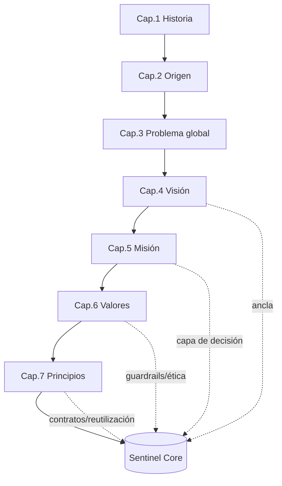

```
════════════════════════════════════════════════════════════════
  SENTINEL INTELLIGENCE PLATFORM — AI Intelligence Platform
  SENTINEL INTELLIGENCE FOUNDATION v1.0
  DOCUMENTO CONSOLIDADO — BLOQUE I: ADN E IDENTIDAD
────────────────────────────────────────────────────────────────
  Bloque        : I — ADN e Identidad (Capítulos 1 a 7)
  Versión       : v1.0
  Fecha         : 2026-08-14
  Estado        : Approved (bloque cerrado)
  Autor         : Comité Fundador de Sentinel Intelligence
  Founder       : Patricio David Fierro (Product Owner principal)
  Confidencial. : CONFIDENCIAL — Uso interno fundacional
════════════════════════════════════════════════════════════════
```

# BLOQUE I — ADN e Identidad · Documento Consolidado

> Este documento consolida los siete capítulos del Bloque I para revisión integral antes de iniciar el Bloque II. El **texto completo** de cada capítulo reside en su archivo individual (`Cap-01` … `Cap-07`); aquí se presenta la **síntesis ejecutiva** y los **registros transversales** (ADR, riesgos, impacto en el Core, pendientes) que dan visión de conjunto.

---

## A. Índice del Bloque

| Cap. | Título | Archivo | Estado |
|---|---|---|---|
| 1 | Historia de Sentinel Intelligence | `Cap-01-Historia.md` | Approved (conceptual) |
| 2 | Origen del Proyecto | `Cap-02-Origen-del-Proyecto.md` | Approved |
| 3 | Problema que Busca Resolver | `Cap-03-Problema.md` | Approved |
| 4 | Visión | `Cap-04-Vision.md` | Approved |
| 5 | Misión | `Cap-05-Mision.md` | Approved |
| 6 | Valores | `Cap-06-Valores.md` | Draft (para aprobación) |
| 7 | Principios | `Cap-07-Principios.md` | Draft (para aprobación) |

---

## B. Síntesis Ejecutiva del Bloque

El Bloque I establece el **ADN** de Sentinel Intelligence Platform: por qué existe, qué resuelve, hacia dónde va, cómo cumple su propósito y bajo qué valores y principios opera.

| Elemento | Enunciado consolidado |
|---|---|
| **Problema (global)** | El mundo genera información abundante pero carece de inteligencia continua, contextual, ética y explicable para convertirla en decisiones. |
| **Visión** | Ser la plataforma de inteligencia sobre la que el mundo transforma información en decisiones: un motor (Sentinel Core) extensible a toda industria, con ética y explicabilidad innegociables. |
| **Misión** | Transformar información en inteligencia accionable, ética y explicable, mediante Sentinel Core y módulos, para que cualquier organización decida mejor. |
| **Valores** | Inteligencia con propósito · Ética innegociable · Explicabilidad · Confianza · Excelencia · Innovación responsable · Impacto global con raíz local. |
| **Principios** | La decisión primero · Explicar es producto · Un Core, muchos módulos · Explicabilidad por diseño · Reutilización sobre reinvención · Guardrails siempre activos · Gobierno del dato · Ética sobre ingreso. |
| **Arquitectura** | Sentinel Core como núcleo; módulos especializados. **Sentinel Politics** es el **primer módulo implementado sobre Sentinel Core**. |

**Hilo conductor:** el Bloque I converge en una tesis única — Sentinel Core debe ser un **motor genérico, explicable, ético, gobernado y reutilizable**, y toda la identidad de la empresa refuerza esa forma arquitectónica.

---

## C. Mapa conceptual del Bloque (Mermaid)



---

## D. Registro Consolidado de ADR (Bloque I)

| ADR | Decisión | Capítulo |
|---|---|---|
| ADR-002-01 | Nacer como ecosistema modular (Core + módulos) | 2 |
| ADR-002-02 | Entrar al mercado por Sentinel Politics (primer módulo sobre el Core) | 2 |
| ADR-002-03 | Gobernar el proyecto por hipótesis falsables (uso acotado) | 2 |
| ADR-003-01 | Un problema central único, especializado por módulo | 3 |
| ADR-003-02 | Explicabilidad y trazabilidad como NFR obligatorios | 3 |
| ADR-003-03 | Gobierno del dato como precondición de diseño | 3 |
| ADR-004-01 | Sentinel como plataforma-infraestructura, no herramienta | 4 |
| ADR-004-02 | Ética y explicabilidad como restricciones de diseño permanentes | 4 |
| ADR-005-01 | La misión exige salidas accionables, no solo analíticas | 5 |
| ADR-005-02 | Explicabilidad como criterio de aceptación operativo ("done") | 5 |
| ADR-006-01 | Ética/explicabilidad con prelación arquitectónica | 6 |
| ADR-006-02 | Jerarquía formal de valores para conflictos | 6 |
| ADR-007-01 | Principios como criterios explícitos en toda decisión técnica | 7 |
| ADR-007-02 | Árbol de resolución de trade-offs como mecanismo formal | 7 |

---

## E. Registro Consolidado de Riesgos (Bloque I)

| ID | Riesgo | Impacto | Mitigación principal |
|---|---|---|---|
| R2-1 | Sobre-ingeniería del Core antes de validar demanda | Alto | MVP del Core enfocado en el primer módulo |
| R3-1 | Problema definido demasiado amplio | Alto | Priorizar primer módulo; requisitos mínimos |
| R3-4 | Explicabilidad tratada como "extra" | Alto | NFR obligatorio (Cap. 9) |
| R4-4 | Erosión de explicabilidad por presión comercial | Alto | Restricción innegociable (Cap. 25, 27) |
| R5-3 | Derivar a "fábrica de reportes" | Alto | Criterio de "accionable" en producto |
| R6-3 | Presión comercial erosiona la ética | Alto | Ética con máxima prelación |
| R7-1 | Principios ignorados en la práctica | Alto | Citar principios en ADR; auditoría |

*(Registro completo por capítulo en los archivos individuales.)*

---

## F. Consolidado "Impacto en Sentinel Core" (Bloque I)

El Bloque I deja definidos, a nivel de identidad, los siguientes **requisitos estructurales del Sentinel Core**:

| Requisito del Core | Origen (capítulos) |
|---|---|
| Núcleo **genérico y reutilizable** con contratos estables Core↔Módulo | 2, 4, 7 |
| Capacidades **agnósticas de dominio**: observar · comprender · explicar · decidir | 4, 5 |
| **Capa de recomendación accionable** (cerrar el ciclo de decisión) | 5 |
| **Explicabilidad y trazabilidad** de extremo a extremo (NFR de primera clase) | 3, 4, 5, 6, 7 |
| **Guardrails éticos** transversales como servicio central | 4, 6, 7 |
| **Gobierno, privacidad y soberanía del dato** como servicios del Core | 3, 6, 7 |
| Preparación **multi-idioma / multi-contexto** desde el diseño | 4 |

**Conclusión arquitectónica del bloque:** la identidad de la empresa y la forma del motor son inseparables — Sentinel Core nace obligado a ser **explicable, ético, gobernado, reutilizable y orientado a la decisión**.

---

## G. Pendientes Consolidados del Bloque

| ID | Pendiente | Depende de |
|---|---|---|
| P2-2 | Inventario de fuentes de datos lícitas | Cap. 10 |
| P3-2 | Consolidar matriz problema→requisito como referencia de arquitectura | Cap. 21–22 |
| P4-1 | Versión corta comunicable de la visión (marca) | Cap. 18 |
| P5-1 | Criterios formales de "accionable" y "explicable" | Cap. 8, 9 |
| P6-2 | Integrar valores en marco de contratación | Cap. 31 |
| P7-1 | Seleccionar principios a elevar a Reglas Fundacionales | Cap. 25 |

---

## H. Decisiones Fundacionales del Bloque I (aprobadas)

1. El problema se define como una **necesidad global** de convertir información en inteligencia para decidir.
2. Sentinel Intelligence Platform es una **plataforma-infraestructura modular** (Sentinel Core + módulos), no una herramienta puntual.
3. **Sentinel Core** es el núcleo genérico, explicable, ético, gobernado y reutilizable.
4. **Sentinel Politics** es el **primer módulo implementado sobre Sentinel Core**.
5. **Ética y explicabilidad** son restricciones de diseño **innegociables** (con prelación sobre desempeño/costo).
6. La plataforma entrega **decisiones accionables y trazables**, no solo análisis.
7. Rigen **siete valores** y un conjunto de **principios** con jerarquía y árbol de trade-offs para decisiones.

---

## I. Estado del Bloque y siguientes pasos

- **Capítulos 1–5:** Approved. **Capítulos 6–7:** Draft (pendientes de aprobación en esta revisión de bloque).
- Al aprobarse el bloque, los Cap. 6 y 7 pasan a **Approved** y el Bloque I queda **cerrado (v1.0)**.
- Siguiente: **Bloque II — Filosofía y Tecnología** (Cap. 8 Ingeniería · Cap. 9 IA · Cap. 10 Estrategia de Datos).

---

## J. Historial de Cambios (documento consolidado)

| Versión | Fecha | Cambio | Autor |
|---|---|---|---|
| v1.0 | 2026-08-13 | Consolidación del Bloque I para revisión integral. | Comité Fundador |

---

*Nota: este documento es la vista ejecutiva de revisión. El contenido íntegro (17 secciones por capítulo, con todos los diagramas y tablas) está en los archivos `Cap-01` a `Cap-07`. A solicitud, se puede generar un único archivo con el texto completo de los siete capítulos fusionado.*

*Fin del Documento Consolidado — Bloque I.*
