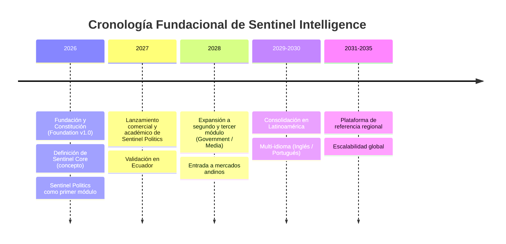

```
════════════════════════════════════════════════════════
  SENTINEL INTELLIGENCE PLATFORM — AI Intelligence Platform
  SENTINEL INTELLIGENCE FOUNDATION v1.0
────────────────────────────────────────────────────────
  Capítulo      : 1 — Historia de Sentinel Intelligence
  Versión       : v1.1
  Fecha         : 2026-08-14
  Estado        : Approved
  Autor         : Comité Fundador de Sentinel Intelligence
  Founder       : Patricio David Fierro (Product Owner principal)
  Confidencial. : CONFIDENCIAL — Uso interno fundacional
════════════════════════════════════════════════════════
```

# CAPÍTULO 1 — Historia de Sentinel Intelligence
### SENTINEL INTELLIGENCE FOUNDATION v1.0 · Bloque I — ADN e Identidad

> **Nota de normalización:** este capítulo fue aprobado conceptualmente antes de adoptarse el estándar de 17 secciones. Se le añade portada oficial y control de estado/versión para trazabilidad; su contenido narrativo se conserva.

> **Objetivo del capítulo:** Establecer el relato fundacional oficial de Sentinel Intelligence, situándolo en el contexto tecnológico y social de América Latina, para que toda comunicación futura (comercial, académica, institucional) parta de una narrativa única, coherente y verificable.

**Autoría:** La visión original que da origen a esta historia pertenece a **Patricio David Fierro**, Fundador y Product Owner principal.

---

## 1.1 Contexto de la IA en Latinoamérica

América Latina vive un momento de asimetría estructural: consume tecnología de inteligencia artificial diseñada para otros contextos, pero produce muy poca inteligencia artificial *propia*, pensada desde su realidad social, política, lingüística y regulatoria. Esta brecha es el terreno donde nace Sentinel Intelligence.

### 1.1.1 Tres brechas que definen el punto de partida

| Brecha | Descripción | Consecuencia para la región |
|---|---|---|
| **Brecha de soberanía** | Los datos estratégicos de organizaciones latinoamericanas se procesan en plataformas y jurisdicciones externas. | Dependencia tecnológica y pérdida de control sobre información crítica. |
| **Brecha de contexto** | Los modelos globales entienden mal el español regional, la cultura política local y las dinámicas sociales propias. | Análisis descontextualizados y decisiones mal informadas. |
| **Brecha de acceso** | La inteligencia de datos avanzada está reservada a grandes corporaciones con presupuestos globales. | Pymes, gobiernos locales, medios y academia quedan excluidos. |

### 1.1.2 Mapa conceptual del contexto

```
                     REALIDAD LATINOAMERICANA
                              │
        ┌─────────────────────┼─────────────────────┐
        ▼                     ▼                     ▼
  Abundancia de datos   Escasa inteligencia    Decisiones basadas
  (redes, medios,       propia y contextual    en intuición o en
   registros públicos)                          herramientas ajenas
        │                     │                     │
        └─────────────────────┼─────────────────────┘
                              ▼
                    OPORTUNIDAD FUNDACIONAL
        "Convertir datos abundantes pero inertes en
         inteligencia contextual, ética y accionable."
                              ▼
                    SENTINEL INTELLIGENCE
```

**Lectura del mapa:** la región no sufre escasez de datos —sufre escasez de *inteligencia sobre esos datos*. Sentinel Intelligence se funda precisamente en ese vacío: no para producir más datos, sino para transformarlos en decisiones.

---

## 1.2 El Momento Fundacional

Sentinel Intelligence no nace como una empresa de software genérica, sino como respuesta a una convicción de su fundador: **las organizaciones latinoamericanas toman decisiones estratégicas sin una capa de inteligencia que las respalde, mientras conviven con una abundancia de datos que no saben aprovechar.**

### 1.2.1 El insight fundacional

> *"El problema de Latinoamérica no es la falta de datos, sino la falta de inteligencia contextual, ética y explicable para interpretarlos y actuar sobre ellos."*
> — Visión de Patricio David Fierro, Fundador.

De este insight se derivan las tres decisiones que marcan el ADN del proyecto y que ya quedaron consagradas como principios fundacionales:

| Decisión de origen | Traducción en el producto |
|---|---|
| No ser una herramienta de un solo sector | Plataforma **modular y multiindustria** |
| No reinventar la inteligencia por cada caso de uso | Un motor común: **Sentinel Core** |
| Entrar por un dominio de alto valor y demanda | Primer módulo: **Sentinel Politics** |

### 1.2.2 De la idea al ecosistema

Sentinel Intelligence se concibe desde el primer día como un **ecosistema**, no como un producto aislado. El razonamiento fundacional fue: si el motor de inteligencia (comprender datos, detectar señales tempranas, explicar hallazgos, apoyar decisiones) es esencialmente el mismo en política, negocios, gobierno o medios, entonces debe construirse **una sola vez, bien**, y proyectarse hacia múltiples industrias.

```
   IDEA               PRODUCTO             ECOSISTEMA
 (un análisis)  →  (una herramienta)  →  (Core + 8 módulos)
     2026              2026-2027            2027 en adelante
```

---

## 1.3 Hitos Proyectados (Cronología Fundacional)

Al ser una organización de reciente fundación, su "historia" es principalmente **fundacional y proyectiva**. La siguiente cronología define los hitos que la Constitución compromete y contra los cuales se medirá el avance.



*(Fallback ASCII por si el visor no renderiza Mermaid:)*

```
2026  ── Fundación · Constitución v1.0 · Diseño de Sentinel Core · Politics como 1er módulo
2027  ── Lanzamiento de Sentinel Politics (comercial + académico) · Validación en Ecuador
2028  ── Módulos Government/Media · Expansión andina
2029-30 ─ Consolidación LATAM · Multi-idioma (EN/PT)
2031-35 ─ Referencia regional · Escalabilidad global
```

| Año | Hito principal | Estado esperado | Métrica de éxito asociada |
|---|---|---|---|
| 2026 | Constitución + diseño de Core | Fundacional | Foundation v1.0 aprobada |
| 2027 | Sentinel Politics en mercado | Lanzamiento | Primeros clientes/instituciones en Ecuador |
| 2028 | 2–3 módulos activos | Expansión temprana | Presencia en ≥2 países |
| 2029–2030 | Consolidación regional | Escalamiento | Multi-idioma operativo |
| 2031–2035 | Liderazgo LATAM | Madurez | Plataforma de IA de referencia regional |

---

## 1.4 Narrativa Oficial de Marca (Brand Story)

La narrativa que el Comité adopta como oficial —base para landing pages, pitch, material académico y relaciones institucionales— es la siguiente:

> **Sentinel Intelligence nace en Ecuador con una ambición latinoamericana: devolver a las organizaciones el control sobre su propia inteligencia.**
>
> En una región rica en datos pero pobre en interpretación, Sentinel actúa como un *centinela inteligente*: observa con rigor, detecta a tiempo, analiza sin descanso y explica sus conclusiones. No vigila para invadir; vigila para proteger y para que cada decisión se tome con información, ética y claridad.
>
> Construida sobre un único motor —**Sentinel Core**— y proyectada en módulos para la política, los negocios, el gobierno, los medios, la reputación, las crisis, la seguridad y la investigación, Sentinel transforma datos en decisiones inteligentes.
>
> *Sentinel Intelligence. AI Intelligence Platform.*

### 1.4.1 Comparación: narrativa tradicional vs. narrativa Sentinel

| Dimensión | Narrativa tecnológica tradicional | Narrativa Sentinel Intelligence |
|---|---|---|
| Protagonista | La tecnología / el algoritmo | La organización que decide mejor |
| Rol de la IA | Automatizar / reemplazar | Observar, explicar y **apoyar la decisión** |
| Relación con los datos | Acumular | **Interpretar** con contexto y ética |
| Postura sobre vigilancia | Ambigua | Explícitamente **no invasiva** |
| Origen | Global / genérico | **Latinoamericano y contextual** |

### 1.4.2 Principios narrativos (do's & don'ts)

| ✅ La historia SÍ dice | ❌ La historia NO dice |
|---|---|
| "Centinela inteligente que protege con información" | "Sistema de vigilancia o espionaje" |
| "Plataforma modular multiindustria" | "Herramienta solo para política" |
| "Nacida en Ecuador para Latinoamérica" | "Otro producto global adaptado" |
| "Apoyo ético y explicable a la decisión" | "IA que decide por ti / caja negra" |

---

## 1.5 Conclusiones del Capítulo

1. **La historia de Sentinel es una historia de brecha y oportunidad:** la región tiene datos, no inteligencia propia; ahí se funda el proyecto.
2. **El relato es coherente con las decisiones fundacionales:** modularidad, Sentinel Core, Politics como primer módulo, y origen ecuatoriano con proyección regional.
3. **La narrativa protege la marca de una lectura errónea** (vigilancia/espionaje) y la ancla en inteligencia, ética y explicabilidad.
4. **La cronología convierte la "historia" en compromisos medibles**, enlazando con el RoadMap a 10 años (Cap. 24) y los Indicadores de Éxito (Cap. 33).

**Enlaces con otros capítulos:** este relato alimenta directamente el *Origen del Proyecto* (Cap. 2), el *Problema* (Cap. 3) y todo el Bloque de Marca (Cap. 18–20).

---

## Historial de Cambios

| Versión | Fecha | Cambio | Autor |
|---|---|---|---|
| v1.0 | 2026-08-13 | Creación y aprobación conceptual del Capítulo 1. | Comité Fundador |
| v1.1 | 2026-08-14 | Normalización al estándar (portada + control de versión); estado → Approved. | Patricio David Fierro |

## Estado del Documento

Draft → Review → **Approved**

---

*Fin del Capítulo 1 — Historia. Estado: **Approved** (v1.1).*
