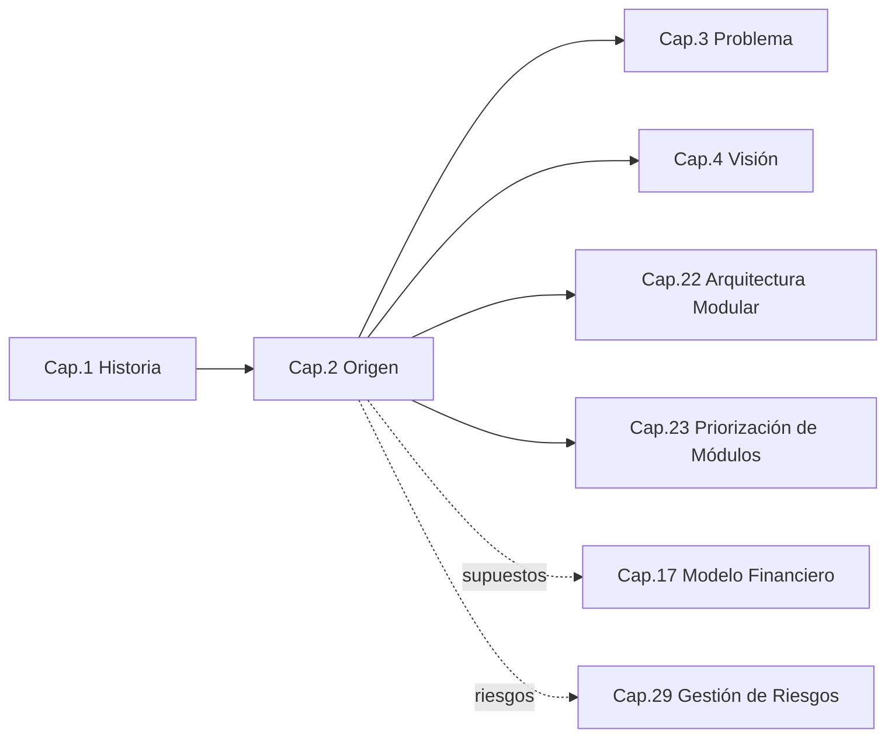
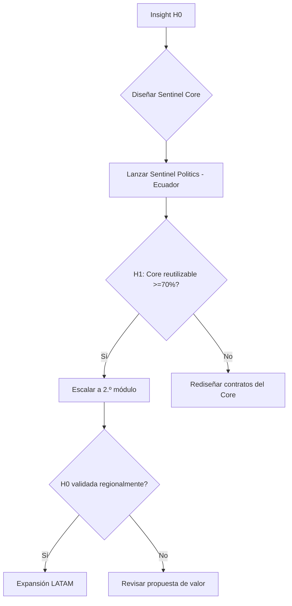

```
════════════════════════════════════════════════════════
  SENTINEL INTELLIGENCE — AI Intelligence Platform
  SENTINEL INTELLIGENCE FOUNDATION v1.0
────────────────────────────────────────────────────────
  Capítulo      : 2 — Origen del Proyecto
  Versión       : v1.1
  Fecha         : 2026-08-13
  Estado        : Approved
  Autor         : Comité Fundador de Sentinel Intelligence
  Founder       : Patricio David Fierro (Product Owner principal)
  Confidencial. : CONFIDENCIAL — Uso interno fundacional
════════════════════════════════════════════════════════
```

# CAPÍTULO 2 — Origen del Proyecto
### Bloque I — ADN e Identidad

---

## 2. Objetivos del Capítulo

1. Documentar con rigor la **génesis conceptual** de Sentinel Intelligence: de dónde viene la idea y qué la hace necesaria.
2. Formalizar el **insight fundacional** y la **hipótesis central** del proyecto como enunciados verificables.
3. Explicar la **transición de una idea a un ecosistema** (Sentinel Core + módulos) como decisión de origen, no como evolución posterior.
4. Registrar los **supuestos y riesgos iniciales** que condicionan todo el proyecto.

---

## 3. Alcance

| Incluye | NO incluye |
|---|---|
| Génesis conceptual e insight fundacional | El relato de marca (Cap. 1, ya cubierto) |
| Hipótesis central y sub-hipótesis | La definición formal del problema y sus causas raíz (Cap. 3) |
| Justificación de la decisión "ecosistema modular" | El diseño técnico del ecosistema (Cap. 21–23) |
| Supuestos y riesgos de origen | El registro global de riesgos (Cap. 29) |
| Marco de validación de hipótesis | El modelo financiero que las cuantifica (Cap. 17) |

**Frontera del capítulo:** aquí se explica *por qué existe* el proyecto y *sobre qué apuestas* se funda; el *qué problema resuelve en detalle* corresponde al Capítulo 3.

---

## 4. Relación con Otros Capítulos



| Capítulo | Tipo de relación |
|---|---|
| Cap. 1 — Historia | **Entrante** — provee el contexto narrativo |
| Cap. 3 — Problema | **Saliente** — el origen enmarca el problema a resolver |
| Cap. 4 — Visión | **Saliente** — la hipótesis alimenta la visión |
| Cap. 22–23 — Arquitectura/Módulos | **Saliente** — la decisión "ecosistema" se materializa aquí |
| Cap. 17 / Cap. 29 | **Saliente (débil)** — supuestos y riesgos se cuantifican/gestionan allí |

---

## 5. Desarrollo Completo

### 5.1 La génesis conceptual

Sentinel Intelligence surge de una observación repetida por su fundador, **Patricio David Fierro**: en Latinoamérica, decisiones de altísimo impacto —políticas, empresariales, públicas— se toman con **datos abundantes pero inteligencia escasa**. Existen tableros, encuestas y redes sociales saturadas de información, pero falta una capa que *observe de forma continua, detecte señales tempranas, explique el porqué y apoye la decisión*.

La idea no nació como "una app" ni como "un dashboard más", sino como la pregunta: **¿y si la inteligencia sobre datos fuera un servicio confiable, ético y contextual, disponible para cualquier organización de la región?**

### 5.2 El insight fundacional (enunciado formal)

> **INSIGHT:** *El cuello de botella latinoamericano no es la generación de datos, sino la ausencia de una inteligencia contextual, ética y explicable que los convierta en decisiones.*

De este insight se desprende la **apuesta estructural**: construir el motor de inteligencia **una sola vez** (Sentinel Core) y proyectarlo hacia múltiples industrias mediante módulos, en lugar de crear soluciones aisladas y redundantes.

### 5.3 Hipótesis central y sub-hipótesis

| Código | Hipótesis | Cómo se validaría | Estado |
|---|---|---|---|
| **H0** (central) | Existe demanda regional por una plataforma de inteligencia modular, ética y explicable. | Adopción de Sentinel Politics en Ecuador (2027). | Por validar |
| H1 | Un mismo Core puede servir a múltiples industrias sin rediseño profundo. | Reutilización ≥70% del Core entre Politics y un 2.º módulo. | Por validar |
| H2 | El mercado valora la **explicabilidad** por encima de la mera automatización. | Preferencia declarada en entrevistas/venta. | Por validar |
| H3 | Entrar por **Politics** acelera tracción y aprendizaje transferible a otros módulos. | Velocidad de cierre + aprendizajes portables. | Por validar |
| H4 | La **soberanía y ética de datos** es un diferenciador de compra en LATAM. | Peso en decisiones de clientes institucionales. | Por validar |

### 5.4 De la idea al ecosistema (decisión de origen)

La decisión de nacer como **ecosistema modular** (y no como producto único) es una **decisión de origen**, tomada desde el diseño:

```
   ┌────────────────────────── DECISIÓN DE ORIGEN ──────────────────────────┐
   │                                                                         │
   │   Opción A: Producto único          Opción B: Ecosistema modular  ✅    │
   │   (una herramienta por sector)      (Sentinel Core + N módulos)         │
   │                                                                         │
   │   - Rápido de lanzar                 - Inversión inicial mayor          │
   │   - Difícil de escalar               - Escalable a multiindustria       │
   │   - Reinvención por caso de uso      - Reutilización del Core           │
   │   - Marca fragmentada                - Marca y datos coherentes         │
   └─────────────────────────────────────────────────────────────────────────┘
```

Se eligió **B** porque la hipótesis H1 (reutilización del Core) es precisamente lo que convierte la inversión inicial en ventaja competitiva sostenible.

### 5.5 Supuestos iniciales

| Código | Supuesto | Si es falso… |
|---|---|---|
| S1 | Hay disponibilidad de datos utilizables (públicos/lícitos) en la región. | Cambia el diseño de adquisición de datos (Cap. 10). |
| S2 | El marco regulatorio (p. ej. LOPDP Ecuador) permite el procesamiento previsto. | Ajuste de alcance y cumplimiento (Cap. 30). |
| S3 | El talento técnico necesario es contratable/formable en la región. | Reordena la estrategia de talento (Cap. 31). |
| S4 | La explicabilidad es técnicamente alcanzable a costo razonable. | Reordena la filosofía de IA (Cap. 9). |

---

## 6. Diagramas

### 6.1 Mapa conceptual del origen (ASCII)

```
        OBSERVACIÓN DEL FUNDADOR
   "Datos abundantes, inteligencia escasa"
                    │
                    ▼
             INSIGHT (H0)
   "El cuello de botella es la inteligencia,
        no la generación de datos"
                    │
        ┌───────────┴───────────┐
        ▼                       ▼
   APUESTA TÉCNICA         APUESTA DE MERCADO
   (Core reutilizable)     (entrar por Politics)
        │                       │
        └───────────┬───────────┘
                    ▼
        ECOSISTEMA MODULAR SENTINEL
        (Core + 8 módulos, ético y explicable)
```

### 6.2 Flujo de validación de hipótesis (Mermaid)



### 6.3 Árbol de hipótesis

```
H0 (¿hay demanda por plataforma modular ética y explicable?)
├── H1 (¿un Core sirve a múltiples industrias?)
├── H2 (¿se valora la explicabilidad > automatización?)
├── H3 (¿Politics acelera tracción transferible?)
└── H4 (¿soberanía/ética es diferenciador de compra?)
```

---

## 7. Tablas Comparativas

### 7.1 Origen "producto" vs. origen "ecosistema"

| Criterio | Origen como Producto | Origen como Ecosistema (Sentinel) |
|---|---|---|
| Tiempo al primer lanzamiento | Menor | Mayor |
| Costo de escalar a nuevo sector | Alto (rehacer) | Bajo (nuevo módulo sobre Core) |
| Coherencia de marca y datos | Baja | Alta |
| Riesgo de sobre-ingeniería inicial | Bajo | Medio-alto (mitigable) |
| Potencial de liderazgo regional | Limitado | Alto |

### 7.2 Comparación con enfoques del mercado

| Enfoque típico en el mercado | Limitación | Respuesta de Sentinel |
|---|---|---|
| Herramienta vertical cerrada | No escala a otros sectores | Core + módulos |
| Suite genérica global | Poco contexto LATAM | Diseño contextual regional |
| IA "caja negra" | Baja confianza institucional | Explicabilidad por diseño |

---

## 8. Buenas Prácticas

1. **Enunciar hipótesis falsables** (con métrica y umbral), no aspiraciones vagas.
2. **Separar insight de solución:** el insight (Cap. 2) es estable; la solución (Cap. 21+) puede evolucionar.
3. **Diseñar el Core con contratos explícitos** desde el inicio para hacer real la reutilización (H1).
4. **Registrar supuestos como riesgos vivos**, revisándolos en cada hito del RoadMap.
5. **Validar antes de escalar:** no abrir el 2.º módulo hasta confirmar H1 con Politics.

---

## 9. Riesgos

| ID | Riesgo | Prob. | Impacto | Mitigación |
|---|---|---|---|---|
| R2-1 | Sobre-ingeniería del Core antes de validar demanda | Media | Alto | MVP del Core enfocado en Politics; expandir por evidencia |
| R2-2 | Hipótesis H1 (reutilización) no se cumple | Media | Alto | Contratos Core↔Módulo bien definidos (Cap. 22) |
| R2-3 | Restricciones regulatorias sobre datos (S2) | Media | Alto | Diseño "privacy/legal by design" (Cap. 30) |
| R2-4 | Confundir Sentinel con vigilancia invasiva | Media | Medio | Narrativa y ética explícitas (Cap. 1, 27) |
| R2-5 | Escasez de talento especializado (S3) | Media | Medio | Estrategia de talento y formación (Cap. 31) |

---

## 10. Recomendaciones

1. Aprobar el **insight fundacional (H0)** como enunciado oficial de origen.
2. Instrumentar un **tablero de validación de hipótesis** desde el día uno (enlaza con Cap. 33).
3. Comprometer que **el 2.º módulo no se abre sin validar H1** (regla candidata para Cap. 25).
4. Encargar tempranamente el **análisis regulatorio de datos** (S2) al frente legal.

---

## 11. Architecture Decision Records (ADR)

### ADR-002-01 — Nacer como ecosistema modular (Core + módulos), no como producto único
- **Contexto:** Se debe decidir la forma estructural del proyecto en su origen.
- **Decisión:** Adoptar una arquitectura de **ecosistema modular** con un motor común (Sentinel Core).
- **Estado:** Aprobada (fundacional).
- **Consecuencias:** (+) Escalabilidad multiindustria y coherencia; (−) mayor inversión inicial y riesgo de sobre-ingeniería (ver R2-1).
- **Alternativas descartadas:** Producto vertical único (no escala); suite genérica (sin contexto regional).

### ADR-002-02 — Entrar al mercado por Sentinel Politics
- **Contexto:** Se necesita un punto de entrada de alto valor y aprendizaje transferible.
- **Decisión:** **Politics** es el primer módulo comercial y académico.
- **Estado:** Aprobada (fundacional).
- **Consecuencias:** (+) Tracción y aprendizaje portables (H3); (−) riesgo reputacional de asociación con "vigilancia" (R2-4), mitigado por narrativa/ética.

### ADR-002-03 — Gobernar el proyecto por hipótesis falsables
- **Contexto:** Evitar decisiones basadas en intuición no verificable.
- **Decisión:** Formalizar H0–H4 con métricas y umbrales; validar antes de escalar.
- **Estado:** Aprobada.
- **Consecuencias:** (+) Disciplina de validación; (−) requiere instrumentación de métricas desde el inicio.

---

## 12. Pendientes

| ID | Pendiente | Responsable sugerido | Depende de |
|---|---|---|---|
| P2-1 | Definir umbrales exactos de H1 (¿70%? ¿medido cómo?) | CTO / Chief Architect | Cap. 22 |
| P2-2 | Levantar inventario preliminar de fuentes de datos lícitas (S1) | Data Scientist | Cap. 10 |
| P2-3 | Encargo de análisis regulatorio (S2) | Cybersecurity/Legal | Cap. 30 |
| P2-4 | Diseñar tablero de validación de hipótesis | Data Scientist / CPO | Cap. 33 |

---

## 13. Referencias Cruzadas

- **Cap. 1 — Historia:** contexto narrativo del origen.
- **Cap. 3 — Problema:** formalización del problema derivado del insight.
- **Cap. 9 — Filosofía de IA / Cap. 10 — Estrategia de Datos:** viabilidad técnica de S1 y S4.
- **Cap. 22–23 — Arquitectura Modular / Priorización:** materialización de la decisión de ecosistema.
- **Cap. 25 — Reglas Fundacionales:** candidata "no escalar sin validar H1".
- **Cap. 29 — Riesgos / Cap. 30 — Legal:** gestión de R2-x y S2.
- **Cap. 33 — Indicadores de Éxito:** tablero de validación de hipótesis.

---

## 14. Historial de Cambios

| Versión | Fecha | Cambio | Autor |
|---|---|---|---|
| v1.0 | 2026-08-13 | Creación del Capítulo 2 bajo el estándar corporativo de 16 secciones. | Comité Fundador |
| v1.1 | 2026-08-13 | Aprobación por el Product Owner; estado → Approved. | Patricio David Fierro |

---

## 15. Estado del Documento

Draft → Review → **Approved**

*Estado actual: **Approved** (aprobado por el Product Owner).*

---

## 16. Versión

**v1.1** — capítulo aprobado. Toda modificación futura incrementará la versión (v1.x menor · v2.0 mayor).

---

*Fin del Capítulo 2 — Origen del Proyecto.*
