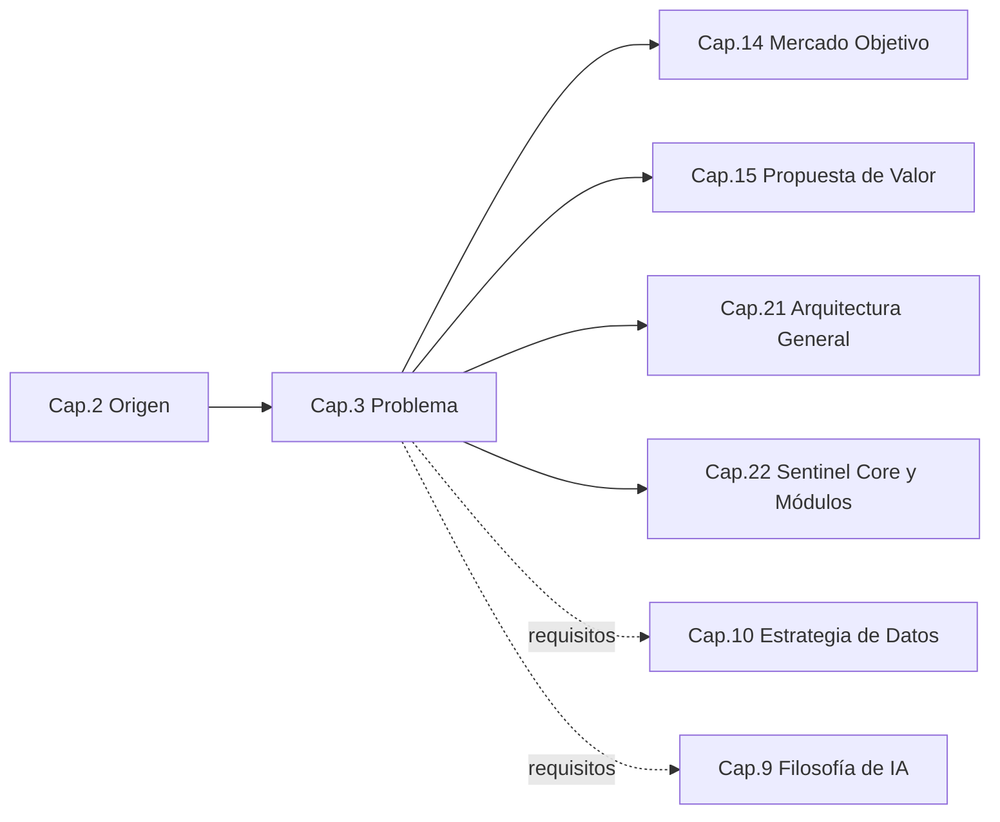
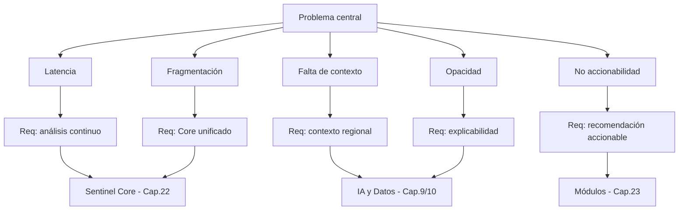
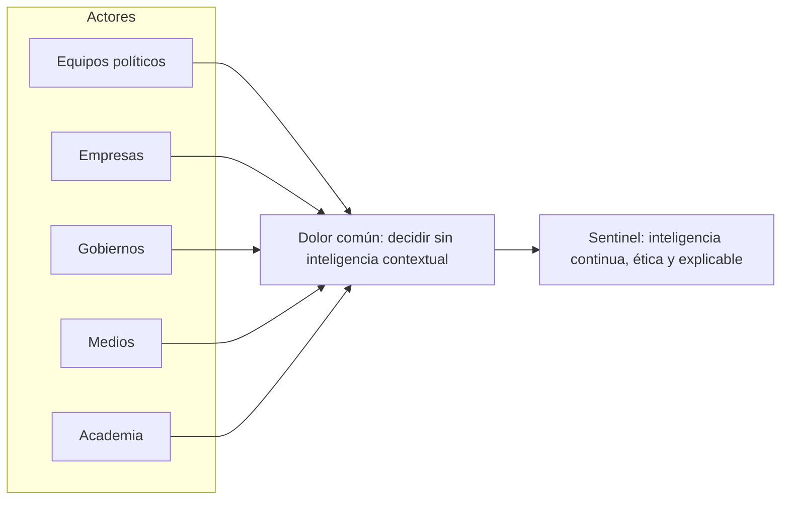

```
════════════════════════════════════════════════════════
  SENTINEL INTELLIGENCE — AI Intelligence Platform
  SENTINEL INTELLIGENCE FOUNDATION v1.0
────────────────────────────────────────────────────────
  Capítulo      : 3 — Problema que Busca Resolver
  Versión       : v1.1
  Fecha         : 2026-08-13
  Estado        : Approved
  Autor         : Comité Fundador de Sentinel Intelligence
  Founder       : Patricio David Fierro (Product Owner principal)
  Confidencial. : CONFIDENCIAL — Uso interno fundacional
════════════════════════════════════════════════════════
```

# CAPÍTULO 3 — Problema que Busca Resolver
### Bloque I — ADN e Identidad

---

## 2. Objetivos del Capítulo

1. Definir con precisión el **problema central** que Sentinel Intelligence resuelve y sus problemas derivados por industria.
2. Identificar las **causas raíz** (técnicas, organizacionales y de datos) que lo originan.
3. Caracterizar a los **actores afectados** y el **costo de no resolver** el problema.
4. Traducir el problema en **requisitos de plataforma** que orientarán la arquitectura (Sentinel Core y módulos).

---

## 3. Alcance

| Incluye | NO incluye |
|---|---|
| Definición del problema central y por módulo | Diseño de la solución técnica (Cap. 21–23) |
| Causas raíz y vacíos del mercado | Análisis competitivo detallado (Cap. 16) |
| Actores afectados y costo de inacción | Cuantificación financiera del mercado (Cap. 17) |
| Traducción problema → requisitos de plataforma | Especificación funcional de cada módulo (fase posterior) |

**Frontera:** este capítulo describe *qué está roto y por qué*, y deriva *qué debe cumplir la plataforma*; el *cómo* se construye pertenece al Bloque IV.

---

## 4. Relación con Otros Capítulos



| Capítulo | Relación |
|---|---|
| Cap. 2 — Origen | **Entrante** — el insight fundacional enmarca el problema |
| Cap. 14 — Mercado / Cap. 15 — Propuesta de Valor | **Saliente** — el problema define a quién y qué se ofrece |
| Cap. 21–22 — Arquitectura | **Saliente** — los requisitos derivados guían el diseño |
| Cap. 9 — IA / Cap. 10 — Datos | **Saliente** — requisitos de explicabilidad y de datos |

---

## 5. Desarrollo Completo

### 5.1 Definición del problema central

> **Problema central:** *Las organizaciones latinoamericanas deben tomar decisiones estratégicas sobre entornos complejos y cambiantes, pero carecen de una capa de inteligencia continua, contextual, ética y explicable que convierta el enorme volumen de datos disponibles en decisiones oportunas y defendibles.*

El problema no es la ausencia de datos —redes sociales, medios, registros públicos, encuestas—, sino la **ausencia de inteligencia operativa sobre esos datos**: llega tarde, sin contexto local, sin trazabilidad y fragmentada en herramientas que no conversan entre sí.

### 5.2 Manifestaciones del problema (síntomas)

| Síntoma | Descripción | Impacto en la decisión |
|---|---|---|
| **Latencia** | La información se analiza cuando el evento ya ocurrió. | Reacción tardía; oportunidades y crisis mal gestionadas. |
| **Fragmentación** | Datos y herramientas dispersos, sin visión unificada. | Visión parcial y contradictoria. |
| **Falta de contexto** | Herramientas globales no entienden la realidad regional. | Conclusiones erróneas o irrelevantes. |
| **Opacidad** | Resultados sin explicación ("caja negra"). | Baja confianza; difícil de defender ante stakeholders. |
| **No accionabilidad** | Reportes que no indican qué hacer. | Datos que no se convierten en decisión. |

### 5.3 Problema por módulo

El problema central se especializa por dominio. Todos comparten la misma raíz y, por tanto, el mismo motor (Sentinel Core).

| Módulo | Problema específico que resuelve |
|---|---|
| **Sentinel Politics** (1.º) | Entender la conversación política y ciudadana en tiempo real, con contexto y ética, para decisiones estratégicas informadas. |
| Sentinel Business | Convertir señales de mercado y clientes en inteligencia competitiva. |
| Sentinel Government | Apoyar la gestión pública con evidencia y detección temprana. |
| Sentinel Media | Comprender narrativas, agenda y cobertura mediática. |
| Sentinel Reputation | Monitorear y proteger la reputación con alerta temprana. |
| Sentinel Crisis | Detectar, anticipar y gestionar crisis. |
| Sentinel Security | Inteligencia de seguridad basada en información. |
| Sentinel Research | Investigación y análisis avanzado sobre grandes volúmenes de datos. |

### 5.4 Causas raíz

```
PROBLEMA: "Datos abundantes, decisiones sin inteligencia"
│
├── CAUSA TÉCNICA
│     ├── Inteligencia construida ad-hoc por caso de uso (no reutilizable)
│     ├── Modelos globales sin contexto lingüístico/cultural regional
│     └── Ausencia de explicabilidad y trazabilidad
│
├── CAUSA DE DATOS
│     ├── Datos dispersos, sin gobierno ni calidad
│     └── Dudas de licitud/soberanía que frenan su uso
│
└── CAUSA ORGANIZACIONAL
      ├── Decisiones por intuición o por herramientas ajenas
      └── Falta de una capa unificada de inteligencia
```

### 5.5 Vacíos del mercado actual

| Alternativa que usan hoy las organizaciones | Vacío que deja |
|---|---|
| Monitoreo de redes/medios genérico | Sin análisis profundo, contexto ni explicabilidad |
| Suites de BI tradicionales | Requieren datos ya estructurados; no interpretan lo no estructurado |
| Consultorías manuales | Lentas, costosas, no continuas |
| Soluciones globales de IA | Poco contexto regional; dudas de soberanía de datos |

### 5.6 De problema a requisitos de plataforma

El aporte central de este capítulo a la arquitectura es traducir el problema en **requisitos no funcionales y capacidades** que Sentinel Core y los módulos deben cumplir:

| Requisito derivado | Origen (síntoma/causa) | Dónde se materializa |
|---|---|---|
| **Análisis continuo** (near real-time) | Latencia | Sentinel Core (Cap. 22) |
| **Contextualización regional** | Falta de contexto | Filosofía de IA (Cap. 9), Datos (Cap. 10) |
| **Explicabilidad y trazabilidad** | Opacidad | Filosofía de IA (Cap. 9), Ética (Cap. 27) |
| **Unificación (Core común)** | Fragmentación | Arquitectura modular (Cap. 22) |
| **Recomendación accionable** | No accionabilidad | Módulos (Cap. 23) |
| **Gobierno y soberanía del dato** | Causa de datos | Estrategia de Datos (Cap. 10), Legal (Cap. 30) |

---

## 6. Diagramas

### 6.1 Árbol de problema (causa → efecto) — ASCII

```
                 EFECTO FINAL
     Decisiones tardías, riesgosas e indefendibles
                      ▲
                      │
        ┌─────────────┼───────────────┐
        │             │               │
    Latencia     Sin contexto      Opacidad
        ▲             ▲               ▲
        │             │               │
   Inteligencia   Modelos        Falta de
   ad-hoc no      globales sin   explicabilidad
   reutilizable   contexto       y trazabilidad
        ▲             ▲               ▲
        └─────────────┴───────────────┘
                      │
             CAUSA RAÍZ COMÚN
   "No existe una capa unificada de inteligencia
    contextual, ética y explicable sobre los datos"
```

### 6.2 Mapa problema → requisito → capítulo (Mermaid)



### 6.3 Mapa de dolor por actor (flujo)



---

## 7. Tablas Comparativas

### 7.1 Estado actual (sin Sentinel) vs. estado objetivo (con Sentinel)

| Dimensión | Sin Sentinel | Con Sentinel |
|---|---|---|
| Momento del análisis | Reactivo, tardío | Continuo, temprano |
| Cobertura | Fragmentada por herramienta | Unificada sobre un Core |
| Contexto | Global/genérico | Regional/contextual |
| Confianza en resultados | Baja (caja negra) | Alta (explicable/trazable) |
| Salida | Reportes | Decisiones accionables |

### 7.2 Actores afectados y su dolor principal

| Actor | Dolor principal | Módulo que lo atiende |
|---|---|---|
| Equipos político-electorales | Ceguera ante la conversación en tiempo real | Politics |
| Empresas | Señales de mercado sin inteligencia | Business |
| Gobiernos / entidades públicas | Gestión sin evidencia temprana | Government |
| Medios | Narrativas y agenda difíciles de mapear | Media |
| Organizaciones expuestas | Reputación y crisis sin alerta temprana | Reputation / Crisis |

---

## 8. Buenas Prácticas

1. **Definir el problema antes que la solución:** todo requisito debe rastrearse a un síntoma o causa raíz de este capítulo.
2. **Trazabilidad problema → requisito → componente:** mantener la matriz de la §5.6 como fuente de verdad para la arquitectura.
3. **Un problema, un Core:** resistir la tentación de resolver cada módulo con soluciones aisladas.
4. **Contexto y explicabilidad como requisitos de primera clase**, no como características opcionales.
5. **Validar el problema con actores reales** por módulo antes de sobre-especificar.

---

## 9. Riesgos

| ID | Riesgo | Prob. | Impacto | Mitigación |
|---|---|---|---|---|
| R3-1 | Definir el problema demasiado amplio y perder foco | Media | Alto | Priorizar Politics; requisitos mínimos por módulo |
| R3-2 | Requisitos no trazables a causas raíz (scope creep) | Media | Medio | Matriz problema→requisito como control de alcance |
| R3-3 | Sub-estimar restricciones de datos (licitud/soberanía) | Media | Alto | Coordinar con Cap. 10 y Cap. 30 desde el inicio |
| R3-4 | Explicabilidad tratada como "extra" y no como requisito | Media | Alto | Fijarla como requisito no funcional obligatorio (Cap. 9) |
| R3-5 | Percepción de "vigilancia" por el dominio Politics | Media | Medio | Encuadre ético y narrativa (Cap. 1, 27) |

---

## 10. Recomendaciones

1. Adoptar la **definición de problema central** de la §5.1 como enunciado oficial.
2. Congelar la **matriz problema → requisito** (§5.6) como insumo directo del Bloque IV.
3. Priorizar en el diseño los requisitos de **análisis continuo, contexto y explicabilidad**.
4. Iniciar en paralelo el análisis de **datos lícitos y soberanía** (Cap. 10 / Cap. 30).

---

## 11. Architecture Decision Records (ADR)

### ADR-003-01 — Un problema central único, especializado por módulo
- **Contexto:** El problema se manifiesta distinto en cada industria, pero comparte raíz.
- **Decisión:** Modelar **un problema central** con especializaciones por módulo, resueltas sobre un mismo Core.
- **Estado:** Aprobada.
- **Consecuencias:** (+) Coherencia y reutilización; (−) exige disciplina para no diluir el foco (R3-1).

### ADR-003-02 — Explicabilidad y trazabilidad como requisitos no funcionales obligatorios
- **Contexto:** La opacidad es una causa raíz del bajo valor de las herramientas actuales.
- **Decisión:** Toda salida de inteligencia debe ser **explicable y trazable**; no es opcional.
- **Estado:** Aprobada.
- **Consecuencias:** (+) Confianza institucional y diferenciación; (−) mayor exigencia técnica sobre el Core (Cap. 9, 22).

### ADR-003-03 — Gobierno del dato como precondición de diseño
- **Contexto:** Dudas de licitud/soberanía frenan el uso de datos en la región.
- **Decisión:** El diseño asume **gobierno del dato y cumplimiento** como precondición, no como añadido.
- **Estado:** Aprobada.
- **Consecuencias:** (+) Reduce riesgo legal/reputacional; (−) condiciona la arquitectura de datos (Cap. 10, 30).

---

## 12. Pendientes

| ID | Pendiente | Responsable sugerido | Depende de |
|---|---|---|---|
| P3-1 | Validar el problema por módulo con actores reales (empezando por Politics) | CPO / Business Strategist | Cap. 14 |
| P3-2 | Consolidar la matriz problema→requisito como documento de referencia | Chief Architect | Cap. 21–22 |
| P3-3 | Inventario de restricciones de datos por tipo de fuente | Data Scientist / Legal | Cap. 10, 30 |

---

## 13. Referencias Cruzadas

- **Cap. 2 — Origen:** insight fundacional que enmarca el problema.
- **Cap. 9 — Filosofía de IA:** explicabilidad y contexto como requisitos.
- **Cap. 10 — Estrategia de Datos:** gobierno y soberanía del dato.
- **Cap. 14 — Mercado / Cap. 15 — Propuesta de Valor:** actores y oferta.
- **Cap. 21–23 — Arquitectura y Módulos:** materialización de los requisitos.
- **Cap. 27 — Principios Éticos / Cap. 30 — Legal:** encuadre ético y de cumplimiento.

---

## 14. Historial de Cambios

| Versión | Fecha | Cambio | Autor |
|---|---|---|---|
| v1.0 | 2026-08-13 | Creación del Capítulo 3 con estilo corporativo empresarial (marco experimental reducido). | Comité Fundador |
| v1.1 | 2026-08-13 | Aprobación por el Product Owner; estado → Approved. | Patricio David Fierro |

---

## 15. Estado del Documento

Draft → Review → **Approved**

*Estado actual: **Approved** (aprobado por el Product Owner).*

---

## 16. Versión

**v1.1** — capítulo aprobado.

---

*Fin del Capítulo 3 — Problema que Busca Resolver.*
