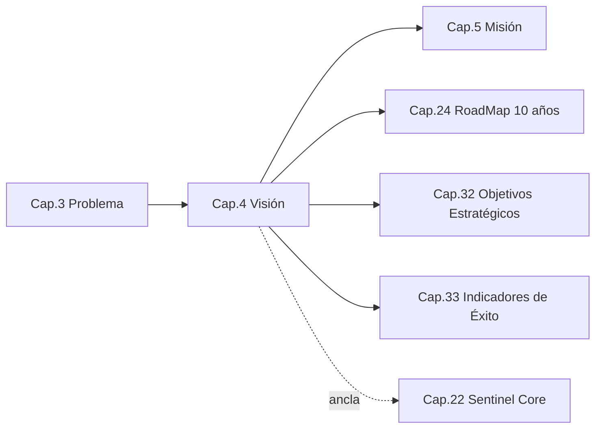
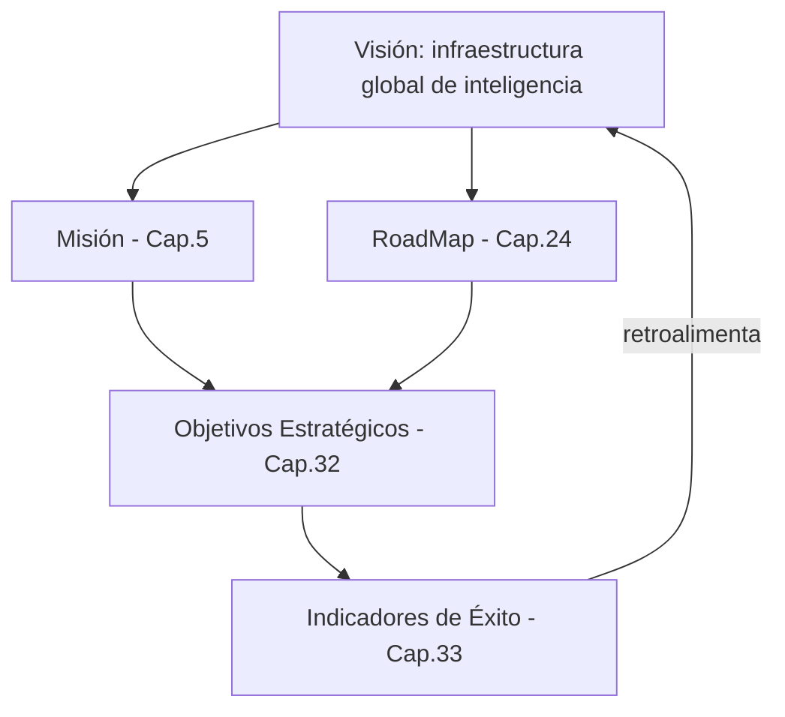

```
════════════════════════════════════════════════════════
  SENTINEL INTELLIGENCE PLATFORM — AI Intelligence Platform
  SENTINEL INTELLIGENCE FOUNDATION v1.0
────────────────────────────────────────────────────────
  Capítulo      : 4 — Visión
  Versión       : v1.1
  Fecha         : 2026-08-13
  Estado        : Approved
  Autor         : Comité Fundador de Sentinel Intelligence
  Founder       : Patricio David Fierro (Product Owner principal)
  Confidencial. : CONFIDENCIAL — Uso interno fundacional
════════════════════════════════════════════════════════
```

# CAPÍTULO 4 — Visión
### Bloque I — ADN e Identidad

---

## 2. Objetivos del Capítulo

1. Declarar la **visión oficial** de Sentinel Intelligence Platform: el estado futuro que aspira a construir.
2. Interpretar la visión en términos **concretos y accionables**, evitando la retórica vacía.
3. Definir los **indicadores de largo plazo** que permitirán saber si la visión se está cumpliendo.
4. Anclar la visión al diseño del **Sentinel Core**, para que la arquitectura la haga técnicamente posible.

---

## 3. Alcance

| Incluye | NO incluye |
|---|---|
| Declaración oficial de visión | La misión operativa (Cap. 5) |
| Interpretación de la visión | El RoadMap detallado a 10 años (Cap. 24) |
| Indicadores de largo plazo de la visión | El cuadro de mando completo (Cap. 33) |
| Ancla de la visión al Sentinel Core | El diseño técnico del Core (Cap. 22) |

---

## 4. Relación con Otros Capítulos



| Capítulo | Relación |
|---|---|
| Cap. 3 — Problema | **Entrante** — la visión responde al problema global |
| Cap. 5 — Misión | **Saliente** — la misión operativiza la visión |
| Cap. 24 — RoadMap | **Saliente** — traza el camino hacia la visión |
| Cap. 32–33 — Objetivos/Indicadores | **Saliente** — miden el avance hacia la visión |

---

## 5. Desarrollo Completo

### 5.1 Declaración oficial de visión

> **VISIÓN:**
> *"Ser la plataforma de inteligencia sobre la que el mundo transforma información en decisiones: un motor —Sentinel Core— capaz de observar, comprender y explicar cualquier realidad compleja, extensible a toda industria a través de módulos, con ética y explicabilidad como principios innegociables."*

La visión parte de una necesidad **global** —convertir información en inteligencia para decidir— y se materializa con un punto de partida concreto: **Ecuador y Latinoamérica como mercado inicial**, con proyección global.

### 5.2 Interpretación de la visión

La visión se descompone en cuatro afirmaciones verificables:

| Afirmación de la visión | Qué significa en concreto |
|---|---|
| "Plataforma sobre la que el mundo transforma información en decisiones" | Sentinel es **infraestructura de inteligencia**, no una herramienta puntual. |
| "Un motor —Sentinel Core— extensible a toda industria" | Un núcleo reutilizable + módulos; sin reinvención por sector. |
| "Observar, comprender y explicar cualquier realidad compleja" | Capacidades genéricas del Core, independientes del dominio. |
| "Ética y explicabilidad innegociables" | Restricciones de diseño permanentes, no características opcionales. |

### 5.3 Horizontes de la visión

```
   HORIZONTE 1 (Fundación y prueba)
   Sentinel Core operativo + primer módulo sobre el Core
        │
        ▼
   HORIZONTE 2 (Expansión multiindustria)
   Varios módulos sobre el mismo Core · multi-idioma
        │
        ▼
   HORIZONTE 3 (Referencia global)
   Sentinel Intelligence Platform como infraestructura
   de inteligencia adoptada globalmente
```

### 5.4 La visión como estándar de decisión

La visión no es decorativa: funciona como **criterio de decisión**. Ante cualquier disyuntiva futura, la pregunta guía es:

> *¿Esta decisión acerca a Sentinel a ser una plataforma-infraestructura de inteligencia global, reutilizable, ética y explicable —o la aleja?*

---

## 6. Diagramas

### 6.1 Mapa de estado futuro (Vision Map) — ASCII

```
   HOY                                     VISIÓN
   ───────────────                         ────────────────────────
   Información         ──[Sentinel Core]──►  Decisiones inteligentes
   abundante, inerte                         oportunas y explicables
   Herramientas        ──[Módulos]────────►  Plataforma unificada
   fragmentadas                              multiindustria
   Contexto ausente    ──[Contexto+Ética]─►  Inteligencia confiable
                                             a escala global
```

### 6.2 De la visión a la medición (Mermaid)



---

## 7. Tablas Comparativas

### 7.1 Visión de "herramienta" vs. visión de "plataforma-infraestructura"

| Criterio | Visión de herramienta | Visión de Sentinel (plataforma) |
|---|---|---|
| Alcance | Un problema, un sector | Toda industria vía módulos |
| Reutilización | Baja | Alta (Sentinel Core) |
| Horizonte | Producto | Infraestructura de largo plazo |
| Ámbito | Local | Global (inicio en Ecuador/LATAM) |
| Diferenciador | Funcionalidad | Ética + explicabilidad como base |

### 7.2 Indicadores de largo plazo de la visión

| Indicador de visión | Qué mide | Detalle en |
|---|---|---|
| Nº de módulos productivos sobre el Core | Extensibilidad real | Cap. 23, 33 |
| % de reutilización del Core entre módulos | Solidez del núcleo | Cap. 22, 33 |
| Presencia geográfica (países/idiomas) | Alcance global | Cap. 24, 33 |
| Nivel de explicabilidad de las salidas | Cumplimiento del principio innegociable | Cap. 9, 33 |

---

## 8. Buenas Prácticas

1. **Visión estable, tácticas flexibles:** la visión no cambia con cada ciclo; el RoadMap sí.
2. **Verificabilidad:** toda afirmación de la visión debe poder medirse (§7.2).
3. **Usar la visión como filtro de decisiones** (§5.4), no solo como texto de marketing.
4. **Coherencia de nombre y encuadre:** "Sentinel Intelligence Platform"; problema global; Politics solo como primer módulo.

---

## 9. Riesgos

| ID | Riesgo | Prob. | Impacto | Mitigación |
|---|---|---|---|---|
| R4-1 | Visión demasiado amplia → dispersión de foco | Media | Alto | Horizontes claros; primer módulo como ancla concreta |
| R4-2 | Visión percibida como retórica sin medición | Media | Medio | Indicadores de largo plazo (§7.2) |
| R4-3 | Divergencia entre visión y arquitectura del Core | Baja | Alto | Sección "Impacto en Sentinel Core" en cada capítulo |
| R4-4 | Erosión del principio de explicabilidad bajo presión comercial | Media | Alto | Fijarlo como restricción innegociable (Cap. 25, 27) |

---

## 10. Recomendaciones

1. Adoptar la **declaración de visión** de la §5.1 como texto oficial.
2. Ligar cada objetivo estratégico (Cap. 32) a una afirmación de la visión.
3. Publicar una **versión corta comunicable** de la visión para uso externo (marca).
4. Revisar la visión formalmente **una vez al año**, sin alterarla por presiones tácticas.

---

## 11. Architecture Decision Records (ADR)

### ADR-004-01 — Concebir Sentinel como plataforma-infraestructura, no como herramienta
- **Contexto:** La visión determina el alcance arquitectónico.
- **Decisión:** Sentinel Intelligence Platform es **infraestructura de inteligencia** (Core + módulos), no un producto puntual.
- **Estado:** Aprobada (fundacional).
- **Consecuencias:** (+) Escalabilidad y longevidad; (−) exige robustez del Core desde el inicio.

### ADR-004-02 — Ética y explicabilidad como restricciones de diseño permanentes
- **Contexto:** La visión las declara innegociables.
- **Decisión:** Ningún módulo o versión del Core puede renunciar a explicabilidad y ética para ganar velocidad o costo.
- **Estado:** Aprobada.
- **Consecuencias:** (+) Confianza y diferenciación sostenible; (−) mayor exigencia técnica (Cap. 9, 22).

---

## 12. Pendientes

| ID | Pendiente | Responsable sugerido | Depende de |
|---|---|---|---|
| P4-1 | Redactar versión corta comunicable de la visión (marca) | Branding Director | Cap. 18 |
| P4-2 | Vincular indicadores de visión al cuadro de mando | Data Scientist / CPO | Cap. 33 |

---

## 13. Referencias Cruzadas

- **Cap. 3 — Problema:** la visión responde a la necesidad global.
- **Cap. 5 — Misión:** operativiza la visión.
- **Cap. 22 — Sentinel Core:** hace la visión técnicamente posible.
- **Cap. 24 / 32 / 33 — RoadMap, Objetivos, Indicadores:** camino y medición.
- **Cap. 25 / 27 — Reglas / Ética:** blindan los principios innegociables.

---

## 14. Historial de Cambios

| Versión | Fecha | Cambio | Autor |
|---|---|---|---|
| v1.0 | 2026-08-13 | Creación del Capítulo 4 con convenciones nuevas (nombre oficial, problema global, sección Impacto en Sentinel Core). | Comité Fundador |
| v1.1 | 2026-08-13 | Aprobación por el Product Owner; estado → Approved. | Patricio David Fierro |

---

## 15. Estado del Documento

Draft → Review → **Approved**

*Estado actual: **Approved** (aprobado por el Product Owner).*

---

## 16. Versión

**v1.1** — capítulo aprobado.

---

## 17. Impacto en Sentinel Core

Las decisiones de este capítulo condicionan directamente el diseño del motor principal:

| Decisión del capítulo | Impacto en la arquitectura de Sentinel Core |
|---|---|
| Sentinel como **plataforma-infraestructura** (ADR-004-01) | El Core debe diseñarse como **núcleo reutilizable y extensible** (contratos estables, independencia de dominio), no como backend de un solo módulo. |
| **Observar, comprender y explicar** cualquier realidad compleja (§5.1) | El Core debe exponer capacidades **genéricas y agnósticas de dominio**: ingesta/observación, comprensión/análisis y explicación/trazabilidad. |
| **Explicabilidad innegociable** (ADR-004-02) | La explicabilidad es un **requisito no funcional de primera clase** del Core: toda salida debe poder trazar su origen y razonamiento. |
| **Ética innegociable** (ADR-004-02) | El Core incorpora **guardrails y controles éticos** transversales, no delegados a cada módulo. |
| Alcance **global** con inicio en Ecuador/LATAM | El Core nace preparado para **multi-idioma y multi-contexto** (aunque se active progresivamente). |

**Síntesis:** la visión obliga a que Sentinel Core sea, desde el día uno, un **motor genérico, explicable, ético y multi-contexto**, sobre el que el primer módulo implementado (Sentinel Politics) es solo la primera aplicación.

---

*Fin del Capítulo 4 — Visión.*
