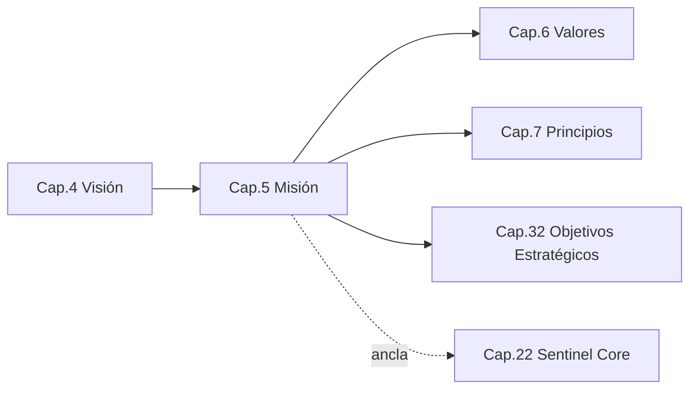
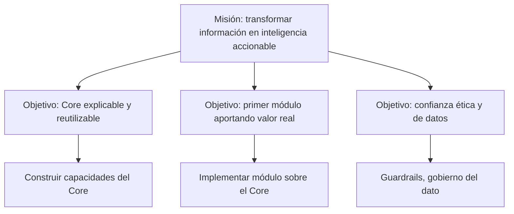

```
════════════════════════════════════════════════════════
  SENTINEL INTELLIGENCE PLATFORM — AI Intelligence Platform
  SENTINEL INTELLIGENCE FOUNDATION v1.0
────────────────────────────────────────────────────────
  Capítulo      : 5 — Misión
  Versión       : v1.1
  Fecha         : 2026-08-13
  Estado        : Approved
  Autor         : Comité Fundador de Sentinel Intelligence
  Founder       : Patricio David Fierro (Product Owner principal)
  Confidencial. : CONFIDENCIAL — Uso interno fundacional
════════════════════════════════════════════════════════
```

# CAPÍTULO 5 — Misión
### Bloque I — ADN e Identidad

---

## 2. Objetivos del Capítulo

1. Declarar la **misión oficial** de Sentinel Intelligence Platform: el propósito operativo que la empresa cumple **hoy**, en camino a la visión.
2. Traducir la misión en **compromisos operativos** concretos y verificables.
3. Descomponer la misión por **área organizacional**, para que cada equipo sepa cómo la ejecuta.
4. Alinear la misión con el diseño del **Sentinel Core**.

---

## 3. Alcance

| Incluye | NO incluye |
|---|---|
| Declaración oficial de misión | La aspiración de largo plazo (Visión, Cap. 4) |
| Compromisos operativos derivados | Valores y principios de conducta (Cap. 6–7) |
| Desglose de la misión por área | Objetivos e indicadores cuantitativos (Cap. 32–33) |
| Ancla de la misión al Sentinel Core | Diseño técnico del Core (Cap. 22) |

**Diferencia clave con la Visión:** la **Visión** describe el *estado futuro* (dónde queremos llegar); la **Misión** describe el *propósito presente* (qué hacemos cada día para llegar allí).

---

## 4. Relación con Otros Capítulos



| Capítulo | Relación |
|---|---|
| Cap. 4 — Visión | **Entrante** — la misión operativiza la visión |
| Cap. 6 — Valores / Cap. 7 — Principios | **Saliente** — definen *cómo* se cumple la misión |
| Cap. 32 — Objetivos Estratégicos | **Saliente** — cuantifican la misión |
| Cap. 22 — Sentinel Core | **Ancla** — la misión exige capacidades concretas del motor |

---

## 5. Desarrollo Completo

### 5.1 Declaración oficial de misión

> **MISIÓN:**
> *"Transformar información en inteligencia accionable, ética y explicable, mediante un motor central —Sentinel Core— y un ecosistema de módulos especializados, para que cualquier organización tome mejores decisiones ante realidades complejas."*

### 5.2 Análisis de la misión (por componente)

| Componente de la misión | Compromiso operativo |
|---|---|
| "Transformar información en inteligencia accionable" | Entregar no reportes, sino **decisiones y recomendaciones**. |
| "Ética y explicable" | Toda salida es **trazable y defendible**; sin caja negra. |
| "Mediante Sentinel Core + módulos" | Construir **una vez el motor**, extender por módulos. |
| "Cualquier organización" | Diseño **agnóstico de industria y de escala**. |
| "Ante realidades complejas" | Foco en entornos **dinámicos y multi-fuente**. |

### 5.3 Alcance operativo (qué hace la empresa día a día)

```
   INGESTA            COMPRENSIÓN           EXPLICACIÓN          DECISIÓN
   ───────            ───────────           ───────────          ────────
   Observar        →  Analizar y         →  Explicar el       →  Recomendar
   fuentes de         contextualizar        porqué (trazar)      acción
   información        con Sentinel Core                          accionable
        │                  │                    │                   │
        └──────────────────┴─── Sentinel Core ──┴───────────────────┘
                        (capacidad transversal a todos los módulos)
```

### 5.4 Misión desglosada por área organizacional

| Área | Cómo ejecuta la misión |
|---|---|
| Ingeniería / Arquitectura | Construir y mantener Sentinel Core como motor reutilizable y explicable. |
| IA / Data Science | Garantizar comprensión contextual y explicabilidad de las salidas. |
| Producto | Traducir capacidades del Core en módulos que resuelvan decisiones reales. |
| Comercial / Estrategia | Llevar la inteligencia a organizaciones, empezando por el primer módulo sobre el Core. |
| Seguridad / Cumplimiento | Asegurar ética, gobierno del dato y confianza. |

### 5.5 Relación Misión ↔ Visión

| | Misión (presente) | Visión (futuro) |
|---|---|---|
| Pregunta que responde | ¿Qué hacemos hoy? | ¿Dónde queremos llegar? |
| Horizonte | Continuo/operativo | 10 años y más |
| Enunciado | Transformar información en inteligencia accionable | Ser infraestructura global de inteligencia |
| Medición | Compromisos operativos | Indicadores de largo plazo |

---

## 6. Diagramas

### 6.1 Cadena Misión → Objetivos → Actividades (Mermaid)



### 6.2 Mapa misión → área → entregable (ASCII)

```
        MISIÓN
          │
   ┌──────┼───────────────┬───────────────┬──────────────┐
   ▼      ▼               ▼               ▼              ▼
Ingeniería  IA/Data     Producto        Comercial     Seguridad
   │          │            │               │              │
 Core     Explicabilidad  Módulos      Adopción      Confianza
 sólido   y contexto      útiles       del valor     y cumplimiento
```

---

## 7. Tablas Comparativas

### 7.1 "Entregar reportes" vs. "entregar inteligencia accionable"

| Criterio | Enfoque de reportes | Misión de Sentinel |
|---|---|---|
| Resultado | Datos y gráficos | Decisiones y recomendaciones |
| Explicación | Opcional | Obligatoria (trazable) |
| Continuidad | Puntual | Continua |
| Reutilización | Nula | Core común a todos los módulos |

### 7.2 Misión bien formulada vs. mal formulada (autocrítica)

| Atributo de una buena misión | ¿Cumple la misión de Sentinel? |
|---|---|
| Clara y memorable | Sí — una frase, un propósito |
| Accionable (guía el trabajo) | Sí — se desglosa por área (§5.4) |
| Diferenciada | Sí — ética + explicabilidad + Core |
| No confundible con la visión | Sí — presente vs. futuro (§5.5) |

---

## 8. Buenas Prácticas

1. **La misión guía la priorización diaria:** si una tarea no sirve a la misión, se cuestiona.
2. **Misión ≠ Visión:** mantener la distinción presente/futuro para evitar confusión estratégica.
3. **Desglose por área siempre vigente:** cada equipo conoce su contribución a la misión.
4. **Coherencia de marca:** usar el nombre oficial y el encuadre global de la misión.

---

## 9. Riesgos

| ID | Riesgo | Prob. | Impacto | Mitigación |
|---|---|---|---|---|
| R5-1 | Confundir misión con visión en la comunicación | Media | Medio | Tabla comparativa §5.5 como referencia |
| R5-2 | Misión aspiracional pero no operativizada | Media | Alto | Desglose por área (§5.4) y objetivos (Cap. 32) |
| R5-3 | Derivar a "fábrica de reportes" en vez de inteligencia accionable | Media | Alto | Definición de "accionable" como criterio de producto |
| R5-4 | Sacrificar explicabilidad por velocidad de entrega | Media | Alto | Restricción innegociable (Cap. 25, 27) |

---

## 10. Recomendaciones

1. Adoptar la **declaración de misión** de la §5.1 como texto oficial.
2. Incluir "accionabilidad" y "explicabilidad" como **criterios de aceptación** de producto.
3. Comunicar internamente el **desglose por área** para alinear equipos.
4. Revisar la misión solo si cambia el propósito operativo, no por presiones tácticas.

---

## 11. Architecture Decision Records (ADR)

### ADR-005-01 — La misión exige salidas accionables, no solo analíticas
- **Contexto:** El valor de la plataforma está en la decisión, no en el dato.
- **Decisión:** El Core y los módulos deben producir **recomendaciones accionables**, no únicamente análisis.
- **Estado:** Aprobada.
- **Consecuencias:** (+) Diferenciación y valor percibido; (−) exige una capa de recomendación en el Core (Cap. 22).

### ADR-005-02 — Explicabilidad como criterio de aceptación operativo
- **Contexto:** La misión declara la explicabilidad como parte del propósito diario.
- **Decisión:** Ninguna funcionalidad se considera "terminada" si su salida no es explicable/trazable.
- **Estado:** Aprobada.
- **Consecuencias:** (+) Confianza sostenida; (−) impacta definición de "done" en ingeniería (Cap. 8).

---

## 12. Pendientes

| ID | Pendiente | Responsable sugerido | Depende de |
|---|---|---|---|
| P5-1 | Definir criterios formales de "accionable" y "explicable" | CPO / Chief AI Officer | Cap. 8, 9 |
| P5-2 | Traducir la misión en OKRs concretos | CEO / CPO | Cap. 32 |

---

## 13. Referencias Cruzadas

- **Cap. 4 — Visión:** propósito futuro que la misión operativiza.
- **Cap. 6 — Valores / Cap. 7 — Principios:** el *cómo* de la misión.
- **Cap. 8 — Ingeniería / Cap. 9 — IA:** criterios de "accionable" y "explicable".
- **Cap. 22 — Sentinel Core:** capa de recomendación y explicabilidad.
- **Cap. 32 — Objetivos Estratégicos:** cuantificación de la misión.

---

## 14. Historial de Cambios

| Versión | Fecha | Cambio | Autor |
|---|---|---|---|
| v1.0 | 2026-08-13 | Creación del Capítulo 5 (Misión) bajo el estándar de 17 secciones. | Comité Fundador |
| v1.1 | 2026-08-13 | Aprobación por el Product Owner; estado → Approved. | Patricio David Fierro |

---

## 15. Estado del Documento

Draft → Review → **Approved**

*Estado actual: **Approved** (aprobado por el Product Owner).*

---

## 16. Versión

**v1.1** — capítulo aprobado.

---

## 17. Impacto en Sentinel Core

| Decisión del capítulo | Impacto en la arquitectura de Sentinel Core |
|---|---|
| Salidas **accionables** (ADR-005-01) | El Core debe incluir una **capa de recomendación/decisión**, no detenerse en el análisis. |
| **Explicabilidad** como criterio de "done" (ADR-005-02) | El Core debe registrar **trazabilidad de extremo a extremo** (origen del dato → razonamiento → conclusión). |
| Flujo operativo ingesta→comprensión→explicación→decisión (§5.3) | El Core se estructura en **etapas modulares** correspondientes a ese flujo, reutilizables por todos los módulos. |
| "Cualquier organización, cualquier industria" (§5.1) | El Core mantiene **APIs y contratos agnósticos de dominio**; la especialización vive en los módulos. |
| Ética y gobierno del dato (§5.4) | El Core centraliza **controles éticos y de gobierno del dato** como servicios transversales. |

**Síntesis:** la misión añade al Core una exigencia clave que la sola visión no imponía: **no basta con comprender y explicar; el motor debe cerrar el ciclo con una recomendación accionable y trazable**. Esto define la capa de decisión como componente de primera clase del Sentinel Core.

---

*Fin del Capítulo 5 — Misión.*
