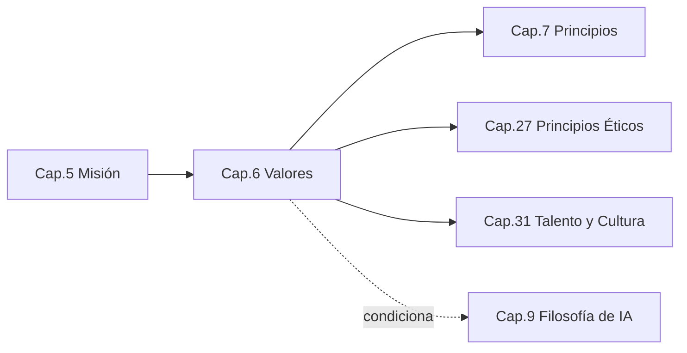
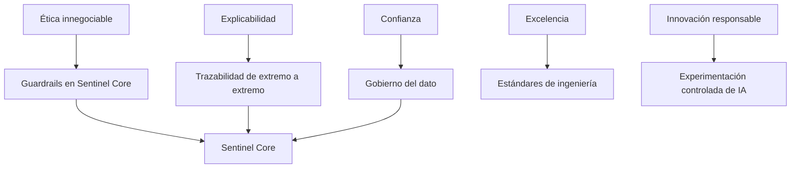

```
════════════════════════════════════════════════════════
  SENTINEL INTELLIGENCE PLATFORM — AI Intelligence Platform
  SENTINEL INTELLIGENCE FOUNDATION v1.0
────────────────────────────────────────────────────────
  Capítulo      : 6 — Valores
  Versión       : v1.1
  Fecha         : 2026-08-14
  Estado        : Approved
  Autor         : Comité Fundador de Sentinel Intelligence
  Founder       : Patricio David Fierro (Product Owner principal)
  Confidencial. : CONFIDENCIAL — Uso interno fundacional
════════════════════════════════════════════════════════
```

# CAPÍTULO 6 — Valores
### Bloque I — ADN e Identidad

---

## 2. Objetivos del Capítulo

1. Definir los **valores centrales** e innegociables de Sentinel Intelligence Platform.
2. Traducir cada valor en **comportamientos observables** y en **antipatrones** a evitar.
3. Conectar los valores con las decisiones de producto, ingeniería y arquitectura del Sentinel Core.
4. Establecer los valores como **criterio cultural y de contratación**.

---

## 3. Alcance

| Incluye | NO incluye |
|---|---|
| Valores centrales y su significado | Reglas de decisión operativas (Principios, Cap. 7) |
| Comportamientos esperados y antipatrones | Código ético formal y cumplimiento (Cap. 27, 30) |
| Relación valores ↔ arquitectura | Cultura organizacional y talento (Cap. 31) |

**Distinción:** los **Valores** son *lo que somos* (identidad); los **Principios** (Cap. 7) son *cómo decidimos* (regla aplicable).

---

## 4. Relación con Otros Capítulos



| Capítulo | Relación |
|---|---|
| Cap. 5 — Misión | **Entrante** — los valores rigen *cómo* se cumple la misión |
| Cap. 7 — Principios | **Saliente** — los principios operativizan los valores |
| Cap. 27 — Ética | **Saliente** — los valores éticos se formalizan allí |
| Cap. 31 — Talento/Cultura | **Saliente** — los valores guían contratación y cultura |

---

## 5. Desarrollo Completo

### 5.1 Los siete valores centrales

| # | Valor | Definición |
|---|---|---|
| V1 | **Inteligencia con propósito** | La tecnología existe para mejorar decisiones, no para impresionar. |
| V2 | **Ética innegociable** | La ética precede al negocio; nunca se sacrifica por velocidad o ingreso. |
| V3 | **Explicabilidad y transparencia** | Toda conclusión debe poder explicarse y trazarse. Nada de "caja negra". |
| V4 | **Confianza** | Somos custodios responsables de la información de nuestros clientes. |
| V5 | **Excelencia en ingeniería** | Construimos con calidad, rigor y visión de largo plazo. |
| V6 | **Innovación responsable** | Innovamos sin comprometer ética, seguridad ni explicabilidad. |
| V7 | **Impacto global con raíz local** | Resolvemos un problema global, arraigados en el contexto donde operamos. |

### 5.2 Rueda de valores (ASCII)

```
                    ┌───────────────────────┐
                    │  INTELIGENCIA CON      │
                    │      PROPÓSITO (V1)    │
          ┌─────────┴───────────┬───────────┴─────────┐
   IMPACTO GLOBAL          [ NÚCLEO CULTURAL ]     ÉTICA
   CON RAÍZ LOCAL (V7)     Sentinel Intelligence   INNEGOCIABLE (V2)
          │                    Platform                  │
   INNOVACIÓN                     │                 EXPLICABILIDAD
   RESPONSABLE (V6)               │                 Y TRANSPARENCIA (V3)
          └─────────┬───────────┬─┴─────────┬───────────┘
              EXCELENCIA EN            CONFIANZA (V4)
              INGENIERÍA (V5)
```

### 5.3 Valores → comportamientos observables → antipatrones

| Valor | Comportamiento esperado | Antipatrón (a evitar) |
|---|---|---|
| V1 Inteligencia con propósito | Cada feature se justifica por la decisión que mejora | "Tecnología por moda" sin valor de decisión |
| V2 Ética innegociable | Rechazar usos indebidos aunque sean rentables | Ceder ante ingresos que violan la ética |
| V3 Explicabilidad | Entregar la razón detrás de cada salida | Aceptar resultados que nadie puede explicar |
| V4 Confianza | Proteger y gobernar el dato del cliente | Uso opaco o negligente de datos |
| V5 Excelencia | Calidad, pruebas, deuda técnica controlada | "Parches" que hipotecan el futuro |
| V6 Innovación responsable | Experimentar con guardrails | Innovar saltándose seguridad/ética |
| V7 Impacto global/raíz local | Diseñar global, contextualizar local | Ignorar el contexto o el alcance global |

### 5.4 Jerarquía de valores (regla de desempate)

Cuando dos valores entran en tensión, se aplica esta prelación:

```
   ÉTICA (V2)  ►  EXPLICABILIDAD/CONFIANZA (V3,V4)  ►  EXCELENCIA (V5)  ►  INNOVACIÓN (V6)
```

*Ejemplo:* si una innovación (V6) compromete la ética (V2), **prevalece la ética**. Esta regla evita decisiones ambiguas bajo presión.

---

## 6. Diagramas

### 6.1 Mapa valores → decisiones (Mermaid)



### 6.2 Flujo de resolución de conflicto de valores (ASCII)

```
   ¿Dos valores en tensión?
            │
            ▼
   ¿Alguno es ÉTICA (V2)? ──sí──► Prevalece V2
            │no
            ▼
   ¿Afecta EXPLICABILIDAD/CONFIANZA? ──sí──► Prevalecen V3/V4
            │no
            ▼
   Decidir por EXCELENCIA (V5) sobre INNOVACIÓN (V6)
```

---

## 7. Tablas Comparativas

### 7.1 Valores declarativos vs. valores operativos (nuestro enfoque)

| Enfoque | Valores solo declarativos | Valores operativos (Sentinel) |
|---|---|---|
| Forma | Frases en una pared | Comportamientos + antipatrones + jerarquía |
| Aplicación | Difusa | Guían decisiones concretas y arquitectura |
| Medición | No medibles | Observables en conducta y producto |

### 7.2 Cómo se manifiesta cada valor en el producto

| Valor | Manifestación en Sentinel Core / módulos |
|---|---|
| Ética (V2) | Controles y guardrails transversales en el Core |
| Explicabilidad (V3) | Trazabilidad de datos y razonamiento |
| Confianza (V4) | Gobierno y seguridad del dato |
| Excelencia (V5) | Arquitectura sólida y mantenible |

---

## 8. Buenas Prácticas

1. **Contratar y evaluar por valores**, no solo por competencias técnicas.
2. **Hacer visibles los antipatrones:** nombrar lo que NO haremos es tan importante como lo que sí.
3. **Aplicar la jerarquía de valores** para desempatar decisiones difíciles.
4. **Auditar producto contra valores:** cada release se revisa frente a V2–V4.

---

## 9. Riesgos

| ID | Riesgo | Prob. | Impacto | Mitigación |
|---|---|---|---|---|
| R6-1 | Valores que quedan en lo declarativo | Media | Alto | Comportamientos observables + auditoría (§8) |
| R6-2 | Conflictos de valores sin criterio de desempate | Media | Medio | Jerarquía de valores (§5.4) |
| R6-3 | Presión comercial erosiona la ética | Media | Alto | V2 como valor de máxima prelación; reglas (Cap. 25) |
| R6-4 | Crecimiento diluye la cultura | Media | Medio | Valores como criterio de contratación (Cap. 31) |

---

## 10. Recomendaciones

1. Adoptar los **siete valores** y su **jerarquía** como oficiales.
2. Integrar los valores en el proceso de **contratación y evaluación** (Cap. 31).
3. Incluir una **checklist de valores** en la revisión de releases.
4. Formalizar los valores éticos en el **código ético** (Cap. 27).

---

## 11. Architecture Decision Records (ADR)

### ADR-006-01 — Ética y explicabilidad como valores con prelación arquitectónica
- **Contexto:** Los valores deben tener consecuencia técnica, no solo cultural.
- **Decisión:** V2 (Ética) y V3 (Explicabilidad) tienen **prioridad de diseño** sobre desempeño o costo en el Sentinel Core.
- **Estado:** Aprobada (fundacional).
- **Consecuencias:** (+) Coherencia entre cultura y producto; (−) puede aumentar costo/latencia, aceptado por diseño.

### ADR-006-02 — Jerarquía formal de valores para resolución de conflictos
- **Contexto:** Sin criterio de desempate, las decisiones bajo presión son inconsistentes.
- **Decisión:** Adoptar la prelación Ética ► Explicabilidad/Confianza ► Excelencia ► Innovación.
- **Estado:** Aprobada.
- **Consecuencias:** (+) Decisiones predecibles y defendibles; (−) requiere disciplina cultural.

---

## 12. Pendientes

| ID | Pendiente | Responsable sugerido | Depende de |
|---|---|---|---|
| P6-1 | Diseñar checklist de valores para releases | UX Director / CPO | Cap. 8 |
| P6-2 | Integrar valores en marco de contratación | CEO / Talento | Cap. 31 |

---

## 13. Referencias Cruzadas

- **Cap. 5 — Misión:** los valores rigen cómo se cumple.
- **Cap. 7 — Principios:** operativizan los valores.
- **Cap. 9 — IA / Cap. 22 — Core:** materialización de ética y explicabilidad.
- **Cap. 27 — Ética / Cap. 31 — Talento:** formalización cultural y de conducta.

---

## 14. Historial de Cambios

| Versión | Fecha | Cambio | Autor |
|---|---|---|---|
| v1.0 | 2026-08-13 | Creación del Capítulo 6 (Valores) bajo el estándar de 17 secciones. | Comité Fundador |
| v1.1 | 2026-08-14 | Aprobación por el Product Owner (aprobación de Bloque I); estado → Approved. | Patricio David Fierro |

---

## 15. Estado del Documento

Draft → Review → **Approved**

*Estado actual: **Approved** (aprobado por el Product Owner).*

---

## 16. Versión

**v1.1** — capítulo aprobado.

---

## 17. Impacto en Sentinel Core

| Decisión del capítulo | Impacto en la arquitectura de Sentinel Core |
|---|---|
| Ética innegociable (V2) con prelación (ADR-006-01) | El Core incorpora **guardrails éticos transversales** como servicio central, no opcional por módulo. |
| Explicabilidad y transparencia (V3) | El Core garantiza **trazabilidad de extremo a extremo** como capacidad nativa. |
| Confianza (V4) | El Core centraliza **gobierno, seguridad y auditoría del dato**. |
| Excelencia en ingeniería (V5) | El Core se rige por **estándares de calidad y mantenibilidad** (Cap. 8). |
| Innovación responsable (V6) | La experimentación de IA en el Core ocurre en un **entorno con guardrails** y controles. |

**Síntesis:** los valores no son solo culturales — fijan **restricciones arquitectónicas permanentes** del Sentinel Core: guardrails éticos, trazabilidad y gobierno del dato como servicios centrales, con prelación de la ética sobre desempeño y costo.

---

*Fin del Capítulo 6 — Valores.*
