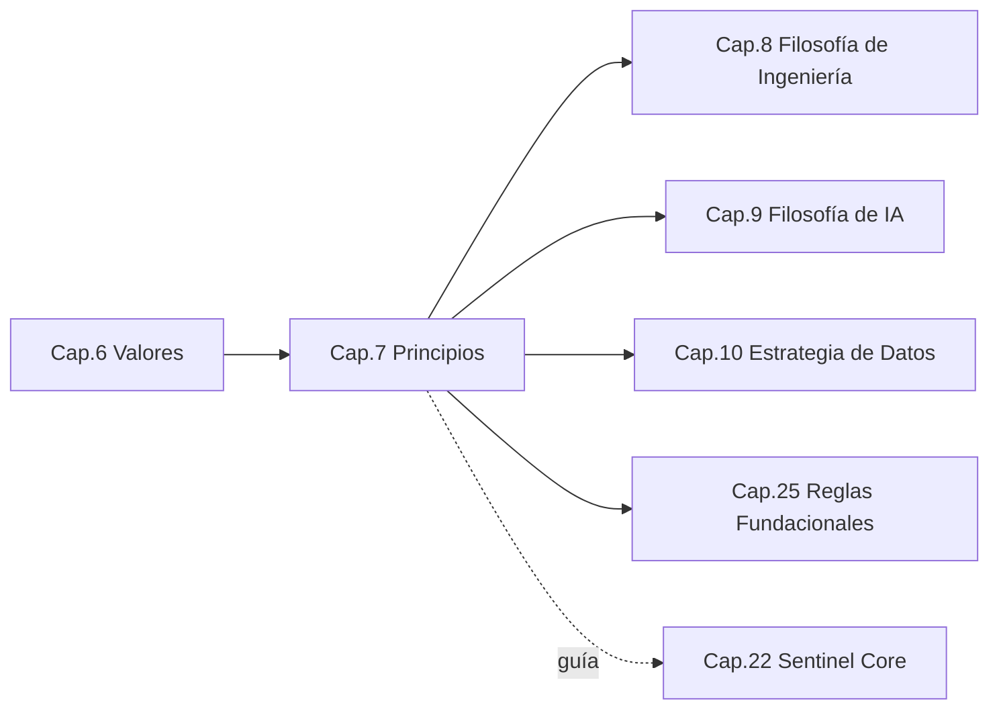
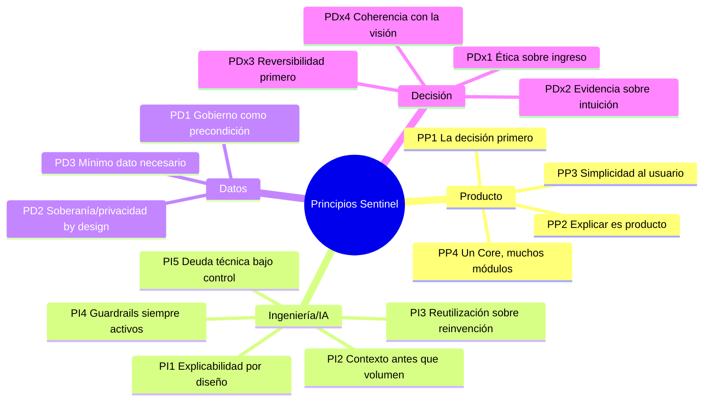

```
════════════════════════════════════════════════════════
  SENTINEL INTELLIGENCE PLATFORM — AI Intelligence Platform
  SENTINEL INTELLIGENCE FOUNDATION v1.0
────────────────────────────────────────────────────────
  Capítulo      : 7 — Principios
  Versión       : v1.1
  Fecha         : 2026-08-14
  Estado        : Approved
  Autor         : Comité Fundador de Sentinel Intelligence
  Founder       : Patricio David Fierro (Product Owner principal)
  Confidencial. : CONFIDENCIAL — Uso interno fundacional
════════════════════════════════════════════════════════
```

# CAPÍTULO 7 — Principios
### Bloque I — ADN e Identidad

---

## 2. Objetivos del Capítulo

1. Convertir los valores (Cap. 6) en **principios operativos**: reglas de decisión aplicables al día a día.
2. Organizar los principios por dominio: **producto, ingeniería/IA, datos y decisión**.
3. Definir cómo se resuelven los **trade-offs** cuando dos principios entran en tensión.
4. Anclar los principios al diseño del **Sentinel Core**.

---

## 3. Alcance

| Incluye | NO incluye |
|---|---|
| Principios de producto, ingeniería, IA, datos y decisión | Los valores identitarios (Cap. 6) |
| Reglas de aplicación y ejemplos | Reglas fundacionales inmutables de gobierno (Cap. 25) |
| Guía de resolución de trade-offs | Filosofías completas de ingeniería/IA (Cap. 8, 9) |

**Distinción:** los **Valores** dicen *quiénes somos*; los **Principios** dicen *cómo decidimos*; las **Reglas Fundacionales** (Cap. 25) dicen *qué no se puede cambiar*.

---

## 4. Relación con Otros Capítulos



| Capítulo | Relación |
|---|---|
| Cap. 6 — Valores | **Entrante** — los principios operativizan los valores |
| Cap. 8–10 — Ingeniería/IA/Datos | **Saliente** — desarrollan los principios técnicos |
| Cap. 25 — Reglas Fundacionales | **Saliente** — algunos principios se elevan a reglas |
| Cap. 22 — Sentinel Core | **Ancla** — los principios guían el diseño del motor |

---

## 5. Desarrollo Completo

### 5.1 Principios de producto

| Código | Principio | Aplicación |
|---|---|---|
| PP1 | **La decisión primero** | Todo módulo se diseña desde la decisión que habilita, no desde la feature. |
| PP2 | **Explicar es parte del producto** | Una salida sin explicación no es una salida válida. |
| PP3 | **Simplicidad para el usuario, complejidad en el Core** | La sofisticación vive en el motor, no en la carga cognitiva del usuario. |
| PP4 | **Un Core, muchos módulos** | No se resuelve un caso con soluciones aisladas; se extiende el Core. |

### 5.2 Principios de ingeniería e IA

| Código | Principio | Aplicación |
|---|---|---|
| PI1 | **Explicabilidad por diseño** | La trazabilidad se construye desde el inicio, no se añade después. |
| PI2 | **Contexto antes que volumen** | Mejor inteligencia contextual que más datos sin sentido. |
| PI3 | **Reutilización sobre reinvención** | Capacidades comunes viven en el Core y se comparten. |
| PI4 | **Guardrails siempre activos** | La experimentación de IA ocurre con controles éticos y de seguridad. |
| PI5 | **Calidad y deuda técnica bajo control** | Se prioriza la mantenibilidad de largo plazo. |

### 5.3 Principios de datos

| Código | Principio | Aplicación |
|---|---|---|
| PD1 | **Gobierno del dato como precondición** | Ningún dato entra sin licitud, calidad y trazabilidad claras. |
| PD2 | **Soberanía y privacidad by design** | El diseño respeta la residencia y protección del dato. |
| PD3 | **Mínimo dato necesario** | Se recopila y retiene solo lo que aporta a la decisión. |

### 5.4 Principios de decisión (cómo decide la organización)

| Código | Principio | Aplicación |
|---|---|---|
| PDx1 | **Ética por encima del ingreso** | Ante conflicto, prevalece la ética (coherente con la jerarquía de valores). |
| PDx2 | **Evidencia sobre intuición** | Las decisiones estratégicas se apoyan en datos, no solo en opinión. |
| PDx3 | **Reversibilidad primero** | Se favorecen decisiones reversibles; las irreversibles requieren mayor rigor. |
| PDx4 | **Coherencia con la visión** | Toda decisión se contrasta con el filtro de la visión (Cap. 4). |

### 5.5 Resolución de trade-offs entre principios

```
   Conflicto entre principios
            │
            ▼
   1) ¿Choca con ÉTICA (PDx1) o guardrails (PI4)? ──► Gana la ética/seguridad
            │no
            ▼
   2) ¿Compromete EXPLICABILIDAD (PI1/PP2)?       ──► Prevalece explicabilidad
            │no
            ▼
   3) ¿Afecta la REUTILIZACIÓN del Core (PI3/PP4)? ──► Preferir la vía que fortalece el Core
            │no
            ▼
   4) Optimizar por valor de decisión al usuario (PP1)
```

---

## 6. Diagramas

### 6.1 Mapa de principios por dominio (Mermaid)



### 6.2 Árbol de decisión de trade-offs (ASCII)

```
[Decisión con principios en tensión]
        │
        ├─ ¿Viola ética/seguridad? ──► NO se hace
        │
        ├─ ¿Rompe explicabilidad? ──► Rediseñar hasta que sea explicable
        │
        ├─ ¿Debilita el Core?     ──► Elegir opción que fortalece el Core
        │
        └─ Maximizar valor de decisión para el usuario
```

---

## 7. Tablas Comparativas

### 7.1 Valores vs. Principios vs. Reglas

| Aspecto | Valores (Cap. 6) | Principios (Cap. 7) | Reglas Fundacionales (Cap. 25) |
|---|---|---|---|
| Responden a | ¿Quiénes somos? | ¿Cómo decidimos? | ¿Qué no se cambia? |
| Naturaleza | Identidad | Guía aplicable | Norma inmutable |
| Flexibilidad | Estable | Adaptable con criterio | Rígida (excepción formal) |
| Ejemplo | Ética innegociable | Ética sobre ingreso (PDx1) | Explicabilidad obligatoria |

### 7.2 Principio → beneficio arquitectónico

| Principio | Beneficio para el sistema |
|---|---|
| PI3 Reutilización | Menor costo marginal por módulo |
| PI1 Explicabilidad por diseño | Confianza y cumplimiento nativos |
| PD1 Gobierno del dato | Reducción de riesgo legal/reputacional |
| PP4 Un Core, muchos módulos | Escalabilidad multiindustria |

---

## 8. Buenas Prácticas

1. **Citar el principio** en decisiones relevantes (queda en el registro/ADR).
2. **Usar el árbol de trade-offs** (§5.5) para dirimir conflictos, no la jerarquía informal.
3. **Elevar a regla** (Cap. 25) los principios que nunca deben negociarse.
4. **Revisar periódicamente** que los principios sigan sirviendo a la visión.

---

## 9. Riesgos

| ID | Riesgo | Prob. | Impacto | Mitigación |
|---|---|---|---|---|
| R7-1 | Principios ignorados en la práctica | Media | Alto | Citarlos en ADR; auditoría de decisiones |
| R7-2 | Conflictos de principios sin criterio | Media | Medio | Árbol de trade-offs (§5.5) |
| R7-3 | Exceso de principios → parálisis | Baja | Medio | Set acotado y jerarquizado |
| R7-4 | Principios técnicos que chocan con presión comercial | Media | Alto | PDx1 (ética sobre ingreso) + reglas (Cap. 25) |

---

## 10. Recomendaciones

1. Adoptar el conjunto de principios y el **árbol de trade-offs** como oficiales.
2. Incorporar la **cita de principios** en la plantilla de ADR de todos los capítulos técnicos.
3. Seleccionar los principios candidatos a **Reglas Fundacionales** (Cap. 25).
4. Formar a los equipos en la aplicación práctica de los principios.

---

## 11. Architecture Decision Records (ADR)

### ADR-007-01 — Principios como criterios explícitos en toda decisión técnica
- **Contexto:** Sin referencia explícita, los principios no se aplican de forma consistente.
- **Decisión:** Toda decisión arquitectónica relevante debe **citar el/los principios** que la sustentan.
- **Estado:** Aprobada.
- **Consecuencias:** (+) Trazabilidad y coherencia de decisiones; (−) leve sobrecarga de documentación.

### ADR-007-02 — Árbol de resolución de trade-offs como mecanismo formal
- **Contexto:** Los conflictos entre principios necesitan un método reproducible.
- **Decisión:** Adoptar el árbol de la §5.5 (ética/seguridad ► explicabilidad ► fortalecer Core ► valor de decisión).
- **Estado:** Aprobada.
- **Consecuencias:** (+) Decisiones predecibles; (−) requiere disciplina de uso.

---

## 12. Pendientes

| ID | Pendiente | Responsable sugerido | Depende de |
|---|---|---|---|
| P7-1 | Seleccionar principios a elevar a Reglas Fundacionales | Comité / CEO | Cap. 25 |
| P7-2 | Añadir campo "principios aplicados" a la plantilla ADR | Chief Architect | Estándar |

---

## 13. Referencias Cruzadas

- **Cap. 6 — Valores:** origen de los principios.
- **Cap. 8 — Ingeniería / Cap. 9 — IA / Cap. 10 — Datos:** desarrollo técnico de los principios.
- **Cap. 22 — Sentinel Core:** aplicación de PI1, PI3, PI4.
- **Cap. 25 — Reglas Fundacionales:** principios elevados a norma inmutable.

---

## 14. Historial de Cambios

| Versión | Fecha | Cambio | Autor |
|---|---|---|---|
| v1.0 | 2026-08-13 | Creación del Capítulo 7 (Principios) bajo el estándar de 17 secciones. | Comité Fundador |
| v1.1 | 2026-08-14 | Aprobación por el Product Owner (aprobación de Bloque I); estado → Approved. | Patricio David Fierro |

---

## 15. Estado del Documento

Draft → Review → **Approved**

*Estado actual: **Approved** (aprobado por el Product Owner).*

---

## 16. Versión

**v1.1** — capítulo aprobado.

---

## 17. Impacto en Sentinel Core

| Principio | Impacto en la arquitectura de Sentinel Core |
|---|---|
| PI1 Explicabilidad por diseño | La trazabilidad es un **requisito estructural** del Core desde el primer commit. |
| PI3 Reutilización sobre reinvención | El Core expone **capacidades comunes compartidas** por todos los módulos. |
| PI4 Guardrails siempre activos | El Core integra un **subsistema de guardrails** de ética y seguridad. |
| PD1/PD2 Gobierno y soberanía del dato | El Core incluye **servicios de gobierno, privacidad y residencia del dato**. |
| PP4 Un Core, muchos módulos | El Core define **contratos estables Core↔Módulo** para habilitar extensibilidad. |

**Síntesis:** los principios consolidan la forma del Sentinel Core: un **motor común, explicable, gobernado y con guardrails**, extensible mediante contratos estables. Esta es la base conceptual que el Bloque IV (Cap. 22) desarrollará técnicamente.

---

*Fin del Capítulo 7 — Principios.*
