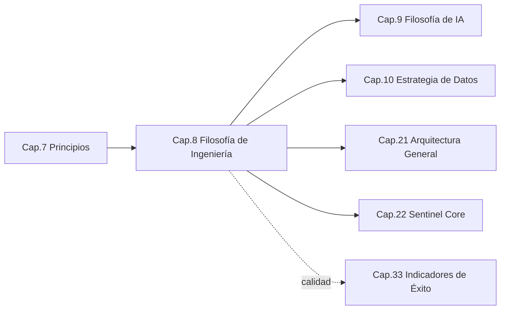
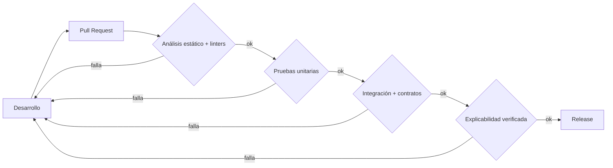

```
════════════════════════════════════════════════════════
  SENTINEL INTELLIGENCE PLATFORM — AI Intelligence Platform
  SENTINEL INTELLIGENCE FOUNDATION v1.0
────────────────────────────────────────────────────────
  Capítulo      : 8 — Filosofía de Ingeniería
  Bloque        : II — Filosofía y Tecnología
  Versión       : v1.1
  Fecha         : 2026-08-14
  Estado        : Approved
  Autor         : Comité Fundador de Sentinel Intelligence
  Founder       : Patricio David Fierro (Product Owner principal)
  Confidencial. : CONFIDENCIAL — Uso interno fundacional
════════════════════════════════════════════════════════
```

# CAPÍTULO 8 — Filosofía de Ingeniería
### Bloque II — Filosofía y Tecnología

---

## 2. Objetivos del Capítulo

1. Definir **cómo construye software** Sentinel Intelligence Platform: principios, calidad, escalabilidad y gestión de la deuda técnica.
2. Establecer los **estándares de ingeniería** que garantizan un Sentinel Core sólido, explicable y mantenible a largo plazo.
3. Fijar el modelo de **calidad y testing** coherente con los valores (ética, explicabilidad) del Bloque I.
4. Traducir la filosofía de ingeniería en **requisitos concretos del Sentinel Core**.

---

## 3. Alcance

| Incluye | NO incluye |
|---|---|
| Principios y estándares de ingeniería | La filosofía de IA/modelos (Cap. 9) |
| Modelo de calidad, testing y deuda técnica | La estrategia de datos (Cap. 10) |
| Escalabilidad y mantenibilidad por diseño | El diseño técnico detallado del Core (Cap. 22) |
| Prácticas de DevOps/entrega (marco) | La infraestructura cloud específica (Cap. 21) |

---

## 4. Relación con Otros Capítulos



| Capítulo | Relación |
|---|---|
| Cap. 7 — Principios | **Entrante** — PI1 (explicabilidad por diseño), PI3 (reutilización), PI5 (deuda técnica) |
| Cap. 9 — IA | **Saliente** — la ingeniería sostiene la IA explicable |
| Cap. 21–22 — Arquitectura/Core | **Saliente** — la filosofía guía el diseño |
| Cap. 33 — Indicadores | **Saliente** — métricas de calidad de ingeniería |

---

## 5. Desarrollo Completo

### 5.1 Principios de ingeniería

| Código | Principio de ingeniería | Descripción |
|---|---|---|
| EI1 | **Explicabilidad por diseño** | La trazabilidad y la capacidad de explicar se construyen en el código, no se añaden después. |
| EI2 | **Simplicidad esencial** | Se prefiere la solución más simple que resuelve el problema (evitar complejidad accidental). |
| EI3 | **Modularidad y contratos** | Componentes con límites claros y contratos estables (habilita el modelo Core + módulos). |
| EI4 | **Automatización primero** | Todo lo repetible se automatiza (pruebas, despliegue, calidad). |
| EI5 | **Seguridad y privacidad by design** | La seguridad es parte del diseño inicial, no un parche. |
| EI6 | **Observabilidad nativa** | Todo componente emite métricas, logs y trazas desde el inicio. |
| EI7 | **Deuda técnica gestionada** | La deuda se hace visible, se prioriza y se paga; no se oculta. |

### 5.2 Modelo de calidad y testing

Sentinel adopta una **pirámide de testing** con verificación específica de explicabilidad:

```
                 ▲  Pruebas E2E / de decisión
                /█\   (¿la salida es correcta y explicable?)
               /███\
              /█████\  Pruebas de integración
             /███████\  (Core ↔ módulos, contratos)
            /█████████\
           /███████████\ Pruebas unitarias
          /█████████████\ (lógica, funciones, componentes)
         ─────────────────
          Base: análisis estático, linters, revisión de código
```

| Nivel | Qué verifica | Particularidad Sentinel |
|---|---|---|
| Estático / revisión | Estilo, seguridad, complejidad | Puertas de calidad obligatorias en CI |
| Unitario | Lógica de componentes | Cobertura significativa (no solo %) |
| Integración | Contratos Core↔Módulo | Los contratos son "ciudadanos de primera clase" |
| E2E / decisión | Resultado accionable | **Verifica también que la salida sea explicable/trazable** |

### 5.3 Estándares de código

| Estándar | Regla |
|---|---|
| Definición de "Done" | Incluye pruebas, documentación y **explicabilidad de la salida** (ADR-005-02). |
| Revisión de código | Toda incorporación pasa por revisión; se cita el principio aplicado (ADR-007-01). |
| Contratos primero | Cambios en el Core que afectan módulos requieren versionado de contrato. |
| Estilo y linters | Automatizados; bloquean el merge si fallan. |

### 5.4 Escalabilidad y mantenibilidad por diseño

| Dimensión | Enfoque |
|---|---|
| Escalabilidad horizontal | Componentes sin estado donde sea posible; escalar por réplicas. |
| Desacoplamiento | El Core no depende de la lógica específica de un módulo. |
| Evolución sin ruptura | Contratos versionados; compatibilidad hacia atrás. |
| Mantenibilidad | Código simple, observabilidad nativa y documentación viva. |

### 5.5 Gestión de la deuda técnica

```
   Detectar  →  Registrar  →  Clasificar  →  Priorizar  →  Pagar  →  Verificar
   (métricas)   (backlog)    (impacto/     (por riesgo   (sprint)  (métricas
                              esfuerzo)     y valor)                 de calidad)
```

La deuda técnica se trata como un **elemento de backlog visible**, con presupuesto asignado en cada ciclo (no se acumula en silencio — antipatrón de V5).

---

## 6. Diagramas

### 6.1 Flujo de entrega con puertas de calidad (Mermaid)



### 6.2 Capas de ingeniería del Core (ASCII)

```
   ┌──────────────────────────────────────────────┐
   │  Observabilidad (métricas · logs · trazas)     │
   ├──────────────────────────────────────────────┤
   │  Seguridad y privacidad by design              │
   ├──────────────────────────────────────────────┤
   │  Contratos estables Core ↔ Módulos             │
   ├──────────────────────────────────────────────┤
   │  Núcleo de dominio (agnóstico) — Sentinel Core │
   └──────────────────────────────────────────────┘
```

---

## 7. Tablas Comparativas

### 7.1 Ingeniería "de producto único" vs. ingeniería "de plataforma"

| Criterio | Producto único | Plataforma (Sentinel) |
|---|---|---|
| Reutilización | Baja | Alta (Core común) |
| Contratos | Implícitos | Explícitos y versionados |
| Deuda técnica | Suele ocultarse | Visible y gestionada |
| Testing | Funcional | Funcional **+ explicabilidad** |
| Escalabilidad | Puntual | Por diseño |

### 7.2 Enfoque de calidad: "cobertura" vs. "confianza"

| Métrica | Cobertura de código | Confianza en la decisión (Sentinel) |
|---|---|---|
| Qué mide | Líneas ejecutadas por pruebas | Que la salida sea correcta **y explicable** |
| Riesgo | Falsa sensación de seguridad | Alineado al valor real del producto |

---

## 8. Buenas Prácticas

1. **Contratos primero:** definir y versionar el contrato Core↔Módulo antes de implementar.
2. **Explicabilidad como prueba automatizada**, no como revisión manual opcional.
3. **Presupuesto fijo de deuda técnica** en cada ciclo de trabajo.
4. **Observabilidad desde el día uno** en cada componente del Core.
5. **Puertas de calidad que bloquean** el merge (no advertencias ignorables).

---

## 9. Riesgos

| ID | Riesgo | Prob. | Impacto | Mitigación |
|---|---|---|---|---|
| R8-1 | Deuda técnica acumulada en silencio | Media | Alto | Registro visible + presupuesto por ciclo (§5.5) |
| R8-2 | Complejidad accidental que frena la evolución | Media | Alto | Principio de simplicidad esencial (EI2) |
| R8-3 | Contratos Core↔Módulo inestables | Media | Alto | Versionado de contratos; compatibilidad hacia atrás |
| R8-4 | Explicabilidad no verificada automáticamente | Media | Alto | Pruebas de explicabilidad en CI (§6.1) |
| R8-5 | Falsa confianza por métricas de cobertura | Baja | Medio | Métricas orientadas a confianza en la decisión |

---

## 10. Recomendaciones

1. Adoptar los **7 principios de ingeniería (EI1–EI7)** como estándar oficial.
2. Implementar la **pirámide de testing con puerta de explicabilidad** en CI.
3. Institucionalizar el **manejo visible de deuda técnica**.
4. Exigir **contratos versionados** para todo cambio del Core que afecte módulos.

---

## 11. Architecture Decision Records (ADR)

### ADR-008-01 — Contratos explícitos y versionados entre Sentinel Core y módulos
- **Contexto:** El modelo Core + módulos requiere estabilidad de interfaces.
- **Decisión:** Todo intercambio Core↔Módulo se define por **contratos versionados** con compatibilidad hacia atrás.
- **Estado:** Aprobada.
- **Consecuencias:** (+) Evolución sin romper módulos; (−) disciplina de versionado y pruebas de contrato.
- **Principios aplicados:** PI3 (reutilización), EI3 (modularidad).

### ADR-008-02 — Explicabilidad verificada en el pipeline de calidad
- **Contexto:** La explicabilidad es un NFR obligatorio (Cap. 3, 5); debe ser verificable, no declarativa.
- **Decisión:** Incluir una **puerta de explicabilidad** en CI: ninguna salida no explicable llega a release.
- **Estado:** Aprobada.
- **Consecuencias:** (+) Explicabilidad garantizada; (−) mayor esfuerzo de pruebas.
- **Principios aplicados:** PI1 (explicabilidad por diseño).

### ADR-008-03 — Deuda técnica como elemento de backlog con presupuesto
- **Contexto:** La deuda oculta erosiona la excelencia (V5).
- **Decisión:** Registrar, priorizar y **presupuestar** la deuda técnica en cada ciclo.
- **Estado:** Aprobada.
- **Consecuencias:** (+) Mantenibilidad de largo plazo; (−) reduce capacidad de features por ciclo (aceptado).

---

## 12. Pendientes

| ID | Pendiente | Responsable sugerido | Depende de |
|---|---|---|---|
| P8-1 | Definir el stack tecnológico concreto | CTO / Cloud Architect | Cap. 21 |
| P8-2 | Especificar el formato de "prueba de explicabilidad" | Chief AI Officer | Cap. 9 |
| P8-3 | Definir métricas de calidad de ingeniería para el tablero | DevOps Lead | Cap. 33 |

---

## 13. Referencias Cruzadas

- **Cap. 7 — Principios:** PI1, PI3, PI5 como base.
- **Cap. 9 — IA / Cap. 10 — Datos:** ingeniería que sostiene IA y datos.
- **Cap. 21–22 — Arquitectura/Core:** materialización técnica.
- **Cap. 33 — Indicadores:** métricas de calidad de ingeniería.

---

## 14. Historial de Cambios

| Versión | Fecha | Cambio | Autor |
|---|---|---|---|
| v1.0 | 2026-08-14 | Creación del Capítulo 8 (Filosofía de Ingeniería) — inicio del Bloque II. | Comité Fundador |
| v1.1 | 2026-08-14 | Aprobación por el Product Owner; ADR-008-01/02/03 registrados; estado → Approved. | Patricio David Fierro |

---

## 15. Estado del Documento

Draft → Review → **Approved**

*Estado actual: **Approved** (aprobado por el Product Owner). ADR-008-01, ADR-008-02 y ADR-008-03 registrados como decisiones arquitectónicas oficiales.*

---

## 16. Versión

**v1.1** — capítulo aprobado.

---

## 17. Impacto en Sentinel Core

| Decisión del capítulo | Impacto en la arquitectura de Sentinel Core |
|---|---|
| Contratos versionados Core↔Módulo (ADR-008-01) | El Core expone **interfaces estables y versionadas**; los módulos dependen de contratos, no de internals. |
| Puerta de explicabilidad en CI (ADR-008-02) | El Core debe producir salidas con **artefactos de explicabilidad verificables automáticamente**. |
| Observabilidad nativa (EI6) | El Core integra **métricas, logs y trazas** en cada etapa (observar→comprender→explicar→decidir). |
| Seguridad by design (EI5) | La seguridad es una **capa transversal** del Core desde el diseño. |
| Deuda técnica gestionada (ADR-008-03) | El Core se mantiene **evolucionable**, evitando rigidez que impida sumar módulos. |

**Síntesis:** la filosofía de ingeniería fija las **garantías no funcionales** del Sentinel Core — contratos estables, explicabilidad verificable, observabilidad y seguridad nativas — que hacen viable el crecimiento del ecosistema de módulos sin degradar la calidad.

---

*Fin del Capítulo 8 — Filosofía de Ingeniería.*
