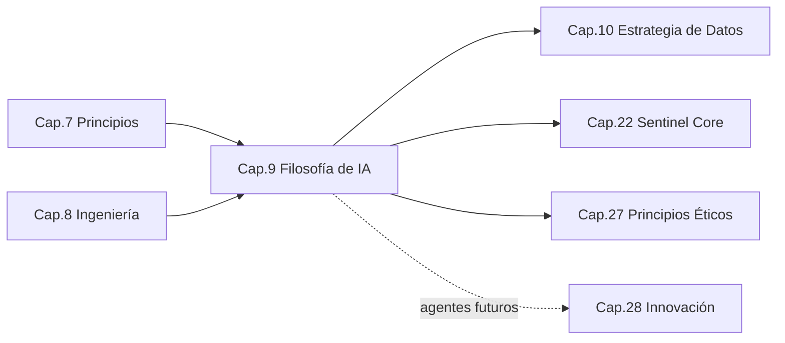
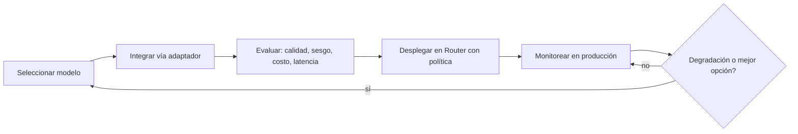
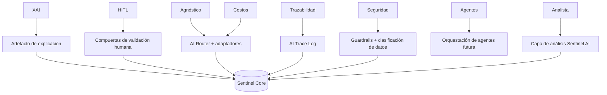

```
════════════════════════════════════════════════════════
  SENTINEL INTELLIGENCE PLATFORM — AI Intelligence Platform
  SENTINEL INTELLIGENCE FOUNDATION v1.0
────────────────────────────────────────────────────────
  Capítulo      : 9 — Filosofía de Inteligencia Artificial
  Bloque        : II — Filosofía y Tecnología
  Versión       : v1.1
  Fecha         : 2026-08-14
  Estado        : Approved
  Autor         : Comité Fundador de Sentinel Intelligence
  Founder       : Patricio David Fierro (Product Owner principal)
  Confidencial. : CONFIDENCIAL — Uso interno fundacional
════════════════════════════════════════════════════════
```

# CAPÍTULO 9 — Filosofía de Inteligencia Artificial
### Bloque II — Filosofía y Tecnología

---

## 2. Objetivos del Capítulo

1. Establecer la **doctrina oficial de IA** de Sentinel Intelligence Platform (principios IA1–IA8) y su interpretación arquitectónica.
2. Definir una **arquitectura de IA agnóstica al proveedor**, con AI Router, trazabilidad y guardrails.
3. Fijar el modelo de **IA explicable (XAI)** y **human-in-the-loop** para decisiones críticas.
4. Sentar las bases para **agentes de IA especializados** futuros y para el rol de **Sentinel AI como analista estratégico**.

---

## 3. Alcance

| Incluye | NO incluye |
|---|---|
| Doctrina de IA (IA1–IA8) y su arquitectura | La estrategia de datos que la alimenta (Cap. 10) |
| AI Router, trazabilidad, XAI, HITL, guardrails | El diseño detallado del Core (Cap. 22) |
| Ciclo de vida y evaluación de modelos | La infraestructura cloud específica (Cap. 21) |
| Rol de Sentinel AI (analista estratégico) | Casos de uso por módulo (fase posterior) |

---

## 4. Relación con Otros Capítulos



| Capítulo | Relación |
|---|---|
| Cap. 7 — Principios | **Entrante** — PI1 (explicabilidad), PI4 (guardrails) |
| Cap. 8 — Ingeniería | **Entrante** — puerta de explicabilidad, observabilidad |
| Cap. 10 — Datos | **Saliente** — la IA depende del gobierno del dato |
| Cap. 22 — Sentinel Core | **Saliente** — la IA es el corazón del motor |
| Cap. 27 — Ética | **Saliente** — IA responsable y guardrails |

---

## 5. Desarrollo Completo

### 5.1 Doctrina oficial de IA (IA1–IA8)

| # | Principio | Qué significa en Sentinel |
|---|---|---|
| IA1 | **Explainable AI (XAI)** | Toda respuesta expone el porqué: fuentes, razonamiento y confianza. |
| IA2 | **Human-in-the-loop (HITL)** | Las decisiones críticas requieren validación humana explícita. |
| IA3 | **Agnóstica al proveedor** | OpenAI, Claude, Gemini, Llama u otros son intercambiables tras una capa de abstracción. |
| IA4 | **Trazabilidad completa** | Se registran prompt, modelo, versión, parámetros, contexto y respuesta. |
| IA5 | **Seguridad y privacidad by design** | Protección de datos y controles desde el diseño del flujo de IA. |
| IA6 | **Optimización de costos (AI Router)** | Selección dinámica del modelo óptimo por costo/calidad/latencia. |
| IA7 | **Preparación para agentes** | Arquitectura lista para agentes especializados en versiones futuras. |
| IA8 | **Analista estratégico, no chatbot** | Sentinel AI razona, contextualiza y recomienda; no solo conversa. |

### 5.2 Arquitectura de IA agnóstica al proveedor (IA3, IA6)

El corazón técnico de la doctrina es una **capa de abstracción de modelos** con un **AI Router** que desacopla a Sentinel de cualquier proveedor.

```
        ┌──────────────────────────────────────────────────────┐
        │                   SENTINEL CORE                       │
        │   (observar · comprender · explicar · decidir)        │
        └───────────────────────┬──────────────────────────────┘
                                 │  (interfaz única de IA)
                        ┌────────▼─────────┐
                        │    AI ROUTER      │  ◄─ política: costo/calidad/latencia/privacidad
                        │  + Abstracción    │
                        └───┬───┬───┬───┬───┘
                    ┌───────┘   │   │   └────────┐
                    ▼           ▼   ▼            ▼
                 OpenAI      Claude Gemini     Llama / modelos
                                                propios / on-prem
```

| Componente | Función |
|---|---|
| **Interfaz única de IA** | El Core y los módulos llaman a la IA por un contrato común, sin conocer el proveedor. |
| **AI Router** | Enruta cada petición al modelo óptimo según política (costo, calidad, latencia, sensibilidad del dato). |
| **Adaptadores por proveedor** | Traducen el contrato común al SDK/API de cada proveedor. |
| **Fallback y resiliencia** | Si un proveedor falla o se degrada, el Router reintenta con otro. |

### 5.3 Explainable AI (IA1) y Human-in-the-loop (IA2)

**Explicabilidad:** toda salida de IA se acompaña de un **artefacto de explicación** con:

| Elemento de la explicación | Descripción |
|---|---|
| Fuentes | Datos/documentos que sustentan la respuesta |
| Razonamiento | Pasos o factores que llevaron a la conclusión |
| Nivel de confianza | Grado de certeza y sus límites |
| Modelo y versión | Qué modelo la produjo (trazabilidad IA4) |

**Human-in-the-loop:** clasificación de decisiones según criticidad:

```
   Criticidad de la decisión
   ───────────────────────────────────────────────
   BAJA     → IA autónoma (con trazabilidad)
   MEDIA    → IA sugiere, humano confirma
   ALTA/CRÍTICA → IA asiste, humano DECIDE (validación obligatoria)
```

### 5.4 Trazabilidad completa (IA4)

Cada interacción de IA genera un **registro auditable**:

```
   prompt → [modelo + versión + parámetros] → respuesta + explicación
     │              │                              │
     └──────────────┴──────── AI Trace Log ────────┘
        (inmutable, auditable, asociado a usuario/módulo/tiempo)
```

### 5.5 Seguridad, privacidad y guardrails (IA5)

| Control | Descripción |
|---|---|
| Clasificación de sensibilidad | Datos sensibles no se envían a proveedores no autorizados (política del Router). |
| Minimización | Se envía a la IA solo el contexto necesario (coherente con PD3). |
| Guardrails | Filtros de entrada/salida: contenido, sesgos, fugas de datos, usos indebidos. |
| Aislamiento | Opción de modelos on-prem/privados para datos críticos. |

### 5.6 Ciclo de vida y evaluación de modelos



### 5.7 Sentinel AI como analista estratégico (IA8) y agentes futuros (IA7)

**Sentinel AI** no es un chatbot: es una **capa de análisis** que observa, contextualiza, explica y recomienda. La arquitectura se prepara para que, en versiones futuras, esa capa evolucione a **agentes especializados** (por dominio/módulo) que colaboren bajo orquestación, sin romper la doctrina (siguen siendo explicables, trazables y con HITL).

---

## 6. Diagramas

### 6.1 Mapa de la doctrina de IA → componentes (Mermaid)



### 6.2 Flujo de una petición de IA (ASCII)

```
Usuario/Módulo
     │  (petición + contexto mínimo)
     ▼
[Guardrails de entrada] ── clasifica sensibilidad
     ▼
[AI Router] ── elige modelo por política (costo/calidad/latencia/privacidad)
     ▼
[Adaptador de proveedor] ── llama al modelo (OpenAI/Claude/Gemini/Llama/…)
     ▼
[Guardrails de salida] ── valida contenido y explicabilidad
     ▼
[AI Trace Log] ── registra prompt/modelo/respuesta/explicación
     ▼
¿Decisión crítica? ──sí──► [HITL: validación humana]
     │no
     ▼
Respuesta + explicación al usuario/módulo
```

---

## 7. Tablas Comparativas

### 7.1 Chatbot genérico vs. Sentinel AI (analista estratégico)

| Criterio | Chatbot genérico | Sentinel AI (IA8) |
|---|---|---|
| Objetivo | Conversar/responder | Analizar y **recomendar decisiones** |
| Explicación | Opcional | Obligatoria (XAI) |
| Proveedor | Fijo | Agnóstico (Router) |
| Trazabilidad | Limitada | Completa y auditable |
| Rol del humano | Consumidor | Decisor en casos críticos (HITL) |

### 7.2 Dependencia de proveedor único vs. arquitectura agnóstica

| Dimensión | Proveedor único | Agnóstica (Sentinel) |
|---|---|---|
| Riesgo de lock-in | Alto | Bajo |
| Optimización de costo | Nula | AI Router por política |
| Resiliencia | Baja (punto único de fallo) | Alta (fallback) |
| Cumplimiento/soberanía | Rígido | Flexible (on-prem/privado según dato) |

### 7.3 Modelos externos vs. modelos propios/on-prem

| Criterio | Externos (API) | Propios / on-prem |
|---|---|---|
| Time-to-market | Rápido | Lento |
| Costo variable | Por uso | Infraestructura fija |
| Control de datos | Menor | Máximo |
| Uso recomendado | General | Datos críticos/sensibles |

---

## 8. Buenas Prácticas

1. **Nunca acoplar el Core a un SDK de proveedor:** siempre a través de la interfaz única + Router (IA3).
2. **Explicación obligatoria** en cada respuesta; sin explicación no hay salida válida (IA1).
3. **Clasificar la sensibilidad del dato** antes de enrutar a cualquier proveedor (IA5).
4. **Registrar todo** (prompt/modelo/respuesta) de forma inmutable y auditable (IA4).
5. **Definir umbrales de criticidad** para activar HITL de forma consistente (IA2).
6. **Evaluar modelos continuamente** (calidad, sesgo, costo, latencia) antes de cambiar políticas del Router.

---

## 9. Riesgos

| ID | Riesgo | Prob. | Impacto | Mitigación |
|---|---|---|---|---|
| R9-1 | Lock-in a un proveedor de IA | Media | Alto | Interfaz única + AI Router + adaptadores (IA3) |
| R9-2 | Respuestas no explicables ("caja negra") | Media | Alto | XAI obligatorio + puerta de explicabilidad (Cap. 8) |
| R9-3 | Fuga de datos sensibles a proveedores externos | Media | Alto | Clasificación + política del Router + on-prem (IA5) |
| R9-4 | Alucinaciones / errores en decisiones críticas | Media | Alto | HITL obligatorio en criticidad alta (IA2) |
| R9-5 | Costos de IA fuera de control | Media | Medio | AI Router optimizando costo/calidad (IA6) |
| R9-6 | Sesgos en los modelos | Media | Alto | Evaluación de sesgo + guardrails (IA5) |
| R9-7 | Trazas incompletas que impiden auditar | Baja | Alto | AI Trace Log inmutable (IA4) |

---

## 10. Recomendaciones

1. Ratificar la **doctrina IA1–IA8** como parte oficial de la Constitución (ya incorporada en `00-PRINCIPIOS-FUNDACIONALES.md`).
2. Diseñar el **AI Router y la interfaz única de IA** como componentes centrales del Sentinel Core.
3. Estandarizar el **artefacto de explicación** y el **AI Trace Log**.
4. Definir la **matriz de criticidad** que dispara HITL.
5. Preparar la **hoja de ruta de agentes especializados** (enlaza con Cap. 28).

---

## 11. Architecture Decision Records (ADR)

### ADR-009-01 — Arquitectura de IA agnóstica al proveedor mediante AI Router
- **Contexto:** Depender de un proveedor único genera lock-in, riesgo y costos rígidos.
- **Decisión:** Toda IA se consume a través de una **interfaz única + AI Router + adaptadores**; los proveedores son intercambiables.
- **Estado:** Aprobada (fundacional).
- **Consecuencias:** (+) Sin lock-in, optimización de costos, resiliencia; (−) mayor complejidad de abstracción y pruebas.
- **Principios aplicados:** IA3, IA6.

### ADR-009-02 — Explicabilidad (XAI) obligatoria en toda salida de IA
- **Contexto:** La explicabilidad es NFR innegociable de la plataforma.
- **Decisión:** Cada respuesta de IA incluye un **artefacto de explicación** (fuentes, razonamiento, confianza, modelo).
- **Estado:** Aprobada.
- **Consecuencias:** (+) Confianza y cumplimiento; (−) mayor costo de cómputo y diseño.
- **Principios aplicados:** IA1, IA4.

### ADR-009-03 — Human-in-the-loop obligatorio en decisiones críticas
- **Contexto:** La IA no debe decidir de forma autónoma en escenarios de alto impacto.
- **Decisión:** Una **matriz de criticidad** determina cuándo la validación humana es obligatoria.
- **Estado:** Aprobada.
- **Consecuencias:** (+) Reduce riesgo de errores graves; (−) introduce latencia humana en casos críticos (aceptado).
- **Principios aplicados:** IA2, IA8.

### ADR-009-04 — Trazabilidad completa vía AI Trace Log inmutable
- **Contexto:** Auditar y explicar requiere registrar todo el ciclo de IA.
- **Decisión:** Toda interacción de IA se registra (prompt, modelo, versión, parámetros, respuesta, explicación) de forma **inmutable y auditable**.
- **Estado:** Aprobada.
- **Principios aplicados:** IA4, IA5.

### ADR-009-05 — Preparación para agentes de IA especializados
- **Contexto:** La evolución hacia agentes debe respetar la doctrina.
- **Decisión:** La capa de IA se diseña para **orquestar agentes especializados** en el futuro, manteniendo XAI, HITL y trazabilidad.
- **Estado:** Aprobada (habilitante).
- **Principios aplicados:** IA7, IA8.

---

## 12. Pendientes

| ID | Pendiente | Responsable sugerido | Depende de |
|---|---|---|---|
| P9-1 | Especificar el contrato de la interfaz única de IA | Chief AI Officer / Chief Architect | Cap. 22 |
| P9-2 | Definir política del AI Router (reglas costo/calidad/privacidad) | Chief AI Officer | Cap. 10 |
| P9-3 | Estandarizar el esquema del artefacto de explicación y del Trace Log | Data Scientist | Cap. 22 |
| P9-4 | Definir la matriz de criticidad para HITL | CPO / Cybersecurity | Cap. 27 |
| P9-5 | Hoja de ruta de agentes especializados | Product Innovation Director | Cap. 28 |

---

## 13. Referencias Cruzadas

- **`00-PRINCIPIOS-FUNDACIONALES.md` §6:** doctrina oficial IA1–IA8.
- **Cap. 7 — Principios / Cap. 8 — Ingeniería:** explicabilidad, guardrails, puerta de calidad.
- **Cap. 10 — Estrategia de Datos:** insumo del AI Router y de la contextualización.
- **Cap. 22 — Sentinel Core:** hogar de la interfaz única, Router y Trace Log.
- **Cap. 27 — Ética / Cap. 28 — Innovación:** IA responsable y agentes futuros.

---

## 14. Historial de Cambios

| Versión | Fecha | Cambio | Autor |
|---|---|---|---|
| v1.0 | 2026-08-14 | Creación del Capítulo 9 (Filosofía de IA) con la doctrina IA1–IA8 y arquitectura agnóstica. | Comité Fundador |
| v1.1 | 2026-08-14 | Aprobación por el Product Owner; ADR-009-01…05 registrados; estado → Approved. | Patricio David Fierro |

---

## 15. Estado del Documento

Draft → Review → **Approved**

*Estado actual: **Approved** (aprobado por el Product Owner). ADR-009-01 a ADR-009-05 registrados como decisiones arquitectónicas oficiales.*

---

## 16. Versión

**v1.1** — capítulo aprobado.

---

## 17. Impacto en Sentinel Core

| Decisión del capítulo | Impacto en la arquitectura de Sentinel Core |
|---|---|
| Interfaz única + AI Router (ADR-009-01) | El Core incorpora una **capa de IA agnóstica** como componente central; ningún módulo llama a un proveedor directamente. |
| XAI obligatorio (ADR-009-02) | El Core genera y adjunta el **artefacto de explicación** en toda salida de IA. |
| HITL en decisiones críticas (ADR-009-03) | El Core expone **puntos de validación humana** gobernados por la matriz de criticidad. |
| AI Trace Log inmutable (ADR-009-04) | El Core integra **registro y auditoría** de todo el ciclo de IA como servicio transversal. |
| Guardrails y clasificación (IA5) | El Core aplica **filtros de entrada/salida y política de sensibilidad** antes de enrutar. |
| Preparación para agentes (ADR-009-05) | El Core se diseña para **orquestar agentes especializados** sin romper la doctrina. |

**Síntesis:** este capítulo define el **corazón de IA del Sentinel Core**: una capa agnóstica al proveedor con AI Router, explicabilidad y trazabilidad nativas, guardrails de seguridad, compuertas HITL y preparación para agentes. Sentinel AI queda establecido como **analista estratégico**, no como chatbot.

---

*Fin del Capítulo 9 — Filosofía de Inteligencia Artificial.*
