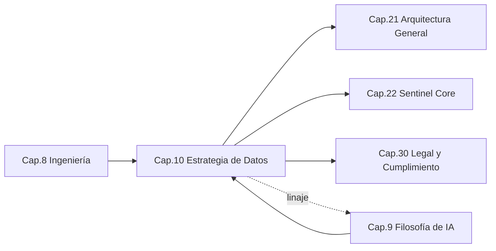
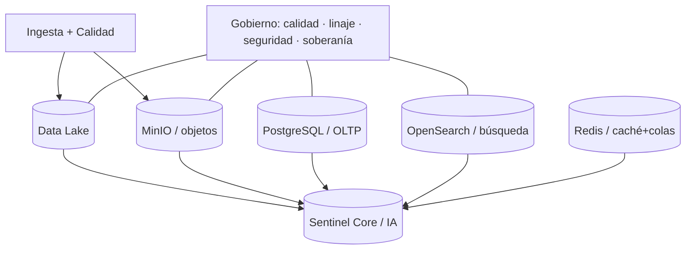

```
════════════════════════════════════════════════════════
  SENTINEL INTELLIGENCE PLATFORM — AI Intelligence Platform
  SENTINEL INTELLIGENCE FOUNDATION v1.0
────────────────────────────────────────────────────────
  Capítulo      : 10 — Estrategia de Datos (Data Foundation)
  Bloque        : II — Filosofía y Tecnología
  Versión       : v1.1
  Fecha         : 2026-08-14
  Estado        : Approved
  Autor         : Comité Fundador de Sentinel Intelligence
  Founder       : Patricio David Fierro (Product Owner principal)
  Confidencial. : CONFIDENCIAL — Uso interno fundacional
════════════════════════════════════════════════════════
```

# CAPÍTULO 10 — Estrategia de Datos (Data Foundation)
### Bloque II — Filosofía y Tecnología

---

## 2. Objetivos del Capítulo

1. Establecer la **estrategia de datos oficial** de Sentinel Intelligence Platform: el stack (Data Lake, PostgreSQL, OpenSearch, Redis, MinIO) y su rol.
2. Definir el **gobierno, la calidad y la trazabilidad (linaje)** del dato desde el diseño.
3. Garantizar la **escalabilidad multi-organización y multi-país** de la capa de datos.
4. Asegurar que **toda decisión de IA pueda rastrear el origen de los datos** utilizados (DT3, refuerza IA4).

---

## 3. Alcance

| Incluye | NO incluye |
|---|---|
| Stack de datos oficial y su arquitectura | El diseño físico/despliegue cloud (Cap. 21) |
| Gobierno, calidad, linaje y ciclo de vida del dato | La filosofía de modelos de IA (Cap. 9, ya cubierta) |
| Multitenancy de datos (multi-org/país) | El modelo de negocio SaaS (Cap. 12) |
| Trazabilidad origen-dato → decisión de IA | Cumplimiento legal detallado (Cap. 30) |

---

## 4. Relación con Otros Capítulos



| Capítulo | Relación |
|---|---|
| Cap. 8 — Ingeniería | **Entrante** — observabilidad y calidad aplicadas al dato |
| Cap. 9 — IA | **Bidireccional** — la IA consume datos; el linaje explica sus decisiones |
| Cap. 21–22 — Arquitectura/Core | **Saliente** — la capa de datos vive en el Core/infra |
| Cap. 30 — Legal | **Saliente** — soberanía, residencia y protección del dato |

---

## 5. Desarrollo Completo

### 5.1 Principios de datos (DT1–DT4)

| # | Principio | Significado |
|---|---|---|
| DT1 | Escalabilidad multi-org/multi-país | La capa de datos aísla y escala por organización y país. |
| DT2 | Gobernanza, calidad y trazabilidad by design | Gobierno, calidad y linaje nativos, no añadidos. |
| DT3 | Trazabilidad del origen para la IA | Toda salida de IA rastrea qué datos usó (linaje E2E). |
| DT4 | Soberanía y residencia | El dato respeta su residencia/protección por jurisdicción. |

### 5.2 Stack de datos oficial y su rol

| Componente | Tecnología | Rol en Sentinel | Tipo de dato |
|---|---|---|---|
| **Data Lake** | Data Lake (sobre MinIO/objetos) | Fuente histórica y analítica; base para IA y modelos. | Histórico, crudo y curado |
| **PostgreSQL** | PostgreSQL | Base transaccional (OLTP): entidades, usuarios, configuración, metadatos. | Operativo/estructurado |
| **OpenSearch** | OpenSearch | Búsqueda, indexación y consulta de texto y documentos. | Índices/búsqueda |
| **Redis** | Redis | Caché de alto rendimiento y **colas** de tareas/mensajes. | Efímero/colas |
| **MinIO** | MinIO (S3-compatible) | Almacenamiento de objetos y archivos (documentos, adjuntos, artefactos). | Archivos/objetos |

### 5.3 Arquitectura de datos (capas)

```
   ┌─────────────────────────────────────────────────────────────┐
   │  CONSUMO:  Sentinel Core (IA) · Módulos · Analítica           │
   ├─────────────────────────────────────────────────────────────┤
   │  SERVICIO: PostgreSQL (OLTP) · OpenSearch (búsqueda) ·         │
   │            Redis (caché/colas)                                │
   ├─────────────────────────────────────────────────────────────┤
   │  ALMACÉN:  Data Lake (histórico curado)  ·  MinIO (objetos)    │
   ├─────────────────────────────────────────────────────────────┤
   │  INGESTA:  fuentes → validación → normalización → linaje       │
   ├─────────────────────────────────────────────────────────────┤
   │  GOBIERNO TRANSVERSAL: calidad · linaje · seguridad ·          │
   │                        soberanía · catálogo de datos          │
   └─────────────────────────────────────────────────────────────┘
```

### 5.4 Flujo del dato (ingesta → consumo → linaje)

```
   Fuente ──► Ingesta ──► Validación/Calidad ──► [Data Lake / MinIO]
                                    │                    │
                                    ▼                    ▼
                             Registro de linaje    Indexación (OpenSearch)
                                    │                    │
                                    ▼                    ▼
                             PostgreSQL (metadatos)  Caché (Redis)
                                    │
                                    ▼
                        Consumo por Sentinel Core (IA)
                                    │
                                    ▼
                 Decisión de IA + explicación con ORIGEN DEL DATO (DT3/IA4)
```

### 5.5 Gobierno, calidad y linaje del dato (DT2, DT3)

| Pilar | Práctica |
|---|---|
| **Catálogo de datos** | Todo dataset registrado (propietario, sensibilidad, retención). |
| **Calidad** | Reglas de validación en ingesta; métricas de calidad monitoreadas. |
| **Linaje (lineage)** | Cada dato conserva su origen y transformaciones; recuperable extremo a extremo. |
| **Seguridad** | Cifrado en tránsito y en reposo; control de acceso por rol y tenant. |
| **Retención** | Políticas por tipo de dato y jurisdicción (mínimo dato necesario, PD3). |

### 5.6 Multitenancy de datos (DT1, DT4)

| Estrategia | Descripción | Uso |
|---|---|---|
| Aislamiento lógico | Separación por `tenant_id` con controles de acceso. | Por defecto, eficiente. |
| Aislamiento físico | Esquemas/instancias separadas por organización. | Clientes de alta exigencia. |
| Residencia por país | Datos alojados según jurisdicción (DT4). | Cumplimiento/soberanía. |

### 5.7 Trazabilidad origen-dato → decisión de IA (DT3 ↔ IA4)

Este es el enlace crítico entre el Bloque de datos y el de IA:

```
   [Dato con linaje] ──► [AI Router / modelo] ──► [Decisión + explicación]
          │                                              │
          └──────────── el linaje se adjunta ────────────┘
        (la explicación de la IA cita el ORIGEN de cada dato usado)
```

Ninguna decisión de IA se considera válida si no puede **rastrear el origen** de los datos que la sustentan.

---

## 6. Diagramas

### 6.1 Mapa stack → rol (Mermaid)



### 6.2 Linaje del dato para explicabilidad (ASCII)

```
   Origen ──► Transformación ──► Almacenamiento ──► Uso por IA ──► Decisión
     │             │                  │                │             │
     └─────────────┴──── LINAJE REGISTRADO (auditable) ┴─────────────┘
                     "¿de dónde salió este dato?"  → siempre respondible
```

---

## 7. Tablas Comparativas

### 7.1 Rol de cada tecnología (evitar solapamientos)

| Necesidad | Tecnología oficial | Por qué (no otra) |
|---|---|---|
| Histórico/analítico masivo | Data Lake | No saturar OLTP con analítica |
| Transaccional/consistencia | PostgreSQL | ACID, relaciones, integridad |
| Búsqueda de texto/documentos | OpenSearch | Índices invertidos, relevancia |
| Caché/colas/baja latencia | Redis | Velocidad en memoria |
| Archivos/objetos | MinIO | S3-compatible, escalable |

### 7.2 Enfoque "datos como subproducto" vs. "Data Foundation"

| Criterio | Datos como subproducto | Data Foundation (Sentinel) |
|---|---|---|
| Gobierno | Ad-hoc | By design |
| Linaje | Inexistente | Extremo a extremo |
| Escalabilidad multi-país | Difícil | Nativa (DT1/DT4) |
| Explicabilidad de IA | Limitada | Sustentada en linaje (DT3) |

---

## 8. Buenas Prácticas

1. **Un rol por tecnología:** no usar OpenSearch como base transaccional ni PostgreSQL como Data Lake.
2. **Linaje obligatorio en la ingesta:** ningún dato entra sin registrar su origen.
3. **Calidad antes de consumo:** validar en ingesta, no al momento de decidir.
4. **Tenant y residencia explícitos** en cada dataset (DT1/DT4).
5. **Catálogo de datos vivo** como fuente de verdad de gobierno.

---

## 9. Riesgos

| ID | Riesgo | Prob. | Impacto | Mitigación |
|---|---|---|---|---|
| R10-1 | Decisiones de IA sin origen rastreable | Media | Alto | Linaje obligatorio (DT3) + AI Trace Log (IA4) |
| R10-2 | Mala calidad del dato contamina la IA | Media | Alto | Validación en ingesta + métricas de calidad |
| R10-3 | Fuga o mezcla de datos entre tenants | Media | Alto | Aislamiento por tenant + control de acceso |
| R10-4 | Incumplimiento de residencia/soberanía | Media | Alto | Residencia por país (DT4) + Cap. 30 |
| R10-5 | Uso incorrecto de la tecnología (solapamiento) | Media | Medio | Roles claros por componente (§7.1) |
| R10-6 | Costos de almacenamiento sin control | Baja | Medio | Políticas de retención + mínimo dato (PD3) |

---

## 10. Recomendaciones

1. Ratificar el **stack oficial** y los principios **DT1–DT4** (ya incorporados en `00-PRINCIPIOS-FUNDACIONALES.md` §7).
2. Implementar el **catálogo de datos y el registro de linaje** como servicios del Core.
3. Adoptar **aislamiento por tenant** por defecto, con opción de aislamiento físico/residencia.
4. Definir **políticas de calidad y retención** por tipo de dato y jurisdicción.
5. Conectar el **linaje del dato con el artefacto de explicación** de la IA (DT3 ↔ IA4).

---

## 11. Architecture Decision Records (ADR)

### ADR-010-01 — Stack de datos oficial (Data Lake, PostgreSQL, OpenSearch, Redis, MinIO)
- **Contexto:** Se requiere un stack estándar, con roles claros y sin solapamientos.
- **Decisión:** Adoptar **Data Lake** (histórico), **PostgreSQL** (OLTP), **OpenSearch** (búsqueda), **Redis** (caché/colas) y **MinIO** (objetos) como stack oficial.
- **Estado:** Aprobada (fundacional).
- **Consecuencias:** (+) Claridad y estandarización; (−) requiere operar y coordinar varios sistemas.
- **Principios aplicados:** DT1, DT2.

### ADR-010-02 — Linaje del dato obligatorio y trazable hasta la decisión de IA
- **Contexto:** DT3 exige rastrear el origen de los datos de toda decisión de IA.
- **Decisión:** Todo dato conserva **linaje extremo a extremo**, y la explicación de la IA cita el origen de los datos usados.
- **Estado:** Aprobada.
- **Consecuencias:** (+) Explicabilidad real y auditable; (−) sobrecarga de metadatos y almacenamiento.
- **Principios aplicados:** DT2, DT3, IA4.

### ADR-010-03 — Multitenancy con aislamiento por tenant y residencia por país
- **Contexto:** La plataforma debe escalar a múltiples organizaciones y países (DT1/DT4).
- **Decisión:** **Aislamiento lógico por `tenant_id`** por defecto, con opción de aislamiento físico y **residencia por jurisdicción**.
- **Estado:** Aprobada.
- **Consecuencias:** (+) Escalabilidad y cumplimiento; (−) complejidad operativa por opciones de aislamiento.
- **Principios aplicados:** DT1, DT4.

---

## 12. Pendientes

| ID | Pendiente | Responsable sugerido | Depende de |
|---|---|---|---|
| P10-1 | Diseñar el esquema de linaje y el catálogo de datos | Data Scientist / Chief Architect | Cap. 22 |
| P10-2 | Definir políticas de calidad y retención por tipo/jurisdicción | Data Scientist / Legal | Cap. 30 |
| P10-3 | Especificar el modelo de multitenancy físico vs. lógico | Cloud Architect | Cap. 21 |
| P10-4 | Integrar linaje del dato con el artefacto de explicación de IA | Chief AI Officer | Cap. 9, 22 |

---

## 13. Referencias Cruzadas

- **`00-PRINCIPIOS-FUNDACIONALES.md` §7:** stack de datos y principios DT1–DT4.
- **Cap. 8 — Ingeniería:** calidad y observabilidad aplicadas al dato.
- **Cap. 9 — IA:** el linaje (DT3) sustenta la explicabilidad (IA1/IA4).
- **Cap. 21–22 — Arquitectura/Core:** hogar de la capa de datos y el catálogo.
- **Cap. 30 — Legal:** soberanía, residencia y protección del dato.

---

## 14. Historial de Cambios

| Versión | Fecha | Cambio | Autor |
|---|---|---|---|
| v1.0 | 2026-08-14 | Creación del Capítulo 10 (Estrategia de Datos) con stack oficial y principios DT1–DT4. | Comité Fundador |
| v1.1 | 2026-08-14 | Capítulo **Approved** por el Product Owner. ADR-010-01…03 ratificados. Cierre del Bloque II. | Patricio David Fierro |

---

## 15. Estado del Documento

Draft → Review → **Approved**

*Estado actual: **Approved** por el Product Owner (2026-08-14). Con esta aprobación se cierra el **Bloque II — Filosofía y Tecnología (v1.0)**.*

---

## 16. Versión

**v1.1** — capítulo aprobado.

---

## 17. Impacto en Sentinel Core

| Decisión del capítulo | Impacto en la arquitectura de Sentinel Core |
|---|---|
| Stack de datos oficial (ADR-010-01) | El Core se apoya en una **capa de datos estandarizada** (Data Lake, PostgreSQL, OpenSearch, Redis, MinIO) con roles definidos. |
| Linaje obligatorio (ADR-010-02) | El Core integra un **servicio de linaje y catálogo** que acompaña cada dato hasta la decisión de IA. |
| Multitenancy y residencia (ADR-010-03) | El Core opera con **contexto de tenant y jurisdicción** en cada operación de dato. |
| Gobierno/calidad by design (DT2) | El Core incorpora **validación de calidad y controles de gobierno** como servicios transversales. |
| Trazabilidad origen→IA (DT3 ↔ IA4) | El **artefacto de explicación** de la IA se enriquece con el **origen de los datos**; sin linaje no hay decisión válida. |

**Síntesis:** la Data Foundation dota al Sentinel Core de su **base de datos y gobierno**: un stack estandarizado, multitenant y con residencia por país, donde el **linaje del dato es la pieza que cierra el círculo de explicabilidad** — toda decisión de IA puede rastrear de dónde provino cada dato. Con esto, el Bloque II queda completo (Ingeniería + IA + Datos).

---

*Fin del Capítulo 10 — Estrategia de Datos (Data Foundation).*
