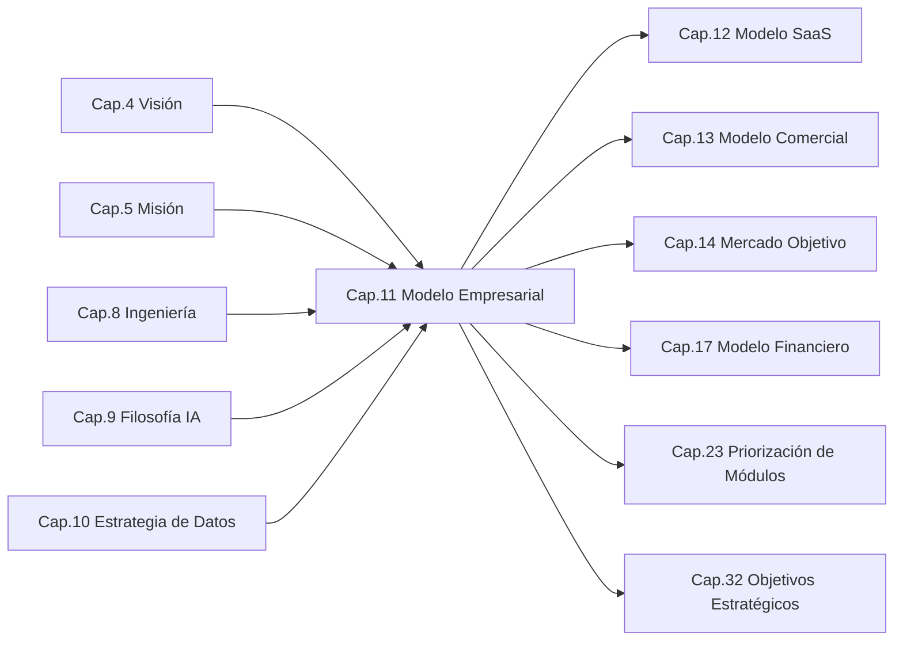
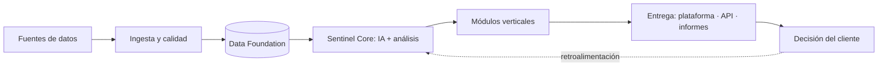
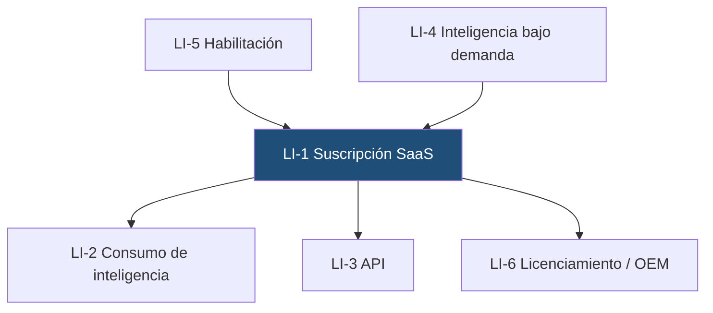
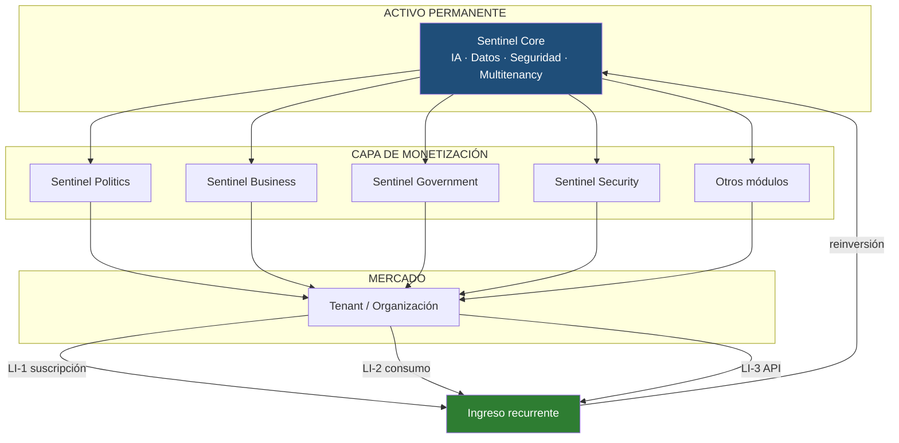

```
════════════════════════════════════════════════════════
  SENTINEL INTELLIGENCE PLATFORM — AI Intelligence Platform
  SENTINEL INTELLIGENCE FOUNDATION v1.0
────────────────────────────────────────────────────────
  Capítulo      : 11 — Modelo Empresarial
  Bloque        : III — Negocio y Mercado
  Versión       : v1.0
  Fecha         : 2026-08-14
  Estado        : Draft
  Autor         : Comité Fundador de Sentinel Intelligence
  Founder       : Patricio David Fierro (Product Owner principal)
  Confidencial. : CONFIDENCIAL — Uso interno fundacional
════════════════════════════════════════════════════════
```

# CAPÍTULO 11 — Modelo Empresarial
### Bloque III — Negocio y Mercado

---

## 2. Objetivos del Capítulo

1. Definir **qué tipo de empresa es Sentinel Intelligence**: una **empresa de plataforma** (*platform company*), no una consultora ni una fábrica de proyectos a medida.
2. Establecer la **lógica económica fundacional**: cómo la arquitectura Core + Módulos se traduce en un modelo de negocio escalable y repetible.
3. Definir el **modelo operativo** (capacidades empresariales, cadena de valor, roles) que sostiene la plataforma.
4. Establecer las **líneas de ingreso oficiales** y su jerarquía, dejando el detalle de empaquetado y precios a los Capítulos 12 y 13.
5. Fijar las **reglas de negocio inmutables** que impiden que la empresa derive hacia un modelo de servicios no escalable.

---

## 3. Alcance

| Incluye | NO incluye |
|---|---|
| Naturaleza y tipo de empresa (empresa de plataforma) | Empaquetado, planes y tiers SaaS (Cap. 12) |
| Lógica económica Core + Módulos | Política de precios, descuentos y canales (Cap. 13) |
| Cadena de valor y capacidades empresariales | Segmentación y tamaño de mercado (Cap. 14) |
| Líneas de ingreso oficiales y su jerarquía | Propuesta de valor por segmento (Cap. 15) |
| Modelo operativo y de entrega (delivery) | Proyecciones financieras y unit economics detallados (Cap. 17) |
| Reglas de negocio inmutables y anti-patrones | Estructura societaria, legal y fiscal (Cap. 30) |
| Ecosistema de socios y partners | Organigrama y plan de talento (Cap. 31) |

---

## 4. Relación con Otros Capítulos



| Capítulo | Relación | Naturaleza |
|---|---|---|
| Cap. 4–5 — Visión y Misión | El modelo empresarial es el **vehículo económico** de la visión. | Entrante |
| Cap. 8 — Ingeniería | La modularidad y el API First **habilitan** la economía de plataforma. | Entrante |
| Cap. 9 — Filosofía de IA | La agnosticidad de proveedor y el AI Router son **palancas de margen**. | Entrante |
| Cap. 10 — Estrategia de Datos | La multitenancy (`tenant_id`) es el **fundamento técnico del SaaS**. | Entrante |
| Cap. 12 — Modelo SaaS | Traduce este modelo a **planes y empaquetado**. | Saliente |
| Cap. 13 — Modelo Comercial | Traduce este modelo a **precios y canales**. | Saliente |
| Cap. 17 — Modelo Financiero | Cuantifica las líneas de ingreso aquí definidas. | Saliente |
| Cap. 23 — Priorización de Módulos | El orden de construcción responde a esta lógica económica. | Saliente |

---

## 5. Desarrollo Completo

### 5.1 Naturaleza de la empresa: qué es y qué no es Sentinel Intelligence

Sentinel Intelligence es una **empresa de plataforma de software con inteligencia artificial**. Su activo principal no son las horas de sus especialistas, sino **Sentinel Core**: un motor de inteligencia construido una vez y monetizado muchas veces a través de módulos verticales.

| Sentinel Intelligence **ES** | Sentinel Intelligence **NO ES** |
|---|---|
| Empresa de plataforma (producto) | Consultora por horas |
| Motor reutilizable (Core) + módulos verticales | Fábrica de desarrollos a medida |
| Ingresos recurrentes por suscripción | Ingresos por proyecto no repetible |
| Multi-industria desde el diseño | Empresa de nicho político |
| Multi-tenant sobre infraestructura compartida | Instalaciones aisladas por cliente como norma |
| Proveedora de inteligencia explicable | Proveedora de dashboards |

> **Regla fundacional del bloque:** todo ingreso que no sea repetible o que no fortalezca el Core es, por definición, **excepcional** y debe justificarse.

### 5.2 La lógica económica: Core construido una vez, monetizado N veces

El modelo empresarial es una consecuencia directa de la arquitectura aprobada en el Bloque II. La modularidad no es solo una decisión técnica: **es la decisión económica central de la empresa**.

```
   INVERSIÓN                        MONETIZACIÓN
   ─────────                        ────────────
                                 ┌──► Sentinel Politics    ─┐
                                 │                          │
   ┌───────────────┐             ├──► Sentinel Business    ─┤
   │ SENTINEL CORE │  ──────────►├──► Sentinel Government  ─┼──► INGRESO
   │  (una vez)    │             ├──► Sentinel Security    ─┤    RECURRENTE
   └───────────────┘             ├──► Sentinel Media       ─┤
      Costo mayoritario          └──► Sentinel Research    ─┘
      y decreciente                  Costo marginal
      por módulo                     por módulo

   Cada módulo nuevo cuesta MENOS que el anterior
   y amplía el mercado direccionable SIN rehacer el motor.
```

**Consecuencias económicas:**

| Efecto | Descripción |
|---|---|
| **Costo marginal decreciente** | El módulo *n+1* reutiliza ingesta, IA, datos, seguridad y multitenancy del Core. |
| **Mercado direccionable creciente** | Cada módulo abre una industria completa sin cambiar el motor. |
| **Aprendizaje compartido** | Toda mejora del Core beneficia simultáneamente a todos los módulos y clientes. |
| **Riesgo de concentración reducido** | La empresa no depende de un solo vertical ni de un ciclo electoral. |

### 5.3 Cadena de valor de Sentinel Intelligence



| Eslabón | Qué aporta | Dónde se captura el valor |
|---|---|---|
| Ingesta y calidad | Convierte datos dispersos en insumo confiable | Barrera de entrada operativa |
| Data Foundation | Histórico, linaje y gobierno del dato | Activo acumulativo (Cap. 10) |
| Sentinel Core | Análisis con IA explicable | **Núcleo de la propuesta y del margen** |
| Módulos verticales | Contexto e interpretación por industria | Punto de cobro y diferenciación |
| Entrega | Plataforma, API e informes ejecutivos | Experiencia y retención |
| Decisión del cliente | Resultado real de negocio | Justificación de la renovación |

> El valor no se captura en el dato ni en el dashboard: se captura en la **capacidad de decidir mejor con respaldo explicable**.

### 5.4 Capacidades empresariales (business capability map)

```
┌──────────────────────────────────────────────────────────────────┐
│  CAPACIDADES ESTRATÉGICAS                                         │
│  Visión de producto · Arquitectura empresarial · Gobierno de IA   │
├──────────────────────────────────────────────────────────────────┤
│  CAPACIDADES NUCLEARES (fuente de ventaja competitiva)            │
│  Ingeniería de plataforma · IA aplicada y explicable ·            │
│  Ingeniería de datos y linaje · Seguridad y multitenancy          │
├──────────────────────────────────────────────────────────────────┤
│  CAPACIDADES DE MERCADO                                           │
│  Producto vertical · Comercial y alianzas · Customer Success ·    │
│  Marca y comunicación                                             │
├──────────────────────────────────────────────────────────────────┤
│  CAPACIDADES DE SOPORTE                                           │
│  Finanzas · Legal y cumplimiento · Talento · Operaciones/Cloud    │
└──────────────────────────────────────────────────────────────────┘
```

| Capa | Regla de decisión |
|---|---|
| Estratégicas | **Nunca se externalizan.** Residen en el Comité Fundador y el Founder. |
| Nucleares | **Se construyen internamente.** Son la ventaja competitiva de la empresa. |
| De mercado | Se construyen internamente; pueden **apalancarse en socios**. |
| De soporte | **Externalizables** cuando sea más eficiente. |

### 5.5 Líneas de ingreso oficiales

| # | Línea de ingreso | Descripción | Recurrencia | Prioridad |
|---|---|---|---|---|
| **LI-1** | **Suscripción a módulos (SaaS)** | Acceso recurrente por organización y módulo. | Alta (MRR/ARR) | **Principal** |
| **LI-2** | **Consumo de inteligencia** | Componente variable por uso intensivo de IA/análisis. | Media-alta | Complementaria |
| **LI-3** | **API y acceso programático** | Consumo de las APIs de Sentinel por sistemas del cliente. | Alta | Complementaria |
| **LI-4** | **Inteligencia bajo demanda** | Informes y estudios estratégicos producidos sobre la plataforma. | Baja | Táctica |
| **LI-5** | **Habilitación e integración** | Onboarding, integración de fuentes y capacitación. | Única | Habilitadora |
| **LI-6** | **Licenciamiento / OEM** | Uso del Core o de módulos por terceros bajo acuerdo. | Media | Futura |

**Jerarquía obligatoria:** LI-1 debe constituir la mayoría de los ingresos en régimen. LI-4 y LI-5 son **puertas de entrada** al SaaS, no el negocio en sí.



### 5.6 Modelo operativo y de entrega

| Dimensión | Definición oficial |
|---|---|
| **Modelo de entrega** | SaaS multi-tenant en la nube (Cloud Ready, Cap. 8), con opción de aislamiento reforzado o residencia por país (DT4, Cap. 10) para clientes de alta exigencia. |
| **Unidad de venta** | La **organización (tenant)**, suscrita a uno o más módulos. |
| **Unidad de entrega** | El **módulo**, construido sobre Sentinel Core. |
| **Unidad de producto** | El **Core**, evolucionado de forma continua y compartida. |
| **Modelo de soporte** | Escalonado según plan (definición en Cap. 12). |
| **Modelo de personalización** | Configuración, no bifurcación de código. Toda necesidad recurrente se **absorbe como capacidad del Core**. |

> **Regla de absorción:** si una necesidad de cliente aparece **dos veces**, deja de ser un desarrollo a medida y se convierte en un **requerimiento de producto**.

### 5.7 Motores de crecimiento

| Motor | Mecanismo | Efecto |
|---|---|---|
| **Expansión vertical** | Nuevos módulos sobre el mismo Core | Amplía el mercado direccionable |
| **Expansión horizontal** | Nuevos países sobre la misma plataforma | Escala geográfica (Ecuador → LATAM → global) |
| **Expansión intra-cuenta** | El cliente suma módulos, usuarios o consumo | Crecimiento sin costo de adquisición nuevo |
| **Efecto de datos** | Más uso → mejor Data Foundation → mejor inteligencia | Ventaja competitiva acumulativa |
| **Efecto de ecosistema** | API abierta → integradores y socios construyen sobre Sentinel | Distribución apalancada |

### 5.8 Ecosistema de socios

| Tipo de socio | Rol | Aporte a la empresa |
|---|---|---|
| Integradores/consultoras | Implementación y adopción local | Escala comercial sin plantilla propia |
| Socios de datos | Provisión de fuentes especializadas | Enriquecimiento de la Data Foundation |
| Academia e investigación | Validación metodológica y talento | Rigor, credibilidad y cantera |
| Socios tecnológicos (cloud/IA) | Infraestructura y modelos | Capacidad técnica; **nunca dependencia única** (IA3) |

### 5.9 Reglas de negocio inmutables (RN)

| # | Regla | Justificación |
|---|---|---|
| **RN1** | El **Core es el activo**; los módulos son la forma de monetizarlo. | Preserva la economía de plataforma. |
| **RN2** | El ingreso **recurrente** prima sobre el ingreso puntual. | Sostenibilidad y valoración de la empresa. |
| **RN3** | **No se bifurca el producto por cliente.** | Evita deuda estructural y pérdida de margen. |
| **RN4** | Ninguna venta puede exigir **violar los principios de IA (IA1–IA8) ni de datos (DT1–DT4)**. | La ética no es negociable por ingreso. |
| **RN5** | Ningún cliente ni proveedor puede volverse **indispensable**. | Independencia estratégica (IA3). |
| **RN6** | El servicio profesional existe **para habilitar la plataforma**, no para sustituirla. | Impide la deriva a consultora. |

### 5.10 Anti-patrones del modelo empresarial

| Anti-patrón | Síntoma observable | Contramedida |
|---|---|---|
| **Deriva a consultora** | Los servicios superan sostenidamente a la suscripción | Límite explícito y revisión trimestral (RN6) |
| **Fábrica de forks** | Versiones distintas del producto por cliente | Configuración sobre bifurcación (RN3) |
| **Dependencia de un vertical** | Un solo módulo concentra los ingresos | Priorización deliberada de módulos (Cap. 23) |
| **Dependencia de un cliente ancla** | Un cliente concentra una porción crítica del ARR | Diversificación de cartera (RN5) |
| **Cautiverio de proveedor de IA** | El producto no funciona sin un modelo específico | Arquitectura agnóstica + AI Router (IA3, IA6) |
| **Crecimiento sin margen** | El costo de IA crece más rápido que el ingreso | AI Router y control de consumo (Cap. 17) |

---

## 6. Diagramas

### 6.1 Modelo empresarial integral (Mermaid)



### 6.2 Ciclo de reinversión (ASCII)

```
        ┌──────────────────────────────────────────────┐
        │                                              │
        ▼                                              │
   ┌─────────┐    ┌──────────┐    ┌──────────┐    ┌────────┐
   │  CORE   │──► │ MÓDULOS  │──► │ CLIENTES │──► │ INGRESO│
   │ mejora  │    │ nuevos   │    │ nuevos   │    │  ARR   │
   └─────────┘    └──────────┘    └──────────┘    └────────┘
        ▲                                              │
        │            reinversión en el Core            │
        └──────────────────────────────────────────────┘

   Cada vuelta del ciclo abarata el módulo siguiente
   y encarece la réplica por parte de un competidor.
```

### 6.3 Modelo de negocio en una página (Canvas ejecutivo)

| Bloque | Definición Sentinel |
|---|---|
| **Propuesta de valor** | Transformar datos dispersos en **decisiones explicables** (detalle en Cap. 15). |
| **Segmentos** | Organizaciones que deciden bajo incertidumbre: política, empresa, gobierno, seguridad (Cap. 14). |
| **Canales** | Venta directa consultiva · Alianzas e integradores · API/autoservicio (Cap. 13). |
| **Relación con el cliente** | Suscripción con acompañamiento; Customer Success orientado a decisiones logradas. |
| **Ingresos** | LI-1 a LI-6, con predominio de LI-1. |
| **Recursos clave** | Sentinel Core · Data Foundation · talento de IA e ingeniería · marca. |
| **Actividades clave** | Evolución del Core · construcción de módulos · gobierno de datos e IA. |
| **Socios clave** | Integradores · socios de datos · academia · proveedores cloud/IA. |
| **Estructura de costos** | Ingeniería y talento · infraestructura cloud · **consumo de modelos de IA** · adquisición de clientes. |

---

## 7. Tablas Comparativas

### 7.1 Modelos empresariales evaluados

| Criterio | Consultora de análisis | Software a medida | **Plataforma SaaS modular (elegido)** |
|---|---|---|---|
| Escalabilidad | Lineal con el personal | Baja | **Alta (costo marginal decreciente)** |
| Recurrencia del ingreso | Baja | Baja | **Alta (ARR)** |
| Reutilización tecnológica | Nula | Parcial | **Total (Core compartido)** |
| Valoración de la empresa | Múltiplo bajo | Múltiplo bajo | **Múltiplo alto (SaaS)** |
| Barrera de entrada creada | Reputacional | Contractual | **Tecnológica + datos + marca** |
| Riesgo de dependencia | Alto (personas clave) | Alto (clientes clave) | **Distribuido** |
| Velocidad de entrada a mercado | Muy alta | Alta | Media (requiere construir el Core) |
| Coherencia con Visión y Misión | Parcial | Baja | **Total** |

**Conclusión:** se adopta el **modelo de plataforma SaaS modular**, asumiendo conscientemente su menor velocidad inicial a cambio de escalabilidad, recurrencia y coherencia con la Visión.

### 7.2 Perfil económico de cada línea de ingreso

| Línea | Margen esperado | Escalabilidad | Esfuerzo humano | Rol estratégico |
|---|---|---|---|---|
| LI-1 Suscripción | Alto | Alta | Bajo | **Motor del negocio** |
| LI-2 Consumo | Medio-alto | Alta | Muy bajo | Expansión de cuenta |
| LI-3 API | Alto | Muy alta | Muy bajo | Ecosistema |
| LI-4 Inteligencia bajo demanda | Medio | Baja | Alto | Entrada y credibilidad |
| LI-5 Habilitación | Bajo-medio | Baja | Alto | Habilitador de LI-1 |
| LI-6 Licenciamiento/OEM | Alto | Alta | Bajo | Palanca futura |

### 7.3 Módulo propio vs. desarrollo por socio

| Criterio | Módulo propio | Módulo de socio sobre API |
|---|---|---|
| Control de calidad y marca | Total | Parcial |
| Velocidad de cobertura de mercado | Menor | Mayor |
| Captura de margen | Total | Compartida |
| Riesgo de dispersión | Bajo | Medio |
| **Regla Sentinel** | **Módulos estratégicos: siempre propios** | **Verticales periféricos: elegibles vía socio** |

---

## 8. Buenas Prácticas

1. **Medir el negocio por recurrencia**, no por facturación puntual: ARR, retención neta y expansión de cuenta como métricas rectoras.
2. **Proteger el Core de la presión comercial:** ninguna oportunidad de venta justifica fragmentar el producto.
3. **Convertir cada servicio en producto:** todo trabajo manual repetido dos veces es un requerimiento de plataforma pendiente.
4. **Vigilar el costo de IA como costo de mercadería vendida (COGS)**, no como gasto de I+D: el margen del SaaS depende de ello.
5. **Priorizar módulos por retorno y reutilización del Core**, no por atractivo coyuntural (Cap. 23).
6. **Diversificar deliberadamente** clientes, verticales y proveedores de IA desde el inicio.
7. **Documentar toda excepción comercial** como decisión trazable, con fecha de revisión.

---

## 9. Riesgos

| ID | Riesgo | Prob. | Impacto | Mitigación |
|---|---|---|---|---|
| R11-1 | Deriva hacia consultora por presión de caja temprana | **Alta** | Alto | RN6 + límite explícito de servicios sobre ingreso total; revisión trimestral |
| R11-2 | Personalizaciones por cliente que fragmentan el producto | Alta | Alto | RN3 + regla de absorción (§5.6) + gobierno de producto |
| R11-3 | Concentración de ingresos en un solo módulo o cliente ancla | Media | Alto | RN5 + priorización de módulos (Cap. 23) + diversificación de cartera |
| R11-4 | Costo de inferencia de IA erosiona el margen bruto | **Alta** | Alto | AI Router (IA6) + control de consumo + LI-2 vinculada al uso |
| R11-5 | Ciclo de venta largo en sector público retrasa el ARR | Alta | Medio | Mezcla de segmentos privados + LI-4/LI-5 como entrada |
| R11-6 | Competidor global entra al mercado inicial | Media | Alto | Contexto local, cumplimiento y explicabilidad como diferenciación (Cap. 16) |
| R11-7 | Sobreextensión: demasiados módulos antes de madurar el Core | Media | Alto | Secuenciación estricta de módulos (Cap. 23) |
| R11-8 | Dependencia de un proveedor de IA con cambio de precios | Media | Alto | Arquitectura agnóstica (IA3) + capacidad real de conmutación |
| R11-9 | Modelo mal comprendido internamente y ejecutado como servicios | Media | Medio | Este capítulo como referencia obligatoria en decisiones comerciales |

---

## 10. Recomendaciones

1. **Ratificar el modelo de plataforma SaaS modular** como modelo empresarial oficial e inmutable de Sentinel Intelligence.
2. **Adoptar las reglas RN1–RN6** como criterio de decisión comercial obligatorio, invocable ante cualquier oportunidad de negocio.
3. **Establecer un umbral de vigilancia** para la proporción de ingresos por servicios (LI-4/LI-5) sobre el total, a cuantificar en el Cap. 17.
4. **Tratar el costo de IA como COGS** desde el primer día, con medición por tenant y por módulo.
5. **Definir el catálogo oficial de módulos y su secuencia** en el Cap. 23, aplicando el criterio de reutilización del Core.
6. **Instrumentar métricas de negocio desde el Core** (uso por tenant, consumo de IA, módulos activos) para habilitar el modelo financiero del Cap. 17.
7. **Revisar este capítulo anualmente**, o ante cualquier cambio estructural del mercado o de la tecnología de IA.

---

## 11. Architecture Decision Records (ADR)

### ADR-011-01 — Modelo empresarial oficial: plataforma SaaS modular
- **Contexto:** La empresa puede monetizarse como consultora, como software a medida o como plataforma. La arquitectura aprobada (Core + módulos, API First, multitenancy) apunta inequívocamente a plataforma, pero la presión de caja temprana empuja hacia servicios.
- **Decisión:** Adoptar el **modelo de empresa de plataforma SaaS modular multi-tenant** como modelo empresarial oficial. Los servicios profesionales existen únicamente como **habilitadores** de la suscripción.
- **Alternativas descartadas:** consultora de análisis (no escala); software a medida (sin reutilización ni recurrencia).
- **Estado:** Propuesta (fundacional) — pendiente de aprobación del Product Owner.
- **Consecuencias:** (+) Escalabilidad, recurrencia, valoración alta, coherencia con Visión y Misión; (−) mayor inversión inicial y retorno más lento antes de que el Core madure.
- **Principios aplicados:** Arquitectura modular · API First · Multitenancy (DT1).

### ADR-011-02 — El Core es el activo; los módulos son la unidad de monetización
- **Contexto:** Es necesario definir dónde reside el valor de la empresa y qué se le vende al cliente.
- **Decisión:** **Sentinel Core** es el activo permanente y no se comercializa de forma aislada por defecto; el cliente adquiere **módulos** sobre una organización (**tenant**). La inversión se concentra en el Core y se recupera vía módulos.
- **Estado:** Propuesta (fundacional).
- **Consecuencias:** (+) Costo marginal decreciente por módulo y aprendizaje compartido; (−) exige disciplina para no ceder el Core en negociaciones puntuales.
- **Principios aplicados:** Sentinel Core como núcleo permanente · Arquitectura modular.

### ADR-011-03 — Prohibición de bifurcar el producto por cliente (configuración sobre personalización)
- **Contexto:** Las personalizaciones por cliente son la causa más frecuente de que una plataforma degenere en fábrica de proyectos.
- **Decisión:** **No se bifurca el código por cliente.** Toda necesidad se resuelve por **configuración**; si una necesidad se repite dos veces, se absorbe como **requerimiento de producto** del Core o del módulo.
- **Estado:** Propuesta (fundacional).
- **Consecuencias:** (+) Producto único, margen y mantenibilidad preservados; (−) se perderán oportunidades puntuales que exijan un producto distinto.
- **Principios aplicados:** Filosofía de Ingeniería (Cap. 8) · RN3.

### ADR-011-04 — Jerarquía de líneas de ingreso con predominio de la suscripción
- **Contexto:** La empresa puede facturar por suscripción, consumo, API, informes, habilitación y licenciamiento. Sin jerarquía explícita, el ingreso puntual desplaza al recurrente.
- **Decisión:** Establecer las líneas **LI-1 a LI-6** con **LI-1 (suscripción) como línea principal**; LI-4 y LI-5 se consideran **puertas de entrada** y no fines en sí mismos. El umbral cuantitativo se fija en el Cap. 17.
- **Estado:** Propuesta (fundacional).
- **Consecuencias:** (+) Protege el carácter recurrente del negocio y su valoración; (−) puede exigir rechazar ingresos inmediatos que no conduzcan a suscripción.
- **Principios aplicados:** RN2 · RN6.

---

## 12. Pendientes

| ID | Pendiente | Responsable sugerido | Depende de |
|---|---|---|---|
| P11-1 | Fijar el umbral máximo de ingresos por servicios (LI-4/LI-5) sobre el total | Founder / Finanzas | Cap. 17 |
| P11-2 | Definir el empaquetado y los planes que materializan LI-1 | Chief Product Officer | Cap. 12 |
| P11-3 | Definir política de precios, canales y descuentos | Dirección Comercial | Cap. 13 |
| P11-4 | Cuantificar unit economics: CAC, LTV, margen bruto por módulo | Finanzas | Cap. 17 |
| P11-5 | Definir el criterio formal de priorización y secuencia de módulos | Chief Enterprise Architect | Cap. 23 |
| P11-6 | Definir el marco contractual del programa de socios y del licenciamiento (LI-6) | Legal | Cap. 30 |
| P11-7 | Instrumentar en el Core las métricas de negocio por tenant y módulo | Chief Architect | Cap. 22 |

---

## 13. Referencias Cruzadas

- **`00-PRINCIPIOS-FUNDACIONALES.md`:** arquitectura modular Core + módulos; mercado Ecuador → LATAM → global; §6 doctrina de IA (IA1–IA8); §7 stack y principios de datos (DT1–DT4).
- **Cap. 4 — Visión / Cap. 5 — Misión:** finalidad que este modelo debe financiar.
- **Cap. 8 — Filosofía de Ingeniería:** modularidad y API First como habilitadores económicos.
- **Cap. 9 — Filosofía de IA:** IA3 (agnosticidad) e IA6 (AI Router) como palancas de margen.
- **Cap. 10 — Estrategia de Datos:** multitenancy por `tenant_id` (DT1) y residencia (DT4) como base del SaaS.
- **Cap. 12 — Modelo SaaS:** empaquetado y planes derivados de LI-1.
- **Cap. 13 — Modelo Comercial:** precios y canales.
- **Cap. 14–15 — Mercado y Propuesta de Valor:** a quién y con qué argumento.
- **Cap. 16–17 — Competencia y Finanzas:** contraste competitivo y cuantificación.
- **Cap. 23 — Priorización de Módulos:** secuencia de monetización del Core.
- **Cap. 32 — Objetivos Estratégicos:** metas que traducen este modelo en resultados.

---

## 14. Historial de Cambios

| Versión | Fecha | Cambio | Autor |
|---|---|---|---|
| v1.0 | 2026-08-14 | Creación del Capítulo 11 (Modelo Empresarial). Apertura del Bloque III. Define naturaleza de empresa de plataforma, lógica Core + Módulos, cadena de valor, capacidades, líneas de ingreso LI-1…LI-6, reglas RN1–RN6 y ADR-011-01…04. | Comité Fundador |

---

## 15. Estado del Documento

**Draft** → Review → Approved

*Estado actual: **Draft** (pendiente de revisión y aprobación del Product Owner).*

---

## 16. Versión

**v1.0** — versión inicial del capítulo.

---

## 17. Impacto en Sentinel Core

| Decisión del capítulo | Impacto en la arquitectura de Sentinel Core |
|---|---|
| Plataforma SaaS modular (ADR-011-01) | El Core debe ser **operable como servicio multi-tenant**: aprovisionamiento de tenants, aislamiento, ciclo de vida de suscripciones y activación/desactivación de módulos por organización. |
| Core como activo, módulos como monetización (ADR-011-02) | Refuerza la **frontera arquitectónica** Core ↔ módulo: el Core no puede contener lógica de un vertical concreto; cada módulo se acopla mediante contratos de API estables. |
| Prohibición de bifurcar por cliente (ADR-011-03) | El Core requiere una **capa de configuración por tenant** suficientemente expresiva (parámetros, reglas, taxonomías, marca) para absorber la variabilidad sin ramas de código. |
| Jerarquía de líneas de ingreso (ADR-011-04) | El Core debe **medir el consumo**: uso por tenant, por módulo y por operación de IA, como insumo de facturación (LI-2), de control de margen y del modelo financiero. |
| Costo de IA como COGS (§5.10, R11-4) | Eleva el **AI Router** (IA6) de optimización técnica a **control económico**: la selección de modelo impacta directamente el margen bruto. |
| Expansión geográfica y multi-módulo (§5.7) | Confirma la necesidad de **residencia por país** (DT4) y de un catálogo de módulos activable por tenant sin redespliegue. |
| Ecosistema y API (LI-3, §5.8) | Las APIs dejan de ser un detalle de integración y pasan a ser **producto vendible**: exigen versionado, cuotas, medición y documentación OpenAPI de nivel comercial. |

**Síntesis:** el Modelo Empresarial confirma que **Sentinel Core no es solo un motor técnico: es el activo económico de la empresa**. Toda decisión de arquitectura sobre el Core es, simultáneamente, una decisión de margen, de escalabilidad y de valoración. En consecuencia, el Core debe incorporar de forma nativa tres capacidades que este capítulo vuelve obligatorias: **gestión de tenants y suscripciones**, **configuración por tenant sin bifurcación de código** y **medición de consumo de inteligencia**. Sin ellas, el modelo de plataforma no es ejecutable.

---

*Fin del Capítulo 11 — Modelo Empresarial.*
