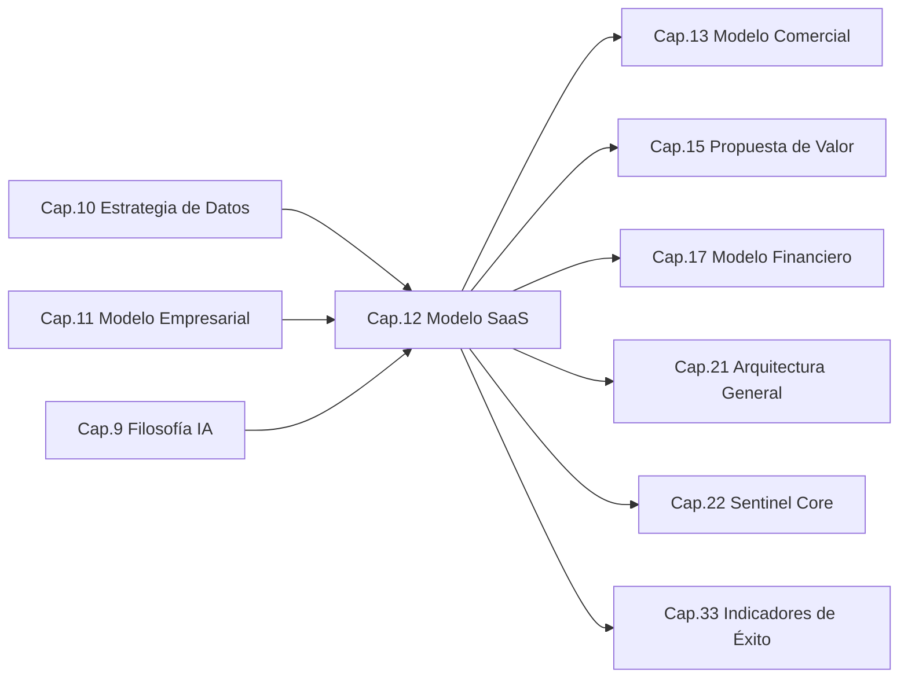
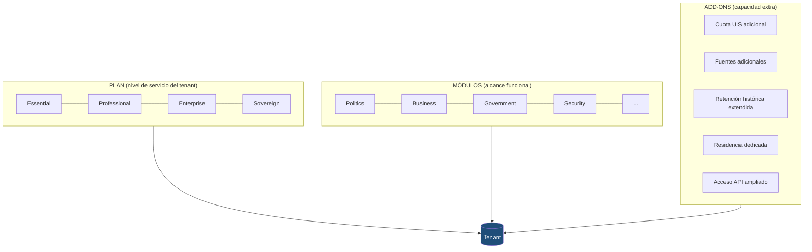
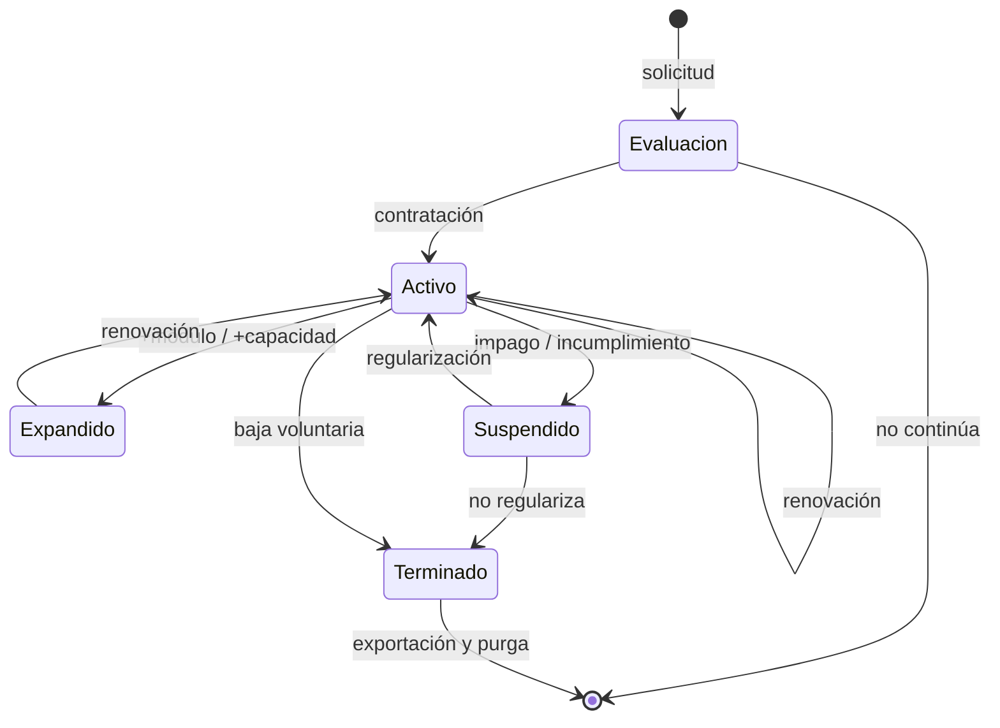
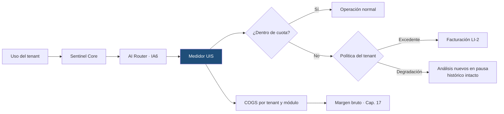

```
════════════════════════════════════════════════════════
  SENTINEL INTELLIGENCE PLATFORM — AI Intelligence Platform
  SENTINEL INTELLIGENCE FOUNDATION v1.0
────────────────────────────────────────────────────────
  Capítulo      : 12 — Modelo SaaS
  Bloque        : III — Negocio y Mercado
  Versión       : v1.0
  Fecha         : 2026-08-17
  Estado        : Draft
  Autor         : Comité Fundador de Sentinel Intelligence
  Founder       : Patricio David Fierro (Product Owner principal)
  Confidencial. : CONFIDENCIAL — Uso interno fundacional
════════════════════════════════════════════════════════
```

# CAPÍTULO 12 — Modelo SaaS
### Bloque III — Negocio y Mercado

---

## 2. Objetivos del Capítulo

1. Traducir la línea de ingreso principal **LI-1 (suscripción)** aprobada en el Cap. 11 en un **modelo SaaS concreto y operable**.
2. Definir la **unidad de cobro** oficial y la **métrica de valor** que la sustenta.
3. Establecer la **arquitectura de empaquetado**: planes, módulos, add-ons y sus límites.
4. Definir la **métrica de consumo de inteligencia** que hace medible y facturable la línea LI-2.
5. Establecer el **ciclo de vida de la suscripción** (alta, activación, expansión, renovación, suspensión, baja) y sus reglas.
6. Fijar los **niveles de servicio (SLA)** y de soporte por plan.
7. Determinar las **capacidades que Sentinel Core debe implementar** para que el modelo SaaS sea ejecutable.

*Este capítulo define la **estructura** del SaaS. **No define precios**: la política de precios, descuentos y canales corresponde al Cap. 13, y su cuantificación al Cap. 17.*

---

## 3. Alcance

| Incluye | NO incluye |
|---|---|
| Unidad de cobro y métrica de valor | Precios, monedas y listas de tarifas (Cap. 13) |
| Estructura de planes y su lógica de escalamiento | Descuentos, promociones y canales (Cap. 13) |
| Empaquetado por módulo y add-ons | Segmentación de mercado (Cap. 14) |
| Métrica de consumo de inteligencia (UIS) | Unit economics: CAC, LTV, márgenes (Cap. 17) |
| Cuotas, límites y política de excedentes | Diseño técnico del motor de facturación (Cap. 21–22) |
| Ciclo de vida de la suscripción | Contratos y términos legales (Cap. 30) |
| SLA, soporte y niveles de aislamiento | Organización del equipo de soporte (Cap. 31) |
| Modelo de prueba y adopción inicial | Métricas corporativas de éxito (Cap. 33) |

---

## 4. Relación con Otros Capítulos



| Capítulo | Relación | Naturaleza |
|---|---|---|
| Cap. 9 — Filosofía de IA | El **AI Router** (IA6) hace viable el margen de las cuotas de inteligencia. | Entrante |
| Cap. 10 — Estrategia de Datos | La **multitenancy por `tenant_id`** (DT1) y la residencia (DT4) son la base del plan. | Entrante |
| Cap. 11 — Modelo Empresarial | Define **LI-1…LI-6** y las reglas **RN1–RN6** que este capítulo materializa. | Entrante |
| Cap. 13 — Modelo Comercial | Asigna **precio** a la estructura definida aquí. | Saliente |
| Cap. 15 — Propuesta de Valor | Cada plan debe corresponder a un **valor percibido** distinto. | Saliente |
| Cap. 17 — Modelo Financiero | Cuantifica ARR, márgenes y costo de las cuotas. | Saliente |
| Cap. 21–22 — Arquitectura/Core | Implementa tenants, suscripciones, cuotas y medición. | Saliente |
| Cap. 33 — Indicadores de Éxito | Toma de aquí las métricas SaaS rectoras. | Saliente |

---

## 5. Desarrollo Completo

### 5.1 Principios del modelo SaaS (SA1–SA7)

| # | Principio | Significado |
|---|---|---|
| **SA1** | **Un solo producto, múltiples configuraciones** | Todos los tenants corren la misma versión del Core (RN3, Cap. 11). |
| **SA2** | **El cliente paga por capacidad de decisión, no por software** | La métrica de valor se ancla al análisis producido, no a la licencia. |
| **SA3** | **Escalamiento por valor, no por obstáculo** | Se sube de plan al necesitar **más capacidad**, no por bloqueos artificiales de funciones esenciales. |
| **SA4** | **Explicabilidad en todos los planes** | La IA explicable (IA1) **nunca** es una función de pago; es un derecho del cliente. |
| **SA5** | **Consumo medido y transparente** | El tenant conoce en todo momento su consumo y su límite; sin sorpresas de facturación. |
| **SA6** | **Aislamiento y residencia como nivel de servicio** | Las exigencias de soberanía (DT4) se atienden por plan, no por bifurcación del producto. |
| **SA7** | **Reversibilidad y portabilidad del dato** | El cliente puede exportar sus datos y retirarse; no hay retención por cautiverio técnico. |

> **SA4 es la regla ética del modelo comercial:** ningún plan puede vender "IA sin explicación" ni cobrar por la explicación. Contradiría IA1 y RN4.

### 5.2 Unidad de cobro y métrica de valor

| Concepto | Definición oficial |
|---|---|
| **Unidad de cobro** | El **tenant** (organización), suscrito a uno o más **módulos**. |
| **Métrica de valor primaria** | El **módulo activo** por tenant: mide el alcance del problema que Sentinel resuelve para el cliente. |
| **Métrica de escala** | La **capacidad contratada**: usuarios con rol, fuentes de datos monitoreadas y cuota de inteligencia. |
| **Métrica de consumo** | La **Unidad de Inteligencia Sentinel (UIS)** — véase §5.4. |

```
   FACTURACIÓN DE UN TENANT
   ────────────────────────
   [ PLAN base ]  ×  [ nº de MÓDULOS activos ]
          +
   [ CAPACIDAD: usuarios · fuentes · cuota UIS incluida ]
          +
   [ ADD-ONS contratados ]
          +
   [ EXCEDENTE de UIS, si aplica ]   ← LI-2
   ─────────────────────────────────
   = Suscripción recurrente (LI-1) + consumo (LI-2)
```

**Descartado explícitamente:** cobro **por usuario individual como métrica principal**. Penalizaría la difusión interna de la inteligencia dentro de la organización — exactamente el comportamiento que Sentinel busca fomentar (véase ADR-012-02).

### 5.3 Arquitectura de empaquetado



**Las tres dimensiones son independientes y ortogonales:**

| Dimensión | Responde a | Ejemplo |
|---|---|---|
| **Plan** | *¿Con qué nivel de servicio?* | Enterprise |
| **Módulo** | *¿Sobre qué dominio decide?* | Politics + Government |
| **Add-on** | *¿Cuánta capacidad extra?* | +cuota UIS, +retención |

> Esta ortogonalidad evita la trampa clásica del SaaS: obligar a subir de plan para obtener una funcionalidad no relacionada con el nivel de servicio.

### 5.4 La Unidad de Inteligencia Sentinel (UIS)

El costo variable dominante de la plataforma es la **inferencia de IA** (R11-4, Cap. 11). Facturar y controlar ese costo exige una métrica propia, estable y comprensible.

| Atributo | Definición |
|---|---|
| **Qué es** | Unidad interna de medida del **trabajo de inteligencia** ejecutado para un tenant. |
| **Qué mide** | Análisis, síntesis, clasificación, detección y generación de explicaciones ejecutadas por el Core. |
| **Por qué existe** | Desacopla el precio al cliente del **precio del proveedor de IA** (IA3): si cambia el modelo, la UIS no cambia. |
| **Cómo se presenta** | Cuota incluida por plan + consumo visible en tiempo real + excedente opcional. |
| **Qué NO es** | No es un token, ni una llamada a API, ni una unidad de un proveedor específico. |

```
   Operación del usuario
          │
          ▼
   ┌──────────────┐   selecciona modelo por costo/calidad
   │  AI ROUTER   │◄──────────── IA6 (Cap. 9)
   └──────┬───────┘
          │ costo real variable (proveedor)
          ▼
   ┌──────────────────────────────────────────┐
   │  MEDIDOR: consumo expresado en UIS       │
   │  (estable frente al proveedor elegido)   │
   └──────┬───────────────────────────────────┘
          │
          ├──► Cuota del tenant  (control y transparencia, SA5)
          ├──► Facturación LI-2  (excedente)
          └──► Margen bruto      (COGS por tenant y módulo)
```

**Ventaja estratégica:** la UIS convierte la agnosticidad de proveedor (IA3) en una **ventaja económica**. Si el AI Router encuentra un modelo más eficiente, el margen mejora sin renegociar con el cliente.

### 5.5 Estructura oficial de planes

| Atributo | **Essential** | **Professional** | **Enterprise** | **Sovereign** |
|---|---|---|---|---|
| **Destinatario** | Organizaciones pequeñas y primer uso | Organizaciones con analítica continua | Organizaciones grandes y multi-área | Sector público / alta exigencia normativa |
| **Módulos incluidos** | 1 | Hasta 2 | Múltiples | Múltiples |
| **Usuarios con rol** | Reducido | Amplio | Extenso | Extenso |
| **Fuentes monitoreadas** | Básicas | Ampliadas | Extensas | Extensas + fuentes propias |
| **Cuota UIS** | Básica | Media | Alta | Alta o dedicada |
| **IA explicable (IA1)** | ✅ Incluida | ✅ Incluida | ✅ Incluida | ✅ Incluida |
| **Human-in-the-loop (IA2)** | ✅ Incluido | ✅ Incluido | ✅ Incluido | ✅ Incluido |
| **Acceso API (LI-3)** | Limitado | ✅ Estándar | ✅ Ampliado | ✅ Ampliado |
| **Retención histórica** | Corta | Media | Extendida | Extendida/configurable |
| **Aislamiento de datos** | Lógico (`tenant_id`) | Lógico | Lógico reforzado | **Físico / dedicado** |
| **Residencia por país (DT4)** | Estándar | Estándar | Configurable | **Garantizada** |
| **Soporte** | Estándar | Prioritario | Dedicado | Dedicado + gestor de cuenta |
| **SLA de disponibilidad** | Básico | Estándar | Alto | Alto reforzado |
| **Auditoría y trazabilidad (IA4)** | ✅ Básica | ✅ Completa | ✅ Completa + exportable | ✅ Completa + exportable |
| **Línea de ingreso** | LI-1 | LI-1 + LI-2 | LI-1 + LI-2 + LI-3 | LI-1 + LI-2 + LI-3 |

**Lectura del escalamiento (SA3):** de Essential a Sovereign **no se compran funciones nuevas**, se compra **más capacidad, más aislamiento y más nivel de servicio**. La inteligencia y su explicabilidad son las mismas en todos los planes.

### 5.6 Add-ons oficiales

| Add-on | Qué añade | Línea |
|---|---|---|
| **Cuota UIS adicional** | Bloque extra de capacidad de inteligencia | LI-2 |
| **Fuentes adicionales** | Monitoreo de fuentes más allá del plan | LI-1 |
| **Retención extendida** | Ampliación del histórico en la Data Foundation | LI-1 |
| **Residencia dedicada** | Alojamiento en jurisdicción específica (DT4) | LI-1 |
| **API ampliada** | Cuotas y límites superiores de consumo programático | LI-3 |
| **Módulo adicional** | Nuevo dominio de decisión sobre el mismo tenant | LI-1 |
| **Inteligencia bajo demanda** | Informe o estudio estratégico puntual | LI-4 |
| **Habilitación e integración** | Onboarding e integración de fuentes propias | LI-5 |

> **Motor de expansión de cuenta:** el add-on **Módulo adicional** es la palanca principal de crecimiento intra-cuenta descrita en el Cap. 11 §5.7.

### 5.7 Cuotas, límites y política de excedentes

| Situación | Comportamiento de la plataforma |
|---|---|
| Consumo < 80 % de la cuota | Operación normal; consumo visible en el panel del tenant. |
| Consumo ≥ 80 % | **Aviso proactivo** al administrador del tenant (SA5). |
| Consumo ≥ 100 % | Según configuración del tenant: (a) **excedente facturable** (LI-2), o (b) **degradación controlada**. |
| Degradación controlada | Se preservan consulta, lectura e histórico; se pausan los análisis nuevos de IA. |
| Cuota agotada | **Nunca** se borra dato ni se revoca el acceso al histórico (SA7). |

**Regla de no penalización:** una cuota agotada **nunca** puede producir pérdida de datos, pérdida de trazabilidad ni interrupción del acceso a análisis ya generados.

### 5.8 Ciclo de vida de la suscripción



| Estado | Definición | Acceso a datos |
|---|---|---|
| **Evaluación** | Período de prueba acotado, con datos reales y alcance limitado. | Completo dentro del alcance |
| **Activo** | Suscripción vigente. | Completo |
| **Expandido** | Activo con módulos, capacidad o add-ons añadidos. | Completo ampliado |
| **Suspendido** | Vigencia interrumpida; el tenant se conserva íntegro. | **Solo lectura del histórico** |
| **Terminado** | Suscripción finalizada. | Ventana de **exportación** y luego purga según retención (Cap. 10, Cap. 30) |

**Reglas del ciclo de vida:**

1. La **suspensión no destruye datos**: el tenant queda intacto y es reactivable.
2. La **terminación otorga una ventana de exportación** antes de cualquier purga (SA7).
3. La **expansión es inmediata**; la reducción de plan se aplica en la renovación.
4. Toda transición de estado queda **auditada y trazable** (IA4).

### 5.9 Modelo de prueba y adopción inicial

| Elemento | Definición |
|---|---|
| **Modalidad** | Prueba acotada **con datos reales del cliente** y alcance funcional definido. |
| **Por qué con datos reales** | El valor de Sentinel solo es demostrable sobre el contexto del propio cliente. |
| **Duración** | Acotada y explícita; sin renovación indefinida. |
| **Criterio de éxito** | Que el cliente **tome al menos una decisión** respaldada por la plataforma. |
| **Límites** | Cuota UIS de evaluación, sin acceso API ampliado, sin residencia dedicada. |
| **Riesgo controlado** | La prueba consume UIS reales: se controla con cuota explícita, no con buena voluntad. |

### 5.10 Niveles de servicio (SLA) y soporte

| Dimensión | Essential | Professional | Enterprise | Sovereign |
|---|---|---|---|---|
| Canal de soporte | Asincrónico | Asincrónico prioritario | Canal dedicado | Canal dedicado + gestor |
| Tiempo de respuesta | Estándar | Reducido | Prioritario | Máxima prioridad |
| Disponibilidad comprometida | Básica | Estándar | Alta | Alta reforzada |
| Ventana de mantenimiento | Estándar | Estándar | Coordinada | Coordinada |
| Continuidad y respaldo | Estándar | Estándar | Reforzada | Reforzada + plan documentado |
| Revisión de valor con el cliente | — | Periódica | Trimestral | Trimestral ejecutiva |
| Informe de consumo UIS | Panel | Panel + periódico | Panel + detallado | Panel + detallado |

*Los valores numéricos de cada SLA se fijan en el Cap. 13 (compromiso comercial) y se validan operativamente en el Cap. 21.*

### 5.11 Métricas SaaS rectoras

| Métrica | Qué mide | Por qué importa |
|---|---|---|
| **ARR / MRR** | Ingreso recurrente | Salud del modelo (RN2, Cap. 11) |
| **NRR (retención neta)** | Expansión menos contracción | Mide si el modelo modular funciona |
| **Módulos por tenant** | Profundidad de adopción | Palanca de crecimiento intra-cuenta |
| **Churn de tenant** | Bajas | Ajuste producto-mercado |
| **Margen bruto por tenant** | Ingreso − costo (incluido UIS) | Viabilidad real del SaaS |
| **Costo UIS / ingreso** | Peso del costo de IA | Control del riesgo R11-4 |
| **Time-to-first-decision** | Días hasta la primera decisión respaldada | **Métrica propia de Sentinel:** valor real, no adopción aparente |
| **Tasa de uso de la cuota** | Consumo / cuota | Calidad del dimensionamiento de planes |

> **Time-to-first-decision** es la métrica distintiva del modelo: Sentinel no se mide por sesiones ni por clics, sino por **decisiones respaldadas**.

---

## 6. Diagramas

### 6.1 Composición de una suscripción (ASCII)

```
   ┌──────────────────────────── TENANT ────────────────────────────┐
   │  Organización · tenant_id · residencia (DT4)                    │
   │                                                                 │
   │   PLAN: Essential │ Professional │ Enterprise │ Sovereign        │
   │   ─────────────────────────────────────────────────────────      │
   │   MÓDULOS ACTIVOS:  [Politics] [Business] [Government] ...       │
   │   ─────────────────────────────────────────────────────────      │
   │   CAPACIDAD: usuarios · fuentes · CUOTA UIS                      │
   │   ─────────────────────────────────────────────────────────      │
   │   ADD-ONS: +UIS · +fuentes · +retención · residencia · API       │
   │                                                                 │
   │   SIEMPRE INCLUIDO (no negociable):                              │
   │   ✔ IA explicable (IA1)   ✔ Human-in-the-loop (IA2)              │
   │   ✔ Trazabilidad (IA4)    ✔ Linaje del dato (DT3)                │
   │   ✔ Exportabilidad (SA7)                                         │
   └─────────────────────────────────────────────────────────────────┘
```

### 6.2 Del uso a la facturación y al margen (Mermaid)



### 6.3 Ruta de expansión de cuenta (ASCII)

```
   Evaluación ──► Essential ──► Professional ──► Enterprise ──► Sovereign
      (1 módulo)     (1 mód.)      (2 mód.)        (N mód.)      (N + soberanía)
         │              │              │               │              │
         └──── el mismo Core, el mismo producto, más capacidad ───────┘

   Expansión intra-cuenta (sin nuevo costo de adquisición):
      +módulo   +usuarios   +fuentes   +cuota UIS   +retención   +API
```

---

## 7. Tablas Comparativas

### 7.1 Métricas de cobro evaluadas

| Métrica de cobro | Ventaja | Riesgo | Decisión |
|---|---|---|---|
| **Por usuario (per seat)** | Simple y predecible | **Penaliza difundir la inteligencia** dentro de la organización | ❌ Descartada como principal |
| **Por consumo puro** | Alineada al costo real de IA | Ingreso impredecible; frena la exploración del cliente | ❌ Descartada como principal |
| **Licencia perpetua** | Ingreso inmediato alto | Sin recurrencia; contradice RN2 | ❌ Descartada |
| **Por tenant + módulos + cuota (híbrida)** | Recurrencia predecible **y** cobertura del costo de IA | Mayor complejidad de medición | ✅ **Adoptada** |

### 7.2 Aislamiento por plan

| Nivel | Implementación | Plan | Costo operativo |
|---|---|---|---|
| Lógico | `tenant_id` + control de acceso (DT1) | Essential, Professional | Bajo |
| Lógico reforzado | Esquemas separados + controles adicionales | Enterprise | Medio |
| Físico / dedicado | Instancia y almacenamiento dedicados, residencia garantizada (DT4) | Sovereign | Alto |

*El aislamiento es un **nivel de servicio**, nunca una bifurcación del producto (RN3, SA1, SA6).*

### 7.3 Qué se monetiza y qué no

| Elemento | ¿Monetizable? | Fundamento |
|---|---|---|
| Capacidad de análisis (UIS) | ✅ Sí | Refleja costo real (LI-2) |
| Módulos y dominios | ✅ Sí | Alcance del valor (LI-1) |
| Aislamiento y residencia | ✅ Sí | Costo de infraestructura (SA6) |
| Retención histórica | ✅ Sí | Costo de almacenamiento |
| Soporte y SLA | ✅ Sí | Costo de servicio |
| **Explicación de la IA** | ❌ **Nunca** | IA1 · SA4 · RN4 |
| **Human-in-the-loop** | ❌ **Nunca** | IA2 · RN4 |
| **Trazabilidad y auditoría** | ❌ **Nunca** | IA4 · DT3 |
| **Exportación de datos propios** | ❌ **Nunca** | SA7 |

---

## 8. Buenas Prácticas

1. **Dimensionar la cuota UIS con datos, no con intuición:** medir el consumo real por tenant antes de fijar los bloques del Cap. 13.
2. **Hacer visible el consumo antes de facturarlo:** el panel de consumo precede a cualquier cobro por excedente (SA5).
3. **Nunca bloquear el histórico** por razones comerciales: la degradación controlada es el único mecanismo admisible.
4. **Vender el módulo siguiente, no el plan siguiente:** la expansión por módulo es más valiosa y más natural que el upsell de plan.
5. **Revisar trimestralmente el costo UIS real** frente al ingreso: es el indicador temprano del riesgo R11-4.
6. **Mantener la ortogonalidad plan/módulo/add-on:** cada vez que se rompe, se genera fricción comercial y deuda de producto.
7. **Instrumentar `time-to-first-decision` desde el primer tenant:** es la métrica que valida la propuesta de valor.

---

## 9. Riesgos

| ID | Riesgo | Prob. | Impacto | Mitigación |
|---|---|---|---|---|
| R12-1 | Cuota UIS mal dimensionada erosiona el margen | **Alta** | Alto | Medición previa, revisión trimestral, AI Router (IA6) |
| R12-2 | Complejidad del empaquetado dificulta la venta | Media | Medio | Tres dimensiones claras (§5.3) + material comercial (Cap. 13) |
| R12-3 | Cliente percibe la UIS como métrica opaca | Media | Alto | Panel de consumo en tiempo real + informe periódico (SA5) |
| R12-4 | Presión por vender aislamiento físico a clientes pequeños | Media | Alto | Aislamiento físico solo en Sovereign; disciplina de plan (SA6) |
| R12-5 | Pruebas indefinidas que no convierten | **Alta** | Medio | Duración acotada + cuota de evaluación + criterio de éxito explícito |
| R12-6 | Degradación por cuota interpretada como falla del servicio | Media | Medio | Aviso al 80 % + comunicación clara + histórico siempre accesible |
| R12-7 | Cambio de precios de un proveedor de IA rompe el margen | Media | Alto | UIS desacoplada del proveedor (ADR-012-03) + agnosticidad (IA3) |
| R12-8 | Concesiones de plan caso por caso que degradan la estructura | Alta | Medio | Toda excepción documentada y con fecha de revisión (Cap. 13) |
| R12-9 | Churn por valor no demostrado en el primer trimestre | Media | Alto | `time-to-first-decision` como métrica de Customer Success |

---

## 10. Recomendaciones

1. **Ratificar la estructura de tres dimensiones** (plan × módulo × add-on) como arquitectura oficial de empaquetado.
2. **Ratificar la UIS** como métrica interna oficial de consumo de inteligencia, desacoplada de cualquier proveedor.
3. **Implementar el medidor de UIS y el panel de consumo del tenant** como requisito del Core **anterior** al primer cliente facturado.
4. **Definir en el Cap. 13** los valores concretos: precios, tamaño de cuotas, límites de usuarios y fuentes, y cifras de SLA.
5. **Ejecutar una fase de calibración** con los primeros tenants para dimensionar cuotas con datos reales antes de publicar tarifas.
6. **Instrumentar las métricas SaaS de §5.11** en el Core desde el inicio, en particular el margen bruto por tenant.
7. **Documentar el compromiso de no monetizar** explicabilidad, HITL, trazabilidad y exportación (§7.3) como cláusula pública de confianza.

---

## 11. Architecture Decision Records (ADR)

### ADR-012-01 — Modelo de suscripción híbrido: tenant + módulos + capacidad
- **Contexto:** LI-1 requiere una estructura de cobro concreta. El cobro por usuario es habitual pero desalienta difundir la inteligencia; el cobro puro por consumo hace impredecible el ingreso y frena la exploración del cliente.
- **Decisión:** Adoptar un modelo **híbrido**: cuota recurrente por **tenant** según **plan**, multiplicada por los **módulos activos**, más **capacidad contratada** (usuarios, fuentes, cuota UIS) y **add-ons**; con consumo excedente facturable (LI-2).
- **Alternativas descartadas:** per-seat como métrica principal; consumo puro; licencia perpetua.
- **Estado:** Propuesta (fundacional) — pendiente de aprobación del Product Owner.
- **Consecuencias:** (+) Ingreso recurrente predecible con cobertura del costo variable de IA; (−) exige un motor de medición y facturación más sofisticado en el Core.
- **Principios aplicados:** RN2 · SA2 · SA5 · DT1.

### ADR-012-02 — El usuario individual no es la métrica principal de cobro
- **Contexto:** La misión de Sentinel es que las organizaciones decidan mejor; cobrar por asiento incentiva restringir el acceso interno a la inteligencia y contradice el propósito del producto.
- **Decisión:** El **número de usuarios no es la métrica de cobro principal**. Se usa únicamente como **parámetro de capacidad** dentro del plan.
- **Estado:** Propuesta (fundacional).
- **Consecuencias:** (+) Fomenta la difusión interna de la inteligencia y la adopción real; (−) desalinea parcialmente el precio del número de personas beneficiadas.
- **Principios aplicados:** Misión (Cap. 5) · SA2 · SA3.

### ADR-012-03 — Unidad de Inteligencia Sentinel (UIS) como métrica de consumo
- **Contexto:** El costo dominante es la inferencia de IA, cuyo precio varía por proveedor y en el tiempo. Facturar en unidades de un proveedor (tokens, llamadas) trasladaría al cliente la volatilidad ajena y ataría el modelo comercial a ese proveedor, contradiciendo IA3.
- **Decisión:** Definir la **UIS** como unidad **propia, interna y estable** de medida del trabajo de inteligencia. Toda cuota y todo excedente se expresan en UIS, con independencia del modelo que ejecute la operación.
- **Estado:** Propuesta (fundacional).
- **Consecuencias:** (+) Estabilidad de precio para el cliente, agnosticidad real y captura de la mejora de eficiencia como margen; (−) requiere definir, calibrar y gobernar la equivalencia UIS ↔ costo real.
- **Principios aplicados:** IA3 · IA6 · SA5.

### ADR-012-04 — Explicabilidad, HITL, trazabilidad y exportación nunca se monetizan
- **Contexto:** Es comercialmente tentador reservar la explicación de la IA, la auditoría o la exportación de datos para los planes superiores.
- **Decisión:** **Prohibido monetizar o restringir por plan** la IA explicable (IA1), el human-in-the-loop en decisiones críticas (IA2), la trazabilidad y auditoría (IA4) y la exportación de los datos propios del cliente (SA7). Están incluidos en **todos** los planes, incluida la evaluación.
- **Estado:** Propuesta (fundacional).
- **Consecuencias:** (+) Coherencia ética total y diferenciación creíble frente a competidores; (−) se renuncia a una palanca de upsell habitual en la industria.
- **Principios aplicados:** IA1 · IA2 · IA4 · RN4 · SA4 · SA7.

### ADR-012-05 — La cuota agotada degrada, nunca destruye ni bloquea el histórico
- **Contexto:** Debe definirse el comportamiento al agotarse la capacidad contratada. El corte total de servicio dañaría la confianza y podría interrumpir decisiones en curso.
- **Decisión:** Al alcanzar el 100 % de la cuota, y según configuración del tenant, se factura **excedente** o se aplica **degradación controlada**: se pausan los análisis nuevos de IA, preservando consulta, lectura, histórico y trazabilidad. **Nunca** se borra dato ni se revoca el acceso al histórico. Aviso obligatorio al 80 %.
- **Estado:** Propuesta (fundacional).
- **Consecuencias:** (+) Confianza y previsibilidad para el cliente; (−) el ingreso por excedente es menos automático que con un corte duro.
- **Principios aplicados:** SA5 · SA7 · DT2.

---

## 12. Pendientes

| ID | Pendiente | Responsable sugerido | Depende de |
|---|---|---|---|
| P12-1 | Definir la equivalencia técnica UIS ↔ operaciones del Core y su gobierno | Chief AI Officer / Chief Architect | Cap. 22 |
| P12-2 | Fijar precios, tamaños de cuota y límites numéricos por plan | Dirección Comercial / Founder | Cap. 13 |
| P12-3 | Fijar las cifras concretas de SLA por plan | Operaciones / Legal | Cap. 13, 21 |
| P12-4 | Especificar el motor de suscripciones, cuotas y facturación en el Core | Chief Architect | Cap. 21–22 |
| P12-5 | Diseñar el panel de consumo del tenant (transparencia SA5) | Product / UX | Cap. 19, 22 |
| P12-6 | Ejecutar la calibración de cuotas con los primeros tenants | Product / Finanzas | Cap. 17 |
| P12-7 | Definir duración y alcance formal del período de evaluación | Dirección Comercial | Cap. 13 |
| P12-8 | Redactar la cláusula contractual de exportabilidad y purga (SA7) | Legal | Cap. 30 |
| P12-9 | Instrumentar `time-to-first-decision` como métrica de producto | Product / Customer Success | Cap. 33 |

---

## 13. Referencias Cruzadas

- **`00-PRINCIPIOS-FUNDACIONALES.md` §6:** doctrina de IA (IA1 explicabilidad, IA2 HITL, IA3 agnosticidad, IA4 trazabilidad, IA6 AI Router).
- **`00-PRINCIPIOS-FUNDACIONALES.md` §7:** principios de datos (DT1 multitenancy, DT2 gobierno, DT3 linaje, DT4 residencia).
- **Cap. 5 — Misión:** fundamento de ADR-012-02 (no penalizar la difusión de la inteligencia).
- **Cap. 9 — Filosofía de IA:** IA1/IA2/IA4 como elementos no monetizables; IA6 como palanca de margen.
- **Cap. 10 — Estrategia de Datos:** `tenant_id`, linaje, retención y residencia por jurisdicción.
- **Cap. 11 — Modelo Empresarial:** LI-1…LI-6, RN1–RN6 y el riesgo R11-4 que la UIS controla.
- **Cap. 13 — Modelo Comercial:** precios, cuotas numéricas, canales y cifras de SLA.
- **Cap. 15 — Propuesta de Valor:** correspondencia plan ↔ valor percibido por segmento.
- **Cap. 17 — Modelo Financiero:** ARR, margen bruto por tenant y costo UIS.
- **Cap. 21–22 — Arquitectura / Sentinel Core:** motor de tenants, suscripciones, cuotas y medición.
- **Cap. 30 — Legal:** contrato, SLA vinculante, exportabilidad y purga.
- **Cap. 33 — Indicadores de Éxito:** métricas SaaS rectoras de §5.11.

---

## 14. Historial de Cambios

| Versión | Fecha | Cambio | Autor |
|---|---|---|---|
| v1.0 | 2026-08-17 | Creación del Capítulo 12 (Modelo SaaS). Define principios SA1–SA7, unidad de cobro, empaquetado en tres dimensiones, Unidad de Inteligencia Sentinel (UIS), cuatro planes oficiales, add-ons, política de cuotas, ciclo de vida de la suscripción, SLA, métricas SaaS y ADR-012-01…05. | Comité Fundador |

---

## 15. Estado del Documento

**Draft** → Review → Approved

*Estado actual: **Draft** (pendiente de revisión y aprobación del Product Owner).*

---

## 16. Versión

**v1.0** — versión inicial del capítulo.

---

## 17. Impacto en Sentinel Core

| Decisión del capítulo | Impacto en la arquitectura de Sentinel Core |
|---|---|
| Suscripción híbrida (ADR-012-01) | El Core requiere un **Subscription & Entitlement Service**: registro de tenant, plan vigente, módulos activos, capacidad contratada y add-ons, consultable por cada módulo en tiempo de ejecución. |
| Empaquetado ortogonal (§5.3) | Los **entitlements** deben resolverse en tres ejes independientes (plan, módulo, add-on). Ningún módulo puede asumir su propio nivel de servicio: debe preguntarlo al Core. |
| UIS como métrica (ADR-012-03) | El Core incorpora un **Metering Service** acoplado al **AI Router**: toda operación de inteligencia se contabiliza en UIS antes de ejecutarse, con el costo real del proveedor registrado por separado para el cálculo de COGS. |
| Cuotas y degradación (ADR-012-05) | El Core necesita **control de cuota en el camino de ejecución** (pre-autorización de la operación) y un **modo degradado** que preserve lectura, histórico y trazabilidad. La degradación es un estado de primera clase, no un error. |
| No monetizar IA1/IA2/IA4/SA7 (ADR-012-04) | Explicabilidad, HITL, auditoría y exportación se implementan como **capacidades incondicionales del Core**, jamás detrás de un flag de plan. Elimina toda ramificación comercial en el motor de IA. |
| Aislamiento por plan (§7.2, SA6) | El Core debe soportar **tres topologías de aislamiento** (lógico, lógico reforzado, dedicado) con la **misma base de código**, seleccionadas por configuración de despliegue (RN3). |
| Ciclo de vida (§5.8) | El Core gestiona **estados de tenant** (evaluación, activo, expandido, suspendido, terminado) con transiciones auditadas; *suspendido* implica **solo lectura**, no eliminación. |
| Transparencia de consumo (SA5) | El Core expone una **API de consumo y cuota** por tenant, base del panel de transparencia y del informe periódico. |
| Métricas SaaS (§5.11) | El Core emite la telemetría de negocio: módulos activos, consumo UIS, margen bruto por tenant y `time-to-first-decision`. |

**Síntesis:** el Modelo SaaS añade a Sentinel Core una **capa de negocio de primera clase** compuesta por tres servicios que hasta ahora no estaban formalizados: **entitlements** (qué puede hacer cada tenant), **metering en UIS** (cuánta inteligencia consumió) y **ciclo de vida del tenant** (en qué estado está). Estos tres servicios son requisito **previo** al primer cliente facturado. Simultáneamente, el capítulo **simplifica** el motor de IA: al prohibir monetizar explicabilidad, HITL, trazabilidad y exportación (ADR-012-04), elimina toda ramificación condicional por plan dentro del núcleo de inteligencia. El Core mide y autoriza; nunca negocia.

---

*Fin del Capítulo 12 — Modelo SaaS.*
