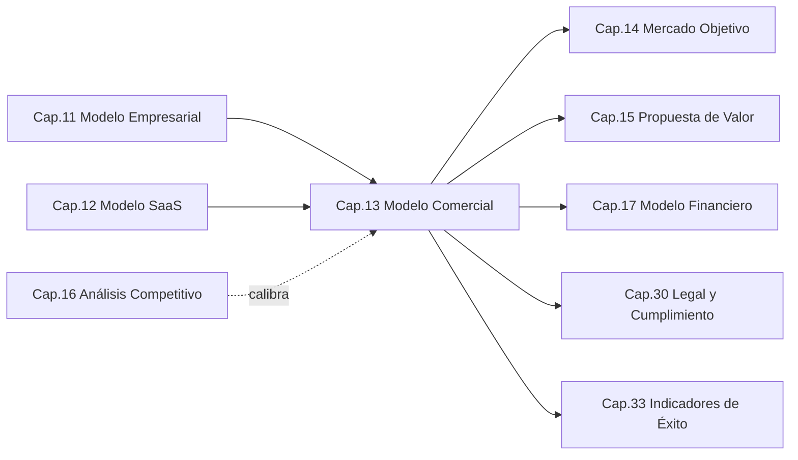
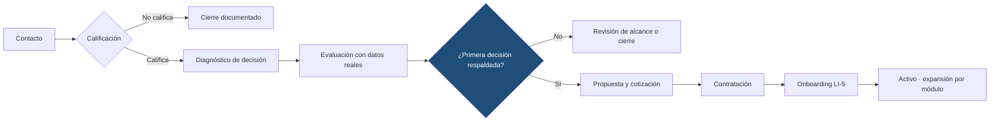
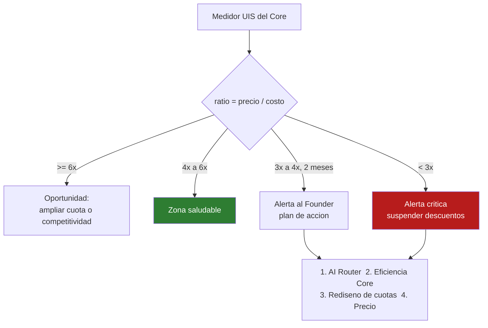

```
════════════════════════════════════════════════════════
  SENTINEL INTELLIGENCE PLATFORM — AI Intelligence Platform
  SENTINEL INTELLIGENCE FOUNDATION v1.0
────────────────────────────────────────────────────────
  Capítulo      : 13 — Modelo Comercial
  Bloque        : III — Negocio y Mercado
  Versión       : v1.1
  Fecha         : 2026-08-18
  Estado        : Approved
  Autor         : Comité Fundador de Sentinel Intelligence
  Founder       : Patricio David Fierro (Product Owner principal)
  Confidencial. : CONFIDENCIAL — Uso interno fundacional
════════════════════════════════════════════════════════
```

# CAPÍTULO 13 — Modelo Comercial
### Bloque III — Negocio y Mercado

---

> ### ⚠️ Naturaleza de las cifras de este capítulo
>
> Este capítulo fija la **arquitectura de precios, la gobernanza comercial y las reglas de decisión**, que son **normativas y estables**.
>
> Los **valores numéricos concretos** (tarifas, tamaños de cuota, límites) se presentan como **valores de referencia propuestos**, derivados de los supuestos declarados en §5.2. Son **calibrables** y quedan sujetos a:
> - la **calibración de consumo real** con los primeros tenants (P12-6),
> - el **análisis competitivo** del Cap. 16,
> - la **validación de unit economics** del Cap. 17.
>
> **Lo que no es calibrable** son las reglas: la lógica de precios (§5.4), los topes de descuento (§5.8), la regla de margen de la UIS (ADR-013-03) y la autoridad de aprobación (§5.9). Estas rigen aunque cambien todas las cifras.

---

## 2. Objetivos del Capítulo

1. Asignar **precio** a la estructura SaaS aprobada en el Cap. 12 y **cuantificar** cuotas, límites y SLA.
2. Establecer la **arquitectura de precios**: moneda, periodicidad, lógica del módulo adicional y precio de la UIS.
3. Definir la **gobernanza de precios**: quién aprueba qué, topes de descuento y tratamiento de excepciones.
4. Definir los **canales de venta** y su economía.
5. Establecer las **reglas de contratación** para sector público y para socios.
6. Proteger el margen frente a la **volatilidad del costo de IA** mediante reglas explícitas de revisión.

---

## 3. Alcance

| Incluye | NO incluye |
|---|---|
| Moneda, periodicidad y lógica de precios | Estructura de planes y add-ons (Cap. 12, ya aprobada) |
| Valores de referencia por plan y cuota | Proyecciones de ingreso, CAC y LTV (Cap. 17) |
| Precio y gobierno de margen de la UIS | Definición técnica de la UIS (Cap. 12) |
| Cifras concretas de SLA y créditos de servicio | Implementación operativa del SLA (Cap. 21) |
| Canales de venta y economía de socios | Segmentación y tamaño de mercado (Cap. 14) |
| Política de descuentos y autoridad de aprobación | Argumentario de valor por segmento (Cap. 15) |
| Reglas de contratación pública y de partners | Contratos, términos legales y licitaciones (Cap. 30) |
| Ciclo de venta y criterios de calificación | Estructura del equipo comercial (Cap. 31) |

---

## 4. Relación con Otros Capítulos



| Capítulo | Relación | Naturaleza |
|---|---|---|
| Cap. 11 — Modelo Empresarial | LI-1…LI-6 y RN1–RN6 acotan lo que se puede vender y cómo. | Entrante |
| Cap. 12 — Modelo SaaS | Aporta la estructura (planes, módulos, add-ons, UIS) que aquí se tarifa. | Entrante |
| Cap. 16 — Análisis Competitivo | **Calibra** los valores de referencia frente al mercado. | Bidireccional |
| Cap. 17 — Modelo Financiero | Convierte estas tarifas en ARR, margen y proyección. | Saliente |
| Cap. 14–15 — Mercado y Valor | Verifican que cada plan corresponda a un segmento y a un valor real. | Saliente |
| Cap. 30 — Legal | Contrato, SLA vinculante y normativa de contratación pública. | Saliente |
| Cap. 33 — Indicadores | Toma de aquí las métricas comerciales rectoras. | Saliente |

---

## 5. Desarrollo Completo

### 5.1 Principios comerciales (CO1–CO7)

| # | Principio | Significado |
|---|---|---|
| **CO1** | **Precio anclado al valor, con piso en el costo** | El precio refleja la decisión habilitada; nunca desciende bajo el costo de servir (incluida la UIS). |
| **CO2** | **Transparencia de estructura** | El cliente entiende **por qué** paga lo que paga; la estructura es pública aunque la cifra sea negociada. |
| **CO3** | **El descuento es una excepción, no una herramienta de venta** | Se concede por compromiso (plazo, volumen, referencia), nunca por presión. |
| **CO4** | **Un mismo perfil, un mismo precio** | Clientes comparables reciben condiciones comparables. Sin arbitrariedad. |
| **CO5** | **El margen se gobierna, no se espera** | Toda tarifa tiene una regla de margen verificable y revisable. |
| **CO6** | **No se vende lo que la plataforma no puede sostener** | Ninguna promesa comercial excede la capacidad técnica u operativa comprometida. |
| **CO7** | **Ninguna venta viola los principios** | IA1–IA8, DT1–DT4, RN4 y SA4 prevalecen sobre cualquier oportunidad comercial. |

### 5.2 Supuestos declarados de la propuesta económica

Los valores de referencia de este capítulo se derivan de los siguientes supuestos. **Si un supuesto cambia, las cifras deben recalcularse.**

| # | Supuesto | Fundamento | Riesgo si es falso |
|---|---|---|---|
| S1 | **Moneda de referencia: USD** | Ecuador —mercado inicial— opera en dólares estadounidenses; simplifica la expansión LATAM. | Bajo |
| S2 | El cliente típico inicial es una **organización mediana** con presupuesto de análisis existente, no una startup. | Cap. 11 §5.1 y perfil del mercado objetivo. | Medio — validar en Cap. 14 |
| S3 | El **costo de inferencia por análisis** es el componente dominante del costo variable. | R11-4 (Cap. 11); ADR-012-03. | Bajo |
| S4 | El consumo medio real de UIS por tenant **aún no está medido**. | La plataforma está en Release Alpha; sin tenants productivos. | **Alto — es el supuesto crítico** |
| S5 | El comprador compara contra **herramientas de monitoreo internacionales** y contra **consultoría local**, no contra un sustituto idéntico. | No existe competidor equivalente en el mercado inicial (a validar en Cap. 16). | Medio |
| S6 | El **ciclo de venta público** es sustancialmente más largo que el privado. | R11-5 (Cap. 11). | Bajo |

> **S4 es el supuesto que gobierna todo lo demás.** Por eso §5.5 fija la UIS mediante una **regla de margen** y no mediante un precio absoluto: la regla sobrevive a la ignorancia inicial sobre el consumo real.

### 5.3 Arquitectura de precios

| Dimensión | Definición oficial |
|---|---|
| **Moneda** | **USD** como moneda de referencia y de contrato. Otras monedas, solo con cláusula de tipo de cambio (Cap. 30). |
| **Periodicidad** | Suscripción **mensual**, con **facturación anual anticipada preferente** (ADR-013-05). |
| **Base de cálculo** | Plan base + módulos adicionales + capacidad + add-ons + excedente UIS. |
| **Visibilidad** | Essential y Professional con **tarifa publicada**; Enterprise y Sovereign **por cotización** (CO2). |
| **Vigencia de la tarifa** | Precio congelado durante el período contratado; revisión en renovación (§5.10). |
| **Impuestos** | Todos los valores son **netos**, sin impuestos ni retenciones (tratamiento fiscal en Cap. 30). |

### 5.4 Valores de referencia por plan

**Tarifa mensual del plan base, con un (1) módulo activo — valores de referencia propuestos, USD netos:**

| Plan | Mensual | Anual anticipado (−15 %) | Destinatario típico |
|---|---:|---:|---|
| **Essential** | 390 | 3.978 (331/mes) | Organización pequeña; primer módulo; uso acotado |
| **Professional** | 1.200 | 12.240 (1.020/mes) | Organización con analítica continua |
| **Enterprise** | 3.500 | 35.700 (2.975/mes) | Organización grande, multi-área, multi-módulo |
| **Sovereign** | desde 7.500 | por cotización | Sector público / alta exigencia normativa y de soberanía |

**Capacidad incluida en el plan base:**

| Capacidad | Essential | Professional | Enterprise | Sovereign |
|---|---:|---:|---:|---|
| Usuarios con rol | 5 | 20 | 75 | Gestionado por contrato |
| Fuentes monitoreadas | 10 | 40 | 150 | A medida |
| **Cuota UIS / mes** | **5.000** | **20.000** | **75.000** | **200.000** o dedicada |
| Retención histórica | 6 meses | 24 meses | 60 meses | Configurable |
| Módulos incluidos | 1 | 1 (hasta 2 con módulo adicional) | 1 + adicionales | 1 + adicionales |

*Coherencia con el Cap. 12: los usuarios son **parámetro de capacidad**, nunca la métrica de cobro (ADR-012-02).*

### 5.5 Precio del módulo adicional y de la UIS

#### 5.5.1 Módulo adicional — 40 % del plan base

| Módulos activos | Costo incremental | Racional |
|---|---|---|
| 1.º (incluido) | Plan base | Cubre el costo de servir el tenant completo |
| 2.º y siguientes | **+40 % del plan base** cada uno | El costo marginal del módulo *n+1* es menor (Cap. 11 §5.2) |

```
   Ejemplo — Professional con 3 módulos:
   1.200  (base, 1.er módulo)
   +480   (2.º módulo, 40 %)
   +480   (3.er módulo, 40 %)
   ─────
   2.160 USD/mes   →  vs. 3.600 si cada módulo se cobrara completo
                       El cliente gana 40 %; Sentinel gana margen,
                       porque el costo marginal real es aún menor.
```

> **El precio traduce la arquitectura.** El descuento por módulo adicional no es una concesión comercial: es el **reflejo honesto del costo marginal decreciente** que produce la arquitectura Core + Módulos. Es la palanca central de expansión intra-cuenta (Cap. 11 §5.7).

#### 5.5.2 Precio de la UIS — gobernado por regla, no por cifra

| Modalidad | Precio de referencia | Condición |
|---|---:|---|
| Excedente sobre la marcha | **0,045 USD / UIS** | Sin compromiso previo |
| Bloque prepago 25.000 UIS | **0,035 USD / UIS** | Vigencia 12 meses |
| Bloque prepago 100.000 UIS | **0,028 USD / UIS** | Vigencia 12 meses |
| Cuota dedicada (Sovereign) | Por cotización | Capacidad reservada |

**Regla de margen de la UIS (ADR-013-03) — normativa e innegociable:**

```
   precio_UIS  ≥  4 × costo_medio_real_UIS

   donde costo_medio_real_UIS incluye:
     · inferencia del proveedor de IA (vía AI Router)
     · cómputo, almacenamiento y transferencia asociados
     · costo de la trazabilidad y el linaje (DT3)

   Verificación: MENSUAL, con el medidor del Core (Cap. 12 §5.4).
   Si el ratio cae bajo 4×, se activa el protocolo de §5.10.
```

Esta regla es la respuesta al supuesto crítico **S4** y al riesgo **R11-4**: aunque hoy se desconozca el consumo real, el margen queda protegido por construcción. Si el AI Router (IA6) reduce el costo, el ratio sube y la mejora se convierte en **margen o en competitividad**, a decisión del Founder — nunca en una renegociación con el cliente (ADR-012-03).

### 5.6 Add-ons — valores de referencia

| Add-on | Referencia (USD/mes salvo indicación) | Línea |
|---|---:|---|
| Módulo adicional | 40 % del plan base | LI-1 |
| Bloque UIS adicional | Según §5.5.2 (pago único, vigencia 12 meses) | LI-2 |
| Fuentes adicionales (bloque de 10) | 120 | LI-1 |
| Usuarios adicionales (bloque de 10) | 150 | LI-1 |
| Retención extendida (+12 meses) | 8 % del plan base | LI-1 |
| Residencia dedicada por jurisdicción | desde 1.800 | LI-1 |
| API ampliada (cuota superior) | desde 450 | LI-3 |
| Inteligencia bajo demanda (informe estratégico) | desde 2.500 por entrega | LI-4 |
| Habilitación e integración (onboarding) | desde 1.500, pago único | LI-5 |

> **Control RN6 (Cap. 11):** los ingresos por LI-4 y LI-5 son **habilitadores**. Su participación se vigila contra el umbral definido en el Cap. 17 (P11-1). Si un trimestre supera ese umbral, se activa revisión del Founder.

### 5.7 Cifras de SLA y créditos de servicio

| Compromiso | Essential | Professional | Enterprise | Sovereign |
|---|---|---|---|---|
| **Disponibilidad mensual** | 99,0 % | 99,5 % | 99,7 % | **99,9 %** |
| Primera respuesta — severidad crítica | 24 h hábiles | 8 h hábiles | **4 h** (24×7) | **1 h** (24×7) |
| Primera respuesta — severidad media | 48 h hábiles | 24 h hábiles | 8 h hábiles | 4 h hábiles |
| Ventana de mantenimiento | Estándar, avisada | Estándar, avisada | Coordinada | Coordinada, fuera de hora pico |
| Objetivo de recuperación (RTO) | 24 h | 12 h | 4 h | 2 h |
| Objetivo de punto de recuperación (RPO) | 24 h | 12 h | 4 h | 1 h |
| Revisión de valor con el cliente | — | Semestral | Trimestral | Trimestral ejecutiva |

**Créditos de servicio por incumplimiento de disponibilidad** (único remedio, ADR-013-06):

| Disponibilidad real en el mes | Crédito sobre el cargo mensual |
|---|---:|
| Bajo el compromiso, ≥ 98,0 % | 5 % |
| < 98,0 %, ≥ 95,0 % | 15 % |
| < 95,0 % | 30 % |
| Tres meses consecutivos incumplidos | Derecho del cliente a **terminación sin penalidad** |

*Se excluyen del cómputo: mantenimiento coordinado, fuerza mayor e indisponibilidad imputable a sistemas del cliente. Las definiciones vinculantes se redactan en el Cap. 30.*

### 5.8 Política de descuentos

| Descuento | Tope | Condición |
|---|---:|---|
| Facturación anual anticipada | **15 %** | Pago por adelantado de 12 meses |
| Compromiso de 24 meses | **22 %** | Contrato con permanencia |
| Volumen (≥ 4 módulos activos) | **10 %** adicional | Sobre el total de módulos |
| Académico / investigación | **40 %** | Uso no comercial verificado; contribuye al Cap. 28 |
| Cliente de referencia (*design partner*) | **30 %** | Compromiso escrito de caso de éxito y retroalimentación de producto |
| **Tope acumulado ordinario** | **25 %** | Autoridad comercial |
| **Techo absoluto** | **35 %** | **Solo Founder**, con justificación escrita y fecha de revisión |

**Reglas de descuento (CO3, CO4):**

1. **Todo descuento exige contrapartida** verificable: plazo, volumen, prepago o referencia. Nunca se concede solo por resistencia al precio.
2. **Nunca se descuenta la UIS bajo la regla 4×** (§5.5.2). El descuento opera sobre la suscripción, jamás sobre el piso de margen.
3. **Todo descuento se documenta** con motivo, contrapartida y fecha de revisión.
4. **El descuento no es permanente:** se revisa en cada renovación.
5. **Descuento académico ≠ descuento comercial:** no crea precedente ni comparable de mercado.

### 5.9 Autoridad de aprobación comercial

| Decisión | Autoridad |
|---|---|
| Tarifa publicada (Essential, Professional) | Comité Fundador, ratificada por el Founder |
| Cotización Enterprise dentro de la lista | Dirección Comercial |
| Descuento ≤ 25 % con contrapartida | Dirección Comercial |
| Descuento > 25 % y ≤ 35 % | **Founder** (justificación escrita) |
| Descuento > 35 % | **Prohibido** |
| Cotización Sovereign | **Founder** |
| Precio bajo la regla 4× de la UIS | **Prohibido** (sin excepción) |
| Condición que exija violar IA1–IA8 / DT1–DT4 | **Prohibido** (CO7, RN4) |
| Contrato con exclusividad o cesión del Core | **Founder**, con ADR previo (RN1, RN5) |

> Las tres prohibiciones absolutas —romper el piso de margen, violar los principios, ceder el Core— **no admiten excepción**, cualquiera sea el tamaño del contrato. Están fuera del alcance de la negociación.

### 5.10 Revisión de precios y protección del margen

| Disparador | Acción |
|---|---|
| **Revisión ordinaria** | Anual, en el cierre del ejercicio, con datos de consumo real y del Cap. 17. |
| **Ratio UIS < 4×** durante 2 meses consecutivos | Alerta al Founder + plan de acción: optimización del AI Router, revisión de cuotas o ajuste tarifario. |
| **Ratio UIS < 3×** en cualquier mes | **Alerta crítica.** Suspensión de nuevas cotizaciones con descuento hasta corregir. |
| Variación > 30 % en el costo de un proveedor de IA | Evaluación de conmutación de modelo (IA3) **antes** de considerar subir precios. |
| Ratio UIS sostenido > 6× | Oportunidad: ampliar cuotas incluidas o mejorar competitividad, a decisión del Founder. |

**Compromiso con el cliente:** el precio permanece **congelado durante el período contratado**. Todo ajuste se aplica en la renovación, con aviso previo mínimo de 60 días.

> **Primero optimizar, después tarifar.** Ante un alza de costo de IA, la respuesta ordenada es: (1) AI Router, (2) eficiencia del Core, (3) rediseño de cuotas, y solo entonces (4) precio.

### 5.11 Canales de venta

| Canal | Planes objetivo | Economía | Rol |
|---|---|---|---|
| **Venta directa consultiva** | Enterprise, Sovereign | Margen íntegro; ciclo largo | Canal principal en la etapa inicial |
| **Socios integradores** | Professional, Enterprise | Comisión **15–25 %** del primer año; 10 % en renovación | Escala geográfica sin plantilla propia |
| **Autoservicio asistido** | Essential | Costo de adquisición mínimo | Puerta de entrada y calificación |
| **API / OEM** | LI-3, LI-6 | Por acuerdo, con ADR previo | Palanca futura de ecosistema |
| **Académico / investigación** | Essential, Professional | Descuentado; retorno en credibilidad y talento | Legitimidad y cantera (Cap. 31) |

**Reglas de canal:**

1. **Registro de oportunidad obligatorio** para socios: evita conflicto con la venta directa.
2. **La comisión se paga sobre lo cobrado**, nunca sobre lo firmado.
3. **El socio no fija precio**: aplica la lista oficial. El precio es competencia de Sentinel (CO4).
4. **La relación contractual con el cliente final es siempre de Sentinel**, salvo acuerdo OEM aprobado por el Founder.

### 5.12 Ciclo de venta y calificación



**Criterios de calificación:** ¿existe una **decisión recurrente** que hoy se toma sin evidencia suficiente? ¿hay **presupuesto** y un **responsable** identificado? ¿hay **fuentes de datos** accesibles? ¿el uso previsto **respeta los principios éticos** (Cap. 27)?

**Criterio de avance:** la evaluación no se cierra por tiempo transcurrido, sino por el hito **`time-to-first-decision`** (Cap. 12 §5.11). Si el cliente no llega a una decisión respaldada, **el problema es de ajuste, no de precio** — y bajar el precio no lo resuelve.

### 5.13 Contratación con el sector público

| Aspecto | Regla |
|---|---|
| **Marco aplicable** | En Ecuador, la contratación pública se rige por el sistema nacional correspondiente (SERCOP). Todo proceso se valida con Legal (Cap. 30) antes de participar. |
| **Plan aplicable** | Sovereign por defecto, por exigencias de soberanía y residencia (DT4). |
| **Ciclo** | Largo (S6). No se compromete caja contra ingresos públicos no adjudicados. |
| **Precio** | Se aplica la lista oficial. Las condiciones del pliego **no pueden vulnerar** la regla 4× ni los principios (CO7). |
| **Riesgo de dependencia** | Ningún contrato público puede volver a Sentinel dependiente de un solo cliente (RN5). |
| **Transparencia** | La trazabilidad y la explicabilidad (IA1/IA4) son **argumento central**, no un extra: son un requisito de rendición de cuentas pública. |

### 5.14 Métricas comerciales rectoras

| Métrica | Qué vigila | Umbral de atención |
|---|---|---|
| **Descuento medio concedido** | Disciplina de precios (CO3) | > 15 % sostenido |
| **Ratio de margen UIS** | Piso de margen (ADR-013-03) | < 4× |
| **Precio realizado / precio de lista** | Erosión de tarifa | < 85 % |
| **Peso de LI-4 + LI-5 sobre el total** | Deriva a consultora (RN6) | Umbral del Cap. 17 |
| **Módulos por tenant** | Éxito de la expansión | < 1,5 tras 12 meses |
| **Duración del ciclo de venta** | Eficiencia comercial | Por segmento |
| **Tasa de conversión de evaluación** | Ajuste producto-mercado | < 30 % |
| **`time-to-first-decision`** | Valor real entregado | Por definir en calibración |

---

## 6. Diagramas

### 6.1 Composición del precio de un tenant (ASCII)

```
   PRECIO MENSUAL DE UN TENANT
   ═══════════════════════════════════════════════════════════

   PLAN BASE  (Essential 390 · Professional 1.200 ·
               Enterprise 3.500 · Sovereign desde 7.500)
        +
   MÓDULOS ADICIONALES   n × 40 % del plan base
        +
   CAPACIDAD EXTRA       usuarios · fuentes · retención
        +
   ADD-ONS               residencia · API · bloques UIS
        +
   EXCEDENTE UIS         solo si supera la cuota  ── LI-2
   ═══════════════════════════════════════════════════════════
        −  DESCUENTO   (tope ordinario 25 % · techo 35 %)
   ═══════════════════════════════════════════════════════════
        =  PRECIO CONTRATADO

   PISO INNEGOCIABLE:  precio_UIS ≥ 4 × costo_medio_real_UIS
```

### 6.2 Gobierno del margen (Mermaid)



### 6.3 Autoridad de aprobación (ASCII)

```
   ┌──────────────────────────────────────────────────────────┐
   │  PROHIBIDO SIN EXCEPCIÓN                                  │
   │  ✗ Precio bajo la regla 4× de la UIS                      │
   │  ✗ Condición que viole IA1–IA8 / DT1–DT4 (CO7, RN4)       │
   │  ✗ Descuento > 35 %                                       │
   ├──────────────────────────────────────────────────────────┤
   │  SOLO FOUNDER                                             │
   │  · Descuento 25–35 %  · Cotización Sovereign              │
   │  · Exclusividad / OEM / cesión del Core (ADR previo)      │
   ├──────────────────────────────────────────────────────────┤
   │  DIRECCIÓN COMERCIAL                                      │
   │  · Cotización Enterprise en lista  · Descuento ≤ 25 %     │
   └──────────────────────────────────────────────────────────┘
```

---

## 7. Tablas Comparativas

### 7.1 Estrategias de posicionamiento de precio evaluadas

| Estrategia | Lógica | Ventaja | Riesgo | Decisión |
|---|---|---|---|---|
| **Penetración** (precio bajo inicial) | Comprar cuota de mercado | Adopción rápida | Ancla un precio bajo difícil de corregir; margen negativo con costo de IA | ❌ Descartada |
| **Descremado** (precio alto inicial) | Capturar a los primeros adoptantes | Margen alto | Mercado inicial insuficiente; frena la validación | ❌ Descartada |
| **Costo + margen** | Precio derivado del costo | Simple y seguro | Ignora el valor entregado; deja dinero sobre la mesa | ❌ Descartada como método principal |
| **Valor con piso de costo (CO1)** | Precio por decisión habilitada, con piso en la regla 4× | Captura valor **y** protege margen | Exige medir consumo y valor | ✅ **Adoptada** |

### 7.2 Coherencia plan ↔ segmento ↔ valor

| Plan | Segmento típico | Decisión que habilita | Referencia anual (USD) |
|---|---|---|---:|
| Essential | Organización pequeña, campaña local, área única | Una decisión recurrente en un dominio | ~3.978 |
| Professional | Organización mediana con analítica continua | Decisiones semanales multi-fuente | ~12.240 |
| Enterprise | Organización grande, multi-área | Decisiones críticas coordinadas entre áreas | ~35.700 |
| Sovereign | Sector público, alta exigencia normativa | Decisiones públicas con rendición de cuentas | por cotización |

*La correspondencia con segmentos reales se valida en los Cap. 14 y 15.*

### 7.3 Qué se negocia y qué no

| Elemento | ¿Negociable? | Fundamento |
|---|---|---|
| Tarifa del plan | ✅ Dentro de los topes de §5.8 | CO3 |
| Plazo y periodicidad | ✅ Sí | ADR-013-05 |
| Tamaño de cuota y add-ons | ✅ Sí | Estructura del Cap. 12 |
| Cifras de SLA | ✅ Al alza, con costo asociado | CO6 |
| **Precio bajo la regla 4×** | ❌ **Nunca** | ADR-013-03 |
| **Explicabilidad, HITL, trazabilidad, exportación** | ❌ **Nunca** | ADR-012-04 · CO7 |
| **Bifurcación del producto** | ❌ **Nunca** | RN3 · ADR-011-03 |
| **Exclusividad o cesión del Core** | ⚠️ Solo Founder, con ADR | RN1 · RN5 |

---

## 8. Buenas Prácticas

1. **Cotizar sobre valor, no sobre funciones:** la conversación comercial parte de la decisión que el cliente necesita tomar.
2. **Publicar la estructura aunque la cifra sea negociada** (CO2): la opacidad total genera desconfianza en compradores institucionales.
3. **Registrar cada excepción** con motivo, contrapartida y fecha de revisión — es lo que impide que la excepción se vuelva norma.
4. **Revisar el ratio de margen UIS mensualmente**, no trimestralmente: es el indicador más volátil del negocio.
5. **No cerrar una venta que la operación no puede sostener** (CO6): un SLA incumplido cuesta más que el contrato ganado.
6. **Vender el módulo siguiente antes que el descuento siguiente:** la expansión intra-cuenta es más rentable que la retención por precio.
7. **Documentar por qué se pierde una oportunidad:** la razón de pérdida calibra el Cap. 16 mejor que cualquier estudio.

---

## 9. Riesgos

| ID | Riesgo | Prob. | Impacto | Mitigación |
|---|---|---|---|---|
| R13-1 | Precios mal calibrados por desconocer el consumo real (S4) | **Alta** | Alto | Regla 4× (ADR-013-03) + calibración con primeros tenants (P12-6) + revisión mensual |
| R13-2 | Erosión de tarifa por descuentos sucesivos | **Alta** | Alto | Topes de §5.8 + autoridad de §5.9 + métrica precio realizado / lista |
| R13-3 | Alza del costo de IA rompe el margen | Media | Alto | Protocolo de §5.10: optimizar antes que tarifar; agnosticidad (IA3) |
| R13-4 | Cliente ancla exige condiciones que violan los principios | Media | Alto | CO7 como prohibición absoluta; decisión escalada al Founder |
| R13-5 | Complejidad de la cotización alarga el ciclo de venta | Media | Medio | Tarifa publicada en Essential/Professional + calculadora interna |
| R13-6 | Conflicto de canal entre socio y venta directa | Media | Medio | Registro de oportunidad obligatorio (§5.11) |
| R13-7 | Ingresos públicos comprometidos que no se adjudican | Media | Alto | No comprometer caja contra ingresos no adjudicados (§5.13) |
| R13-8 | Descuento académico usado como comparable de mercado | Media | Medio | Régimen separado, no crea precedente (§5.8 regla 5) |
| R13-9 | Precio percibido como alto frente a consultoría local | Media | Medio | Argumentario de valor y costo total (Cap. 15, 16) |
| R13-10 | Promesa comercial que la operación no sostiene | Media | Alto | CO6 + validación de SLA con Operaciones antes de firmar |

---

## 10. Recomendaciones

1. **Ratificar la arquitectura de precios y la gobernanza** (§5.3, §5.8, §5.9) como normativa, con independencia de las cifras.
2. **Ratificar la regla 4× de la UIS** como piso de margen innegociable y activar su medición mensual desde el primer tenant.
3. **Tratar las cifras de §5.4–§5.7 como versión de calibración**, sujetas a revisión formal tras los primeros 3–6 tenants productivos.
4. **Instrumentar en el Core el reporte mensual de ratio de margen** por tenant y por módulo (dependencia del Cap. 22).
5. **Redactar el anexo contractual de SLA** con las cifras de §5.7 y el régimen de créditos (Cap. 30).
6. **Ejecutar el análisis competitivo (Cap. 16) antes de publicar tarifas** externamente: hoy las cifras son coherentes internamente, pero no están contrastadas con el mercado.
7. **Definir la calculadora comercial interna** que aplique automáticamente topes, autoridad y la regla 4×, evitando el error humano en la cotización.
8. **No publicar precios hasta cerrar la calibración:** una tarifa publicada y luego corregida al alza daña más que una tarifa tardía.

---

## 11. Architecture Decision Records (ADR)

### ADR-013-01 — Moneda USD y transparencia parcial de tarifas
- **Contexto:** El mercado inicial (Ecuador) opera en dólares estadounidenses; la expansión a LATAM implica múltiples monedas. Además, debe decidirse si las tarifas son públicas u ocultas.
- **Decisión:** Adoptar el **USD** como moneda oficial de referencia y contrato. Publicar tarifa de **Essential y Professional**; **Enterprise y Sovereign por cotización**. La **estructura** de precios es siempre pública, aunque la cifra sea negociada.
- **Alternativas descartadas:** opacidad total (genera desconfianza institucional y alarga el ciclo); publicación total (impide adaptar la cotización a implantaciones complejas).
- **Estado:** Aprobada (fundacional) — 2026-08-18, Patricio David Fierro.
- **Consecuencias:** (+) Simplicidad contable, comparabilidad y confianza; (−) exposición de tarifas a competidores y necesidad de cláusula de tipo de cambio fuera de economías dolarizadas.
- **Principios aplicados:** CO2 · CO4.

### ADR-013-02 — El módulo adicional se tarifa al 40 % del plan base
- **Contexto:** Cobrar cada módulo a precio completo contradiría la realidad del costo marginal decreciente y frenaría la expansión intra-cuenta, que es el principal motor de crecimiento del Cap. 11.
- **Decisión:** El **segundo módulo y siguientes** se tarifan al **40 % del plan base** cada uno.
- **Estado:** Aprobada (fundacional) — 2026-08-18, Patricio David Fierro.
- **Consecuencias:** (+) Traduce la ventaja arquitectónica en ventaja comercial y acelera la expansión de cuenta; (−) reduce el ingreso por módulo aislado y exige que el plan base cubra el costo fijo de servir el tenant.
- **Principios aplicados:** Cap. 11 §5.2 · CO1 · SA3.

### ADR-013-03 — Regla 4×: piso de margen innegociable para la UIS
- **Contexto:** El consumo real de UIS es desconocido (supuesto S4) y el costo de inferencia es volátil. Fijar un precio absoluto sin datos sería arbitrario; no fijar nada dejaría el margen a merced del proveedor de IA.
- **Decisión:** El precio de la UIS **nunca** puede ser inferior a **4× su costo medio real** (inferencia + cómputo + almacenamiento + trazabilidad). Verificación **mensual** con el medidor del Core. Ninguna autoridad comercial —incluido el Founder— puede cotizar bajo este piso.
- **Estado:** Aprobada (fundacional) — 2026-08-18, Patricio David Fierro.
- **Consecuencias:** (+) Protege el margen aun con supuestos erróneos y convierte la mejora del AI Router en beneficio; (−) puede impedir ganar oportunidades muy sensibles al precio y exige medición fiable del costo real desde el día uno.
- **Principios aplicados:** CO1 · CO5 · IA6 · ADR-012-03.

### ADR-013-04 — Topes de descuento y autoridad de aprobación escalonada
- **Contexto:** Sin límites explícitos, el descuento se convierte en la herramienta de venta por defecto y erosiona la tarifa de forma irreversible (R13-2).
- **Decisión:** Establecer un **tope ordinario del 25 %** (Dirección Comercial), un **techo absoluto del 35 %** reservado al **Founder** con justificación escrita, y la **prohibición** de todo descuento superior. Todo descuento exige **contrapartida verificable**, se documenta y se revisa en cada renovación.
- **Estado:** Aprobada (fundacional) — 2026-08-18, Patricio David Fierro.
- **Consecuencias:** (+) Disciplina de precios, equidad entre clientes (CO4) y trazabilidad de excepciones; (−) rigidez ante competidores agresivos y posible pérdida de oportunidades muy sensibles al precio.
- **Principios aplicados:** CO3 · CO4 · CO5.

### ADR-013-05 — Facturación anual anticipada preferente
- **Contexto:** Una empresa en Release Alpha necesita previsibilidad de caja; el cliente necesita un incentivo para comprometerse.
- **Decisión:** Ofrecer **15 % de descuento** por facturación anual anticipada y **22 %** por compromiso de 24 meses, dentro de los topes de ADR-013-04.
- **Estado:** Aprobada (fundacional) — 2026-08-18, Patricio David Fierro.
- **Consecuencias:** (+) Caja anticipada, menor churn y menor costo de cobranza; (−) menor ingreso nominal y compromiso de servicio de largo plazo asumido por adelantado.
- **Principios aplicados:** RN2 · CO3.

### ADR-013-06 — Créditos de servicio como único remedio por incumplimiento de SLA
- **Contexto:** El incumplimiento de disponibilidad exige un remedio definido. Las indemnizaciones abiertas exponen a la empresa a un riesgo desproporcionado frente al valor del contrato.
- **Decisión:** El **crédito de servicio** (5 % / 15 % / 30 % del cargo mensual, según severidad) es el **único remedio** por incumplimiento de disponibilidad. Tras **tres meses consecutivos** incumplidos, el cliente adquiere derecho a **terminación sin penalidad**.
- **Estado:** Aprobada (fundacional) — 2026-08-18, Patricio David Fierro.
- **Consecuencias:** (+) Riesgo acotado y previsible, con una salida justa para el cliente; (−) puede resultar insuficiente para clientes institucionales que exijan penalidades mayores — decisión escalable al Founder caso por caso.
- **Principios aplicados:** CO6 · SA7.

---

## 12. Pendientes

| ID | Pendiente | Responsable sugerido | Depende de |
|---|---|---|---|
| P13-1 | **Calibrar las cifras con consumo real** de los primeros 3–6 tenants | Product / Finanzas | P12-6, Cap. 17 |
| P13-2 | Contrastar los valores de referencia con el mercado antes de publicarlos | Dirección Comercial | Cap. 16 |
| P13-3 | Establecer la medición mensual del ratio de margen UIS en el Core | Chief Architect | Cap. 22 |
| P13-4 | Redactar el anexo contractual de SLA y créditos de servicio | Legal | Cap. 30 |
| P13-5 | Construir la calculadora comercial interna con topes y regla 4× | Producto / Comercial | Cap. 12 |
| P13-6 | Definir el contrato marco del programa de socios y su comisión | Legal / Comercial | Cap. 30 |
| P13-7 | Validar requisitos de contratación pública aplicables | Legal | Cap. 30 |
| P13-8 | Fijar el umbral de participación de LI-4 + LI-5 sobre el ingreso total | Founder / Finanzas | P11-1, Cap. 17 |
| P13-9 | Definir la política de precios para monedas no dolarizadas en la expansión LATAM | Finanzas | Cap. 24 |

---

## 13. Referencias Cruzadas

- **`00-PRINCIPIOS-FUNDACIONALES.md` §6–§7:** IA1–IA8 y DT1–DT4 como límites innegociables de toda negociación (CO7).
- **Cap. 11 — Modelo Empresarial:** LI-1…LI-6, RN1–RN6, riesgo R11-4 y costo marginal decreciente que fundamenta ADR-013-02.
- **Cap. 12 — Modelo SaaS:** planes, add-ons, UIS y ADR-012-04 (lo que nunca se monetiza).
- **Cap. 14 — Mercado Objetivo:** valida la correspondencia plan ↔ segmento de §7.2.
- **Cap. 15 — Propuesta de Valor:** argumentario que sostiene el precio.
- **Cap. 16 — Análisis Competitivo:** **calibración externa obligatoria antes de publicar tarifas**.
- **Cap. 17 — Modelo Financiero:** ARR, unit economics y umbral de LI-4/LI-5.
- **Cap. 22 — Sentinel Core:** medidor de UIS, reporte de margen y calculadora de entitlements.
- **Cap. 27 — Principios Éticos:** criterio de calificación de oportunidades.
- **Cap. 30 — Legal:** contrato, SLA vinculante, contratación pública y régimen fiscal.
- **Cap. 33 — Indicadores de Éxito:** métricas comerciales de §5.14.

---

## 14. Historial de Cambios

| Versión | Fecha | Cambio | Autor |
|---|---|---|---|
| v1.1 | 2026-08-18 | Capítulo **Approved** por el Product Owner. ADR-013-01…06 ratificados; principios CO1–CO7, **regla 4×** y matriz de autoridad comercial adoptados como normativa oficial. Las cifras quedan como versión de calibración (P13-1, P13-2). | Patricio David Fierro |
| v1.0 | 2026-08-17 | Creación del Capítulo 13 (Modelo Comercial). Define principios CO1–CO7, supuestos declarados S1–S6, arquitectura de precios en USD, valores de referencia por plan y add-on, regla 4× de margen de la UIS, cifras de SLA y créditos de servicio, política de descuentos con topes y autoridad de aprobación, canales de venta, ciclo de venta, reglas de contratación pública y ADR-013-01…06. | Comité Fundador |

---

## 15. Estado del Documento

Draft → Review → **Approved**

*Estado actual: **Approved** por el Product Owner (2026-08-18).*

> **Nota de aprobación:** la aprobación consolida como **normativas** la arquitectura de precios, la regla 4× (ADR-013-03), los topes de descuento y la matriz de autoridad. Los **valores numéricos** de §5.4–§5.7 permanecen como **versión de calibración** y se revisarán conforme a P13-1 y P13-2, sin requerir un nuevo ADR mientras no se altere ninguna regla.

---

## 16. Versión

**v1.1** — capítulo aprobado.

---

## 17. Impacto en Sentinel Core

| Decisión del capítulo | Impacto en la arquitectura de Sentinel Core |
|---|---|
| Regla 4× de margen (ADR-013-03) | El **Metering Service** (Cap. 12) debe registrar, junto a cada UIS consumida, el **costo real** de la operación (proveedor, modelo, cómputo, almacenamiento). Sin este dato la regla no es verificable y el piso de margen no existe. |
| Reporte mensual de margen (§5.10) | El Core expone un **reporte de rentabilidad por tenant y por módulo**, con el ratio precio/costo y sus disparadores de alerta. Es un requisito de gobierno, no de analítica. |
| Módulo adicional al 40 % (ADR-013-02) | El **Subscription & Entitlement Service** calcula el cargo en función del **número de módulos activos**, con precio decreciente. La activación de un módulo es una operación transaccional con efecto en facturación. |
| Topes de descuento y autoridad (ADR-013-04) | El motor de cotización valida **automáticamente** topes y autoridad; el descuento es un **atributo auditable de la suscripción**, no un ajuste manual invisible. |
| Cifras de SLA y créditos (§5.7, ADR-013-06) | El Core debe **medir la disponibilidad real por tenant** y calcular el crédito correspondiente. Un SLA que no se mide no se puede honrar (CO6). |
| Facturación anual anticipada (ADR-013-05) | El ciclo de vida del tenant incorpora **periodicidad de facturación y prepago**, con reconocimiento diferido del ingreso (insumo del Cap. 17). |
| Bloques prepagos de UIS (§5.5.2) | El medidor gestiona **saldos prepagos con vigencia**, además de la cuota periódica: dos contadores distintos sobre la misma métrica. |
| Protocolo de optimización antes de tarifar (§5.10) | Refuerza al **AI Router** (IA6) como control económico de primer orden: su eficiencia es la primera línea de defensa del margen, antes que el precio. |
| Prohibiciones absolutas (§5.9) | El Core **no implementa** mecanismos que permitan violarlas: no existe flag para desactivar explicabilidad, trazabilidad o exportación. La imposibilidad técnica es la garantía de la regla comercial. |

**Síntesis:** el Modelo Comercial convierte el medidor del Core en un **instrumento de gobierno económico**. El Cap. 12 estableció que el Core debe medir *cuánta* inteligencia consume cada tenant; el Cap. 13 añade que debe medir *cuánto cuesta* y *cuánto se cobra* — porque la regla 4× solo es real si el sistema la puede verificar mes a mes. La consecuencia arquitectónica más profunda, sin embargo, es la inversa: **las prohibiciones comerciales se implementan como ausencias en el Core**. No hay interruptor para apagar la explicabilidad, ni ruta de código para bifurcar el producto por cliente, ni parámetro para cotizar bajo el piso de margen. Lo que no existe en la arquitectura no se puede conceder en una negociación.

---

*Fin del Capítulo 13 — Modelo Comercial.*
