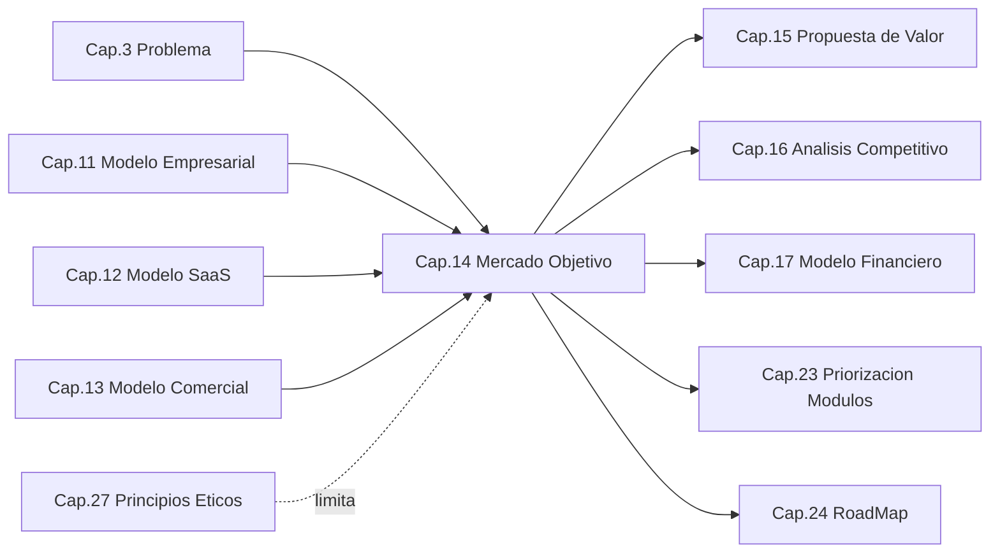
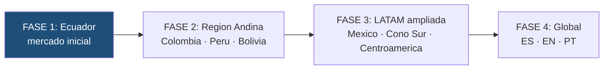
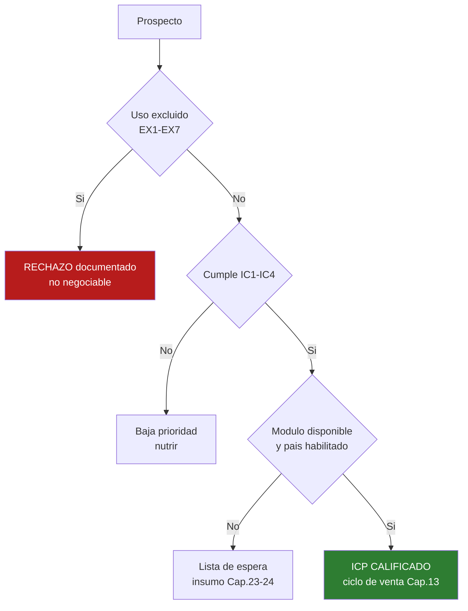

```
════════════════════════════════════════════════════════
  SENTINEL INTELLIGENCE PLATFORM — AI Intelligence Platform
  SENTINEL INTELLIGENCE FOUNDATION v1.0
────────────────────────────────────────────────────────
  Capítulo      : 14 — Mercado Objetivo
  Bloque        : III — Negocio y Mercado
  Versión       : v1.0
  Fecha         : 2026-08-19
  Estado        : Draft
  Autor         : Comité Fundador de Sentinel Intelligence
  Founder       : Patricio David Fierro (Product Owner principal)
  Confidencial. : CONFIDENCIAL — Uso interno fundacional
════════════════════════════════════════════════════════
```

# CAPÍTULO 14 — Mercado Objetivo
### Bloque III — Negocio y Mercado

---

> ### ⚠️ Naturaleza de las cifras de este capítulo
>
> Son **normativas**: la definición del mercado, la segmentación oficial, el perfil de cliente ideal, los **criterios de exclusión**, la secuencia geográfica y la **metodología** de dimensionamiento.
>
> Son **estimaciones a verificar**: todo recuento de organizaciones y todo valor de TAM/SAM/SOM. Se presentan como **órdenes de magnitud** con su fuente pendiente de confirmación (INEC, CNE, SERCOP, superintendencias y cámaras). Están marcados con **(v)** en las tablas.
>
> Este capítulo entrega el **método y el marco de decisión**; el dimensionamiento verificado se cierra en P14-1 y alimenta el Cap. 17.

---

## 2. Objetivos del Capítulo

1. Definir **cuál es el mercado** de Sentinel Intelligence Platform, en términos del problema que resuelve y no de una industria.
2. Establecer la **segmentación oficial** y la **priorización** de segmentos.
3. Definir el **Perfil de Cliente Ideal (ICP)** y sus criterios de calificación.
4. Establecer los **criterios de exclusión de mercado**: a quién Sentinel **no** vende, por decisión ética y estratégica.
5. Fijar la **metodología de dimensionamiento** (TAM/SAM/SOM) reproducible y auditable.
6. Definir la **secuencia geográfica** Ecuador → LATAM → global y las condiciones de habilitación de cada país.
7. Vincular cada segmento con su **módulo** y su **plan** (Cap. 12–13), verificando la coherencia comercial.

---

## 3. Alcance

| Incluye | NO incluye |
|---|---|
| Definición del mercado por problema | Argumentario de valor por segmento (Cap. 15) |
| Segmentación oficial y priorización | Análisis de competidores por segmento (Cap. 16) |
| Perfil de Cliente Ideal y calificación | Proyección de ingresos y captura real (Cap. 17) |
| Criterios de exclusión de mercado | Desarrollo doctrinal de la ética (Cap. 27) |
| Metodología TAM / SAM / SOM | Cifras verificadas de mercado (P14-1) |
| Secuencia geográfica y habilitación de país | Roadmap temporal de expansión (Cap. 24) |
| Mapa segmento ↔ módulo ↔ plan | Priorización de construcción de módulos (Cap. 23) |
| Personas compradoras y estacionalidad | Estructura del equipo comercial (Cap. 31) |

---

## 4. Relación con Otros Capítulos



| Capítulo | Relación | Naturaleza |
|---|---|---|
| Cap. 3 — Problema | El mercado es el **conjunto de quienes sufren ese problema**. | Entrante |
| Cap. 11 — Modelo Empresarial | La plataforma horizontal define la **amplitud** del mercado. | Entrante |
| Cap. 12–13 — SaaS y Comercial | Aportan planes y tarifas que este capítulo asigna a segmentos. | Entrante |
| Cap. 27 — Principios Éticos | **Limita** el mercado: hay demanda que no se atiende. | Restrictiva |
| Cap. 15 — Propuesta de Valor | Construye el argumento para cada segmento definido aquí. | Saliente |
| Cap. 16 — Competencia | Analiza el panorama competitivo de cada segmento priorizado. | Saliente |
| Cap. 17 — Financiero | Convierte SOM en proyección de ingresos. | Saliente |
| Cap. 23–24 — Módulos y RoadMap | La prioridad de segmento determina el orden de construcción. | Saliente |

---

## 5. Desarrollo Completo

### 5.1 Principios de mercado (MK1–MK6)

| # | Principio | Significado |
|---|---|---|
| **MK1** | **El mercado se define por el problema, no por la industria** | Sentinel no vende "software político": vende capacidad de decidir con evidencia. |
| **MK2** | **Concentración para entrar, amplitud para escalar** | Se entra por un segmento estrecho y se escala por módulos, no atacando todo a la vez. |
| **MK3** | **Dimensionamiento ascendente (bottom-up)** | Se cuentan organizaciones reales; no se estiman porcentajes de mercados globales. |
| **MK4** | **Hay mercado que se rechaza** | La demanda que exige violar los principios **no es mercado**: es riesgo. |
| **MK5** | **La diversificación de segmentos es control de riesgo, no ambición** | Compensa la estacionalidad y la concentración (R11-3, R11-5). |
| **MK6** | **Un segmento existe cuando se le puede servir** | No se declara segmento objetivo sin módulo, capacidad operativa y cumplimiento legal para atenderlo. |

> **MK4 es la frontera del capítulo.** En un mercado de inteligencia y datos, la demanda más urgente no siempre es legítima. Delimitar lo que no se vende es tan estratégico como definir lo que sí.

### 5.2 Definición del mercado

**El mercado de Sentinel Intelligence Platform es el conjunto de organizaciones que deben tomar decisiones recurrentes de alto impacto sobre información dispersa, incompleta o no estructurada, y que necesitan poder justificar esas decisiones.**

Esta definición tiene tres consecuencias operativas:

| Consecuencia | Implicación |
|---|---|
| **El mercado es transversal** | Ninguna industria lo agota. La segmentación es por **tipo de decisión**, no por sector. |
| **El sustituto real no es un competidor de software** | Es el **statu quo**: intuición, hojas de cálculo, informes manuales y consultoría puntual. |
| **La exigencia de justificar es el filtro de calidad** | Quien necesita **explicar** su decisión valora la explicabilidad (IA1) y paga por ella. Quien solo quiere una cifra, no es ICP. |

```
   ¿QUÉ ES MERCADO PARA SENTINEL?
   ══════════════════════════════════════════════════════════

   Decisión recurrente          ┐
   + Alto impacto               │
   + Información dispersa       ├──► MERCADO
   + Necesidad de justificar    │
   + Responsable identificable  ┘

   Decisión única y aislada          ┐
   Información ya estructurada       ├──► NO es mercado
   Sin necesidad de justificación    │    (aunque haya presupuesto)
   Sin responsable identificable     ┘

   Uso que exige violar principios   ──► NO es mercado: es RIESGO (MK4)
```

### 5.3 Segmentación oficial

| ID | Segmento | Decisión típica que habilita | Módulo | Estacionalidad |
|---|---|---|---|---|
| **SG1** | **Actores políticos y electorales** | Estrategia de campaña, posicionamiento, respuesta a la agenda pública | Politics | **Alta** (ciclo electoral) |
| **SG2** | **Gobierno y sector público** | Priorización de política pública, percepción ciudadana, gestión territorial | Government | Media (ciclo presupuestario) |
| **SG3** | **Empresa privada** | Reputación, entorno competitivo, riesgo regulatorio y de mercado | Business | **Baja (contracíclico)** |
| **SG4** | **Medios y comunicación** | Agenda editorial, verificación, análisis de conversación pública | Media | Baja |
| **SG5** | **Seguridad y gestión de riesgos** | Detección temprana, alerta de crisis, evaluación de amenazas | Security / Crisis | Baja |
| **SG6** | **Academia e investigación** | Investigación aplicada, análisis social y político | Research | Media (ciclo académico) |

**Sub-segmentación de SG1 y SG2 por escala territorial** (relevante para el plan aplicable):

| Escala | Perfil | Plan típico |
|---|---|---|
| Nacional | Gobierno central, movimientos nacionales, candidaturas presidenciales | Sovereign / Enterprise |
| Provincial | Prefecturas, gobiernos provinciales | Enterprise |
| Cantonal / municipal | Alcaldías, concejos, candidaturas locales | Professional |
| Local / organizacional | Organizaciones pequeñas, áreas específicas | Essential |

### 5.4 Perfil de Cliente Ideal (ICP)

Un prospecto es ICP cuando cumple **los cinco criterios**. El incumplimiento de uno lo convierte en oportunidad de menor prioridad; el incumplimiento del quinto lo **descalifica**.

| # | Criterio | Pregunta de verificación |
|---|---|---|
| **IC1** | **Decisión recurrente de alto impacto** | ¿Existe una decisión que se repite y cuyo error cuesta caro? |
| **IC2** | **Información dispersa y accesible** | ¿Hay fuentes relevantes, y son legalmente accesibles? |
| **IC3** | **Responsable identificable** | ¿Hay una persona con nombre que responde por esa decisión? |
| **IC4** | **Presupuesto asignado o asignable** | ¿Existe hoy gasto en análisis, monitoreo o consultoría? |
| **IC5** | **Uso compatible con los principios** | ¿El uso previsto respeta IA1–IA8, DT1–DT4 y el Cap. 27? |

**Perfil de referencia del cliente inicial:**

| Atributo | Definición |
|---|---|
| Tamaño | Organización mediana o grande, con estructura de decisión formal |
| Madurez de datos | Baja o media — **no** requiere madurez previa; Sentinel la aporta |
| Gasto actual | Ya invierte en monitoreo, encuestas, consultoría o comunicación |
| Motivación dominante | Reducir incertidumbre y **poder sustentar** la decisión ante terceros |
| Obstáculo típico | Desconfianza en la IA ("caja negra") → se neutraliza con IA1/IA4 |

> **La desconfianza en la IA es una ventaja competitiva, no un obstáculo.** El comprador institucional teme la caja negra. La explicabilidad obligatoria (IA1) y la trazabilidad del dato (DT3) convierten ese temor en el argumento de cierre.

### 5.5 Criterios de exclusión de mercado (anti-perfil)

**No se vende, ni en evaluación, ni con descuento, ni bajo intermediación**, a quien plantee alguno de estos usos:

| # | Uso excluido | Fundamento |
|---|---|---|
| **EX1** | Vigilancia o perfilado de **personas individuales** sin base legal | Significado de marca (Cap. 6); Sentinel no es espionaje |
| **EX2** | Producción o amplificación de **desinformación** | Misión (Cap. 5); Cap. 27 |
| **EX3** | Perfilado de grupos por **características protegidas** con fin discriminatorio | Cap. 27; marco legal (Cap. 30) |
| **EX4** | Uso de **fuentes de datos ilegítimas** o de acceso no autorizado | DT2, DT3; Cap. 30 |
| **EX5** | Exigencia de **suprimir la explicabilidad o la trazabilidad** | IA1, IA4; ADR-012-04; CO7 |
| **EX6** | Decisión automatizada **sin intervención humana** en asuntos críticos | IA2 (human-in-the-loop) |
| **EX7** | Uso que requiera **bifurcar el producto** para ocultar su funcionamiento | RN3; ADR-011-03 |

**Reglas de aplicación:**

1. La verificación de exclusión ocurre en la **calificación**, antes de cualquier demostración (Cap. 13 §5.12).
2. La exclusión **no es negociable** por tamaño de contrato (CO7).
3. Toda exclusión se **documenta** con el motivo, para construir jurisprudencia interna.
4. Ante duda razonable, **se escala al Founder** y se resuelve del lado restrictivo.

> Estos criterios no son una limitación comercial: son **el activo de reputación** que hace vendible una plataforma de inteligencia a instituciones públicas.

### 5.6 Metodología de dimensionamiento

**Método adoptado: ascendente (bottom-up), por recuento de organizaciones × plan aplicable × tasa de captura.** Se rechaza el método descendente (tomar un mercado global y aplicar un porcentaje) por ser inauditable (MK3, ADR-014-03).

```
   TAM  = Σ (organizaciones del segmento × valor anual del plan aplicable)
          → Todas las organizaciones que tienen el problema

   SAM  = TAM filtrado por:  módulo disponible
                           + país habilitado (§5.7)
                           + ICP cumplido
                           + no excluido (§5.5)
          → A quienes Sentinel HOY puede servir

   SOM  = SAM × tasa de captura realista × horizonte temporal
          → Lo que Sentinel espera capturar (se cuantifica en Cap. 17)
```

**Anclas estructurales del mercado inicial (Ecuador) — órdenes de magnitud a verificar:**

| Base de recuento | Magnitud **(v)** | Fuente a confirmar | Segmento |
|---|---:|---|---|
| Provincias / gobiernos provinciales | 24 | CNE / INEC | SG2, SG1 |
| Cantones / gobiernos municipales | 221 | CNE / INEC | SG2, SG1 |
| Organizaciones políticas nacionales y locales | por verificar | CNE | SG1 |
| Entidades del ejecutivo y organismos públicos | por verificar | SERCOP / portal estatal | SG2 |
| Grandes y medianas empresas | por verificar | Superintendencia de Compañías | SG3 |
| Medios de comunicación registrados | por verificar | Registro correspondiente | SG4 |
| Universidades y centros de investigación | por verificar | Órgano de educación superior | SG6 |

**Regla de cálculo:** cada organización se dimensiona con el **plan que le corresponde** según §5.3, valorado con las tarifas aprobadas en el Cap. 13 §5.4. Así el TAM queda **anclado a precios reales**, no a supuestos de disposición a pagar.

> **Advertencia metodológica:** un TAM calculado sobre el universo total de cantones **no es alcanzable**: la mayoría no cumplirá IC4 (presupuesto). El valor del método está en el **SAM**, que aplica el filtro de ICP. Un TAM grande sin SAM verificado es una cifra decorativa.

### 5.7 Secuencia geográfica y habilitación de país



**Criterios de habilitación de país (MK6) — los seis deben cumplirse antes de declarar un país abierto:**

| # | Criterio | Verificación |
|---|---|---|
| HP1 | Viabilidad legal y de protección de datos | Evaluación de Legal (Cap. 30) |
| HP2 | Residencia de datos resoluble | Capacidad técnica de cumplir DT4 |
| HP3 | Fuentes de datos locales accesibles y de calidad | Evaluación de ingesta (Cap. 10) |
| HP4 | Presencia comercial: directa o socio integrador | Cap. 13 §5.11 |
| HP5 | Idioma soportado | Español; inglés y portugués posteriores |
| HP6 | Capacidad de soporte en zona horaria y SLA comprometido | CO6 |

**Racional de la secuencia:** la región andina comparte idioma, marco cultural, dinámica política y proximidad de zona horaria; permite reutilizar el módulo Politics con adaptación mínima. Brasil se posterga por requerir portugués (HP5) y un marco de datos propio.

### 5.8 Mapa segmento ↔ módulo ↔ plan

| Segmento | Módulo | Plan predominante | Ingreso esperado | Prioridad |
|---|---|---|---|---|
| SG1 Político-electoral | Politics | Professional / Enterprise | LI-1 + LI-2 + LI-4 | **1 — entrada** |
| SG2 Gobierno | Government | Enterprise / **Sovereign** | LI-1 + LI-2 + LI-3 | **2** |
| SG3 Empresa privada | Business | Professional / Enterprise | LI-1 + LI-2 + LI-3 | **2 — estabilizador** |
| SG4 Medios | Media | Essential / Professional | LI-1 + LI-3 | 3 |
| SG5 Seguridad y crisis | Security / Crisis | Enterprise / Sovereign | LI-1 + LI-2 | 3 |
| SG6 Academia | Research | Essential (descuento académico) | LI-1 reducido | 4 — legitimidad |

**Verificación de coherencia comercial:** cada plan del Cap. 12–13 tiene al menos un segmento natural, y ningún segmento queda sin plan. La estructura de precios es **compatible** con la segmentación.

### 5.9 Personas compradoras

| Rol | Quién es | Qué le importa | Qué lo bloquea |
|---|---|---|---|
| **Decisor** | Autoridad, candidato, gerente general, director | Acertar y **poder sustentar** la decisión | Percepción de riesgo reputacional |
| **Comprador económico** | Dirección financiera / administrativa | Justificar el gasto y su retorno | Ausencia de comparable de precio |
| **Usuario** | Analista, estratega, jefe de comunicación | Rapidez, profundidad y confianza en el dato | Curva de aprendizaje |
| **Guardián técnico** | TI, seguridad de la información | Seguridad, aislamiento, cumplimiento | Dudas sobre residencia y protección |
| **Guardián legal** | Asesoría jurídica / cumplimiento | Legalidad de fuentes y del tratamiento | Riesgo regulatorio y de protección de datos |

> **El guardián legal decide más ventas de las que aparenta.** En SG1 y SG2, la conversación se gana con trazabilidad (IA4), linaje del dato (DT3) y legalidad de fuentes — no con funcionalidades.

### 5.10 Priorización de segmentos

```
              CAPACIDAD DE SERVIR HOY  →
              baja                    alta
         ┌──────────────────┬──────────────────┐
   alto  │   SG5 Seguridad  │  SG1 POLÍTICO    │  ← ENTRADA
 A       │   SG2 Gobierno   │  (módulo listo)  │
 T       ├──────────────────┼──────────────────┤
 R       │   SG4 Medios     │  SG3 Empresa     │  ← ESTABILIZADOR
 A  bajo │   SG6 Academia   │  (contracíclico) │
 C       └──────────────────┴──────────────────┘
 T
 I    Atractivo = tamaño × urgencia × disposición a pagar
 V    Capacidad = módulo disponible × cumplimiento × soporte (MK6)
 O
```

**Decisión de priorización (ADR-014-02):**

| Prioridad | Segmento | Rol estratégico |
|---|---|---|
| **1** | SG1 Político-electoral | **Segmento de entrada.** El módulo Politics ya es el primero construido; la urgencia del comprador es máxima. |
| **2a** | SG3 Empresa privada | **Estabilizador contracíclico.** Su demanda no depende del calendario electoral. |
| **2b** | SG2 Gobierno | Alto valor y plan Sovereign, pero ciclo de venta largo (S6) y exigencia normativa mayor. |
| **3** | SG4 Medios · SG5 Seguridad | Se activan al madurar sus módulos (Cap. 23). |
| **4** | SG6 Academia | Legitimidad, validación metodológica y cantera de talento; no motor de ingresos. |

### 5.11 Estacionalidad electoral: el riesgo estructural del segmento de entrada

El segmento de entrada (SG1) tiene la mayor urgencia de compra **y** la peor estacionalidad. En Ecuador, el calendario electoral alterna procesos generales y seccionales con separación de aproximadamente dos años **(v — verificar con el calendario del CNE)**, lo que produce picos y valles pronunciados de demanda.

```
   DEMANDA SG1 (político)        DEMANDA SG3 (empresa)
   ▲                             ▲
   │    ██              ██       │  ▄▄▄▄▄▄▄▄▄▄▄▄▄▄▄▄▄▄▄
   │   ████            ████      │  (estable, no electoral)
   │  ██████          ██████     │
   │ ─────────────────────────►  │ ─────────────────────────►
     pre-electoral   siguiente          tiempo

   SOLO SG1  →  ingreso cíclico, valles de caja, presión a descontar
   SG1 + SG3 →  ingreso suavizado; el Core se financia todo el año
```

| Implicación | Acción |
|---|---|
| El ingreso de SG1 es cíclico por naturaleza | No dimensionar la empresa sobre el pico (Cap. 17) |
| Los valles presionan a conceder descuentos | Los topes del Cap. 13 §5.8 se sostienen **también** en valle |
| SG3 es la cobertura natural | Activar SG3 **antes** del primer valle, no después |
| El contrato anual suaviza el ciclo | Facturación anual anticipada (ADR-013-05) |

> **Conclusión estratégica:** entrar por el segmento político es correcto por urgencia y por disponibilidad de módulo, pero **depender** de él sería un error estructural. La diversificación a SG3 no es una ambición de crecimiento: es la cobertura del riesgo del segmento de entrada (MK5, R11-3).

### 5.12 Métricas de mercado

| Métrica | Qué vigila | Señal de alerta |
|---|---|---|
| Distribución del ARR por segmento | Concentración (RN5) | Un segmento > 60 % del ARR |
| Distribución del ARR por país | Dependencia geográfica | Un país > 80 % tras la Fase 2 |
| Tasa de calificación ICP | Calidad del pipeline | < 40 % de prospectos califican |
| Tasa de exclusión por §5.5 | Salud reputacional del pipeline | Alza sostenida → revisar origen de la demanda |
| Ciclo de venta por segmento | Eficiencia comercial | SG2 desviado sobre su base |
| Cobertura del SAM | Penetración real | Estancamiento con SAM amplio |
| Índice de estacionalidad | Dependencia del ciclo electoral | Valle > 40 % bajo el pico |

---

## 6. Diagramas

### 6.1 Del universo al mercado servible (ASCII)

```
   ┌───────────────────────────────────────────────────────────┐
   │  TAM — Todas las organizaciones con el problema            │
   │  ┌─────────────────────────────────────────────────────┐  │
   │  │  Filtro 1: módulo disponible        (Cap. 23)        │  │
   │  │  Filtro 2: país habilitado HP1–HP6  (§5.7)           │  │
   │  │  Filtro 3: ICP IC1–IC4              (§5.4)           │  │
   │  │  Filtro 4: NO excluido EX1–EX7      (§5.5)           │  │
   │  │  ┌───────────────────────────────────────────────┐   │  │
   │  │  │  SAM — Mercado servible hoy                    │   │  │
   │  │  │  ┌─────────────────────────────────────────┐  │   │  │
   │  │  │  │  SOM — Captura esperada (Cap. 17)        │  │   │  │
   │  │  │  └─────────────────────────────────────────┘  │   │  │
   │  │  └───────────────────────────────────────────────┘   │  │
   │  └─────────────────────────────────────────────────────┘  │
   └───────────────────────────────────────────────────────────┘

   Cada filtro es AUDITABLE: se puede nombrar qué se excluyó y por qué.
```

### 6.2 Calificación de una oportunidad (Mermaid)



### 6.3 Secuencia de activación segmento × geografía (ASCII)

```
                  Ecuador     Andina      LATAM       Global
                  ─────────   ─────────   ─────────   ─────────
   SG1 Político   ██ ENTRADA  ██          ██          ██
   SG3 Empresa    ██ FASE 2   ██          ██          ██
   SG2 Gobierno   ██ FASE 2   ░░          ░░          ░░
   SG4 Medios     ░░          ░░          ░░          ░░
   SG5 Seguridad  ░░          ░░          ░░          ░░
   SG6 Academia   ██ apoyo    ░░          ░░          ░░

   ██ activo / previsto      ░░ sujeto a módulo y habilitación (MK6)

   Regla: no se abre una nueva COLUMNA y una nueva FILA a la vez.
```

---

## 7. Tablas Comparativas

### 7.1 Estrategias de entrada al mercado evaluadas

| Estrategia | Lógica | Ventaja | Riesgo | Decisión |
|---|---|---|---|---|
| **Horizontal simultánea** | Todos los segmentos a la vez | Máximo mercado teórico | Dispersión; ningún segmento bien servido; contradice MK2 | ❌ Descartada |
| **Nicho permanente** | Especializarse solo en político | Foco y profundidad | Estacionalidad y techo de mercado; contradice la plataforma horizontal | ❌ Descartada |
| **Geográfica primero** | Varios países, un solo segmento | Escala rápida | Costo de habilitación (HP1–HP6) sin producto maduro | ❌ Descartada |
| **Entrada focalizada + expansión modular** | SG1 en Ecuador → SG3 → nuevos países | Foco al entrar, amplitud al escalar; usa la arquitectura | Exige disciplina para no dispersarse | ✅ **Adoptada** |

### 7.2 Atractivo comparado de los segmentos

| Criterio | SG1 Político | SG2 Gobierno | SG3 Empresa | SG4 Medios | SG5 Seguridad | SG6 Academia |
|---|---|---|---|---|---|---|
| Urgencia de compra | **Muy alta** | Media | Media-alta | Media | Alta | Baja |
| Disposición a pagar | Alta | **Alta** | Alta | Baja | **Alta** | Muy baja |
| Ciclo de venta | Corto | **Muy largo** | Medio | Corto | Largo | Largo |
| Estacionalidad | **Alta** | Media | **Baja** | Baja | Baja | Media |
| Exigencia normativa | Media | **Muy alta** | Media | Media | Alta | Baja |
| Madurez del módulo | **Listo** | Por construir | Por construir | Por construir | Por construir | Adaptable |
| Riesgo reputacional | **Alto** | Medio | Bajo | Medio | **Alto** | Bajo |
| **Prioridad** | **1** | 2b | **2a** | 3 | 3 | 4 |

### 7.3 Sustitutos reales frente a los que se compite

| Sustituto | Qué ofrece | Dónde Sentinel gana | Dónde el sustituto gana |
|---|---|---|---|
| **Statu quo** (intuición, hojas de cálculo) | Costo cero aparente | Evidencia, trazabilidad, escala | Sin fricción de adopción |
| **Consultoría puntual** | Criterio experto humano | Continuidad, costo por decisión, disponibilidad | Relación de confianza establecida |
| **Herramientas de monitoreo internacionales** | Escucha y volumen de datos | Contexto local, explicabilidad, decisión (no solo dato) | Marca global y madurez de producto |
| **Encuestas y estudios de opinión** | Medición estructurada puntual | Frecuencia, costo, señales tempranas | Representatividad estadística formal |
| **Desarrollo interno** | Control total | Costo total, tiempo, mantenimiento del Core | Ajuste exacto al proceso propio |

*El análisis competitivo detallado, con actores nombrados, corresponde al Cap. 16.*

---

## 8. Buenas Prácticas

1. **Calificar antes de demostrar:** la verificación de exclusión (§5.5) y de ICP precede a toda demostración; ahorra el recurso más escaso.
2. **Contar organizaciones, no estimar porcentajes:** todo dimensionamiento debe poder señalar **qué** organizaciones lo componen.
3. **Documentar cada rechazo ético:** construye jurisprudencia interna y protege la reputación de forma verificable.
4. **Activar SG3 antes del primer valle electoral**, no cuando el ingreso ya haya caído.
5. **No abrir país y segmento nuevos simultáneamente:** duplica el riesgo de ejecución (§6.3).
6. **Registrar la razón de pérdida por segmento:** es el insumo más fiable para el Cap. 16.
7. **Revisar la segmentación anualmente**, y siempre que se libere un módulo nuevo (MK6).

---

## 9. Riesgos

| ID | Riesgo | Prob. | Impacto | Mitigación |
|---|---|---|---|---|
| R14-1 | Dependencia del ciclo electoral genera valles de caja | **Alta** | Alto | Activación temprana de SG3 (§5.11) + facturación anual (ADR-013-05) |
| R14-2 | TAM sobrestimado por contar organizaciones sin presupuesto | **Alta** | Medio | Filtro IC4 obligatorio en el SAM; el TAM no se usa para decidir |
| R14-3 | Demanda con uso inaceptable presiona por ingresos | Media | **Alto** | EX1–EX7 no negociables + escalamiento al Founder (MK4) |
| R14-4 | Asociación del proyecto a un actor político concreto daña la marca | Media | **Alto** | Neutralidad comercial · diversificación de segmentos · Cap. 27 |
| R14-5 | Ciclo de venta público más largo de lo previsto | Alta | Medio | No comprometer caja contra ingresos públicos (Cap. 13 §5.13) |
| R14-6 | Dispersión por atender segmentos sin módulo maduro | Media | Alto | MK6: un segmento existe cuando se le puede servir |
| R14-7 | Expansión geográfica prematura sin habilitación completa | Media | Alto | Los seis criterios HP1–HP6 son requisito, no recomendación |
| R14-8 | Segmento de entrada saturado por competidor local | Baja | Alto | Cap. 16 + diferenciación por explicabilidad y contexto |
| R14-9 | Concentración en un cliente ancla dentro de SG2 | Media | Alto | RN5 + métrica de distribución del ARR (§5.12) |

---

## 10. Recomendaciones

1. **Ratificar la definición del mercado por problema** (§5.2) y la segmentación oficial SG1–SG6.
2. **Ratificar los criterios de exclusión EX1–EX7** como filtro obligatorio y no negociable del proceso comercial.
3. **Ejecutar el dimensionamiento verificado (P14-1)** con fuentes oficiales antes de comprometer proyecciones en el Cap. 17.
4. **Activar SG3 (empresa privada) como prioridad 2a**, con el módulo Business inmediatamente después de Politics en el Cap. 23.
5. **Incorporar la lista de verificación ICP y de exclusión** a la calculadora comercial de P13-5.
6. **Mapear el calendario electoral real** de Ecuador y de la región andina como insumo de planificación de caja (Cap. 17).
7. **No declarar ningún país abierto** sin evidencia documentada de los seis criterios HP1–HP6.
8. **Instrumentar la distribución del ARR por segmento y país** desde el primer tenant, como control de concentración.

---

## 11. Architecture Decision Records (ADR)

### ADR-014-01 — El mercado se define por el problema, no por la industria
- **Contexto:** Sentinel podría definirse como "plataforma de inteligencia política", lo que daría foco inmediato pero contradiría la arquitectura horizontal aprobada (Cap. 11) y limitaría la empresa a un mercado estacional y estrecho.
- **Decisión:** Definir el mercado como **el conjunto de organizaciones que deben tomar decisiones recurrentes de alto impacto sobre información dispersa y necesitan justificarlas**. La segmentación se organiza por **tipo de decisión**, no por sector.
- **Alternativas descartadas:** definición por industria (nicho político permanente); definición por tecnología ("plataforma de IA", demasiado difusa para vender).
- **Estado:** Propuesta (fundacional) — pendiente de aprobación del Product Owner.
- **Consecuencias:** (+) Coherencia con la plataforma horizontal, mercado ampliable sin refundar la propuesta; (−) exige un esfuerzo mayor de comunicación, porque el comprador busca soluciones por sector.
- **Principios aplicados:** MK1 · Cap. 3 · Cap. 11 §5.1.

### ADR-014-02 — Entrada por SG1 (político-electoral) con SG3 (empresa) como estabilizador contracíclico
- **Contexto:** SG1 combina la máxima urgencia de compra con el módulo ya construido (Politics), pero arrastra la peor estacionalidad y el mayor riesgo reputacional. Entrar solo por SG1 expondría a la empresa a valles de caja estructurales.
- **Decisión:** Entrar por **SG1** como segmento de entrada y activar **SG3** como **prioridad 2a**, antes del primer valle electoral, con el fin explícito de suavizar el ingreso. SG2 se atiende en paralelo asumiendo su ciclo largo.
- **Alternativas descartadas:** entrada horizontal simultánea (dispersión); nicho político permanente (techo y estacionalidad); entrada por SG3 primero (desaprovecha el módulo listo y la urgencia).
- **Estado:** Propuesta (fundacional).
- **Consecuencias:** (+) Aprovecha el módulo disponible y cubre el riesgo cíclico; (−) obliga a construir el módulo Business antes de agotar el potencial de Politics, adelantando inversión.
- **Principios aplicados:** MK2 · MK5 · RN5 · R11-3.

### ADR-014-03 — Dimensionamiento ascendente y auditable (bottom-up)
- **Contexto:** El método habitual —tomar un mercado global publicado y aplicar un porcentaje— produce cifras impresionantes pero no auditables ni útiles para planificar.
- **Decisión:** Dimensionar **contando organizaciones reales** por segmento y valorándolas con el **plan que les corresponde** a las tarifas aprobadas en el Cap. 13. El **SAM**, no el TAM, es la cifra de decisión. Todo filtro aplicado debe ser nombrable.
- **Estado:** Propuesta (fundacional).
- **Consecuencias:** (+) Cifras defendibles ante el propio Comité y ante terceros, y trazables a fuentes oficiales; (−) requiere trabajo de verificación y arroja cifras menores —y más incómodas— que el método descendente.
- **Principios aplicados:** MK3 · Cap. 8 (trazabilidad) · CO5.

### ADR-014-04 — Secuencia geográfica y criterios de habilitación de país
- **Contexto:** La ambición declarada es LATAM y luego global, pero abrir países sin condiciones legales, técnicas y operativas destruye margen y reputación.
- **Decisión:** Adoptar la secuencia **Ecuador → Región Andina → LATAM ampliada → Global** y exigir el cumplimiento **documentado de los seis criterios HP1–HP6** antes de declarar cualquier país abierto. **No se abre un país nuevo y un segmento nuevo simultáneamente.**
- **Estado:** Propuesta (fundacional).
- **Consecuencias:** (+) Expansión ordenada, con cumplimiento y soporte reales; (−) ritmo de internacionalización más lento que la ambición declarada.
- **Principios aplicados:** MK6 · DT4 · CO6.

### ADR-014-05 — Criterios de exclusión de mercado como filtro obligatorio
- **Contexto:** Una plataforma de inteligencia de datos recibe, inevitablemente, demanda para vigilancia de personas, desinformación o perfilado discriminatorio. Sin un filtro explícito y anterior a la venta, la decisión se toma bajo presión de ingresos.
- **Decisión:** Establecer **EX1–EX7** como **criterios de exclusión obligatorios**, verificados en la calificación, **antes** de cualquier demostración. No son negociables por tamaño de contrato. Todo rechazo se documenta; ante duda razonable se resuelve del lado restrictivo.
- **Estado:** Propuesta (fundacional).
- **Consecuencias:** (+) Protege la marca, habilita la venta institucional y evita decisiones éticas bajo presión de caja; (−) se renuncia a demanda real, a veces con alta disposición a pagar.
- **Principios aplicados:** MK4 · RN4 · CO7 · Cap. 6 · Cap. 27.

---

## 12. Pendientes

| ID | Pendiente | Responsable sugerido | Depende de |
|---|---|---|---|
| P14-1 | **Dimensionamiento verificado** de TAM/SAM por segmento con fuentes oficiales | Comercial / Founder | Cap. 17 |
| P14-2 | Mapear el calendario electoral de Ecuador y la región andina | Comercial | Cap. 17, 24 |
| P14-3 | Definir la lista de verificación operativa de ICP y exclusión | Comercial / Legal | P13-5 |
| P14-4 | Evaluar HP1–HP6 para Colombia y Perú | Legal / Operaciones | Cap. 24, 30 |
| P14-5 | Adelantar el módulo Business en la priorización | Chief Enterprise Architect | Cap. 23 |
| P14-6 | Documentar el registro de rechazos éticos y su jurisprudencia interna | Legal | Cap. 27, 30 |
| P14-7 | Instrumentar distribución de ARR por segmento y país en el Core | Chief Architect | Cap. 22 |
| P14-8 | Validar el perfil de cliente inicial con entrevistas a prospectos reales | Producto / Comercial | Cap. 15 |

---

## 13. Referencias Cruzadas

- **`00-PRINCIPIOS-FUNDACIONALES.md`:** mercado Ecuador → LATAM → global; catálogo de módulos; IA1–IA8 y DT1–DT4 como límites de mercado.
- **Cap. 3 — Problema:** el problema cuya población afectada constituye este mercado.
- **Cap. 5–6 — Misión y Valores:** fundamento de EX1–EX7 y del significado de marca.
- **Cap. 11 — Modelo Empresarial:** plataforma horizontal, RN5 (no dependencia) y R11-3/R11-5.
- **Cap. 12 — Modelo SaaS:** planes asignados a cada segmento en §5.8.
- **Cap. 13 — Modelo Comercial:** tarifas que valoran el dimensionamiento; ciclo de venta y calificación.
- **Cap. 15 — Propuesta de Valor:** argumentario por segmento.
- **Cap. 16 — Análisis Competitivo:** sustitutos de §7.3 con actores nombrados.
- **Cap. 17 — Modelo Financiero:** SOM, proyección y planificación de caja frente a la estacionalidad.
- **Cap. 23 — Priorización de Módulos:** consecuencia directa de la prioridad de segmentos.
- **Cap. 24 — RoadMap:** calendario de la secuencia geográfica.
- **Cap. 27 — Principios Éticos:** desarrollo doctrinal de los criterios de exclusión.
- **Cap. 30 — Legal:** habilitación por país, protección de datos y contratación pública.

---

## 14. Historial de Cambios

| Versión | Fecha | Cambio | Autor |
|---|---|---|---|
| v1.0 | 2026-08-19 | Creación del Capítulo 14 (Mercado Objetivo). Define principios MK1–MK6, definición del mercado por problema, segmentación oficial SG1–SG6, ICP (IC1–IC5), criterios de exclusión EX1–EX7, metodología bottom-up de TAM/SAM/SOM, secuencia geográfica con criterios HP1–HP6, mapa segmento↔módulo↔plan, personas compradoras, priorización de segmentos, análisis de estacionalidad electoral, métricas de mercado y ADR-014-01…05. | Comité Fundador |

---

## 15. Estado del Documento

**Draft** → Review → Approved

*Estado actual: **Draft** (pendiente de revisión y aprobación del Product Owner).*

---

## 16. Versión

**v1.0** — versión inicial del capítulo.

---

## 17. Impacto en Sentinel Core

| Decisión del capítulo | Impacto en la arquitectura de Sentinel Core |
|---|---|
| Mercado definido por problema (ADR-014-01) | Confirma que el Core **no puede contener lógica sectorial**: la variabilidad entre segmentos vive en los módulos. Un Core con supuestos políticos incrustados haría inviable SG3 y SG5. |
| Segmentación SG1–SG6 y multi-escala (§5.3) | El Core debe soportar tenants de **escalas muy distintas** —desde una organización local hasta un gobierno nacional— con la misma base de código, variando solo capacidad y aislamiento (RN3, SA6). |
| Entrada SG1 + estabilizador SG3 (ADR-014-02) | Adelanta la exigencia de **frontera limpia Core ↔ módulo**: el módulo Business debe construirse pronto y sin refactorizar el Core. Es la primera prueba real de la modularidad. |
| Criterios de exclusión EX1–EX7 (ADR-014-05) | El Core debe hacer **técnicamente difícil** el uso excluido: sin capacidad de perfilado individual no fundamentado, con linaje obligatorio de fuentes (DT3) que evidencie origen ilegítimo, y sin ruta para desactivar explicabilidad o HITL. |
| Trazabilidad de fuentes como argumento de venta (§5.9) | Eleva el **catálogo de datos y el linaje** (Cap. 10) de requisito de gobierno a **artefacto de venta**: el guardián legal necesita poder auditar el origen del dato. |
| Habilitación por país HP1–HP6 (ADR-014-04) | Confirma la **residencia por jurisdicción** (DT4) como capacidad de despliegue, no como configuración de cliente, y anticipa la multi-región. |
| Distribución de ARR por segmento y país (§5.12) | El Core debe etiquetar cada tenant con **segmento, escala territorial y país**, y exponerlo en la telemetría de negocio: sin esa dimensión no se puede vigilar la concentración (RN5). |
| Estacionalidad electoral (§5.11) | La infraestructura debe absorber **picos de demanda concentrados** en ventanas electorales: elasticidad de cómputo y cuotas UIS dimensionadas al pico, no al promedio. |

**Síntesis:** el Mercado Objetivo somete la arquitectura a dos exigencias nuevas. La primera es de **elasticidad**: servir con una sola base de código desde una organización local hasta un gobierno nacional, y absorber picos electorales sin degradar el SLA. La segunda es más profunda y continúa la línea del Cap. 13: **los límites éticos se implementan como límites técnicos**. Los criterios de exclusión no son una política que el equipo comercial recuerda aplicar — son una propiedad del Core, que no ofrece perfilado individual sin fundamento, exige linaje verificable de cada fuente y no admite ruta alguna para apagar la explicabilidad. Un uso indebido de Sentinel debe requerir construir otro producto, no configurar este.

---

*Fin del Capítulo 14 — Mercado Objetivo.*
